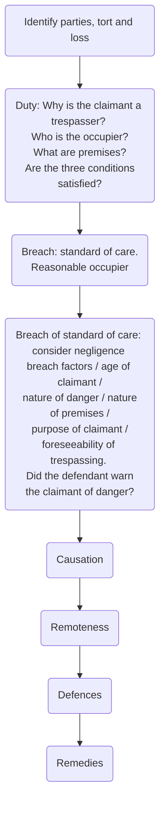

# Occupiers’ Liability Act 1984

If certain conditions are satisfied, the [Occupiers’ Liability Act 1984](https://www.legislation.gov.uk/ukpga/1984/3/contents) imposes a duty on the occupier to take reasonable care to see that trespassers do not suffer injury on their premises by reason of the danger concerned.

This governs the duty owed by occupiers to non-visitors.

## Loss

The occupier is only liable for physical injury, including disease, and any impairment of a person's physical or mental condition ([ss. 1(1)(a) and 1(9) OLA 1984](https://www.legislation.gov.uk/ukpga/1984/3/section/1)). Property damage is not recoverable (s 1(8) OLA 1984).

Term | Definition
---|---
Occupier | Same definition as OLA 1957 (s 1(2)(a) OLA 1987)
Premises | Same definition as OLA 1957
Trespasser/ non-visitor | Defined in common law through [[Robert Addie & Son (Collieries) Ltd v Dumbreck [1929] AC 358]] as “he who goes on to the land without invitation of any sort and whose presence is either unknown to the proprietor or, if known, is practically objected to.”

## Duty of Care

Under OLA 1957, there is no automatic duty of care owed by an occupier of premises to a non-visitor. Instead, there is a three-stage test which needs to be satisfied to establish a duty (ss. 1(3)(a)–(c) OLA 1984). The occupier will owe a duty if:

1. They are aware of the danger or have reasonable grounds to believe that it exists;
2. They know or have reasonable grounds to believe that the other is in the vicinity of the danger concerned or that they may come into the vicinity of the danger (in either case, whether the other has lawful authority for being in that vicinity or not); and
3. The risk is one against which, in all the circumstances of the case, they may reasonably be expected to offer the other some protection.

Examining each in turn:

### Awareness of Danger (s 1(3)(a) OLA 1984)

The occupier must be aware of the danger or have reasonable grounds to believe it exists. ‘Reasonable grounds’ requires actual knowledge of facts which would lead a reasonable occupier to be aware of the danger. See [[Rhind v Astbury Water Park Ltd [2004] EWCACiv 756]].

### Knowledge That the Other is in the Vicinity (s 1(3)(b) OLA 1984)

The occupier must know, or have reasonable grounds to believe, that someone is in the vicinity or may come into the vicinity of the danger.

The defendant must also know (or have reasonable grounds to believe) that someone is in the vicinity of the danger at the **time** of the accident (see [[Donoghue v Folkestone Properties Ltd [2003] QB 1008]]).

The defendant must have **actual knowledg**e either of the claimant's presence in the vicinity of the danger, or facts which would create reasonable belief that there was another likely to be present ([[Swain v Natui Ram Puri [1996] PIQR P442]]).

### Reasonable to Protect Trespassers Against the Risk

The risk must be one which, in all the circumstances, it is reasonable for the occupier to protect the trespasser from.

The analysis here is similar to that under breach, balancing the costs of requiring the occupier to make the premises safer against the foreseeability and seriousness of injury. If the claimant freely chooses to engage in an activity that carries an inherent risk, no duty will be owed. Occupiers are not expected to protect trespassers from obvious risks or self-inflicted harm unless there was no genuine and informed choice by the claimant ([[Tomlinson v Congleton [2003] UKHL 47]]).

## Breach

s 1(4) OLA 1984 imposes a duty on occupiers to take such care as is reasonable in all circumstances to see that the entrant does not suffer injury on the premises by reason of the danger concerned. The standard of care is that of a reasonable occupier.

When deciding what amount to reasonable care, courts will weigh up the negligence breach factors, as well as:

- The nature of the danger (hidden/obvious, degree)
- Whether the claimant is a child or adult
- The nature of the premises (e.g. how dangerous they were)
- Purpose of the claimant (burglar or accidental trespass)
- Whether the occupier could/ should have foreseen trespassing, and if so what measures were taken to prevent this.

Since the claimant is a non-visitor, the defendant's duty will be less onerous as under OLA 1957. Cases:

- [[Swain v Natui Ram Puri [1996] PIQR P442]] — reasonable steps taken
- [[Young v Kent County Council [2005] EWHC 1342]] — cheap practical solution was available which had not been taken.

### Warning Notices

s 1(5) OLA 1984: duty may be satisfied if the occupier takes all reasonable steps “to give warning of the danger concerned or to discourage persons from incurring the risk”.

It is easier to satisfy the duty under OLA 1984 than under OLA 1957 by giving warning. Under OLA 1984, the defendant just needs to take reasonable steps to bring the danger to the claimant's attention. A notice will satisfy this if it sufficiently discourages the claimant from trespassing ([[Titchener v British Railway Board [1983] 1 WLR 1427]]).

## Causation and Remoteness

These elements should be dealt with as under OLA 1957, since there is nothing in the Act dealing with them.

## Defences

### Consent

The defence of consent is provided for under s 1(6) OLA 1984. Helpful case: [[Ratcliff v McConnell and Harper Adams College [1997] EWCA Civ 2]].

### Contributory Negligence

This partial defence is not provided for in OLA 1984, but has been successfully relied on by defendants (such as in [[Young v Kent County Council [2005] EWHC 1342]]). Then go to s 1(1) Law Reform (Contributory Negligence) Act 1945 and just and equitable test.

## Structure

