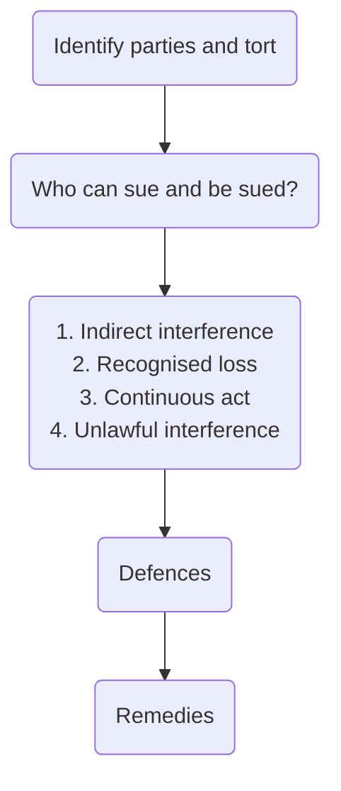

# Private nuisance

## Definition

> Any continuous activity or state of affairs causing a substantial and unreasonable interference with a claimant's land or their use or enjoyment of that land.

In order to bring an action in private nuisance, the claimant must have a legal interest in the land, namely a possessionary or proprietary interest (e.g., freehold or leasehold). Mere permission to use or occupy land is insufficient ([[Hunter and Others v Canary Wharf Ltd [1997] AC 655]]).

The purpose of private nuisance is to balance two competing interests:

- The right of the defendant to do what they like on their land
- The right of the claimant to enjoy their land without being disturbed by the defendant's activities.

It is a 'rule of give and take, live and let live' — [[Bamford v Turnley (1862) 3 B&S 66]].

## Suing

The following can be sued in the tort of private nuisance:

1. Creator of the nuisance
2. Occupier of the land from which the nuisance originates
3. Owner of the land

### Creator of the Nuisance

The creator of the nuisance can be sued even though they may not be in a position to end the nuisance, and even though they may not be the occupier of the land.

### Occupier

The usual defendant is the occupier of the land from where the nuisance has come. They can be liable for nuisances created by themselves, as well as those created by others in certain circumstances. These are:

- Where the nuisance is created by independent contractors
	- In [[Matania v National Provincial Bank [1936] 2 All ER 633]] an occupier was liable for the foreseeable excessive noise and dust caused by contractors altering his property.
- Where the nuisance is created by trespassers/ visitors/ predecessors in title
	- The occupier will be liable if they have continued or adopted the nuisance.
	- In [[Sedleigh-Denfield v O’Callaghan [1940] AC 880]] the defendant was liable for a nuisance created by a trespasser.
	- Occupiers continue a nuisance if they knew or ought reasonably to know of its existence, and fail to take reasonable steps to end it.
	- Occupiers adopt a nuisance if they make use of the thing causing the nuisance.
- Naturally occurring nuisances
	- In [[Goldman v Hargrave [1967] 1 AC 645]] the Privy Council held an occupier liable for a naturally occurring nuisance where they knew or ought to have known of a danger, and failed to take reasonable steps to abate the nuisance.
	- A duty to abate a naturally occurring nuisance is subject to the means of the occupier, who will not be expected to bankrupt themselves in the process of averting the nuisance.
	- The court will consider what steps it is fair and reasonable to expect the defendant to take considering the resources available to both the defendant and the claimant, and must take into account the competing demands on and public purpose of the funds of public authority defendants.

### Owner

A landlord will not usually be liable for a private nuisance, unless the exception in [[Coventry v Lawrence [2014] UKSC 13]] applies. This states that the landlord can only be liable for their tenant's nuisance if they authorised, by actively and directly participating in it, or by leasing the property in circumstances where there was a very high degree of probability that leasing the land would result in that nuisance being created.

## Elements

The four elements of the tort of private nuisance are:

1. Indirect interference
2. Recognised damage
3. Continuous act
4. Unlawful interference

### Indirect Interference

Direct interference would instead be classified as trespass to land. An indirect interference occurs where the nuisance starts on the defendant's land, but then causes damage to some aspect of the claimant's use or enjoyment of their land.

### Recognised Damage

The claimant must establish that they have suffered some damage. The types of damage recoverable in private nuisance are ([[St Helen’s Smelting Co v William Tipping (1865) 11 HL Cas 642]]):

1. **Physical damage** to property
	- e.g., overhanging branches falling and causing damage
2. **Sensible personal discomfort**
	- Where the senses of the claimant are affected in such a way that the claimant is unable to enjoy their land, e.g., unpleasant odours or noise
	- Can be defined as amenity damage
	- The damage must have been reasonably foreseeable ([[Cambridge Water Company v Eastern Counties Leather [1994] 1 All ER 53]]) and
3. The claimant can recover for any **consequential losses** flowing from the recoverable damage, e.g., loss of profits caused by the inability to use land to make those profits.

A claimant **cannot** claim for personal injury, given that private nuisance is a tort against land not person ([[Hunter and Others v Canary Wharf Ltd [1997] AC 655]]).

Any physical damage to property must be more than *de minimus* ([[Mitchell v Darley Main Colliery [1886] App. Cas. 127]]).

Any SPD must be more than fanciful and materially interfere with ordinary human comfort ([[Walter v Selfe (1851) 64 ER 849]]).

### Continuous Act

Nuisance must be continuous. A one-off isolated event is not normally actionable in private nuisance. In such instances, claims may be brought in negligence, or if possible by means of an action in public nuisance or under the Rylands v Fletcher rule.

Exceptions:

1. A single incident cased by an underlying state of affairs
	- In [[British Celanese v AH Hunt Ltd [1969] 1 WLR 959]] a persistent habit provided continuance, even when there was only a single damaging event
2. An activity which creates a state of affairs which gives rise to the risk of escape of physically dangerous or damaging material
	- [[Crown River Cruises Ltd v Kimbolton Fireworks Ltd [1996] 2 Lloyd’s Rep 533]] a firework display and the resulting fire was held to be a private nuisance

### Unlawful Interference

The term 'unlawful' in this context denotes unreasonableness: whether the activity constituting the nuisance amounts in any way to an unreasonable use of land.

Use of land | Liability
---|---
Reasonable | Defendant not liable
Unreasonable | The defendant will be liable, even if they exercised reasonable care and skill to avoid the nuisance activity

[[Sedleigh-Denfield v O’Callaghan [1940] AC 880]]: reasonableness is ‘the ordinary usages of mankind living in society, or more correctly in a particular society.’

Factors the courts consider when deciding what constitutes unlawful interference:

1. Time and duration
2. Locality/ character of the neighbourhood
3. Abnormal sensitivity
4. Malice
5. Lack of care by defendant
6. Excessive behaviour
7. Public benefit

Note that when the loss is physical damage to property, all of these factors except locality will be taken into account.

#### Time and Duration

The longer the interference lasts, the more likely it will be deemed unreasonable. Important considerations include when the alleged nuisance takes place, how long it continues and how frequently it is repeated ([[Kennaway v Thompson [1981] QB 88]]).

Where the loss is property damage only, the court might find a nuisance even if caused by a temporary or short-lived activity.

#### Locality/ Character of Neighbourhood

This factor is only relevant where the loss is SPD, not where it is property damage. In [[Sturges v Bridgman 1879 11 Ch D 852]], the noise and vibrations from a confectionary manufacturer was held to be a nuisance in a residential area.

Thesiger LJ made the famous comment that:

> What would be a nuisance in Belgrave Square would not necessarily be so in Bermondsey

In [[Adams v Ursell [1913] 1 Ch 269]] fumes caused by a fish and chip shop were held to constitute a nuisance in a residential area, though this did not mean the defendant could not carry on their business in a more suitable place.

Planning permission may alter the character of the area, so that what was once a nuisance in that area is no longer a nuisance as the area has changed or *vice versa* ([[Gillingham Borough Council v Medway (Chatham) Dock Co Ltd[1993] QB 343]]).

But the mere granting of planning permission does not authorise a nuisance ([[Wheeler v JJ Saunders Ltd [1996] Ch 18]]).

In [[Coventry v Lawrence [2014] UKSC 13]] it was held that the precise terms of the planning permission might have a bearing on whether the use of the land is reasonable or unreasonable.

#### Abnormal Sensitivity

A claimant who is unusually sensitive cannot claim that activities that would not interfere with the ordinary occupier are a nuisance, simply because they are a nuisance to them alone ([[Robinson v Kilvert (1889) LR 41 Ch D 88]]).

But if the reasonable occupier would be affected, the claimant can claim for the full extent of their loss and irritation, even if these are increased by their sensitivity ([[McKinnon Industries v Walker [1951] 3 DLR 577]]). Note, this is just the 'thin skull rule' from negligence.

In [[Network Rail Infrastructure Ltd v CJ Morris [2004] EWCA Civ 172]] the court disapproved of [[Robinson v Kilvert (1889) LR 41 Ch D 88]], doubting whether the concept of abnormal sensitivity still existed. It was held that cases should be viewed in terms of foreseeability instead.

#### Malice

If the defendant can show a legitimate reason for what they have been doing, the court will be less inclined to interfere with their activities. But if the defendant can point to no real justification for their actions and their aim is solely to annoy the claimant, this will constitute a nuisance ([[Christie v Davey [1893] 1 Ch 316]]).

#### Defendant's Lack of Care

If the defendant has shown lack of care, this is likely to count in the claimant's favour ([[Andreae v Selfridge and Co Ltd [1938] Ch 1 (CA)]]).

#### Excessive Behaviour

This concerns how far removed the behaviour is from normal. If the defendant has behaved in an excessive manner, this may indicate they are being unreasonable and causing a nuisance ([[Farrer v Nelson (1885) 15 QBD 258]]).

#### Public Benefit

This factor is of very limited weight, and is much more relevant to determining a remedy. Just because a defendant's activities serve a useful purpose or benefit to the community, this does not mean they have not committed a nuisance ([[Adams v Ursell [1913] 1 Ch 269]]).

## Defences

The following defences can be relied on in private nuisance:

1. 20 years' prescription
2. Statutory authority
3. Consent
4. Contributory negligence
5. Act of third party
6. Act of God
7. Necessity

### Prescription

If the defendant's activity has been an **actionable nuisance** for 20 years or more (i.e. a claimant would have had grounds for bringing a claim for that period) but no action has been taken, the defendant will have earned the right to continue to commit the nuisance.

In [[Sturges v Bridgman 1879 11 Ch D 852]] the confectionery had been in existence for $>20$ years, but the doctor's consulting rooms had only been built near the nuisance more recently, so the defence of prescription was not available.

The 20 years does not have to be continuous ([[Coventry v Lawrence [2014] UKSC 13]]).

### Statutory Authority

Where the defendant's activity is being carried out on the basis of statutory authority, they will escape liability if they have exercised all due care and the nuisance is an inevitable consequence of the activity ([[Allen v Gulf Oil Refining Ltd [1981] 1 All ER 353]]).

### Consent

If the claimant specifically agrees to the defendant causing the nuisance, then that consent will be a defence. The defence may be available where the claimant, knowing the danger to their property, has by word or deed shown willingness to accept the risks ([[Pwllbach Colliery v Woodman [1915] AC 63]]).

### Contributory Negligence

The usual rules of contributory negligence apply ([[Trevett v Lee [1955] I WLR 113]]).

### Act of Third Party

Where the nuisance has been created by a third party for whom the defendant bears no responsibility, the defendant will not be liable for the nuisance, unless they adopt or continue the nuisance ([[Sedleigh-Denfield v O’Callaghan [1940] AC 880]]).

### Act of God

Where the nuisance results from an act of God, the defendant will not be liable unless they adopt or continue the nuisance ([[Nichols v Marsland (1876) 77 LR 2 ExD 1]]).

### Necessity

The usual principles apply.

'Moving to the nuisance' is a factor which defendants have sought to argue, but without success ([[Miller and Another v Jackson and Others [1977] QB 966]]).

In [[Coventry v Lawrence [2014] UKSC 13]] the principle was confirmed. The Supreme Court considered orbiter that in some circumstances, a defendant might be able to argue that the claimant's claim should fail if the defendant's activity only became a nuisance because of the claimant's change of use of the building.

## Remedies

Three potential remedies:

1. Injunction
2. Damages
3. Abatement

### Injunction

The primary remedy for a continuing nuisance is an injunction. These can be full (ban on activity) or partial. A partial injunction can be seen as a compromise. Partial injunctions are often awarded where the defendant's activities are of public benefit ([[Kennaway v Thompson [1981] QB 88]]).

### Damages

Where a nuisance causes actual physical property damage, the cost of repair/ renewal can be claimed — whichever is lower. Damages for consequential economic loss can also be claimed.

Damages can be awarded in lieu of an injunction where the loss is SPD. But *prima facie*, the remedy should be an injunction. To have this changed to damages, the defendant needs to put forward the arguments as to why an injunction should not be granted.

The court will then weigh up all the competing factors in the exercised of unfettered discretion. This will include stuff like how public interest might be affected by an injunction. Planning permission might support an argument that the activity is of public benefit.

Such damages are normally based on the reduction in the value of the claimant's property.

- [[Dennis v Ministry of Defence [2003] EWHC 793 (QB)]]
- [[Miller and Another v Jackson and Others [1977] QB 966]]

### Abatement

Abatement represents a 'self-help' remedy where the claimant acts to stop the nuisance.

A claimant may, in certain circumstances, enter onto the land of another and take reasonable steps to prevent the nuisance continuing. Anything belonging to the defendant must be left on the property. It is this principle that allows a person to cut down branches overhanging their land, although they must be returned to the defendant and the claimant must do no more than is necessary to abate the nuisance.

Notice must be given by the claimant of their intention, but need not be given if there is an emergency. Validly exercising a right to abate a nuisance will be a defence to any proceedings for trespass to land.

Interesting case:  
[[Coventry & Ors v Lawrence & Anor [2014] UKSC 13]]

## Structure

