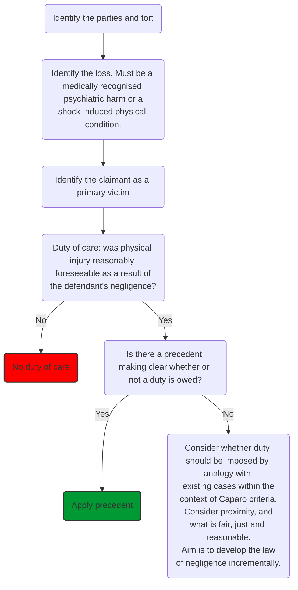
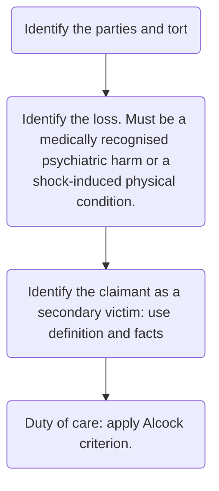

# Psychiatric harm

## Definition

The loss of psychiatric harm is considered, under the tort of negligence. So once a duty of care is established, the claimant must go on to prove each of the other elements in the negligence sequence to succeed.

Psychiatric harm is a form of psychiatric illness that the claimant has suffered as a result of the perception of traumatic events. Old terminology: nervous shock.

The psychiatric harm must be either:

- A medically recognised psychiatric illness, or
- A shock-induced physical condition

Liability will not arise for fear, distress or mental grief caused by negligence ([[Hinz v Berry [1970] 2 QB 40]]). However, new conditions are constantly being recognised like post-traumatic stress disorder, ME (Myalgic Encephalomyelitis) and pathological grief syndrome which goes beyond what is classed as normal human emotion.

For shock-induced physical conditions (such as miscarriage or a heart attack), both the psychiatric injury and the physical injury must be material ([[Mazhar Hussain v Chief Constable of West Mercia [2008] EWCA Civ 1205]]).

Distinguishing cases:

Type of victim | Definition
---|---
Actual victim | Suffers physical injury during an event. They may also suffer consequential psychiatric injury which would be recoverable under the same ordinary negligence action.
Primary victim | Suffers psychiatric harm as a result of the reasonable fear for their own physical safety (objective test). They are involved in the traumatic event and are therefore in the zone of danger.
Secondary victim | Suffers psychiatric harm due to the fear for someone else's safety, normally a close relative. They are not in fear for their own physical safety, but are not in the zone of danger.

## Bystanders and Rescuers

Neither bystanders nor rescuers are given any special status in this area, so must be classified as a primary or secondary victim.

If a rescuer or a bystander suffers psychiatric harm as a result of fearing for their own safety, then they will be a primary victim ([[Cullin v London Fire & Civil Defence Authority [1999] PIQRP 314]]). But if they are not exposed to danger, they will be treated as secondary victims ([[White v Chief Constable of the South Yorkshire Police [1999] 1 All ER 1]]).

The test for reasonable fear for physical safety is an objective, not subjective, one ([[McFarlane v EE Caledonia Ltd [1994] 2 All ER 1]]).

## Primary Victims

In [[Dulieu v White [1901] 2 KB 669]], the claimant had reasonably feared for their own physical safety, so was considered a primary victim.

In [[Page v Smith [1996] AC 155]], it was held that in order to determine whether a primary victim is owed a **duty of care**, the victim must have reasonably foreseen that the claimant might suffer physical injury as a result of their negligence. If physical injury was reasonably foreseeable, the normal principles for determining the existence of duty of care would apply.

If the court is unable to rely on precedent and is discussing proximity and fair, just and reasonableness, these are likely to be relatively straightforward. As the primary victim is always present at the traumatic event, there is always geographical proximity between the claimant and defendant. If the defendant negligently, and foreseeably, puts the claimant in fear of their safety, it is likely that the courts will find it fair, just and reasonable to impose a duty of care for any psychiatric damage caused as a result.

### Structure

## Secondary Victims

In [[Alcock v Chief Constable of South Yorkshire [1991] 4 All ER 907]] the House of Lords set out the current test for determining when a duty of care is owed to a secondary victim for pure psychiatric harm. All of the following criteria must be satisfied:

1. Psychiatric harm must be reasonably foreseeable;
2. Proximity of relationship between the claimant and 'the victim';
3. Proximity in time and space; and
4. The injury must be the result of sudden shock.

### Psychiatric Harm Must Be Reasonably Foreseeable

For a secondary victim to prove duty of care, they must establish that psychiatric harm was reasonably foreseeable in a person of **ordinary fortitude** in the same circumstances ([[Bourhill v Young [1943] AC 92]]).

Once it is established that a person of normal fortitude might have suffered psychiatric illness, the normal 'thin skull' rule applies. So if psychiatric harm is foreseeable, the claimant can recover damages for all psychiatric harm they suffer, even if they suffer more because of a predisposition to mental illness ([[Brice v Brown [1984] 1 All ER 997]]]).

### Proximity of Relationship Between Claimant and ‘the victim’

The secondary victim must have a **relationship of close ties of love and affection** with ‘the victim’ i.e., the person for whose safety the claimant feared because of the defendant’s negligence.

- Close ties of love and affection are rebuttably presumed in the case of parent/child, husband/wife and engaged couples
- No such rebuttable presumption for grandparent/grandchild relationships or between siblings. Lord Ackner:
> “The quality of brotherly love is known to differ widely — from Cain and Abel to David and Jonathan.”

- Claimants falling outside the rebuttable presumption categories can try to prove close ties of love and affection with the victim. But to date, no claimant has successfully argued this.
- Brian Harrison lost two brothers at Hillborough, unsuccessful in his claim.

It remains an open question whether a secondary victim will ever succeed where the victim is a stranger (very doubtful). The courts take the view that the claimant must possess the 'customary phlegm' of the reasonable person and be able to withstand witnessing accidents to strangers. In Alcock, an example of a possible extreme exception would be witnessing an out-of-control petrol tanker crash into a school.

A secondary victim will not be able to claim if the actual victim, for whose safety they feared, is actually the defendant in the case ([[Greatorex v Greatorex [2000] 1 WLR 1790]]).

### Proximity of the Claimant to the Accident in Time and Space

The secondary victim must be present at the scene of the accident or its immediate aftermath; and the claimant must see or hear the accident, or its immediate aftermath, with their own senses. In [[McLoughlin v O’Brian [1982] 2 All ER 298]] the immediate aftermath of an event caused psychiatric harm to a mother: she saw her family two hours later in the same condition as they had been at the scene of the accident.

One of the claimants in Alcock identified their brother-in-law in the mortuary eight hours after the incident; this was not considered to be part of the immediate aftermath.

Alcock also made it clear that there would be no duty owed to a secondary victim who is merely told about a shocking event. Held that such a shock cannot equate to the sight or hearing of an event or its immediate aftermath, partly because individuals are not identifiable. If broadcasters transmit images of identifiable individuals, this could amount to a novus actus interveniens between the defendant's negligence and the claimant's loss.

This did not necessarily defeat claims by those viewing an event on television or hearing about it on radio, but only where such exposure was graphic or immediate (example given was of parents witnessing a live broadcast of their children going up in a balloon that suddenly exploded).

### Sudden Shock

The psychiatric harm must be shock-induced: a reaction to the immediate and horrifying impact of the event, and 'a sudden assault on the nervous system' (Alcock). Two cases:

- In [[North Glamorgan NHS Trust v Walters [2002] EWCA Civ 1792]] held that although the events leading to the claimant's psychiatric condition took place over 36 hours, the series of events leading to the death could together constitute a 'horrifying event', including witnessing the medical negligence. The claimant's appreciation of events was 'sudden' because each separate even had an immediate impact. The claimant suffered drawn out and 'seamless' shock.
- In [[Sion v Hampstead Health Authority (1994) 5 Med LR 170]] the claimant failed because psychiatric condition onset through a gradual realisation rather than a sudden shock.

Also put as, "a sudden appreciation by sight or sound of a horrifying event, which violently agitates the mind".

### Fair, Just and Reasonable

Some policy arguments for restricting claims for negligently inflicted pure psychiatric harm:

- Floodgates
	- Significant increase in the class of claimants who could recover
- Fraudulent claims
	- Historic perception that psychiatric harm is easier to fake than physical injury (diagnostic uncertainty)
- Crushing liability
	- Imposing damages out of proportion to the negligent conduct
- Effect of increased availability of compensation on potential claimants
	- e.g., disincentive to rehabilitation (?!)

## Beyond Primary and Secondary Victims

Examine when a defendant is considered to have assumed responsibility to ensure that the claimant avoids reasonably foreseeable psychiatric harm, and therefore owes the claimant a duty of care.

A defendant will owe a claimant a duty of care not to cause psychiatric harm where the defendant has 'assumed responsibility' to ensure that the claimant avoids reasonably foreseeable psychiatric harm. Examples of relationships which induce this assumed responsibility:

- Employer/employee ([[Waters v Commissioner of Police for the Metropolis [2000] UKHL 50]])
- Doctor/patient ([[AB v Leeds Teaching Hospital NHS Trust [2004] EWHC 644 (QB)]])
- Police/police informant ([[Swinney v Chief Constable of Northumbria Police Force [1997] QB 464]])

### Occupational Stress

Assumption of responsibility cases include occupational stress claims, where stress at work causes the psychiatric harm ([[Walker v Northumberland County Council [1995] 1 All E.R. 737]]).

In [[Barber v Somerset County Council [2004] UKHL 13]] The House of Lords approved guidance as to when an employer would be in breach of occupational stress claims:

1. Psychiatric harm to the claimant was (or ought to have been) **reasonably foreseeable** to the employer
2. Foreseeability depends upon the relationship between the characteristics of the claimant and the requirements made of them by the employer, including:
	1. The **nature and extent of the work** being undertaken. Was the workload much more than normal for that job, was the work particularly emotionally/intellectually demanding, etc.
	2. **Signs of stress**. Indications of impending harm to health arising from stress at work must be plain enough for any reasonable employer to realise they should do something
	3. **Size and scope of the business** and availability of resources. Includes the interests of other employees and the need to treat them fairly.

Once this “threshold” is crossed, it is immaterial whether a person of ordinary fortitude would have suffered the harm.
