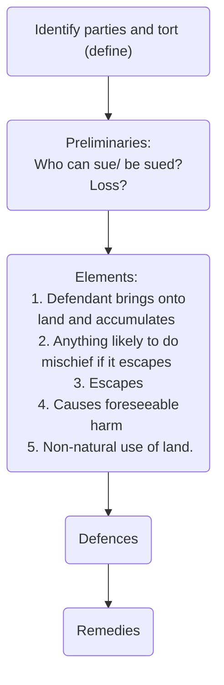

# Rylands v Fletcher rule

## Definition

This is a rule protecting against interference due to an isolated escape from the defendant's land. It originates from [[Rylands v Fletcher (1868) LR 3 HL 330]].

>  “We think that the true rule of law is that the person who for his own purposes brings on his land and collects and keeps there anything likely to do mischief if it escapes, must keep it in at his peril, and, if he does not do so, is prima facie answerable for all the damage that is the natural consequence of the escape.”

Some preliminaries:

Detail | Description
---|---
Who can sue? |The *Rylands v Fletcher* rule is a subset of private nuisance ([[Transco v Stockport Metropolitan Borough Council [2003] UKHL 61]]), so the claimant must have a proprietary interest in the land affected ([[Hunter and Others v Canary Wharf Ltd [1997] AC 655]]).
Who can be sued? | The person who brings, collects and keeps the 'thing' onto the land (the creator of the nuisance), and/or any person who has control over the land (owner/occupier).
Loss | The only types of loss recoverable are property damage and consequential economic loss.

## Elements

1. The defendant brings onto the land and accumulates there;
2. For their own purposes, anything likely to do mischief if it escapes;
3. Escape;
4. Escape caused foreseeable harm; and
5. Non-natural use of the land

Each is considered in turn;

### Defendant Brings onto the Land and Accumulates There

The defendant must have brought something voluntarily onto the land. In [[Giles v Walker (1890) 24 QBD 656]] there was no liability for the spread of thistles from the defendant's land as they grew naturally, and had not been brought onto the land.

### For Their Own Purposes, Anything Likely to Do Mischief if it Escapes

The thing brought onto the land must be capable of causing damage if it escapes, so need not necessarily be dangerous itself. Examples are water, acid and explosives.

In [[Transco v Stockport Metropolitan Borough Council [2003] UKHL 61]] it was held that the thing that escapes has to be reasonably recognised as having an **exceptionally** high risk of causing a danger if it were to escape, setting the threshold very high.

### Escape

The 'thing' brought onto the land must escape from the land over which the defendant has control, to land where they do not have control. This escape can be slow and over a period of time ([[Cambridge Water Co. v Eastern Counties Leather plc [1994] 2 AC 264]]).

It must be the substance collected by the defendant that escapes ([[Stannard v Gore [2012] EWCA Civ 1248]]).

In [[Colour Quest Ltd v Total Downstream UK Plc [2010] EWCA Civ 180]] the fuel was the dangerous thing which escaped onto the defendant's land and started the fire/ explosion. This was seen to be a component of the fire.

### Escape Caused Foreseeable Harm

The defendant need not have foreseen the escape but must have known or ought reasonably to have foreseen that the 'dangerous thing' could, if it escaped, cause damage. Even if the defendant has taken reasonable care to prevent the escape and the damage, they will still be liable if they fulfil the requirements for operation of the rule. This is an example of [[strict liability]].

### Non-natural Use of Land

This is best defined as 'non-ordinary use' of the land. What is ordinary depends on the time, place and context of the land use. All circumstances must be taken into account, such as the type of area.

The defendant's use of land has to be shown to be **extraordinary and unusual** ([[Transco v Stockport Metropolitan Borough Council [2003] UKHL 61]]).

In [[Colour Quest Ltd v Total Downstream UK Plc [2010] EWCA Civ 180]] the use of land was non-natural because of the quantity of oil kept on the premises, despite the industrial nature of the depot.

The storage of substantial quantities of chemicals on industrial premises was 'almost a classic case' of non-natural use ([[Cambridge Water Co. v Eastern Counties Leather plc [1994] 2 AC 264]]).

## Defences

The same defences apply as for public nuisance, with the addition of 'common benefit' and default of the claimant.

1. Common benefit
2. Act or default of the claimant
3. Statutory authority
4. Act of third party
5. Act of God
6. Contributory negligence
7. Consent

### Common Benefit

If the claimant has agreed to the accumulation of the material by the defendant, there will be no liability. Consent will be implied if the substance has been accumulated for the common benefit of the claimant and defendant.

In [[Peters v Prince of Wales Theatre [1943] 1 AC 521]] the defendant was not liable for the bursting of a sprinkler system, which operated for the common benefit of the claimant and defendant.

### Act or Default of the Claimant

If the escape has been caused wholly by the claimant's actions, there will be no liability ([[Dunn v Birmingham Canal Co (1872) LR 8 QB]]).

### Statutory Authority

The rules applying to private nuisance with regard to statutory authority are relevant here. Key case: [[Green v Chelsea Waterworks Co (1894) 70 LT 547]].

### Act of Third Party

The defendant will not be liable if they can show that the escape arose through the unforeseeable act of a stranger over whom they had no control ([[Rickards v Lothian]]).

### Act of God

Where the escape is caused by a natural occurrence which could not have been reasonably foreseen, the defendant will not be liable. It must not be realistically possible for a human to reasonably guard against or prevent the event by any amount of foresight, pains and care ([[Transco v Stockport Metropolitan Borough Council [2003] UKHL 61]]).

In [[Nichols v Marsland (1876) 77 LR 2 ExD 1]] extraordinarily high rainfall was deemed an Act of God.

### Contributory Negligence and Consent

Usual rules.

## Remedies

Damages and injunctions are available for *Rylands v Fletcher* claims, as they are for private nuisance.

Damages are the most common remedy given that the types of loss recoverable are property damage and consequential economic loss.

## Structure

