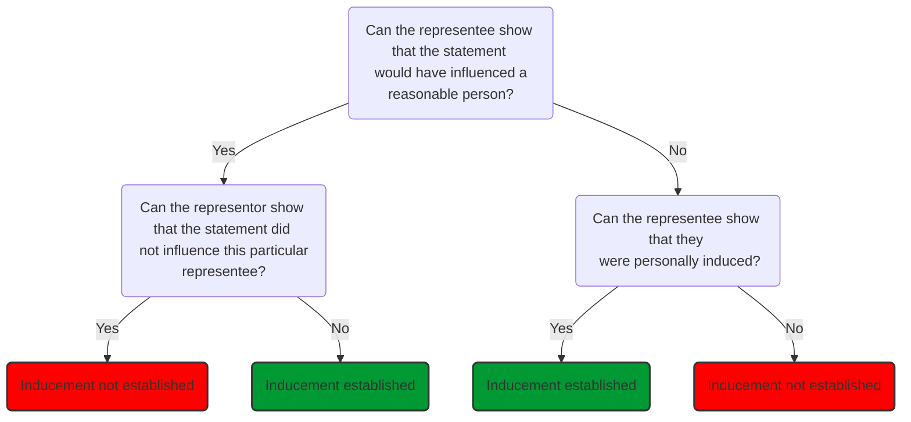

# Actionable Representation

## Definition

An unambiguous false statement of fact made to the claimant and which induces the claimant to enter into the contract with the statement maker.

Examining each component in more detail:

## Unambiguous

The representation must be clear and will only form the basis of a claim in misrepresentation if it unambiguously has the meaning put forward by the representee.

Representor will not be liable if the representee has placed its own unreasonable construction on the representation ([[McInerny v Lloyd's Bank Ltd [1974] 1 Lloyd's Rep 246]]).

## False

The statement must be false; it will not be false if it is substantially correct

> “[A] representation may be true without being entirely correct, provided it is substantially correct and the difference between what is represented and what is actually correct would not have been likely to induce a reasonable person in the position of the claimants to enter into the contracts”  
> [[Rix J, Avon Insurance Plc v Swire Fraser Ltd [2000] 1 All ER (Comm) 573]].

## Statement of Fact

> 'A representation is not an undertaking to do, or not to do, something. It is a statement asserting a given state of affairs'  
> [[Kleinwort Benson Ltd v Malaysia Mining Corp [1989] 1 WLR 379]]

Includes | Does not include
---|---
Statements of fact | Statements of opinion
Some conduct | Statements of intention
Statements of law | Silence

### Facts Vs Puff

Representations distinguished from mere 'puff' ([[Dimmock v Hallett (1866) LR 2 Ch App 21]]).

### Conduct

Statements usually made by words, but can also be made by conduct ([[Gordon v Selico (1986) 278 EG 53]] concealment of dry rot).

### Statement of Law

Traditional rule was that a statement of law could not give rise to an actionable misrepresentation. But the distinction between statements of fact and law has been abolished. It was held that a false statement as to the existence of an Act of Parliament is a misrepresentation of fact ([[West London Commercial Bank v Kitson (1884) LR 13 QBD 360]]).

### Statement of Opinion

#### General Rule

A statement of opinion is not a statement of fact, so cannot usually form the basis of a claim in misrepresentation (e.g., [[Bisset v Wilkinson [1927] AC 1977]]).

#### Exceptions

When someone expresses an opinion, they impliedly state they know the facts justifying that opinion. When the same facts are known to each party, the implicit statement is unlikely to have much impact on the representee. But if the representor has greater knowledge than the representee, the implied statement that there are facts justifying the opinion can significantly mislead the representee ([[Smith v Land and House Property Corporation (1885) LR 28 Ch D 7 (CA)]]).

Where the representor is in a position of superior knowledge or experience, a statement of opinion can be held to involve a statement of fact that there are reasonable grounds for their opinion. So if there are no reasonable grounds for this opinion (i.e., the opinion is one which someone with the knowledge of the representor could not reasonably have held) then a false statement has been made ([[Esso v Mardon [1976] QB 801]]).

There is also an implied statement in an expression of opinion that the representor believes the opinion that they express. If this is not the case, such a representation will be a misrepresentation.

### Statement of Future Intention

Representation is a statement of fact, so can have no reference to future events or promises.

>“There is a clear difference between a representation of fact and a representation that something will be done in the future. A representation that something will be done in the future cannot be true or false at the moment it is made; and although you may call it a representation, if anything it is a contract or promise”  
>[[Beattie v Ebury (1872) LR 7 Ch App 777]], per Mellish LJ.

Consequently, it is not a misrepresentation if the representor makes a promise regarding a future intention, but is prevented from doing so or if circumstances alter so that they change their mind about that intention ([[Wales v Wadham [1977] 1 WLR 199]]).

However, if the representor states they intend to do something, they are making a limited statement of fact: stating they do have that intention. So if, at that time, they know they cannot do what they state, or do not intend to do it, they are misrepresenting their existing intention ([[Edgington v Fitzmaurice (1885) 29 Ch D 459]]).

Bowen LJ:

>“The state of a man's mind is as much a fact as the state of his digestion…”

#### Silence

Silence will generally not give rise to an action for misrepresentation. No general duty to disclose facts which, if known, might affect the other party's decision to enter the contract ([[Keates v The Earl of Cadogan (1851) 10 CB 591]]).

But there are some exceptions to the rule in Keates:

##### Half-truths

It is a misrepresentation to make statements which are technically true but misleading ([[Nottingham Patent Brick & Tile Co v Butler (1866)]]). e.g., to describe property which is the subject of negotiations for sale as 'fully let' without disclosing that, although the property is indeed fully let at that time, the tenants have given notice to quit, is a misrepresentation ([[Dimmock v Hallett (1866) LR 2 Ch App 21]]).

##### Continuing Representation

If, at the beginning of negotiations, a statement is made which is true but which prior to entering into the contract becomes false, the representor is under an obligation to correct the representation. If they fail to do so and allow the other party to enter into the contract still believing that the representation is true, then they will be liable for misrepresentation ([[With v O'Flanagan [1936] Ch 575]]). This is the principle of 'continuing representations'.

##### Contracts Uberrimae Fidei (utmost Good faith)

There is a duty to disclose material facts in some types of contracts in which one party is in a particularly strong position to know the material facts which form the basis of the contract. Most common is contract of insurance: at common law, disclosure of all material facts must be made to the insurer. Also, often this obligation to disclose information exists between parties which are in a fiduciary relationship (e.g., between a company and its directors, between a trustee and beneficiaries of a trust).

## Addressed to the Claimant

The misrepresentation must be addressed by the representor to the claimant.

## Induces the Claimant to Enter into the Contract with Statement Maker

Requirement not satisfied in [[JEB Fasteners v Mark Bloom [1983] 1 All ER 583]], where the Court of Appeal held that the defendants' representation did not play a 'real and substantial' part in inducing the claimants to act.

Court asks:

> Was the representation material?

Objective test for this: did the statement relate to an issue that would have influenced a reasonable person ([[Pan Atlantic Co Ltd v Pine Top Insurance Co Ltd [1995] 1 AC 501]])?

- If a statement is found to be material, then inducement will generally be inferred as a matter of fact ([[Smith v Chadwick (1884) 9 App Cas 187]]). Then burden shift to the defendant to rebut the inference that the claimant was induced. This is done by proving that the claimant was not subjectively induced.
- If a statement is not found to be material, then inducement of the claimant cannot be inferred as a matter of fact. The claimant must prove that they were subjectively induced. If they do this successfully, it will be held that they have been induced by the misrepresentation ([[Museprime Properties Ltd v Adhill Properties Ltd (1990) 61 P. & C.R. 111]]).

Since the representation must have induced the representee to enter the contract, there is no actionable misrepresentation where:

- the statement was not actually communicated to the representee;
- the statement did not affect the representee's decision to enter the contract
- the statement was known to be untrue by the representee.

The misrepresentation need not be the only reason the claimant entered the contract ([[Edgington v Fitzmaurice (1885) 29 Ch D 459]]).

A representor may seek to argue that the representee was not induced where the representee chooses to test the validity of the representor's statement by making its own investigations ([[Attwood v Small (1838) 6 CL & F 232]]).

The key point in Attwood is not that separate enquiries were made or could have been made — the crucial point is that the separate enquiries showed that the vendor's statements were not relied upon ([[Redgrave v Hurd (1881) 20 Ch D 1]]). This case also established that there is no general duty to check the misrepresentor's statement.

If a representee does not check, where the court considers it reasonable for them to have done so, or carries out a negligent investigation, this would open up the possibility of a defence of [[Contributory negligence]] against the representee. This cannot be pleaded where the misrepresentation is fraudulent. The more commercial the representee is, the more likely it is that the court will consider it reasonable for the representee to have investigated (by analogy to [[Smith v Eric Bush [1990] 1 AC 831]]).
