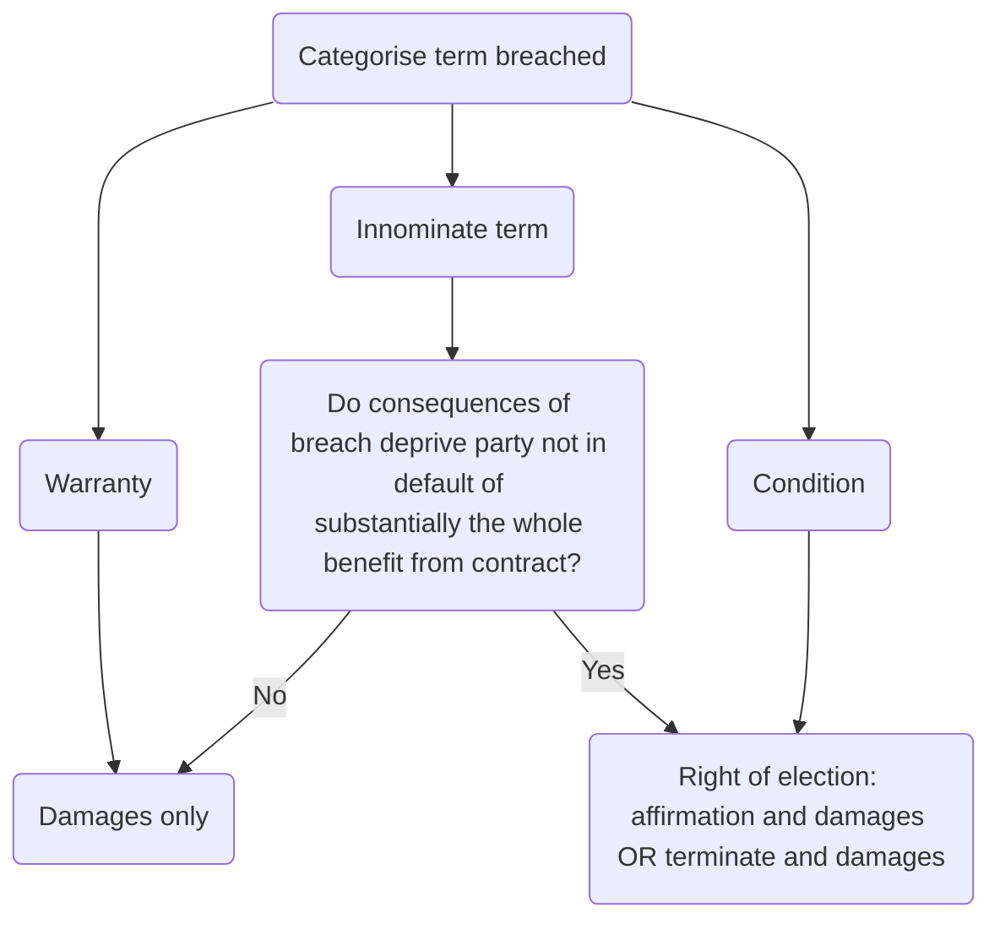

# Conditions and warranties

## Significance of Distinction

If a party breaches a condition, the innocent party has a right to treat the contract as repudiated, i.e., can terminate the contract with the effect that both parties are released from all future obligations under the contract. Can also immediately sue for damages.

If it instead chooses to affirm the contract, the contract remains in full force and effect, so all parties still bound, but can still sue for damages with respect to the other party's breach. Here, innocent party waives the right to repudiate.

But if a party in breach of warranty, the only remedy option is to sue for damages.

## Distinguishing

### Traditional Approach

A condition is an important term “going to the root of the contract” ([[Poussard v Spiers (1876) 1 QBD 410]]), warranty less important.

Ask: did the parties intend, at the time of contracting, that any breach of the relevant term could result in the innocent party terminating. If clearly yes, should categorise as a condition.

### Modern Approach

Traditional distinction no longer regarded as exhaustive.

In [[Hong Kong Fir Shipping Co v Kawasaki Kisen Kaisha Ltd [1962] 2 QB 26]] held that there are many terms which at the outset are neither conditions nor warranties but innominate.

The court should ask:

> Do the consequences of the breach deprive the party not in default of substantially the whole benefit intended to be obtained from the contract?

Obtains more justice, but at the cost of certainty (over whether an innocent party has the right to terminate contract as a result of breach).

So starting point: consider whether term has been classified as a condition or warranty by

1. Statute
2. The parties
3. Previous judicial decisions  
If no answers, court will need to look at contract, subject matter and surrounding facts. If parties' intentions indeterminate, or court determines that intention was that not every breach would lead to right to terminate, test from [[Hong Kong Fir Shipping Co v Kawasaki Kisen Kaisha Ltd [1962] 2 QB 26]] will be applied.

## Classifying Statutory Implied Terms

Statute | Conditions | Innominate terms
---|---|---
Sale of Goods Act 1979 | ss 12-15 |
Supply of Goods and Services Act 1982 | |s 13

Remedy for breach of terms implied by ss 13-15 SGA has been altered as a result of s 15A. S 15A does not apply to s 12(1) SGA, the implied condition as to title. S 15A provides that if the breach is so slight that it is unreasonable for buyer to repudiate, breach treated as breach of warranty (buyer entitled to damages). So breach of implied terms not to be treated automatically as a breach of condition but may at the court's discretion be treated as a breach of warranty. Accordingly, the only remedy is damages.

Under CRA 2015 different approach: provides rights to reject goods but only in certain circumstances.

## Terminology

*Repudiatory breach:* Breach of condition. The innocent party can elect to 'treat the contract as being repudiated'/'accept the repudiatory breach'/ terminate the contract.

## Time for completion/ Performance

Where a requirement as to timing is essential to the contract, for instance in mercantile contracts, the expression used is that 'time is of the essence'. If time is of the essence, lateness will amount to a repudiatory breach, entitling the other party to terminate the contract.

Where time is not of the essence, it can usually become so, by the innocent party serving a notice on the defaulting party which states time is of the essence. Such a notice must state completion date, which must be reasonable.
