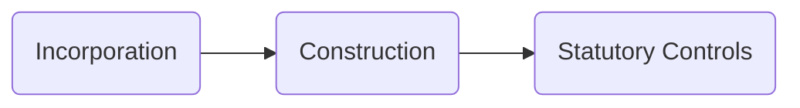
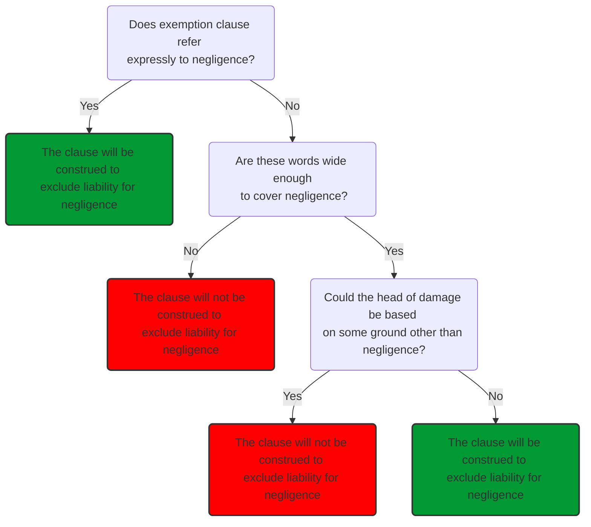

# Exemption Clauses

## Definition

> A contractual term that purports to limit or exclude a liability which would otherwise attach to one of the contracting parties.

For commercial parties, more common for a party to limit its liability in different situations to different sums, rather than exclude it altogether.

When considering whether a party can rely on an exemption clause, need to consider:

- Incorporation
	- Is the exemption clause a part of the contract?
	- Lots of case law about this
- Construction
	- Does the clause, as drafted, cover the alleged breach(es) and resulting loss
- Statutory controls
	- Effect on the clause of [[Unfair Contract Terms Act 1977]] and [[Consumer Rights Act 2015]]

## Construction

Construction means interpreting the exemption clause to determine whether the clause as drafted covers the breach and loss that has occurred.

Exemption clauses will often have two or more of the following elements:

- Statement of whether liability is entirely excluded or only limited to stated amount
- Statement of which types of claim/ duties exemption relates to
- Statement of which types of loss exemption relates to

### Contra Proferentem

>“Interpretation against the draftsman”

General rule: if there is any doubt as to the meaning and scope of an exemption clause, ambiguity will be resolved against the party seeking to rely on it.

Note, courts apply this rule less rigorously when the clause only limits rather than excludes liability: [[Alisa Craig Fishing Co Ltd v Malvem Fishing Co [1983] 1 WR 964]].

See [[Houghton v Trafalgar Insurance [1954] 1 QB 247]] for vague clause in case where claimant was a consumer. But court less likely to read a clause *contra proferentum* in a contract between commercial parties of equal bargaining power: [[Victoria Street v House of Fraser [2011] EWCA Civ 904]]. So apply rule with sensitivity to the circumstances of the case.

## Exemption Clauses and Negligence

Clear words needed if party seeking to exclude liability resulting from its own negligence. Easiest: actually use the word 'negligence'.

Unclear whether more general words are wide enough to cover liability for negligence.

In [[Canada Steamship Lines v R. [1952] AC 192]], Lord Morton set out guidelines for construction of such clauses purporting to exclude liability for negligence:

- Does the clause expressly mention 'negligence' or a close synonym ([[Monarch Airlines v London Luton Airport [1997] CLC 698]])
- Are the words used 'wide enough' (in their ordinary meaning) to cover negligence?
- Are they too wide?
	- If they are wide enough, the court must consider whether liability may be based on some other ground other than the negligence of the proferens.
	- But other grounds cannot be so fanciful or remote that proferens cannot be supposed to have desired protection against it.
	- If, on the facts of the case, the clause could cover a ground other than negligence, then the clause will be ineffective in excluding liability for negligence, and will only be effective against that alternative head of liability ([[White v John Warwick [1953] 1 WLR 1285]])

See also [[Alderslade v Hendon Laundry Limited [1945] KB 189]] for a clause successfully construed to cover negligence.

Note negligence encompasses a breach of duty of care in tort and breach of a contractual duty to take reasonable care and skill implied by statute.

Canada steamship approach:

### Recent Developments

The decision in [[Persimmon Homes Ltd v Ove Arup & Partners Ltd [2017] EWCA Civ 373]] has cast doubt on the extent to which [[Canada Steamship Lines v R. [1952] AC 192]] decision applies to commercial contracts. Recently, courts favoured a more commercial, less mechanistic approach to interpreting exemption clauses, particularly where the commercial parties have equal bargaining power:

> ‘The words used, commercial sense, and the documentary and factual context are, and should be, normally enough to determine the meaning of a contractual provision’.

It is possible that the court will be less inclined to find that an exemption clause covers negligence in a consumer case. But it is not clear if this is still the case since the [[Unfair Contract Terms Act 1977]] came into force.

## Third Parties and Exemption Clauses

Can a clause operate to protect a person who is not party to the contract?

The doctrine of [[Privity of Contract]] establishes that, at common law, a party outside the contract cannot benefit from its terms. Nor can that party have an obligation imposed upon it by the contract.

The effect of this common law rule has been reduced in certain circumstances by the Contracts (Rights of Third Parties) Act 1999.

## Structure for Analysing Exemption Clause

1. What type of contract is it? (e.g., sale of goods, supply or service)
2. Terms: implied/ express/ representation/ puff?
3. For any express terms setting out performance obligations under the contract, how have they been incorporated by the contract? By signature, notice, or course of dealing?
4. Breach?
5. Is the breached term a condition/ warranty/ innominate term – effect of breach?
6. Incorporation: has an exemption clause been incorporated?
7. Construction: does the clause, as drafted, cover the alleged breaches and resulting loss?
8. What is the effect on the clause of UCTA/CRA?
