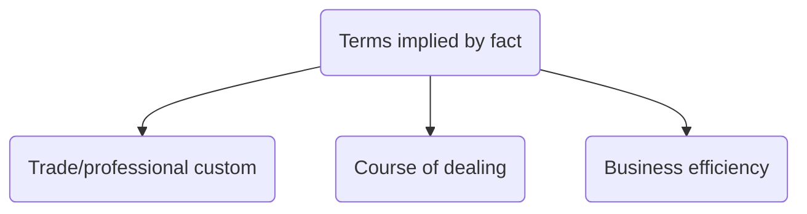
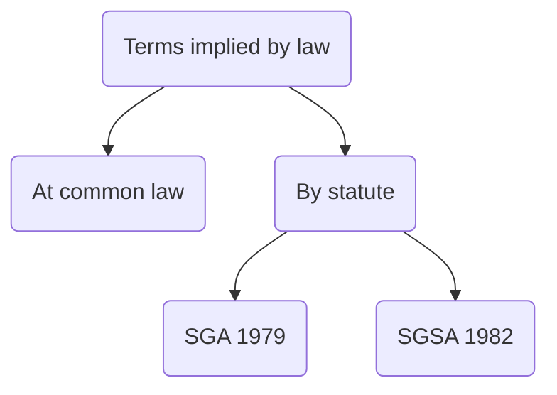

# Terms

## Introduction

Terms of a contract are its contents, define rights and obligations arising from the contract. Contractual terms may be express or implied.

Type of term | Explanation
---|---
Express terms | Statements made by the parties by which they intend to be bound. Can be agreed orally, in writing or both.
Implied terms | Terms not agreed upon, neither orally nor in writing. Law deems they exist.

## Express Terms Vs Representations

Statements made by parties can be divided into three groups:

1. Mere puffs – statements of no legal significance
2. Representations – statements of fact or law which parties do not intend to be binding, which help induce the making of a contract
3. Terms - statements of fact which parties intend to be binding. Usually promissory in nature.

If a statement is a term of the contract and the term not fulfilled, amounts to a breach of contract, the usual award for which is damages. Misrepresentation less serious than a breach of contract. A statement can be both a term and a representation.

### Test

In order to determine whether parties intended to be bound by a statement made by one of them, the court will apply **an objective test** (what would a reasonable person understand to be the intention of the parties, having regard to all the circumstances).

Presumption: when a statement made during negotiations for the purpose of inducing the other party to enter into contract, there is prima facie ground for inferring that the statement was intended to be a binding term of the contract. Can be rebutted if the party making the statement can show unreasonable to hold them to be bound by it.

### Factors

Things to take into account:

- Importance of the statement
	- A statement may be regarded as a term if it can be shown that the injured party considered it so important that it would not have entered into contract but for that statement
	- [[Bannerman v White [1861] 10 CB NS 844]] key authority for this
- Timing of statement
	- If statement made at time of contracting, more likely to be a term of the contract than if made at early stage. If there is a delay between the making of the statement and the parties entering into the contract, also less likely to be treated as a term.
	- [[Routledge v McKay [1954] 1 WLR 615]] lapse of time meant the false statement was a representation, not a term.
- Reduction of contract into writing
	- Also in [[Routledge v McKay [1954] 1 WLR 615]] contract had been reduced in writing and written contract made no mention of previous oral statement => could not have been regarded as significant by the contracting parties
	- Not necessarily decisive though
- Special knowledge/ skill of person making the statement
	- Where party making statement had exclusive access to information or special knowledge compared to other party, taken into account to the latter's favour
	- [[Oscar Chess Ltd v Williams [1957] 1 WLR 370]] false statement regarded as representation since other party had specialist knowledge
	- [[Dick Bentley v Harold Smith [1965] 1 WLR 623]] false statement regarded as term: the car dealer selling the car should have known better
- Assumption of responsibility
	- Statement might become a term where vendor expressly accepts responsibility for the soundness of the sale item in question ([[Schawel v Reade [1913] 2 IR 81 (HL)]] seller assured that horse was sound)
	- Contrast to [[Ecay v Godfrey (1947) 80 Lloyd's Rep 286]] — statement never intended to be taken as a term.

## Express Terms

Need to ascertain what an objective observer would think that the parties intended to be bound by. Terms that parties intend to be bound by will be terms of the contract. But “intention to be bound” can be demonstrated in different ways:

1. A signed written contract
2. Incorporation by notice
3. Incorporation by course of dealing
4. Other ways.

### A Signed Written Contract

Signing of a contract almost always shows that parties intend to be bound by it. Party can express an intention to be bound by something they have not read/ understood: [[L'Estrange v Graucob Ltd [1934] 2 KB 394]]. So all the terms of a contract are binding.

#### Exceptions

- If document signed not one which was intended to have any contractual effect, terms will not form part of the contract ([[Grogan v Robin Meredith Plant Hire [1996] CLC 1127]]). Signing such a contract does not indicate an intention to be bound by its terms, precisely because it was not intended that the document would have any contractual effect.
- A party may be prevented from relying on incorporation of a clause through signature of a document if it has orally misrepresented the meaning of the clause to the other party ([[Curtis v Chemical Cleaning and Dyeing Co [1951] 1 KB 805]]).

### Incorporation by Notice

Terms can be incorporated by one party notifying the other of them. In [[Parker v South Eastern Railway Co (1876-77) 2 CPD 416]] established that terms constitute part of the contract if reasonable steps have been taken to bring them to the claimant's attention.

#### Reasonable Steps

What counts as “reasonable notice” dictated by facts of case:

- [[Thompson v London, Midland & Scottish Railway [1930] 1 KB 41]] established that terms may be incorporated by reference to a different document.
- Insufficient notice where clause on back of ticket: [[Henderson v Stevenson (1875) LR S SC & Div 470]].
- Clause illegible: [[Sugar v London, Midland & Scottish Railway [1941] 1 All ER 241]]

When a party wants to incorporate terms which are particularly adverse to the other party, it must clearly bring these to the other party's attention: [[Thornton v Shoe Lane Parking [1971] 2 QB 163]], e.g.

> “Printed in red ink, with a red hand pointing to it, or something equally startling”  
> Lord Denning

Principle affirmed in [[Interfoto Picture Library Ltd v Stiletto Visual Programmes Ltd [1989] 1 QB 433]].

Note that when a document containing contractual terms is signed, the signing party is bound by the terms, even if the offending clause is onerous.

#### Timing

Any clause will not amount to a binding term if it is communicated only after the contract is made ([[Thornton v Shoe Lane Parking [1971] 2 QB 163]] chronology)

#### Contractual Effect

Terms will only be incorporated by notice if the document giving notice was intended to have 'contractual effect'. [[Chapleton v Barry UDC [1940] 1 KB 532]]

### Incorporation by a Course of Dealing

Often contract is one of a number of contracts entered into by parties. Where a clause has been brought to the notice of the other party during previous dealings, it may be implied into the current transaction to give effect to the presumed intentions of the party, even if this time omitted.

Course of dealing must be:

- Consistent
	- In [[McCutcheon v MacBrayne [1964] 1 WLR 125]] attempt to incorporate by a course of dealing unsuccessful due to past inconsistency in written terms.
- Regular
	- [[Hollier v Rambler Motors (AMC) Ltd [1972] 2 QB 71]]: four transactions over 5 years insufficiently regular.
	- [[Harry Kendall & Sons v William Lillico & Sons Ltd [1969] 2 AC 31]]: 3-4 times a month sufficient
	- [[Petrotrade Inc v Texaco Ltd [1999] 12 WLUK 745]] 5 instances over 13 months sufficient

### Other Ways of Agreeing Express Terms

Many other ways, provided parties adequately express an intention to be bound by those terms (e.g., oral agreements, terms set out in writing and other person expressing written agreement)

### Incorporation and Exclusion Clauses

A party frequently seeks to limit or exclude liability for its own breach of terms incorporated by reference or by a course of dealing. Such 'exclusion clauses' often onerous, in the sense of dramatically reducing remedy in the event of a breach. Lots of case law concerning this.

### Entire Agreement Clauses

Parties can reduce uncertainty between binding terms and representation by including in written contract 'entire agreement' clause. Says that a particular document/ set of documents is the entire agreement between the parties, e.g.,

> The parties agree that this agreement constitutes the entire agreement between them, and supersedes any previous understandings and/or arrangements between them, whether oral or written.

## Implied Terms

There are circumstances where terms which have not been expressed by the parties are inferred by the courts. The implied term is binding to the same extent as the express term.

Term can be implied in a contract:

- On the basis of fact
	- Gives effect to the presumed but unexpressed intentions of the parties
- On the basis of law
	- Courts/ statute require something, regardless of intentions of parties

### Terms Implied by Fact

#### Trade or Professional Customs

Courts consider trade customs and need to give business efficacy to a contract. Where parties have made an unambiguous express provision in contract, the court will not imply a term to the contrary.

So a term can be implied on the grounds of a custom, implication based on the assumption that it was the intention of contracting parties to be bound by well known customs of a particular trade.

#### Course of Dealings Between Parties

The term can be implied into an agreement on the basis that parties have dealt with each other many times previously. Term only implied when dealings of parties have followed consistent, regular pattern ([[McCutcheon v MacBrayne [1964] 1 WLR 125]] and [[Hollier v Rambler Motors (AMC) Ltd [1972] 2 QB 71]])

#### Business Efficacy

The term may be implied to give “business efficacy” to a contract, i.e., to make the contract produce the intended objective.

- The term will not be implied merely on the grounds that such an implication will transform the agreement into a business-like arrangement
- Term will only be implied on the grounds that without the implied term, the arrangement would be so unworkable that sensible people could not be supposed to have entered into it
- [[Shirlaw v Southern Foundries [1939] 2 KB 206 CA]]

### Terms Implied by Law

#### Terms Implied at Common Law

Can be implied by courts at common law in order to give effect to legal duties which arrive as matters of policy out of certain common types of contractual relationships (e.g., employment relationships).

### Terms Implied by Statute

Certain statutes indicate that stipulated terms will be implied into contracts. These will operate irrespective of the intention of the parties, unless a valid exemption clause exists.

Examples:

- [[Sale of Goods Act 1979]]
- [[Consumer Rights Act 2015]]
- [[Supply of Goods and Services Act 1982]]

Imply important obligations on sellers in contracts for sale of goods, and on suppliers in contracts for supply of goods/services.
