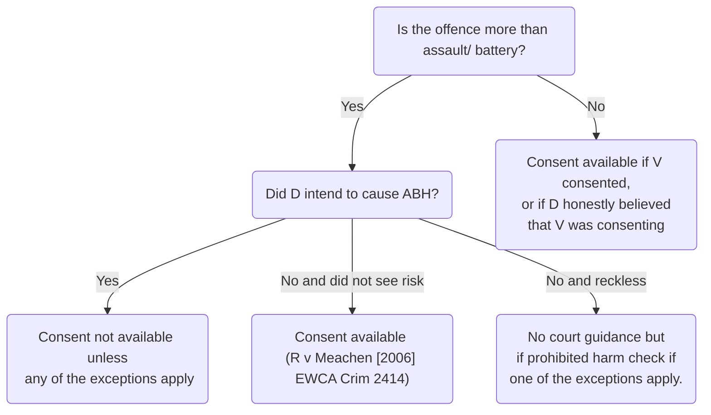

# Consent

## Introduction

For a defendant to be criminally liable, they must have the *actus reus* and *mens rea* of the relevant offence and the absence of a valid defencea justification or excuse for D’s behaviour. If a valid and complete defence exists, D will not be criminally liable.

The victim's consent can sometimes prevent a defendant being liable for a crime. For example, for property offences, there is a statutory defence for a defendant who believes the owner consents. This is found in the [Criminal Damage Act 1971, s 5(2)(a)](https://www.legislation.gov.uk/ukpga/1971/48/section/5) and the [Theft Act 1968, s 2(1)(b)](https://www.legislation.gov.uk/ukpga/1968/60/section/2).

### Defence?

For offences against the person, the consent of the victim may also preclude a crime. It is not clear whether consent operates as a defence to the crime, or whether the absence of consent is an element of the offence. The Law Lords in the important House of Lords case of [[R v Brown [1994] 1 AC 212]] were divided on this. Lords Jauncey and Templeman said consent was a defence, while Lord Mustill said lack of consent was part of the offence. Lord Lowry spoke of it as a defence, but then cited the Law Commission's Draft Code, which treats the absence of consent as an element of the offence of common assault. For the purposes of this module, it is being treated as a defence.

## Elements

There are two elements to consent, whether the:

1. victim consented; and
2. defendant believed the victim consented.

It is for the prosecution to prove both that the victim did not consent and that the defendant did not believe in the victim’s consent. So if the defendant wrongly believed the victim consented, the defence could be available, [[R v Richardson and Irwin [1999] 1 Cr App R 392]]. Equally, if the victim consented, even if the defendant did not know this, the defence could be available. Whether the defence of consent is available will depend on the level of harm inflicted on the victim and the circumstance in which the harm was inflicted.

### Offences Against the Person

The general rule is that consent is only available as a defence to assault and battery.

[[AG's Reference (No 6 of 1980) [1981] QB 715]]:

> '… it is not in the public interest that people should try to cause or should cause each other actual bodily harm for no good reason. Minor struggles are another matter. So, in our judgment, it is immaterial whether the act occurs in public or private … this means that most fights will be unlawful regardless of consent.' (Per Lord Lane CJ.)

The general rule that consent is only available as a defence to assault and battery was confirmed by the House of Lords in [[R v Brown [1994] 1 AC 212]].

The subsequent Court of Appeal case [[R v Meachen [2006] EWCA Crim 2414]] extended the use of consent.

Consent is available as a defence, even where actual bodily harm or worse is caused provided the defendant:

- intended only to commit a battery with the consent of the victim; and
- did not see the risk of inflicting actual bodily harm.

If however, the defendant intended to cause actual bodily harm, then consent is not available as a defence, even if the victim consented (unless the conduct falls into one of the exceptions which follow).

The situation regarding being reckless as to causing actual bodily harm with the victim's consent is unclear and is still the subject of academic debate.

### Exceptions

The general rule is that consent is only available as a defence to assault and battery. However, the victim can consent to offences against the person of ABH and above if the situation falls under one of the public interest exceptions such as:

- Medical treatment;
- Sport;
- Horseplay;
- Tattooing, body piercing and personal adornment; and
- Sexual gratification/ accidental infliction of harm.

#### Medical Treatment

Consent can be given for surgery and other medical treatment that causes harm. Consent can be given to a high risk of death.

#### Sport

There is a public interest in encouraging people to play sport, and therefore any incidental injury caused while playing within the rules of the game will not be an offence. Participants have consented to such incidental injury.

See [[R v Barnes [2005] WLR 910]] and [[R v Billinghurst [1978] Crim LR 553]]

In some Canadian cases, it has been held that spectators at ice hockey matches consent to a certain amount of violence!

#### Horseplay

This exception has received much criticism. See:

- [[R v Richardson and Irwin [1999] 1 Cr App R 392]]
- [[R v Jones (1986) 83 Cr App R 375]]
- [[R v Aitken [1992] 1 WLR 1006]]

#### Tattooing, Body Piercing and Personal Adornment Exception

Consent was successfully argued to the branding of skin in [[R v Wilson [1997] QB 47 (CA)]]. But in [[R v BM [2018] EWCA Crim 560]], the Court of Appeal refused to include body modification, in particular the removal of an ear, the removal of a nipple and the division of a tongue into a fork like a reptile, in the category of tattooing and personal adornment.

#### Sexual gratification/ Accidental Infliction of Harm Exception

All the following cases involved injuries sustained during consensual sexual activity.

Each case will give you some guidance on how the court has dealt with the issue of consent in a variety of issues, from sexually transmitted diseases to sadomasochistic activity.

In [[R v Dica [2004] QB 1257]] the Court of Appeal held that if the complainant consents to the risk of contracting HIV through having sexual intercourse, the defendant does have a defence to a charge under the OAPA 1861, s 20.

After examining the cases on sexual gratification, Judge LJ stated:

> 'It does not follow … that consensual acts of sexual intercourse are unlawful merely because there may be a known risk to the health of one or other participant. These participants are not intent on spreading or becoming infected with disease through sexual intercourse. They are not indulging in serious violence for the purposes of sexual gratification. They are simply prepared, knowingly, to run the risk – not the certainty – of infection, as well as all the other risks inherent in and possible consequences of sexual intercourse, such as, and despite the most careful precautions, an unintended pregnancy.
>
> Modern society has not thought to criminalise those who have willingly accepted the risks, and we know of no cases where one or other of the consenting adults has been prosecuted, let alone convicted, for the consequences of doing so.’

However, it is not possible to consent to deliberate HIV infection because HIV is considered grievous bodily harm as it disables the victim and requires long-term healthcare treatment.

The consensual sadomasochistic activity that occurred in [[R v Brown [1994] 1 AC 212]] such as burning their genitals or beatings for sexual pleasure was not deemed to be a suitable exception. The courts considered the nature of the act rather than the circumstance in which it occurred.

> 'The question whether the defence of consent should be extended to the consequences of sadomasochistic encounters can only be decided by consideration of policy and public interest.'  
> (Per Lord Templeman.)

Sexual gratification/ accidental infliction of harm cases:

- [[R v Boyea [1992] Crim LR 574 (CA)]]
- [[R v Emmett (1999) The Times, 15 October]]
- [[R v Slingsby [1995] Crim LR 570]]

> [!bug] Discussion
> The defendant’s acquittal in R v Slingsby is consistent with R v Meachen in that the defendant did not intend, nor did he see the risk of causing any harm, so consent was available. Professor Sir John Smith believes that R v Boyea (where consent was not allowed as a defence) should have been decided in the same way. It was wrongly decided because the court considered whether there was an obvious risk of causing harm, rather than applying a subjective test for recklessness.
> 
> R v Emmett and R v Brown (where consent was not available as a defence), can be distinguished, as in these cases there was a clear intention to cause harm.
> 
> So in conclusion, it is not clear whether R v Slingsby should be seen as an example of the sexual gratification exception or as under the Meachen principle of lack of foresight of risk. Equally it is not clear whether the Meachen principle is part of the general rule or another exception to the general rule.
> 
> It may well be that the courts will just consider the issue of consent on a case by case basis. See dicta in R v Meachen that there are no hard and fast rules/lists, rather that the court must look at each case on its facts.

See also s 71 Domestic Abuse Act 2021: it is no longer possible to consent to serious harm for the purposes of sexual gratification.

#### Lawful Correction of a Child Exception

A parent has a defence of reasonable chastisement in applying force to a child ([[R v Hopley (1860) 2 F & F 202]]).

This is now open to challenge under the European Convention on Human Rights, Article 3, which states that no one shall be subjected to torture or inhuman or degrading treatment.

In considering whether or not a parent could use this defence, the jury must look at the nature and context of the parent's behaviour, its duration, the physical and mental consequences for the child, and the reasons why the punishment was inflicted ([[R v H [2002] 1 Cr App R 7]]).

This area is also governed by the [Children Act 2004, s 58](https://www.legislation.gov.uk/ukpga/2004/31/section/58) which outlines that the reasonable punishment defence cannot be relied on if it results in ABH or above, for example.

> [!statute] s 58 Children Act 2004
> 
> (1) In relation to any offence specified in subsection (2), battery of a child cannot be justified on the ground that it constituted reasonable punishment.
> 
> (2) The offences referred to in subsection (1) are—
> 
> - (a) an offence under section 18 or 20 of the Offences against the Person Act 1861 (c. 100) (wounding and causing grievous bodily harm);
> 
> - (b) an offence under section 47 of that Act (assault occasioning actual bodily harm);
> 
> - (c) an offence under section 1 of the Children and Young Persons Act 1933 (c. 12) (cruelty to persons under 16).
> 
> (3) Battery of a child causing actual bodily harm to the child cannot be justified in any civil proceedings on the ground that it constituted reasonable punishment.
> 
> (4) For the purposes of subsection (3) “actual bodily harm” has the same meaning as it has for the purposes of section 47 of the Offences against the Person Act 1861.
> 
> (5) In section 1 of the Children and Young Persons Act 1933, omit subsection (7).

> [!warning]
> So if D intended or was reckless as to causing ABH or above, the lawful correction of a child defence cannot be relied on.

In [[R v BM [2018] EWCA Crim 560]], Lord Burnett of Maldon said these categories should not be extended by the courts:

> ‘New exceptions should not be recognised on a case by case basis, save perhaps where there is a close analogy with an existing exception to the general rule established in the Brown case. The recognition of an entirely new exception would involve a value judgement which is policy laden, and on which there may be powerful conflicting views in society. The criminal trial process is inapt to enable a wide-ranging inquiry into the underlying policy issues, which are much better explored in the political environment.’

> [!summary]
> - The victim’s consent can sometimes prevent a defendant being liable for a crime, e.g. belief in owner’s consent, section 5(2)(a) Criminal Damage Act 1971 and section 2(1)(b) Theft Act 1968.
> - For offences against the person the victim’s consent may also prevent the defendant from being liable for a crime:
> - The general rule is that consent is only available as a defence to assault and battery, AG’s Reference (No 6 of 1980).
> - The general rule was extended by R v Meachen- consent is available even where ABH or worse is caused provided D only intended to commit a battery with the consent of the victim and did not see the risk of inflicting ABH or above.
> - If ABH or above has been caused to the victim and the defendant intended to cause such harm (or possibly saw a risk of causing such harm), consent is not available unless D’s behaviour falls into one of the one of the exceptions to the general rule: medical treatment, sport, horseplay, tattooing, body piercing or personal adornment or sexual gratification/ accidental infliction of harm.
