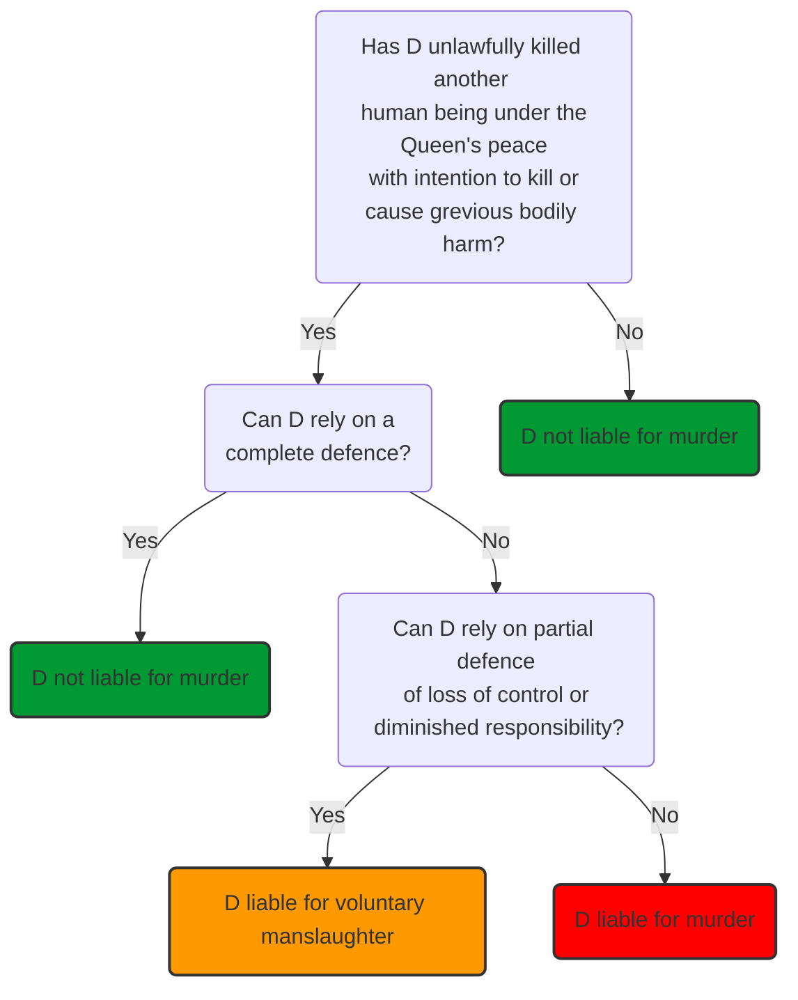

# Murder

## Murder Vs Voluntary Manslaughter

## Homicide

Under English law, there is no offence of homicide as such. It is a generic term and can be broadly defined as causing the death of another human being. Murder is the most serious form of homicide, and what distinguishes murder from other forms of homicide is that the defendant must act with a specific intent. Homicide also covers other offences, including involuntary manslaughter, for example.

Murder carries a mandatory life sentence pursuant to the [Murder (Abolition of Death Penalty) Act 1965](https://www.legislation.gov.uk/ukpga/1965/71/contents). The judge has no discretion in sentencing other than to recommend a minimum term before a prisoner can be released on licence.

> [!defn]
> Murder is a common law offence and is defined as: 'unlawful homicide with malice aforethought’ (intention to kill or cause grevious bodily harm).

The actus reus elements of the offence are the words ‘unlawful homicide’.

Unlawful homicide was defined by Sir Edward Coke (3 Inst 47) as:

> ‘…unlawfully killing a reasonable person who is in being and under the King’s peace…’

The elements of murder are as follows:

| Actus reus                                    | Mens rea |
| --------------------------------------------- | -------- |
| Unlawful, Killing, Human being, Queen’s peace | Malice aforethoughtmeaning intention to kill or intention to cause grievous bodily harm.         |

### Unlawful

The killing must be unlawful. It will be lawful to kill another if it falls into one of the following categories:

- Killing enemy soldiers in battle;
- Advancement of justice – an example of this is the lawful application of the death penalty. Although we no longer have the death penalty in this country there are occasions when a person could be tried in this country for a killing which occurred in a country which does have the death penalty;
- Self-defence – killing will be lawful where the force used was reasonable and necessary to prevent crime or protect self, others or property.

### Killing

Murder is a result crime which requires the prosecution to show that the defendant caused the death of the victim. To do this, the tests of factual and legal causation must be satisfied. Other elements cover causation in detail. In brief these tests are:

- Factual cause – 'but for' the acts or omissions of the defendant, the relevant consequence would not have occurred in the way that it did, [[R v White [1910] 2 KB 124]]
- Legal cause – the defendant's act must be the 'substantial' cause of the prohibited harm. Substantial does not mean it has to be the only or principal cause, but it needs to be more than minimal, [[R v Hughes [2013] UKSC 56]].

### Human Being

The victim of a homicide must be a person, a human being. It is not possible to murder a corpse.

Since 1979, following a conference of the Medical Royal Colleges and Faculties, it has been possible to determine the point of death with complete certainty (see the Criminal Law Review Commission 14th Report). At the moment in which the brain dies, the person will be held to have died. It is the unanimous belief of the medical profession that without the brain the body simply cannot survive.

A person is ‘in being’ when born alive and capable of independent life. The court found it necessary to determine when a person becomes 'in being’ in these cases ([[R v Poulton (1832) 5 C & P]]).

Other cases:

- [[AG-Ref (No 3 of 1994) [1998] AC 245]]
- [[R v Reeves (1839) 9 C & P 25]]

### Queen's Peace

- [[R v Adebolajo [2014] EWCA Crim 2779]]

### Mens Rea

The mens rea for murder is ‘malice aforethought’ which means:

- Intention to kill (express malice); or
- Intention to cause grievous bodily harm (implied malice). Grievous bodily harm means ‘serious harm’, [[Saunders [1985] Crim LR 230]].

The defendant does not need to have any malice, nor does the act need to be premeditated.

Mercy killing is no defence in English law ([[Inglis [2011] 1 WLR 1110]]).

The defendant can have malice aforethought even if they kill a person in the spur of the moment ([[R v Vickers [1957] 2 QB 664]]).

## Key Principles

The key principles of intention apply:

- Generally, the meaning of intention should be left to the common sense of the jury. However, direct intent is where the consequence is what the defendant, subjectively, aims to happen, [[R v Moloney [1985] 1 All ER 1025 (HL)]].
- Where D’s aim or purpose in acting is something other than death or grievous bodily harm, juries are not entitled to find oblique intent unless they feel sure:
	- Death or serious injury was a virtual certainty as a result of the defendant’s action (objective element); and
	- The defendant appreciated that (subjective element), [[R v Woollin [1999] AC 82]].
- Judges have said that the need for a Woollin direction will rarely arise. Oblique intent is not intention but evidence of it, [[R v Matthews and Alleyne [2003] EWCA Crim 192]]
- Motive is not the same as intention ([[Chandler v Director of Public Prosecutions [1964] AC 763]]) but can be used as evidence of intention ([[R v Hill (1985) 81 Cr App R 206 (CA)]]).

## Summary

Murder is a common law offence defined as the unlawful killing of a reasonable person who is in being under the Queen's peace with malice aforethought. This element considered what the prosecution must prove for the _actus reus_ of murder:

- Unlawful – the killing was not done in self-defence, for example;
- Killing – the defendant caused the victim’s death in fact **_White_** and in law, **_Hughes_**;
- Human being – the victim was alive and capable of independent life before their death, **_Poulton_**;
- Queen’s peace – the murder was committed within the legal jurisdiction of the courts of England and Wales, **_Adebolajo_**.

The _mens rea_ for murder is ‘malice aforethought’:

- Intention to kill (express malice); or
- Intention to cause grievous bodily harm (implied malice), **_Vickers_**. Grievous bodily harm means ‘serious harm’, **_Saunders_**.
