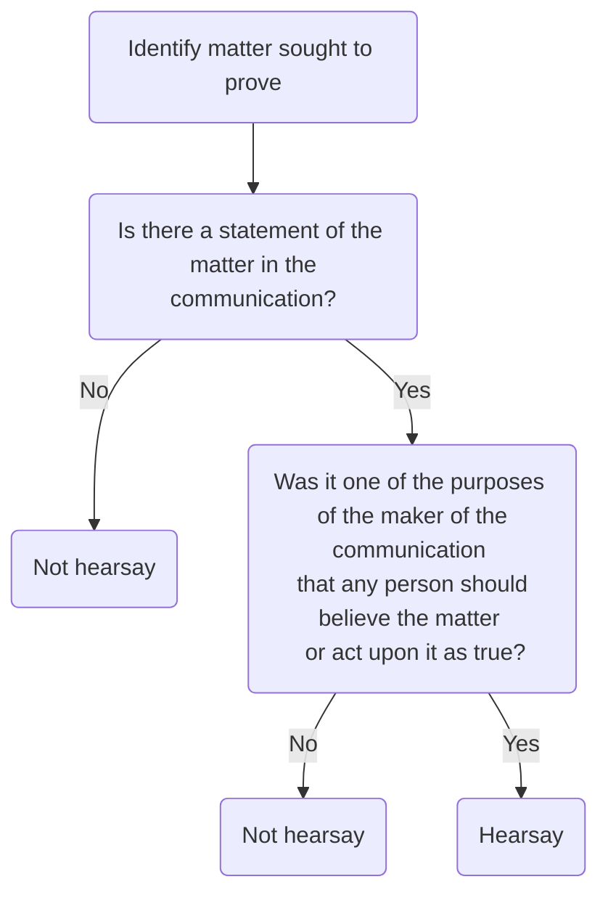

# Hearsay Evidence

```toc
```

## Statutory Definition

Pre-CJA 2003 there was a common law rule that hearsay evidence was inadmissible in criminal proceedings. Under CJA 2003, hearsay is admissible if certain conditions are met.

| Term              | Definition                                                                                          |
| ----------------- | --------------------------------------------------------------------------------------------------- |
| Hearsay statement | A statement, not made in oral evidence, that is relied on as evidence of a matter in it (s 114(1)). |
| Statement         | Any representation of fact or opinion made by the person by whatever means (s 115(2)).              |
| Hearsay           | A hearsay statement, which the court believes was made by a person to cause another person to believe the matter, or to cause another person to act (or a machine to operate) on the basis that the matter is as stated (s 115(3)).                                                                                                     |

Note that under the legislation, the term “matter stated” is used rather than hearsay.

> [!test]
> To decide whether the hearsay rules apply ([[R v Twist and Others [2011] EWCA Crim 1143]]):



> [!example] Hearsay examples
> - A witness repeating at trial what she has been told by another person
> - A statement from a witness being read out at trial instead of the witness attending court to give oral evidence
> - A police officer repeating at trial a confession made to them by D
> - A business document being introduced in evidence at trial

## Admissibility

> [!statute] s 114 CJA 2003
> (1) In criminal proceedings a statement not made in oral evidence in the proceedings is admissible as evidence of any matter stated if, but only if—
> - (a) any provision of this Chapter or any other statutory provision makes it admissible,
> - (b) any rule of law preserved by section 118 makes it admissible,
> - (c) all parties to the proceedings agree to it being admissible, or
> - (d) the court is satisfied that it is in the interests of justice for it to be admissible.

### Statutory Provision

Hearsay is admissible under a statutory provision in the following situations.

| Statute            | Admissible hearsay                                        |
| ------------------ | --------------------------------------------------------- |
| s 116 CJA 2003     | Cases where a witness is unavailable                      |
| s 117 CJA 2003     | Business and other documents                              |
| s 119 CJA 2003     | Previously inconsistent statements of a witness           |
| s 120 CJA 2003     | Previously consistent statements by a witness             |
| s 30 CJA 1998      | Reports prepared by experts (if leave of court obtained)  |
| s 76(1) PACE 1984  | Evidence of a confession made by D                        |
| s 76A(1) PACE 1984 | Evidence raised by D of a confession made by a co-accused |
| s 9 CJA 1967       | Statements from a witness which are not in dispute        |
| s 10 CJA 1967      | Formal admissions                                                          |

#### Witness Unavailable to Attend

> [!statute] s 116 CJA 2003 - Cases where a witness is unavailable
> (1) In criminal proceedings a statement not made in oral evidence in the proceedings is admissible as evidence of any matter stated if—
> - (a) oral evidence given in the proceedings by the person who made the statement **would be admissible** as evidence of that matter,
> - (b) the person who made the statement (the relevant person) is **identified** to the court’s satisfaction, and
> - (c) any of the five conditions mentioned in subsection (2) is satisfied.
> 
> (2) The conditions are—
> - (a) that the relevant person is **dead**;
> - (b) that the relevant person is unfit to be a witness because of his **bodily or mental condition**;
> - (c) that the relevant person is **outside the United Kingdom** and it is not reasonably practicable to secure his attendance;
> - (d) that the relevant person **cannot be found** although such steps as it is reasonably practicable to take to find him have been taken;
> - (e) that through **fear** the relevant person does not give (or does not continue to give) oral evidence in the proceedings, either at all or in connection with the subject matter of the statement, and the court gives leave for the statement to be given in evidence.
> 
> (3) For the purposes of subsection (2)(e) “fear” is to be **widely construed** and (for example) includes fear of the death or injury of another person or of financial loss.
> 
> (4) Leave may be given under subsection (2)(e) only if the court considers that the statement ought to be admitted in the **interests of justice**, having regard—
> - (a) to the statement’s contents,
> - (b) to any risk that its admission or exclusion will result in unfairness to any party to the proceedings (and in particular to how difficult it will be to challenge the statement if the relevant person does not give oral evidence),
> - (c) in appropriate cases, to the fact that a direction under section 19 of the Youth Justice and Criminal Evidence Act 1999 (c. 23) (special measures for the giving of evidence by fearful witnesses etc) could be made in relation to the relevant person, and
> - (d) to any other relevant circumstances.

![[s 116 CJA 2003.png]]

> [!note]
> The requirement under s 116(1)(a) menas that a statement can be admissible under s 116 only if it is first-hand hearsay. 

> [!test] Fear cases
> [[R v Riat and Others [2012] EWCA Crim 1509]] suggested a 6-stage test for whether a court would grant leave in a fear case:
> 1. Is there a specific statutory justification (or ‘gateway’) permitting the admission of hearsay evidence (CJA 2003, ss 116–118)?
> 2. What material is there which can help to test or assess the hearsay (CJA 2003, s 124)?
> 3. Is there a specific ‘interests of justice’ test at the admissibility stage?
> 4. If there is no other justification or gateway, should the evidence nevertheless be considered for admission on the ground that admission is, despite the difficulties, in the interests of justice (CJA 2003, s 114(1)(d))?
> 5. Even if prima facie admissible, ought the evidence to be ruled inadmissible (PACE 1984, s 78 and/or CJA 2003, s 126)?
> 6. If the evidence is admitted, should the case subsequently be stopped under s 125 of the CJA 2003?
> 
> The importance of the evidence to the prosecution case is an important consideration in answering these questions. 

#### Documentary Hearsay

> [!statute] s 117 CJA 2003 - Business and other documents
> (1) In criminal proceedings a statement contained in a document is admissible as evidence of any matter stated if—
> - (a) oral evidence given in the proceedings would be admissible as evidence of that matter,
> - (b) the requirements of subsection (2) are satisfied, and
> - (c) the requirements of subsection (5) are satisfied, in a case where subsection (4) requires them to be.
> 
> (2) The requirements of this subsection are satisfied if—
> - (a) the document or the part containing the statement was **created or received by a person in the course of a trade, business, profession** or other occupation, or as the holder of a paid or unpaid office,
> - (b) the person who supplied the information contained in the statement (the relevant person) had or may reasonably be supposed to have had **personal knowledge of the matters dealt with**, and
> - (c) **each person** (if any) through whom the information was supplied from the relevant person to the person mentioned in paragraph (a) **received the information in the course of a trade**, business, profession or other occupation, or as the holder of a paid or unpaid office.

> [!note]
> Multiple hearsay in documents is admissible if s 117(2)(c) is satisfied. 

Generally, the exception ensures the admissibility of business records.

##### Statements Prepared for Use in Criminal Proceedings

If the statement was prepared for ‘the purposes of pending or contemplated criminal proceedings, or for a criminal investigation’ (s 117(4)), the requirements of s 117(5) must be satisfied. The requirements of s 117(5) will be satisfied if:

- (a) any of the five conditions mentioned in s 116(2) is satisfied; or
- (b) the relevant person **cannot reasonably be expected to have any recollection** of the matters dealt with in the statement (having regard to the length of time since he supplied the information and all other circumstances).

##### Discretionary Power

The court retains a discretionary power to make a direction that a statement shall not be admitted under s 117 (CJA 2003, s 117(6)).

![[s 117 CJA 2003.png]]

##### Producing Document

> [!statute] s 133 CJA 2003 - Proof of statements in documents
> 
> Where a statement in a document is admissible as evidence in criminal proceedings, the statement may be proved by producing either—
> - (a) the document, or
> - (b) (whether or not the document exists) a copy of the document or of the material part of it,
> 
> authenticated in whatever way the court may approve. 

## Multiple Hearsay: Additional Requirements

If the hearsay is multiple hearsay, additional requirements must be met:

> [!statute] s 121 CJA 2003 - Additional requirement for admissibility of multiple hearsay
> 
> (1) A hearsay statement is not admissible to prove the fact that an earlier hearsay statement was made unless—
> - (a) either of the statements is admissible under section 117 [business document], 119 [previous inconsistent statement by witness] or 120 [previous consistent statement by witness],
> - (b) all parties to the proceedings so agree, or
> - (c) the court is satisfied that the value of the evidence in question, taking into account how reliable the statements appear to be, is so high that the interests of justice require the later statement to be admissible for that purpose.
> 
> (2) In this section “hearsay statement” means a statement, not made in oral evidence, that is relied on as evidence of a matter stated in it.

## Challenging Credibility

If hearsay is admitted, the other party will not have the opportunity to cross-examine the maker of the statement. s 124 CJA 2003 aims to compensate.

> [!statute] s 124 CJA 2003 - Credibility
> (1) This section applies if in criminal proceedings—
> - (a) a statement not made in oral evidence in the proceedings is admitted as evidence of a matter stated, and
> - (b) the maker of the statement does not give oral evidence in connection with the subject matter of the statement.
> 
> (2) In such a case—
> - (a) any evidence which (if he had given such evidence) would have been **admissible as relevant** to his credibility as a witness is so admissible in the proceedings;
> - (b) evidence may with the court’s leave be given of any matter which (if he had given such evidence) could have been put to him in **cross-examination as relevant** to his credibility as a witness but of which evidence could not have been adduced by the cross-examining party;

s 124(2)(b) includes evidence that the witnesses had previous convictions for offences where he had been untruthful.

## Unconvincing Evidence

> [!statute] s 125 CJA 2003 - Stopping the case where evidence is unconvincing
> 
> (1) If on a defendant’s trial before a judge and jury for an offence the court is satisfied at any time after the close of the case for the prosecution that—
> - (a) the case against the defendant is based wholly or partly on a statement not made in oral evidence in the proceedings, and
> - (b) the evidence provided by the statement is so unconvincing that, considering its importance to the case against the defendant, his conviction of the offence would be unsafe,
> 
> the court must either direct the jury to acquit the defendant of the offence or, if it considers that there ought to be a retrial, discharge the jury. 

## Excluding Evidence Discretion

> [!statute] s 126 CJA 2003 - Court’s general discretion to exclude evidence
> 
> (1) In criminal proceedings the court may refuse to admit a statement as evidence of a matter stated if—
> - (a) the statement was made otherwise than in oral evidence in the proceedings, and
> - (b) the court is satisfied that **the case for excluding the statement, taking account of the danger that to admit it would result in undue waste of time, substantially outweighs the case for admitting it**, taking account of the value of the evidence.
> 
> (2) Nothing in this Chapter prejudices—
> - (a) any power of a court to exclude evidence under section 78 of the Police and Criminal Evidence Act 1984 (exclusion of unfair evidence), or
> - (b) any other power of a court to exclude evidence at its discretion (whether by preventing questions from being put or otherwise).

## Admitting Hearsay Procedure

Part 20 CrimPR rules on admitting hearsay apply to cases where:

1. it is in the **interests of justice** for the hearsay evidence to be admissible (s 114(1)(d));
2. the **witness** is **unavailable** to attend court (s 116);
3. the evidence is **multiple hearsay** (s 121); or
4. either the prosecution or the defence rely on s 117(1) for the admission of a **written witness statement** prepared for use in criminal proceedings (CrimPR, r 20.2).

> [!note]
> If D made a confession at the time of arrest, Part 20 rules do not apply to the arresting officer giving details of the confession at trial. 

A party must give notice of their intention to adduce hearsay evidence at trial. There are time limits for this.

- If the CPS wishes to adduce Part 20 hearsay evidence at trial
	- Must serve notice to the court and the other parties (r 20.2 CrimPR)
	- **Notice** sent $\leq 20$ business days ([[Magistrates' Court]]) or $\leq 10$ business days ([[Crown Court]]) after D pleads not guilty (r 20.2(3)).
	- If **D** opposes this, must send notice as soon as reasonably practicable and $\leq 10$ business days after the latest of (r 20.3(2)(c))
		- Service of notice to introduce evidence
		- Service of evidence, if no notice required
		- D pleading not guilty.
- If D wishes to adduce Part 20 hearsay evidence at trial
	- **Serve notice** to court and other parties (r 20.2(4)) as soon as reasonably practicable.
	- If **CPS** objects, it must send notice as soon as reasonably practicable and $\leq 10$ business days after the latest of (r 20.3(2)(c))
		- Service of notice to introduce evidence
		- Service of evidence, if no notice required
		- D pleading not guilty.

> [!statute] r 20.5 CrimPR
> (1) The court may—
> - (a) shorten or extend (even after it has expired) a time limit under this Part;
> - (b) allow an application or notice to be in a different form to one set out in the Practice Direction, or to be made or given orally; and
> - (c) dispense with the requirement for notice to introduce hearsay evidence.
> 
> (2) A party who wants an extension of time must—
> - (a) apply when serving the application or notice for which it is needed; and
> - (b) explain the delay.
