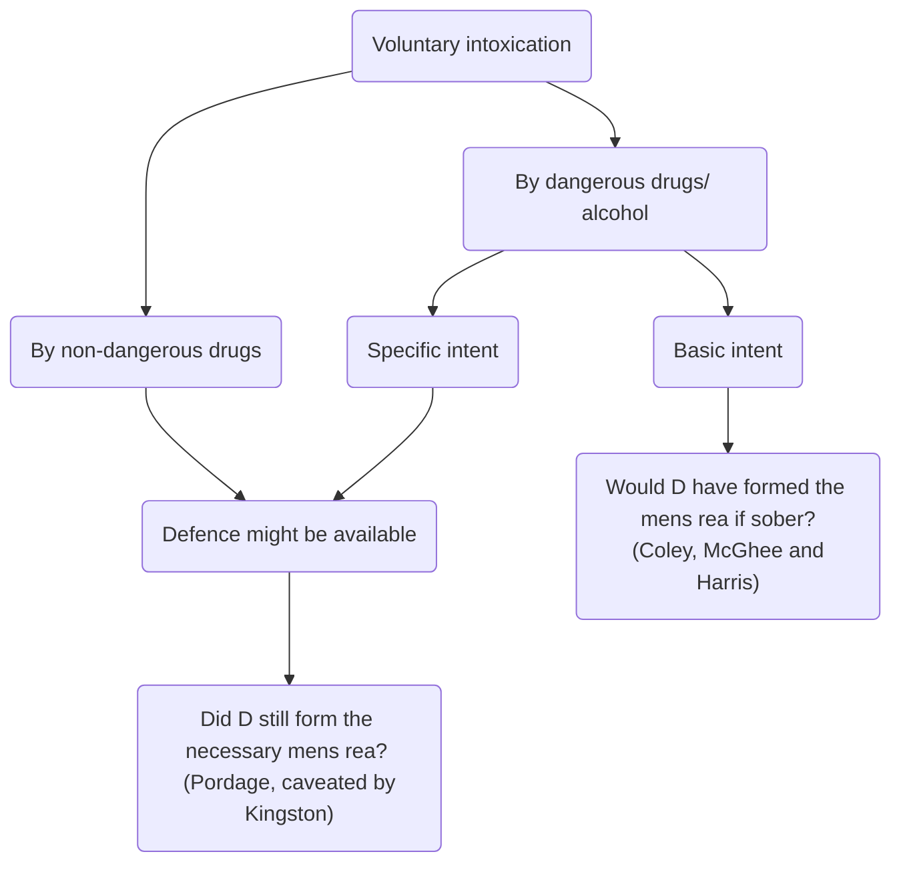
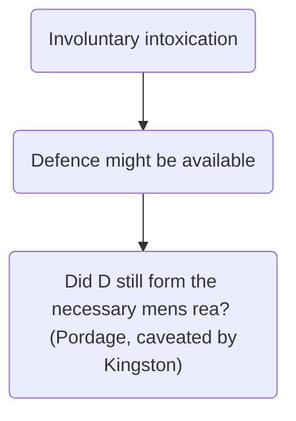

# Intoxication

## Introduction

For a defendant to be criminally liable, they must have the actus reus and mens rea of the relevant offence and the absence of a valid defencea justification or excuse for D’s behaviour. If a valid and complete defence exists, D will not be criminally liable.

Intoxication is a general defence, which means it is available to almost any crime. You will come across intoxication in two different forms:

- A way to negate the mens rea of an offence; or
- An influencing factor on another legal principle/ defence.

First, let us consider the law when addressing whether intoxication can be used to negate mens rea.

## Negating Mens Rea

The principle of intoxication allows the defendant to use evidence of their intoxication to show that they did not form the necessary mens rea for the offence. Strictly speaking, it is not a defence, but many practitioners and academics refer to it in that way. Since the leading case on the burden of proof, [[Woolmington [1935] AC 462]], it has been clear that the prosecution need to prove, beyond reasonable doubt, that the defendant has committed the actus reus with the necessary mens rea. If, due to intoxication, the defendant did not form the necessary mens rea, then under certain circumstances, the defendant will be entitled to a full acquittal.

In [[R v Bennett [1995] Crim LR 877 (CA)]] it was held that the judge is obliged to direct the jury on intoxication whenever there is evidence such that a reasonable jury might conclude that there is a reasonable possibility that the accused did not form the mens rea.

[[R v Pordage [1975] Crim LR 575 (CA)]] confirmed that the question at issue is not whether the defendant was incapable of forming the mens rea, but whether, even if still capable, they did form it.

If the accused's drunkenness was not such as to negate mens rea, it is no answer for the accused to say that they would not have behaved as they did but for being drunk. If the prosecution can establish that the defendant formed the necessary mens rea, despite their intoxication, then intoxication will not assist the defendant.

A good example of this legal principle is the case of [[R v Kingston [1995] 2 AC 355]].

**It was held in DPP v Majewski that where a person is voluntarily intoxicated their intoxication can be taken into account for crimes of specific intent. The question from R v Pordage to ask is, despite the intoxication, did the defendant form the MR? It was held in R v Kingston that a drunken intent is still an intent.**

### Circumstances

Intoxication can operate to negate the *mens rea*:

- In any crime where the intoxication is caused by **drink or drugs taken involuntarily**, i.e., 'spiking' or 'lacing' someone's drink or food with a drug or alcohol.
- In any crime where the intoxication is caused by drugs taken voluntarily, but in **bona fide pursuance of medical treatment**.
- In any crime where the intoxication is caused by **non-dangerous drugs taken voluntarily** (dangerous drugs are those which are illegal or alcohol)
- In crimes where a **specific intent** is required (generally where the offence cannot be committed recklessly).

It would appear that there is an evidential burden on the defendant to raise the issue of intoxication, and then the prosecution needs to prove beyond reasonable doubt that the defendant formed the necessary mens rea.

When addressing whether intoxication will negate the mens rea of the alleged offence, you should ask the following three questions:

1. Is the defendant voluntarily intoxicated or involuntarily intoxicated?
2. Is the intoxicant a dangerous alcohol/drug or a non-dangerous drug?
3. Is it a crime of basic intent or specific intent?

### Involuntary Intoxication

Where the intoxication is involuntary, the defence of intoxication may be available for any offence (both specific and basic intent crimes).

This could arise where D was forced to consume alcohol or other intoxicating drugs, or was deceived into doing so, for example by drugs being placed in their food or their drink being laced with alcohol. See R v Kingston.

However, where the defendant is aware that they are drinking alcohol, but is mistaken as to the strength of the alcohol, this will not count as involuntary intoxication, [[R v Allen [1988] Crim LR 698]].

### Voluntary Intoxication

[[DPP v Majewski [1977] AC 443]] is the key case, where it was held that voluntary intoxication could be a defence to a charge of specific intent, but not to a charge of basic intent.

It is not clear from DPP v Majewski how the jury should be directed when a defendant who is voluntarily intoxicated has committed a basic intent crime. The extract from Lord Elwyn-Jones suggests that the prosecution is excused having to prove the mens rea, while Lord Salmon in the same case referred to the defendant being unable to use intoxication as a defence.

As Lord Elwyn-Jones’s method has been criticised, the method used by the courts today is for the jury to consider whether the defendant would have seen the risk had they not been intoxicated, [[R v Coley, McGhee and Harris [2013] EWCA Crim 233]].

The Judicial Studies Board Crown Court Book gives the following direction for the first part of the test in R v G:

> ‘If the defendant’s ability to appreciate the risk was or may have been impaired through drink, the jury should be asked to consider his awareness as it would have been had the defendant been sober. If they are sure the defendant would have been aware of the risk if he had been sober, the first stage is satisfied.’

### Specific Vs Basic Intent

Majewski provided a leading method for categorising crimes for some time.

#### Basic Intent Offences

A crime was categorised as one of basic intent where the defendant could be convicted on the basis of recklessness as to the consequences, or where no foresight as to the consequences is required.

An example of a basic intent offence is battery, as D must intend or be reckless as to applying unlawful force on another.

> [!example] Basic intent offence examples
> 
> - Unlawful act manslaughter
> - Gross negligence manslaughter
> - Malicious wounding/ inflicting GBH, s 20
> - Assault occasioning ABH, s 47
> - Battery
> - Assault
> - Basic criminal damage and aggravated criminal damage, s 1(1) and s 1(2) Criminal Damage Act 1971
> - Burglary under s 9(1)(b) where D has fulfilled the last element by causing GBH.

#### Specific Intent Offences

Crimes of specific intent were those where intention was the only form of mens rea available, i.e., where recklessness was insufficient mens rea for the offence to be made out.

An example of a specific intent offence is murder as D must intend to kill or cause grievous bodily harm, recklessness is not enough.

> [!example] Specific intent offence examples
> - Murder
> - Wounding or grievous bodily harm with intent, section 18 Offences Against the Person Act (‘OAPA’) 1861
> - Theft
> - Robbery
> - All burglary under s 9(1)(a) Theft Act 1968
> - Burglary under s 9(1)(b) where D has fulfilled the last element by:
> 	- Stealing
> 	- Attempting to steal or attempting to cause GBH

#### Controversy

However, there is no agreed definition of specific and basic intent offences. In the controversial Court of Appeal case of [[R v Heard [2007] EWCA Crim 125]], Lord Justice Hughes gave the following rule for determining specific intent crimes:

> '… proof of a state of mind addressing something beyond the prohibited act itself, namely its consequences.’

If the Heard definition was applied, it would mean that aggravated criminal damage contrary to[s 1(2) Criminal Damage Act 1971](https://www.legislation.gov.uk/ukpga/1971/48/section/1) which is generally thought of as a basic intent offence would be treated as a specific intent offence, as the mens rea includes an intention or recklessness as to life being endangered by the defendant’s act of criminal damage.

However, more recently Hughes LJ in [[Coley, McGhee and Harris [2013] EWCA Crim 233]], while noting that there was now room for doubt as to whether aggravated criminal damage was a crime of basic intent due to the ‘passing obiter reference’ in Heard, said there was force in the argument that voluntary intoxication should not be a defence to crimes of recklessness. He said it was not necessary to resolve the matter in the case before him.

Dennis J Baker in Glanville Williams’s Criminal Law described the court in Heard as having ‘embarked on an ill-considered legislative venture’ and the court’s reasoning as being ‘contradictory and fallacious’. The case is also criticised by David Ormerod in Smith, Hogan and Ormerod’s Criminal Law, where he concludes that any offence which may be committed recklessly ought to be held to be an offence of basic intent.

It is therefore proposed that you concentrate on the Majewski method for distinguishing between crimes of basic and specific intent.

### Dangerous and Non-dangerous Drugs

The court in [[R v Hardie [1985] 1 WLR 64]] held that drugs are divided into two categories.

| Classification      | Description                                                                                                                                                                                                                  |
| ------------------- | ---------------------------------------------------------------------------------------------------------------------------------------------------------------------------------------------------------------------------- |
| Dangerous drugs     | Where it is common knowledge that a drug is liable to cause the taker to become aggressive, or to do dangerous or unpredictable things, that drug is to be classed with alcohol. Illegal drugs will fall into this category. |
| Non-dangerous drugs | Where there is no such common knowledge, e.g., a merely soporific or sedative drug. Different rules apply for non-dangerous drugs, the defence of intoxication might be available if D did not form the necessary mens rea.                                                                                                                                                                                                                             |

### Summary

## Intoxication and Other Defences

The second way that intoxication can impact legal analysis is as an influencing factor on another legal principle or defence. Generally, intoxication will not enable a defendant to rely on a defence, whether the crime they have committed is one of specific or basic intent.

> [!summary]
> - **Self-defence** - D cannot rely on a drunken mistake as to the need to use self-defence.
> - **Loss of control and diminished responsibility** - can still be pleaded if D was intoxicated but it does impact various aspects of the legal analysis.
> - **Consent** - if the jury are satisfied that V consented to the accidental infliction of injury or D (even wrongly) believed that V consented (due to their intoxication), D may have a defence, Richardson & Irwin.
> - **Statutory defences** - where these allow for an honest belief, D will be able to use the defence even if their belief is due to voluntary intoxication, see Jaggard v Dickinson on the lawful excuse defence for criminal damage.
