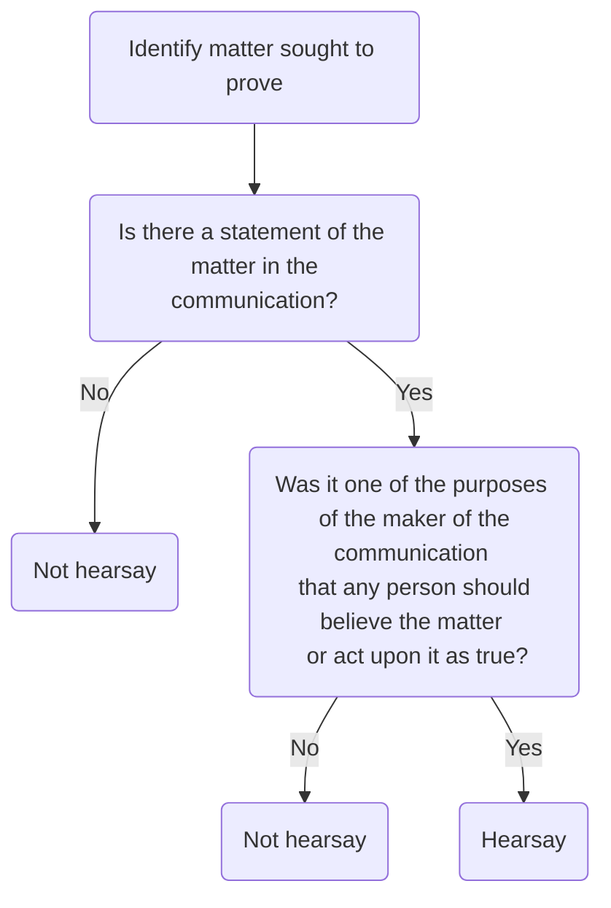

# mermaid

```mermaid
graph TD
id1(Identify matter sought to prove)--> id2("Is there a statement of the <br/> matter in the communication?")
id2 --> |No| id3.1(Not hearsay)
id2 --> |Yes| id3.2(Was it one of the purposes <br/> of the maker of the communication <br/> that any person should believe the matter <br/> or act upon it as true?)
id3.2 --> |No| id4.1(Not hearsay)
id3.2 --> |Yes| id4.2(Hearsay)


```
