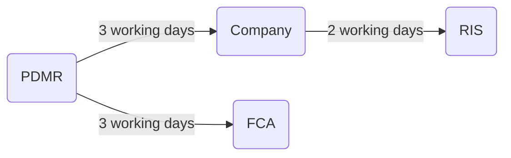

# Continuing Obligations

Once a company is listed, it becomes subject to continuing obligations. These include:

- Obligations imposed by FCA
	- UK MAR
	- UK Prospectus Regulation
	- DTRs
	- PRRs
	- Listing Rules
- Obligations imposed by LSE
	- Admission and Disclosure Standards.

## Purpose

Continuing obligations exist to protect existing and potential investors. Ensures an orderly market for investors and that all investors have access to information at the same time.

Companies with a standard listing are subject to fewer obligations than those with a premium listing. Before an IPO, a company should consider whether it is capable of meeting the continuing obligations imposed on it after the IPO.

Controls on listed companies have been strengthened post financial crisis. To attract companies back to listing after the crash, the LSE created the dual listing system. The in-house legal department of a listed company often takes responsibility for ensuring the company meets its obligations.

### Continuing Obligations

Types of obligations include:

1. obligations with **continuing application**;
2. obligations requiring the **disclosure and notification** of information about the company;
3. obligations relating to the **shareholders** of the company;
4. obligations relating to **financial information** about the company ; and
5. obligations in the **Admission and Disclosure Standards**.

```ad-note
Following only applicable to a premium listed company. 
```

The Association of General Counsel and Company Secretaries has produced guidelines establishing systems and controls complying with all of the above.

## Obligations with Continuing Application

Listing Rule 9.2 sets out some of the requirements for a premium listing.

### Admission to Trading

- A condition for listing is that the shares are admitted to trading (LR 2.2.3R).
- Listing Rule 9.2.1R provides that it is a continuing obligation that the company’s shares are admitted to trading at all times.
- Listing Rule 14.3.1R requires the shares to be admitted to trading at all times for a standard listed company.

### Transparency and Corporate Governance Rules

- Under LR 9.2.5G and LR 9.2.6R, a premium listed company must comply with the disclosure requirements under MAR and the obligations on persons discharging managerial responsibilities (PDMRs) to disclose certain dealings in shares which they own in their listed company.
- Under LR 9.2.6AG, LR 9.2.6BR and LR 9.2.6CR, a premium listed company must comply with the Transparency Rules ( Chapters 4–6 of the DTRs) and the Corporate Governance Rules ( Chapter 7 of the DTRs).
- A company with a standard listing must comply with the MAR disclosure obligations and the Transparency Rules (LR 14.3.11G, LR 14.3.22R, and LR 14.3.23R), and the Corporate Governance Rules (LR 14.3.24R and LR 14.3.25R).

### Contact Details

The company must provide to the FCA contact details of at least one person which it nominates to be the first point of contact with the FCA in relation to compliance with the Listing Rules and the DTRs and the disclosure requirements under MAR (LR 9.2.11R and LR 9.2.12G). Must be contactable on business days between 7 am and 7 pm.

This is also required for a company with a standard listing (LR 14.3.8R).

### Shares in Public Hands

- One of the conditions for listing is that at least 25% of the company’s shares are in public hands (LR 6.14.1R)
- LR 9.2.15R: the company must comply with this rule at all times.
- It must give written notice to the FCA without delay if the proportion of listed securities in public hands falls below 25% (LR 9.2.16R).The standard listed company must continue to comply with LR 14.2.2R at all times (LR 14.3.2R) – same requirement.

### Independent Business, Controlling Shareholder and Control of Business

- Listing Rule 9.2.2AR states that a premium listed company must continue to carry on an independent business as its main activity at all times.
	- Also a requirement for listed companies on first being admitted to the premium segment of the Main Market under LR 6.4.1R.
- If the company has a controlling shareholder, it must continue to have in place the required written agreement, comply with its terms, and maintain provisions in its articles regarding the election of independent directors (LR 9.2.2AB).
- LR 9.2.2IR further requires a listed company to exercise operational control over its business as it had to in order to join the Main Market.

## Disclosure and Notification of Information

Sources of obligations:

- Some of these disclosure and notification obligations arise under the Market Abuse Regulation (MAR) and some under the DTRs.
	- The DTRs give effect to the Transparency Directive, introducing the Transparency Rules, and the Statutory Audit Directive and the Company Reporting Directive, introducing the Corporate Governance Rules.
- Further obligations are set out in LR 9.6.

### Disclosing Inside Information

```ad-important
title: Art 17(1) UK MAR
General obligation to disclose "inside information" about the company. Applies to premium and standard listings, as well as companies quoted on AIM. Applies to **issuers** of financial instruments (as defined in MiFID II). 
```

Helps to ensure that the share price accurately reflects the company's value, reducing the scope of those with insider information to make a secret profit.

The company must also disclose the information on its website and maintain it there for at least five years in accordance with MAR, Article 17(1).

Here financial instruments include ordinary shares. Defined under Art 17(3) to include ordinary shares.

#### Inside Information

```ad-defn
UK MAR, Article 7 defines inside information. It is information:
1. of a precise nature;
2. which has not been made public;
3. which relates, directly or indirectly, to an issuer of a financial instrument or to the financial instrument itself; and
4. if generally available, would be likely to have a significant effect on the price of the financial instrument or the price of related investments.

```

- The company and its advisers are best placed to make an initial assessment of whether information is ‘inside information’ which therefore must be disclosed (DTR 2.2.7G).
- The board must carefully and continuously monitor any changes in the company’s circumstances, which may mean an announcement is required (DTR 2.2.8G).

##### Precise Nature

```ad-test
MAR, Article 7(2) provides that information is of a precise nature if it 
1. EITHER:
	1. indicates a set of circumstances that:
		- exist; or
		- may reasonably be expected to come into existence; OR
	2. indicates an event that:
		- has occurred; or
		- may reasonably be expected to occur; AND
2. is specific enough to enable a conclusion to be drawn as to the possible effect, on the price of the financial instrument, of that set of circumstances or that event.
```

```ad-important
Precise information includes information on:
1. a protracted process that is intended to bring about, or that results in, particular circumstances or a particular event, those future circumstances or that future event; and
2. intermediate steps of that process which are connected with bringing about or resulting in those future circumstances or that future event.
```

This is a very wide definition:

- In [[Geltl v Daimler AG (Case C-19/11)]], the ECJ, in considering the definition of inside information, decided that a reasonable expectation that an event will occur means there must be a realistic prospect that the event will occur, not merely a high probability.
- The information does not have to be entirely accurate to be precise ([[Upper Tribunal in Hannam v Financial Conduct Authority [2014] UKUT 0233 (TCC)]]).

Information about an intermediate step will be inside information itself if it satisfies the criteria for inside information (MAR, Article 7(3)).

#### Financial Instrument

```ad-defn
This term is defined in MAR, Article 3(1)(1), which refers to the definition of ‘financial instrument’ under Article 4(1)(15) of the MiFID II Directive (2014/65/EU) which refers to the list of instruments in Section C of Annex I to the Directive.

It includes shares (transferable securities), but it also includes other investments such as options to acquire shares, and interest rate, currency and equity swaps.

```

#### Significant Effect on a Price

There is no specific figure (percentage or otherwise) which can be set which constitutes a ‘significant effect’ on the price (DTR 2.2.4G(2)).

```ad-test
title: Reasonable investor test
The test will be satisfied if a reasonable investor would be likely to use the information as part of the basis of his investment decision (MAR, Article 7(4)).
```

DTR 2.2.6G provides that information about the following matters is likely to fulfil the reasonable investor test:

1. the company’s assets and liabilities;
2. the performance, or the expectation of the performance, of the company’s business;
3. the company’s financial condition;
4. the course of the company’s business;
5. major new developments in the company’s business; or
6. information previously disclosed to the market.

```ad-tip
If a reasonable investor would be likely to use information as part of the basis of his or her investment decisions, that means it is information which would be likely to have a significant effect on price. There is therefore no need to show that the information is actually price sensitive.

```

#### Making Inside Information Public

MAR, Article 17(1) sets out various requirements for making sure information is disseminated effectively. The company must ensure that the inside information is made public in a manner which enables fast access and complete, correct and timely assessment of the information by the public. It must also be posted on the company’s website for at least five years.

In practice, listed companies will satisfy this obligation by making announcements via a Regulatory Information Service (an RIS) and posting it on their website.

#### Regulatory Information Service

An RIS is either a Primary Information Provider (PIP) or an Information Society Service (ISS).

| RIS | Details                                                                                                                                            |
| --- | -------------------------------------------------------------------------------------------------------------------------------------------------- |
| PIP | This is a service which has been approved by the FCA under s 89O of the FSMA 2000 and is on the list of PIPs maintained by the FCA on its website. |
| ISS | an information service which disseminates regulated information and is established in an EEA country outside the UK.

The best known RIS and PIP (for historical reasons as it used to have a monopoly) is the Stock Exchange’s own Regulatory News Service, known as RNS.

#### Becoming a PIP

To be approved as a PIP, the information service must comply with DTR 8.3R which in turn requires compliance with a series of detailed ongoing obligations set out in DTR 8.4R.

Company announcements made through RNS can be accessed by anyone from the Stock Exchange’s website, and all announcements can be accessed from the National Storage Mechanism.

Transparency Rule 6.3.2R requires that all regulated information (which includes information disclosed under MAR, Article 17(1)) must be disclosed in accordance with DTRs 6.3.3R to 6.3.8R which set out minimum standards. These set out that information must be:

 1. disseminated in a way ensuring it is capable of being **disseminated** as **widely** as possible;
 2. usually communicated in **unedited full text**;
 3. communicated in a way which ensures the **security** of the communication and provides certainty as to the **source** of the information; and
 4. communicated in a way which makes it **clear it is regulated information** and who the issuer is, and the date, time and subject matter of the communication.

#### Role of a PIP

A PIP is a FCA-approved organisation which ensures that information from listed companies (such as regulatory announcements and company news) is disseminated to secondary news sources (Secondary Information Providers, or SIPs), such as Reuters, Bloomberg or Morningstar, at the same time. The SIPs then pass on the information to the public at large.

#### Disclosing ASAP

MAR, Article 17(1) requires a company to disclose all inside information ‘as soon as possible’. A short delay may be acceptable if necessary to clarify the situation (DTR 2.2.9G(2)).

The company should make what is called a ‘holding announcement’ where it believes there is a danger that inside information is likely to leak out before the facts and their impact can be confirmed. This should contain:

1. as much detail of the subject matter as possible;
2. the reasons why a fuller announcement could not be made; and
3. an undertaking to announce further details as soon as possible (DTR 2.2.9G(2)).

The FCA should be consulted if there are any doubts about the timing of the company’s announcements under MAR (DTR 2.2.9G(4)).

```ad-warning
A failure to follow the rules surrounding prompt disclosure of information can be costly. 
```

```ad-question
title: Is it possible for companies to "offset" bad news with good news to avoid making an announcement?
No, companies should disclose both and let the market decide. 
```

#### Delaying Disclosure

```ad-test
title: When disclosure can be delayed
MAR, Article 17(4) provides that the company can delay disclosure if the following three conditions are met:
1. immediate disclosure is likely to prejudice the company’s **legitimate interests**;
2. delay of disclosure is not likely to **mislead** the public; and
3. the company can ensure the **confidentiality** of that information.
```

##### Legitimate Interests

‘MAR Guidelines: Delay in the disclosure of inside information’ by ESMA says this includes:

- Company conducting negotiations where the outcome of negotiations would be jeopardised by immediate public disclosure.
- Financial viability in grave and immediate danger and the disclosure would jeopardise the negotiations designed to ensure financial recovery
- New product/ invention developed and IP rights would be jeopardised by immediate disclosure
- Buying/ selling a majority holding in another entity and disclosure would jeopardise the plan
- Transaction previously announced subject to public authority's approval and such approval is conditional on requirements. The company's ability to meet the requirements would be jeopardised by disclosure.

##### Mislead Public

For example, where inside information whose disclosure the company intends to delay:

- is materially different from the previous public announcement of the company on the matter
- concerns the fact that the issuer’s financial objectives are not likely to be met, where such objectives were previously publicly announced; or
- is in contrast with the market’s expectations, where such expectations are based on signals that the company has previously sent to the market.

##### Confidentiality

Under MAR, Article 17(7), where disclosure of inside information has been delayed in accordance with MAR, Article 17(4) and the confidentiality of that inside information is no longer ensured, the company must disclose that inside information to the public as soon as possible. This includes a situation where a rumour about the inside information is sufficiently accurate.

A holding announcement should be prepared where disclosure of inside information is being delayed so that the announcement can be released swiftly if there is an actual or likely breach of confidentiality (DTR 2.6.3G).

Where there is press speculation or market rumour concerning a company, the listed company should assess whether its general obligation to announce has arisen under MAR, Article 17(1). To do this, the company needs to assess carefully whether the speculation or rumour has given rise to a situation where the company has inside information (DTR 2.7.1G).

```ad-question
title: Is knowledge that a market rumour is false inside information?
Generally no, but possibly. Where it does amount to inside information, the FCA expects that there may be cases where an issuer would be able to delay disclosure in accordance with MAR, Article 17(4) (DTR 2.7.3G).
```

##### Announcing Delayed Inside Information

When delayed disclosure is made, the company must notify the FCA immediately, giving specified details of the circumstances of the delay (MAR, Article 17(4)). The FCA has the power to require the company to provide written explanations as to how the conditions in MAR, Article 17(4) were met (FSMA 2000 (Market Abuse) Regulations 2016 (SI 2016/680), reg 4).

Steps:

- Release delayed info to the public
- Fill in FCA form to notify FCA of delayed disclosuure
- FCA may require additional info, such as date and time, who, why etc. (EU Reg 2016/1055 art 4)

##### Disclosure to Third Parties in the Course of employment/ Profession

- Where any inside information is disclosed to any third party in the normal course of employment/ profession, it must make complete and effective public disclosure of that information, simultaneously in the case of an intentional disclosure, and promptly in the case of a non-intentional disclosure.
- This does not apply if the person receiving the information owes a duty of confidentiality, regardless of whether such duty is based on a law, on regulations, on articles of association, or on a contract (MAR, Article 17(8)).
- Disclosure Rule 2.5.9G highlights the fact that the wider the group of people to whom information is provided, the greater the risk that there will be a leak,

### Consequences of Breaching Disclosure Obligations

See [[EU and FCA#Sanctions for Breaches]].

#### Criminal

Any breach of the general obligation of disclosure under MAR, Article 17 may

- Constitute a criminal offence under s 89 and 90 of the Financial Services Act 2012, which contain provisions relating to misleading statements and misleading impressions.
- Give rise to an offence under Pt V of the Criminal Justice Act 1993 relating to insider dealing.
- It is a criminal offence, under s 3 of the Fraud Act 2006, punishable by up to 10 years’ imprisonment and/or a fine, fraudulently to fail to disclose information which a person is under a legal duty to disclose in certain circumstances.

#### Civil Offences

- Under s 90A of and Sch 10A to the FSMA 2000, a listed company will be liable to pay compensation to a person who has acquired shares, continues to hold shares or disposes of them and has suffered loss as a result of reliance on any untrue or misleading statement in, or omission from, any published information.
	- Includes all information announced via a RIS/ availability announced by RIS.
- Company will be liable if a PDMR for the company knew that the statement was wrong or misleading, was reckless as to whether it was, or knew any omission was a dishonest concealment of a material fact.
- Offence to dishonestly delay the publication of information released through a RIS under s 90A FSMA 2000.

```ad-question
title: Can a director be personally liable?
A director could bear liability to his company for negligence, or could have sanctions imposed on him if he was knowingly concerned in the breach under s 91(2) of the FSMA 2000
```

### Insider Lists

```ad-statute
title: MAR Article 18(1)
Premium, standard and AIM companies must compile a list of those persons who work for it who have access to inside information relating to the company.
```

As well as the company's own employees, this should include all persons ‘otherwise performing tasks’ who have access to inside information about it, such as advisers, accountants or credit rating agencies (MAR Art 18(2)).

MAR, Article 18(1) requires ‘any person acting on … behalf’ of the publicly traded company to maintain their own list of those who have access to inside information relating to the company.

```ad-note
title: Reasoning
To protect market integrity and help manage duties of confidentiality. 
```

If the FCA asks to see the list then the company must provide it as soon as possible (MAR, Article 18(1)(c)).

#### Procedure

- Under DTR 2.6.1G, companies should establish effective arrangements to deny access to inside information to persons other than those who require it for the exercise of their functions within the company.
- The list should be in the format set out in the templates in Annex 1 to Commission Implementing Regulation (EU) 2016/347.
- It must be kept electronically for at least five years from the date it is drawn up or updated.

### Notifications

Listing Rule 1.4.11R and Transparency Rule 6.3.2R require that all regulated information must be disclosed in accordance with DTRs 6.3.3R to 6.3.8R which sets out minimum standards of dissemination.

```ad-important
The RIS system complies with these requirements. 
```

#### Copies of Documents

Listing Rules 9.6.1R to 9.6.3R provide that a premium listed company must file two copies of the following documents with the FCA:

1. all circulars, notices, reports (at the same time they are issued); and
2. resolutions, other than resolutions concerning ordinary business at an AGM (as soon as possible after the relevant meeting).

The company must also notify an RIS that it has filed such documents with the FCA, and set out where copies of the document can be obtained.

```ad-note
These provisions have now been superseded by the obligation on listed companies to file documents with the NSM.
```

#### Notification Relating to Capital

**LR 9.6.4R** a listed company must notify an RIS as soon as possible of the following information in relation to its capital:

1. proposed changes to capital structure;
2. any redemption of listed shares; and
3. the results of any new issue or offer of listed securities.

**DTR 6.1.9R** the company must disclose to the public any change in the rights which attach to any class of listed securities.

**Transparency Rule 5.5.1R** requires the company to disclose the acquisition or disposal of its own shares.

**DTR 5.6.1R** requires the total number of voting rights and capital for each class of shares to be announced at the end of each month in which there has been an increase or decrease (e.g., after rights issue/ buyback).

**DTR 5.6.1AR** this information must be disclosed at any time after there has been a transaction which produces a **material change** in the total number of voting rights. A material change is defined in DTR 5.6.1BG as an increase or decrease of 1% or more.

#### Notification of Major Interests in Shares

Ch 5 DTRs requires every shareholder (of a premium and standard listed company) to notify the company if his, her or its shareholding:

1. has fallen from above 3% to below 3%;
2. has risen from below 3% to above 3%; or
3. is over 3% and rises or falls to a different percentage level.

Transparency Rule 5.8.12R obliges the company to disclose to the public the information it receives under Chapter 5 of the DTRs. The company must make this disclosure in the usual way, that is, by notifying the information to an RIS as soon as possible and no later than the end of the next trading day after receipt of the information.

#### Notification of Board Changes and Directors' Details

- The company must notify an RIS when a new director is appointed, an existing director resigns, retires or is removed, or there is a change to any important function or executive responsibility of a director (LR 9.6.11R).
- Listing Rule 9.6.13R provides that the company must notify an RIS of certain information about new directors, including details of certain current and past directorships, unspent convictions, bankruptcies and any public criticism by a regulatory or statutory body.
- Listing Rule 9.6.14R requires this information to be updated where necessary and to include details of a current director’s new directorships in other publicly quoted companies.

#### Notification of Lock-up Arrangements

Listing Rules 9.6.16R and 9.6.17R provide that the premium listed company must notify an RIS of any lock-up arrangements (“irrevocable undertaking” – preventing shareholders selling their shares for a specific period) that have not already been disclosed, or of any changes to any lock-up arrangements previously disclosed.

#### Notification of Shareholder Resolutions

The premium listed company must notify an RIS as soon as possible after a general meeting of all resolutions passed (other than resolutions concerning ordinary business passed at an AGM) (LR 9.6.18R).

```ad-note
"Ordinary business" is not defined.
```

#### Change of Name

If the premium listed company changes its name, LR 9.6.19R provides that it must, as soon as possible:

1. notify an RIS (stating the date on which the change has effect);
2. inform the FCA in writing; and
3. send the FCA a copy of the revised certificate of incorporation.

#### Change of Accounting Date

The premium listed company must notify an RIS as soon as possible of any change in its accounting reference date. If the change extends the accounting period to more than 14 months, the company must produce a second interim report (LR 9.6.20R to LR 9.6.22G).

#### Transactions by PDMRs

MAR, Article 19 requires PDMRs (persons discharging managerial responsibility) and persons closely associated (PCAs) to disclose certain transactions to their company (premium or standard listed), including their dealings in the company’s shares.

A listed company must pass on the information it receives to an RIS no later than three business days after the transaction (MAR, Article 19(3)).

#### RIS Not Open for Business

```ad-question
title: What happens when the company suddenly discovers it needs to make an announcement, to comply with the ‘as soon as possible’ requirement, and the RIS is closed?

DTR 1.3.6R and LR 1.3.4R, which provide that the company must ensure that it distributes the information to at least two national newspapers in the UK and to two newswire services operating in the UK. In addition the information should be notified to an RIS as soon as it re-opens.
```

## Disclosure of Transactions by Managers

UK MAR, Article 19 requires the notification of transactions conducted by persons discharging managerial responsibilities (PDMRs) of listed companies on their own account, or by a person closely associated with them (PCA).

The reason for this obligation is that it provides ‘not only valuable information for market participants, but also constitutes an additional means for competent authorities to supervise markets’ (MAR, recital 59).

### Purpose of UK MAR Art 19

PDMRs, including directors, manage the day-to-day business of the company. They are best placed to know when they can trade in shares to make a personal profit. UK MAR Art 19 ensures that directors do not abuse their power, protecting investors and the integrity of investors.

### Applicability of UK Mar Art 19

- Applies to PDMRs and PCAs.
- MAR, Article 19 will not apply to PDMRs once they leave the company.
	- They will, however, still be caught by the market abuse and insider dealing regimes.
	- The FCA can also impose a financial penalty on any former director who, while a director, was knowingly concerned in a breach of the Listing Rules (FSMA 2000, s 91(2)).

#### PDMR

```ad-defn
A PDMR is defined in UK MAR, Article 3(1)(25) as:
1. a member of the administrative, management or supervisory body [of the listed company]; and
2. a senior executive who is not a member of the administrative, management or supervisory body of that entity, but who has regular access to inside information relating directly or indirectly to [the listed company] and the power to make managerial decisions affecting the future developments and business prospects of [the listed company].
```

As regards a senior executive who is not a director, DTR 3.1.2AG(2) makes it clear that the nature, or even absence, of a contractual arrangement between him and the company will not prevent that person being a PDMR if he has regular access to the company’s inside information and he can take managerial decisions.

#### PCA

A PCA is defined in UK MAR, Article 3(1)(26). Further guidance is given in s 131AC of the FSMA 2000. It includes:

1. Certain members of the PDMR’s family, that is his:
	- spouse,
	- civil partner,
	- child or step-child under 18 (who is not married or civilly partnered),
	- relative with whom, as at the date of the transaction, he has shared a house for at least one year;
2. Any legal person, trust or partnership, the managerial responsibilities of which are discharged by a PDMR or PCA, which is directly or indirectly controlled by such a person, which is set up for the benefit of such a person or whose economic interests are substantially equivalent to those of such a person.

### Obligation to Notify

UK MAR, Article 19(1)(a) requires PDMRs and PCAs to notify both the listed company and the FCA of every transaction conducted on their own account relating to financial instruments of the company. At its simplest, it includes buying and selling shares, or agreeing to buy and sell shares.



### Exception

There is no requirement for a PDMR or PCA to notify a transaction under MAR, Article 19 if the total amount of transactions in a calendar year does not exceed 5,000 Euros (MAR, Article 19(8)). A PDMR and a PCA are treated separately for this threshold.

ESMA has confirmed that, where a transaction is conducted in a currency other than the Euro, the exchange rate to be used to determine if the threshold is reached is the official daily foreign exchange rate which is applicable at the end of the business day when the transaction is conducted.

The FCA has the power under MAR, Article 19(9) to raise the annual limit exempting PDMR and PCA notifications up to 20,000 Euros but has chosen to stick to the level of 5,000 Euros.

### Notification Procedure

#### When

The notification by the PDMR or PCA to the listed company and the FCA must be made promptly and no later than three business days after the date of the transaction (UK MAR, Article 19(1)). The listed company must make that information public promptly and by no later than the same three-business-day deadline (UK MAR, Article 19(3)).

Listed companies are requiring the notifications to be made to them within one or two business days, allowing themselves one or two days to meet their notification obligation to the public.

#### How

A template form for both notifications is annexed to Commission Implementing Regulation (EU) 2016/523 and contains the information required by UK MAR Art 19(6).

### Transactions During Closed Periods

A PDMR is not allowed to make a transaction during a ‘closed period’ (UK MAR, Article 19(11)). However, there is no restriction on a PCA doing so.

#### "Closed period"

```ad-defn
A ‘closed period’ is defined as the period of 30 calendar days before the announcement of an interim financial report or a year-end report which the listed company is obliged to make public according to the rules of the trading venue.
```

This will be the date of the announcement of preliminary financial results provided the disclosed preliminary financial results contain all the key information relating to the financial figures expected to be included in the final year-end report.

```ad-note
A company listed on the Main Market of the London Stock Exchange is obliged to produce an annual financial report and a six-monthly report.
```

#### Exceptions

A PDMR may conduct a transaction during a closed period in the circumstances set out in UK MAR, Article 19(12). The PDMR must be able to demonstrate that the particular transaction cannot be executed at another moment in time than during the closed period.

```ad-defn
title: Exceptional circumstances
Commission Delegated Regulation (EU) 2016/522:  Circumstances shall be considered to be exceptional when they are extremely urgent, unforeseen and compelling and where their cause is external to the PDMR and the PDMR has no control over them.
```

The PDMR wishing to avail him or herself of this exception must provide a reasoned written request to the listed company for obtaining its permission to proceed with immediate sale of shares during a closed period. The company will take into account whether the PDMR:

- is at the moment of submitting its request facing a legally enforceable financial commitment or claim;
- has to fulfil or is in a situation entered into before the beginning of the closed period and requiring the payment of sum to a third party, including tax liability, and cannot reasonably satisfy a financial commitment or claim by means other than immediate sale of shares.

### Sanctions for Breach

The sanctions for breach of Article 19 are those for breach of the UK MAR disclosure requirements (see [[EU and FCA]].

## Communication with Shareholders

Listing Rules and DTRs set out different circumstances when a company must communicate with its shareholders.

### Circular

The Listing Rules define a circular as:

> Any document issued to holders of listed securities including notices of meetings but excluding prospectuses, listing particulars, annual reports and accounts, interim reports, proxy cards and dividend or interest vouchers.

Chapter 13 of the Listing Rules, entitled ‘Contents of Circulars’, prescribes general content requirements for all circulars (LR 13.3) and specific content requirements for particular types of circular.

### When Required

- Class 1 transactions (LR 13.4, LR 13.5 and LR 13, Annex 1R)
- Related party transactions (LR 13.6)
- Circulars regarding the purchase of own securities (‘buyback’) (LR 13.7)
- Authority to allot shares (LR 13.8.1R)
- Disapplying pre-emption rights (LR 13.8.2R)
- Reduction of capital (LR 13.8.4R)
- Capitalisation or bonus issue (LR 13.8.5R)
- Scrip dividend alternative (LR 13.8.6R)
- Scrip dividend mandate schemes/dividend reinvestment plan (LR 13.8.7R)
- Notices of meetings (including business other than ordinary business at an AGM) (LR 13.8.8R)
- Amendments to the company’s constitution (LR 13.8.10R)
- Employees’ share scheme arrangements (LR 13.8.11R to LR 13.8.14R)
- Discounted option arrangements (LR 13.8.15R)
- Reminders of conversion rights (LR 13.8.16R)

### Content Requirements

Prescribed by LR 13.3. Under LR 13.1.7R, the FCA can authorise the omission of information which would otherwise be required to be included if it would be against the public interest or seriously detrimental to the listed company (provided it would not be likely to mislead the public).

### FCA Approval

Some circulars require prior approval by the FCA before the company can circulate to shareholders. Any circular must, when published, by sent to the NSM for publication and an approved circular sent to shareholders as soon as practicable after.

The circulars which require approval are listed in LR 13.2.1R:

1. Class 1 circulars
2. Related party circulars
3. Circular that proposes the purchase by a listed company of its own shares, which is required by LR 13.7.1R(2) to include a working capital statement.

The approval process is detailed in LR 13.2.4R to LR 13.2.9G. The company must submit the draft circular to the FCA at least **10 clear business days** before the intended publication date.

### Electronic Communication

ss 308, 309, 333, 1143, 1148 CA 2006 apply to all companies. Permit (but do not compel) documents/ information to be sent from the company to the shareholder/ vice versa electronically, provided the conditions in Schs 4 and 5 are met.

Transparency Rule 6.1.7G permits (but does not compel) listed companies to communicate with their shareholders by ‘electronic means’, provided certain conditions are met, the most important of these being (DTR 6.1.8R) the need for prior approval of the shareholders by ordinary resolution and for identification arrangements to be put in place.

```ad-defn
title: Electronic means
A ‘means of electronic equipment for the processing (including digital compression), storage and transmission of data, employing wires, radio optical technologies, or any other electromagnetic means.’
```

ICSA has produced a guidance note for electronic communication with shareholders setting out recommended best practice.

## Admissions and Disclosure Standards

Contain continuing obligations which are additional to those set out in the Listing Rules. Set out at ADS section 4 and include that the company must comply with Part 6 Rules. Also:

1. requirements relating to the timetable for what are referred to as ‘corporate actions’, that is, payment of dividends, open offers, rights issues and the like (ADS 4.7 and Sch 3);
2. that the Stock Exchange will suspend the admission to trading of any shares which are suspended from admission to listing (ADS 4.12) (this is a mirror image of LR 9.2.1R – see 7.4.1 above); and
3. that the company must pay an annual fee to the Stock Exchange (ADS 4.11).

## Sanctions

Sanctions for breach of Admission and Disclosure Standards are set out in ADS 4.21. In the event of breach of any continuing obligation, the Stock Exchange may privately or publicly censure a company, fine it, or alternatively cancel the company’s admission to trading.
