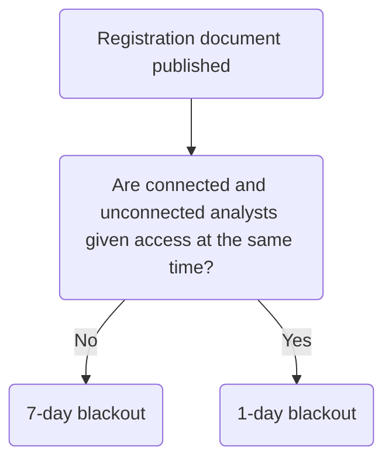

# IPO Process

The IPO process is divided into two stages:

1. Private phase
2. Public phase – begins the day when the IPO is announced to the market.

The company floats when the FCA makes an Official List announcement and the Stock Exchange publishes a London Stock Exchange Notice. Known as “admission day”.

[[IPO-process-1.png]]  
[[IPO-process-2.png]]

## Lawyers' Perspective

Mainly involved with:

### Timetable and List of Documents

The sponsors draw up a draft timetable for the IPO. Considerations:

- FCA and Stock Exchange have their own rules about timing based on law.
- Company may have particular requirements as to timing, which may be inflexible or subject to change.
- IPO always takes at least 3 months.

Lawyers comment on the list of documents drawn up by the sponsor. The list sets out all documents required, the parties and who is primarily responsible for producing them.

### Drafting Documentation

The lawyers draft:

- The prospectus
- ITF announcement (intention to float) - public statement of intention to launch IPO.
- Statements to effect any restructuring.
- Documentation relating to the method of listing shares.
- For a public offer, require an agreement between company, directors, selling shareholders and sponsors.
- For a placing, need a placing agreement.
- Verification note.

### Meetings

#### Drafting Meetings

Meetings where parties contribute and discuss their comments on the draft. Parties can agree revised wording.

#### Completion GM

- Usually takes place shortly before publication of the registration document.
- IPO does not require shareholder approval, but some matters may. Obtain these consents at the completion GM.
- Lawyers draft a notice to convene the meeting and ensure it is sent out in time.
	- At least 21 clear days' notice, unless approval is obtained by shareholders at an AGM to shorten the notice period to 14 days.
	- Articles may extend the notice period.
- Draft resolution necessary. May include
	- Granting authority to allot under s 551.
	- Disapplying pre-emption rights under s 561.
	- Reorganising share capital
	- Adopting new articles of association.

#### Verification Meeting

Takes place shortly before the completion board meeting. The board sign the verification note at this meeting.

#### Board Meetings

Directors approve all IPO documentation and the steps required to float the company. Resolve to:

- approve the terms of the registration document and intention to float (ITF) announcement;
- approve the terms of any ancillary documentation; and
- proceed with the IPO.

Registration document then submitted to the FCA for final approval. A completion board meeting is then called to:

1. approve the terms of the full prospectus for approval by the FCA; and
2. proceed definitively with the IPO and in particular approve the application for admission to listing and the application for admission to trading.

Full prospectus then submitted to the FCA for approval.

### Due Diligence

Categories:

1. Business due diligence;
	- Investigation into the commercial aspects of the company.
2. Financial due diligence;
	- Investigation carried out by the reporting accountants so that they can produce the long form report, the short form report and the working capital report
3. Legal due diligence.
	- Obtain basic company information from various registers.
	- Speak to the company's management to obtain all the relevant information.
	- Lawyers usually draw up a due diligence questionnaire, with sections on:
		- Corporate (structure and constitution)
		- Business and trading (including all material agreements)
		- Assets
		- Property
		- Environmental
		- Insurance
		- Basic financial information
		- IP
		- Employees
		- Pensions
		- Disputes
		- Market-specific regulatory issues.
	- Review all responses from the questionnaire
		- Ask relevant teams within the firm.
		- Then compile a due diligence report, which includes an executive summary setting out the key issues and any steps required.

### Verification

Does not begin until the first draft of the prospectus has progressed reasonably. Process which produces a written “verification note” so the company can support what it said in the prospectus. Aims to protect those responsible for the prospectus from legal liability arising from its publication.

Each statement in the prospectus is phrased as a question to test that it is true, accurate and not misleading. The answer to each question is attached, together with any supporting documentation. Send a new list of questions to the company if needed, so that management can collate the necessary information before meeting with lawyers. Check that management actually answer the questions specifically.

If a statement cannot be backed up, bring this up at drafting meetings, so then prospectus can be amended. Each director (and others with responsibility for the prospectus) will sign the verification note at the verification meeting.

### Submission of Documentation

The sponsor has responsibility of ensuring documents are submitted to the FCA/ Stock Exchange on time.

One copy of all finalised documents must be sent electronically or uploaded onto an online facility, the National Storage Mechanism (NSM) – run by the FCA!

> [!warning]
> Submission of documents on the NSM does not replace the obligation to make certain information public as set out in the Prospectus Regulation. 

### Prospectus

- The FCA must approve the prospectus, pursuant to the procedure set out in the Prospectus Regulation, PR Regulation and PRRs, before it can be published.
- In practice, one part of the prospectus, the registration document, will usually be approved first, followed by a full prospectus within a month later.
- The company must submit the draft registration document and/or prospectus to the FCA at least 20 working (i.e., business) days before the date of approval of the document (Art 20(3) of the Prospectus Regulation (PRR 3.1.2EU)).
- The draft must be submitted in searchable electronic format via electronic means via the FCA website (Art 42(1) of the PR Regulation).
- Subsequent drafts of the prospectus must be marked up (‘blacklined’) to highlight all changes made to the preceding draft of the prospectus previously submitted to the FCA and be submitted together with a clean copy of the amended draft, a UKLA comment sheet containing responses to the FCA’s comments and updated lists (Art 43 of the PR Regulation).
- The final form prospectus must be submitted before midday on the day approval is to be given (PRR 3.1.6R(3)).
- The FCA can approve the prospectus only when it is satisfied that it meets certain criteria set out in Articles 36–38 of the PR Regulation (PRR 3.1.1EU) and s 87A of the FSMA 2000, namely that the UK is the home state for the company issuing shares, and the prospectus meets the standards of completeness, comprehensibility and consistency necessary for approval.

#### 20 Day Documents

The draft registration and draft prospectus must be submitted along with the following:

1. Completed Form A (available from the UKLA section of the FCA website) which includes the application for approval of the prospectus in final form (PRR 3.1.6R(1)(a)(i));
2. Completed Publication Form (PRR 3.1.6R(1)(a)(ii)) (available on the UKLA section of the FCA website) which provides details of how the prospectus is to be made available to the public;
3. Relevant fee payable to the FCA (set out in the Fees Manual in the High Level Standards section of the FCA Handbook);
4. If the order of the items in the prospectus does not follow the order of the Annexes in the PR Regulation, a cross-referenced list setting out where each item can found in the prospectus and a cross-referenced list identifying any items from Annexes to the PR Regulation which are not applicable and so have not been included (Art 24(5) of the PR Regulation).
	- Lists must be submitted in an electronically searchable format.
5. A copy of any document incorporated into the prospectus by reference in searchable electronic format (Art 19(3) of the Prospectus Regulation).
6. Information required by Article 18 of the Prospectus Regulation (if requesting permission to omit information from the prospectus) (Art 42(2) of the PR Regulation);
7. Contact details of a contact point to which the FCA can submit all notifications in writing and by electronic means (Art 42(1) of the PR Regulation).
	- Issuer Contact Details Form.
8. Eligibility letter prepared by the sponsor to confirm that the company meets the eligibility criteria to join the premium segment of the Main Market set out in LRs 2 and 6.
9. Eligibility checklist for admission to the Official List under the Listing Rules.
10. Sponsor’s Declaration on Application for Listing
11. Any other info the FCA reasonably considers necessary.

#### "48-hour" Documents

No later than midday, at least two business days before the FCA hears the company’s application for the admission to listing, the company must submit to the FCA, in final form, the documents set out at LR 3.3.2R.

No later than midday 2 days before the FCA hears the company's application for the admission to listing, the company must submit to the FCA in final form the documents set out in LR 3.3.2R. Include:

1. the Application for Admission of Securities to the Official List;
2. the FCA-approved prospectus;
3. any circular published in connection with the application;
4. any FCA-approved supplementary prospectus; and
5. written confirmation of the number of shares to be allotted pursuant to a board resolution allotting the shares (or, if this is not possible, the written confirmation must be provided to the FCA at least one hour before the admission to listing is to become effective).

LR 3.2.2R: a fee becomes payable on the date the company makes its application for listing.

#### On the Day

By 9 am on the day the FCA **hears** the company’s application for admission to listing, the company must lodge with the FCA a completed Shareholder Statement, signed by the sponsor (LR 3.3.3R).

#### After Admission Day

The company must provide to the FCA written confirmation of the number of shares that were allotted if the actual number was lower than that originally announced, as soon as practicable (LR 3.3.5R).

The company must keep copies of a number of documents used in the IPO for six years after the date of the IPO and make these available to the FCA at its request. A full list is set out in LR 3.3.6R.

### Stock Exchange Documents

| Action                                                                                                  | Deadline |
| ------------------------------------------------------------------------------------------------------- | -------- |
| Submit an application form (Form 1) together with a draft copy of the prospectus, to the Stock Exchange |  No later than 12.00 pm at least 10 business days before the requested date for the hearing of the company’s application for admission to trading (ADS 3.2 and para 1.1 of Sch 1).         |

#### Two Day Documents

By 12 pm on the day which is at least two business days before the Stock Exchange hears the company’s application for admission to trading, the company must submit to the Stock Exchange a copy of the documents listed at ADS Sch 1, Part B:

1. an application for admission to trading on the finalised **Form 1**;
2. an electronic copy of the **prospectus**;
3. an electronic copy of any **circular, announcement** or other document relating to the **issue of shares**;
4. an electronic copy of any **notice of meeting** referred to in any of the documents mentioned above; and
5. by **4 pm** on the day before the expected day of admission, **written confirmation of the number of shares to be allotted** pursuant to the board resolution (or, if this is not possible, it must be provided to the Stock Exchange by 7 am on the expected day of admission).

#### Fee

The Stock Exchange will raise an invoice on admission, which the company must pay within 30 days (ADS 3.7).

#### After Admission Day

Lodge a statement of the number of shares which were issued (and, where different, the total number of issued shares of that class) as soon as this information is available (ADS 3.10).

## Key Dates

### Private Phase of IPO

Before the final FCA-approved prospectus is made available to investors, there is a pre-marketing phase (“pre-marketing”, “pilot fishing”, “pre-sounding”, “early investor engagement”).

Involves checking whether there is sufficient demand in the company's shares for an IPO.

The management and sponsor contact research analysts working at the sponsor bank and at other banks who will participate in the underwriting of the offer of shares by the company.

The company must think about appointing:

- Broker
- Receiving bank
- Lawyers
- Accountants
- Other relevant advisers.

Analysts prepare research reports to be circulated to prospective investors in the company. Known as “connected analysts” - work for the sponsor and underwriting banks.

> [!conduct]
> Potential conflict of interest with connected analysts (who want the IPO to be a succes). FCA’s Conduct of Business Rules ("COBS Rules") grants unconnected analysts equal access to the management and sponsor. 

Before connected/ unconnected analysts' reports can be published, COBS Rules require publication of an approved **disclosure document** (a day before). This can be a full prospectus/ just the registration document. Ensures investors also receive FCA approved company information. See 11A.1.4F COBS Rules:

> [!statute] COBS 11A.1.4F - Timing restrictions for disseminating research on equity IPOs
> (1) A firm must not disseminate investment research or non-independent research on the relevant issuer client or relevant securities as described in COBS 11A.1.4AR(1) until after the relevant time in paragraph (2).
> 
> (2) The relevant time is:
> - (a) where a firm acts in accordance with COBS 11A.1.4BR(2)(a), one day after the publication of the relevant document in paragraph (3); or
> - (b) otherwise, seven days after the publication of the relevant document in paragraph (3).
> 
> (3) The relevant document is:
> - (a) an approved prospectus regarding the relevant securities; or
> - (b) an approved registration document regarding the issuer.
> 
> (4) For this rule, publication of the relevant document means making the relevant document available to the public in accordance with article 21 of the Prospectus Regulation.
> 
> (5) This rule does not apply to a firm in circumstances where, as a result of the firm’s analysts being prevented from being in communication with the issuer team, it has not needed to engage with any unconnected analysts for the purposes of COBS 11A.1.4BR.

- If connected and unconnected brokers are given access at the same time, one day blackout.
- If connected analysts given access first, 7 day blackout (from the publication of the registration document).
	- Common practice in the UK.
	- During the 7 days, have a presentation to unconnected analysts.

### Public Phase of IPO

Public IPO announcement – **Intention to Float (ITF) announcement – on the same day as the publication of the first analyst reports.

Public phase is normally no longer than 4 months.

#### Prospectus Approval

Even though the registration document has already been approved, the company will send a full prospectus for approval (rather than just the two remaining bits).

By the day of prospectus approval, the offer price will have been set. The prospectus will have been submitted to the FCA $\geq 20$ days before “impact day” (the date of approval of the prospectus).

> [!statute] Article 20(3) Prospectus Regulation
> The FCA must notify the company whether it has decided to approve the prospectus before the end  of 20 working days beginning with the date of submission of the draft prospectus, although if further drafts have to be submitted, the deadline is 10 working days from the last draft.

The IPO is “live” with effect from the day of approval of the prospectus. Floatation is conditional on the FCA admitting the shares to listing and the Stock Exchange admitting the shares to trading. This will not be done until admission day.

#### Publishing Prospectus

> [!warning]
> The company must publish the prospectus at least six working days before the end of the offer period (Art 21(1) of the Prospectus Regulation).

Different ways to publish the prospectus (Art 21(2) Prospectus Regulation) – must be made available in electronic form on:

1. the company’s website;
2. the website of the financial intermediaries placing or selling the shares; or
3. the Stock Exchange’s website.

Conditions:

- Any investor is entitled to demand a free hard-copy (Article 21(11) Prospectus Regulation).
- Article 21(4) Prospectus Regulation: it is not acceptable to make accessing the document subject to conditions such as completing a registration process or charging for access.
- The FCA will upload the prospectus to the NSM (PRR 3.2.6G).

#### Applications for Shares

Interested investors will complete the application form attached to the prospectus and send it to the receiving bank.

The application form states the deadline by which the form must reach the receiving bank. This is usually 10.00 am on the day following the FCA’s admission hearing (the time the “lists open”).

- Offer over-subscribed
	- Lists close at 10.01am.
	- Board decides on the basis of allotment (formula which decides the proportion of shares each applicant will receive/ ballot system).
- Offer under-subscribed
	- Offer remains open for longer.
	- Company informs underwriters how many shares they need to take up.

Admin: cash cheques/ money received and account to the company. The company sends share certificates or letters of acceptance to the successful investors, and letters of regret to those investors who didn't get any/ all the shares they wanted.

#### Admission Hearings

FCA hears the application for admission to listing on the same day the Stock Exchange hears the application for admission to trading.

- FCA can refuse admission to listing in some circumstances, e.g., if it considers admission detrimental to investors' interests (LR 2.1.3G and FSMA 2000, s 75(5)).
- The Admission and Disclosure Standards (ADS 2.5) also reserve the right for the Stock Exchange to refuse admission to trading if admission might be detrimental to the orderly operation or integrity of the market.
- Refusal of admission at this stage is v rare.

### Admission Day

#### Official List Announcement

When the FCA is satisfied that it is prepared to admit the shares to listing, it must announce the admission through a Regulatory Information Service (LR 3.2.7G). Such notices are announced to the Regulatory News Service (RNS) each day at 8am.

At this point, listing is effective and dealing in shares begins $\rightarrow$ float.

#### LSE Notice

When the Stock Exchange is satisfied that it wishes to admit the shares to trading, it must announce the admission via a Regulatory Information Service (ADS 2.17). In practice, announced at the same time as the Official List announcement.

#### Letters of Acceptance

Sometimes the offer is structured so that initially successful applicants do not receive a share certificate, but a renounceable letter of acceptance. This is a bearer document, and the recipient can transfer title in the shares to someone else simply by handing them the letter.

> [!important]
> Shares can be traded by way of renounceable letter for six weeks from admission day.

The company’s registrars will enter into the company’s register of members whoever holds the letter at the end of the 6 weeks. Useful to allow shares to be transferred easily at a time of substantial trading. Saves work for registrars.
