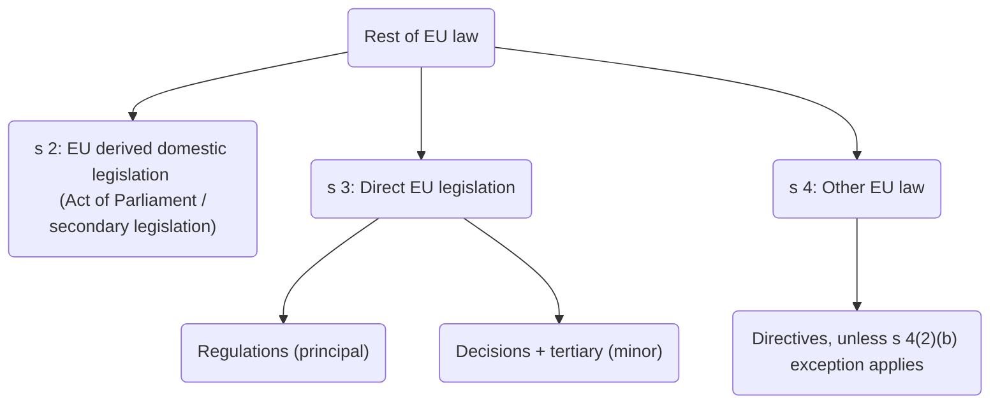

## European Communities Act 1972 recap

s 2(1): gave effect to EU law in the UK, by providing that:
 > ‘All such rights, powers, liabilities, obligations and restrictions from time to time created or arising by or under the Treaties, and all such remedies and procedures from time to time provided for by or under the Treaties, as in accordance with the Treaties are without further enactment to be given legal effect or used in the United Kingdom, shall be recognised and available in law, and be enforced, allowed, and followed accordingly…’

s 2(2): a power to make subordinate legislation to implement EU law or to deal with any matters arising out of obligations and rights under EU law. 

s 3(1): questions of law relating to the EU shall be determined according to the principles and decisions laid down by the Court of Justice. 

Most significantly: s 2(4):
> ‘Any enactment passed or to be passed shall be construed and have effect subject to EU Law’.

This provided the primary basis upon which UK courts were willing to disapply statutes which were incompatible with EU law ([[R v Secretary of State for Transport, ex parte Factortame Ltd. (No. 2) [1991] 1 AC 603]]). 

## Brexit

[European Union (Withdrawal) Act 2018](https://www.legislation.gov.uk/ukpga/2018/16/contents/enacted):

s 1 formally repealed ECA 1972 as of 31/01/20. 

The relationship between the UK and EU following Brexit was initially governed by the [Agreement on the Withdrawal of the United Kingdom of Great Britain and Northern Ireland from the European Union and the European Atomic Energy Community](https://www.legislation.gov.uk/eut/withdrawal-agreement/contents/adopted), more commonly known as the 'Withdrawal Agreement'. This was entered into as part of the withdrawal process under article 50 TEU. It was incorporated into UK law by the [European Union (Withdrawal Agreement) Act 2020](https://www.legislation.gov.uk/ukpga/2020/1/contents/enacted). 

## EUWA and Transition Period

Part 4 Withdrawal Agreement: provided for EU law to continue to apply in the UK during a transition period ending on 31/12/20 (referred to in the Acts as the 'implementation period').

1. s 1A: provided for ECA 1972 to continue to give legal effect to EU law in accordance with Withdrawal Agreement during the transition period. So EU law continued to have effect in the UK like it previously had under ss 2&3 ECA. This included the UK courts being able to disapply any domestic law which was incompatible with the Withdrawal Agreement. 
2. When a statute is repealed, there is a presumption that any subordinate legislation made under it is also repealed. s 1B EUWA 2018: prevented the repeal of ECA from having this effect during the transition period, by preserving EU-derived domestic legislation passed before UK withdraw from EU. 
> [!defn] EU-derived domestic legislation
> 
> Defined in s 1B(7) EUWA 2018 as referring to any UK legislation, which was enacted under s 2(2) ECA, or for one of the purposes in s 2(2), or with otherwise relates to the EU. 
## After transition period

Application of EU law in the UK is now governed by two different regimes:
1. The Withdrawal Agreement provides for some EU law to continue to apply to certain specific matters in the UK
2. Application of the rest of EU law now governed by a separate legal regime. 

#### Preserved EU law

EU law continues to apply to certain specific matters, such as the rights of Union citizens and their family members who were resident in the UK at the end of the transition period. Most controversial was the Northern Ireland Protocol, designed to maintain an open border between Northern Ireland and the Republic of Ireland. 

This is given effect by s 7A EUWA 2018. s 5(7) also preserves the supremacy of EU law in so far as it is required by the Withdrawal Agreement. This means that UK courts remain able to disapply statutes where they are incompatible with any EU law which continues to be preserved by the Withdrawal Agreement, after the end of the transition period. 

There is **no** repetition of the general obligation in s 3(1) ECA to give effect to the decisions of the Court of Justice. s 7C EUWA 2018 requires questions as to the validity, meaning or effect of the following to be decided in accordance with the Withdrawal Act:
- Provisions of EUWA 2018 which provide for the implementation of the Withdrawal Act
- Anything which is part of domestic law by virtue of those provisions
- Anything else which is part of domestic law for the purposes of the Withdrawal Agreement, or because it otherwise falls within the scope of the Withdrawal Agreement. 

Includes any EU law which is preserved by the Withdrawal Agreement and remains part of the domestic UK law as a result. 

s 7C(2) specifically refers to several articles of the Withdrawal Agreement in relation to the obligation under s 7C. These include
- Article 4 Withdrawal Agreement. 
	- Requires the Withdrawal Agreement's provisions, including any EU law preserved by them, to be interpreted in conformity with the case law of the Court of Justice made before the end of the transition period. 
	- So any case law of the Court of Justice is binding where it was decided before the end of the transition period on 31 December 2020.
	- But the UK judiciary need only have due regard to such case law decided after the end of the transition period
- Art 158 Withdrawal Agreement
	- UK courts and tribunals can make preliminary references to the Court of Justice on questions concerning the rights of Union citizens and their family members, in cases which commenced within 8 years of the end of the transition period. 
- Article 12 of Protocol on Ireland/ Northern Ireland attached to the Withdrawal Agreement. Enables preliminary references to be made to the Court of Justice, in relation to EU law preserved by the NI protocol.

#### Parliamentary sovereignty

Insertion by EUWA 2020 of ss 1A and 7A into EUWA 2018 preserves the ability of the courts to disapply statutes where they are incompatible with the Withdrawal Agreement, and with any EU law that is preserved by it. 

s 7C: also does so by requiring compliance with the obligations in art 4(2) of the Withdrawal Agreement, to ensure the dis-application of domestic law which is incompatible with the Withdrawal Agreement. 

s 38 EUWA 2020 specifically reasserts that Parliament remains sovereign, notwithstanding the insertion of these sections. The consequence could be to reinforce the principle in [[Macarthys Ltd v Smith [1979] All ER 325]] and [[Thoburn v Sunderland City Council [2002] EWHC 195 (Admin) 1]], that Parliament retains a right to override EU law, as well as the Withdrawal Agreement, by using express words, or at least specific words that disclose a deliberate intention to do so. 

#### Rest of EU law

Most EU law is no longer preserved following the end of the transition period. The majority of this law has been converted into domestic UK law, capable of being amended or repealed by subsequent domestic legislation in much the same way as any other UK law. 

EUWA also provides for any domestic subordinate legislation made under ECA to be retained. 

#### Retained EU law

s 2-4 EUWA 2018 provide for the following to continue to have effect (except where excluded by the Act):
1. EU-derived domestic legislation
2. Direct EU legislation
3. Other EU law

These are collectively referred to as 'retained EU law'[^1] (s 6(7) EUWA 2018).

[^1]: Retained EU law does not include any EU law which continues to apply under the Withdrawal Agreement after the end of the transition period. That is governed by s.7A of the EUWA 2018 instead.

## Forms of retained EU law

#### s 2: EU derived domestic legislation

[s 2 EUWA 2018](https://www.legislation.gov.uk/ukpga/2018/16/section/2/enacted) retains EU-derived domestic legislation. Performs a similar function to that of s 1B EUWA 2018. 

#### s 3: Direct EU legislation

[s 3 EUWA 2018](https://www.legislation.gov.uk/ukpga/2018/16/section/3/enacted) retains direct EU legislation. This is defined as any EU regulation, EU decision or EU tertiary legislation which is in force and applicable in domestic law immediately before the end of the transition period (s.3(2)).

EU tertiary legislation refers to EU legislation made under powers conferred by EU secondary legislation (s.20 — although tertiary legislation in the form of an EU directive is excluded).

Direct EU legislation is divided into two categories by s.7(6) of the EUWA 2018. These are:

- Direct principal EU legislation which refers to EU Regulations which were not tertiary legislation.
- Direct minor EU legislation which covers any other direct EU legislation which is not direct principal EU legislation.

#### s 4: Other EU law

[s 4 EUWA 2018](https://www.legislation.gov.uk/ukpga/2018/16/section/4/enacted) also retains any other EU law which was applicable in UK law by virtue of s.2(1) of the ECA immediately before the end of the transition period, and which does not constitute direct EU legislation under s.3 of the EUWA 2018.

s 4 excludes any rights and obligations under EU directives which are not 'of a kind recognised' by the EU courts or domestic courts, in a case decided before the end of the transition period (s 4(2)(b)). 

Paragraphs 97 and 98 of the Explanatory Notes to the EUWA 2018 explain that this is designed to exclude rights and obligations conferred by a directive from having direct effect [^2], unless they are of a ‘of a similar kind’ to those already recognised by the EU courts or domestic courts as being able to do so.

[^2]: Direct effect is a method of directly enforcing EU legislation and other EU acts in national courts. Therefore, a directive which has direct effect is one that is capable of being directly enforced in a national court.

> ‘So rights arising under a particular directive that have been recognised by a court before [the end of the transition period] as having direct effect, could be relied upon by other individuals who are not parties to that case, in circumstances which the directive is intended to address.’
> Para 98

Note, this remains ambiguous. It is not clear whether the right must have been expressly recognised as having direct effect in a case concerning the particular directive, or whether it will suffice that the right was of a similar kind to one recognised as having direct effect in a case which was not dealing with that directive. 

s 5(4) EUWA 2018 specifies that the Charter of Fundamental Rights will no longer be part of UK law. So rights under the Charter are not retained by s 4 EUWA 2018. 

#### Amendment of retained EU law

[s 5 EUWA 2018](https://www.legislation.gov.uk/ukpga/2018/16/section/5/enacted): the principle of the supremacy of EU law continues to apply in relation to any UK law made before the end of the transition period. But does not apply to any UK law made after that. 

[s 7 EUWA 2018](https://www.legislation.gov.uk/ukpga/2018/16/section/7/enacted) and [Sch 8 EUWA 2018](https://www.legislation.gov.uk/ukpga/2018/16/schedule/8/enacted) specifically permits retained direct EU legislation and other retained EU law to be modified by:
- An Act of Parliament
- Any other primary legislation (Scotland, Wales, NI)
- Subordinate legislation, where it is made under Henry VIII powers to modify such retained EU law or amend primary legislation. 

Section 7 of the EUWA 2018, together with sch. 8, also permits retained **direct minor EU legislation** to be modified by subordinate legislation where that subordinate legislation was not made under such Henry VIII enabling powers.

However, this subordinate legislation can only modify direct principal EU legislation retained under s.3 or other EU law retained under s.4 in so far as the amendment is supplementary, incidental or consequential to any modification of retained direct minor EU legislation. It cannot modify retained direct principal EU legislation or other retained EU law in any other circumstance.

#### Retained EU case law

The courts and tribunals in the United Kingdom are required by [s.6(3) EUWA 2018](https://www.legislation.gov.uk/ukpga/2018/16/section/6/enacted) to determine any questions as to the validity, meaning or effect of retained EU law (in so far as it remains unmodified) in accordance with the case law of the Court of Justice that existed at the end of the transition period. This case law is referred to as ‘retained EU case law’ (s.6(7)).

- UK courts and tribunals are no longer able to make preliminary references to the Court of Justice on questions of EU law (s.6(1)(b)).
- The Supreme Court and, in Scotland, the High Court of Justiciary are not bound by retained EU case law (s.6(4)).

In deciding whether to depart from retained EU case law, they must apply the same test as they would apply in deciding whether to depart from their own case law (s 6(5)). 

Under the European Union (Withdrawal) Act 2018 (Relevant Court) (Retained EU Case Law) Regulations 2020, the following courts are **not** bound by retained EU case law:
- The Court of Appeal in England and Wales
- The Court Martial Appeal Court
- Various other courts in Scotland and Northern Ireland specified in the Regulations.

In deciding whether to depart from retained EU case law, these courts must apply the same test as the Supreme Court would apply in deciding whether to depart from the case law of the Supreme Court. No courts and tribunals in the United Kingdom are bound by any cases decided by the Court of Justice after the end of the transition period, although they may have regard to them (s.6(1)(a) EUWA 2018).

#### Retained general principles

UK courts and tribunals also continue to be bound by retained general principles of EU law (s.6(3) of the EUWA 2018). These are the general principles of EU law which have effect in EU law immediately before the end of the transition period (s.6(7)).

However, the courts and tribunals are not bound by any general principles which were not recognised by the Court of Justice before the end of the transition period (para. 2 of Sch. 1).

#### Charter of Fundamental Rights and Retained Fundamental Rights

[s 5(4) EUWA 2018](https://www.legislation.gov.uk/ukpga/2018/16/section/5/enacted): Charter of Fundamental Rights has **not** been part of UK law since the end of the transition period. 

s 5(5) mitigates the effect:
- Does not affect the retention of any fundamental rights existing under EU law at that time, irrespective of the Charter. 
- Any references in case law to the Charter are to be treated as if they were references to retained fundamental rights. 

#### State Liability

No longer available as a method of enforcing EU law (para. 4 of Schedule 1 which refers to this as the ‘Rule in Francovich’ after the case that first established this method).
