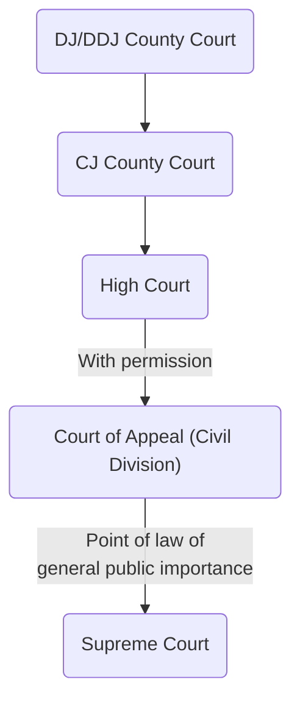

## Civil law

> Regulates the legal relationship between private parties – either individuals or legal persons

This could arise from contract, from a duty of care between parties, or other causes of action. Govt does not prosecute civil law cases, but can be involved either as claimant or defendant in a civil case, in its private law capacity. 

The public law we study does not fall under this description, but is governed by Civil Procedure Rules and largely adjudicated upon by civil law courts. 

#### Parties and outcome
- The parties to a civil case are claimant and defendant
- pre-1990s Woolf reforms, the claimant was known as the plaintiff
- The court's decision is known as the judgment
- The outcomes for a successful party is usually damages, but other remedies can be awarded.

#### Standard of proof
Standard of proof is 'on the balance of probabilities' (lower than criminal standard). Burden of proof is usually on the claimant. 50-50: claimant will fail (technical fluffy point).

#### Examples
- Personal injury claims
- Clinical/ professional negligence
- Breach of contract
- Employment law
- Family disputes

A defendant can be subject to civil & criminal proceedings for the same incident. 

## Chain of courts

Most civil claims begin in the [[County Court]]. Higher value claims (generally > £100,000) begin in the [[High Court]]. 

- An appeal against a decision by a Deputy District or District Judge will remain in the County Court to be decided by a Circuit Judge.
- The decision of a Circuit Judge can be appealed to the High Court, and subsequently to the Court of Appeal (Civil Division), but only with permission.
- A decision of the Court of Appeal (Civil Division) can be appealed to the Supreme Court, but only if it deals with a point of law of 'general public importance'. 

