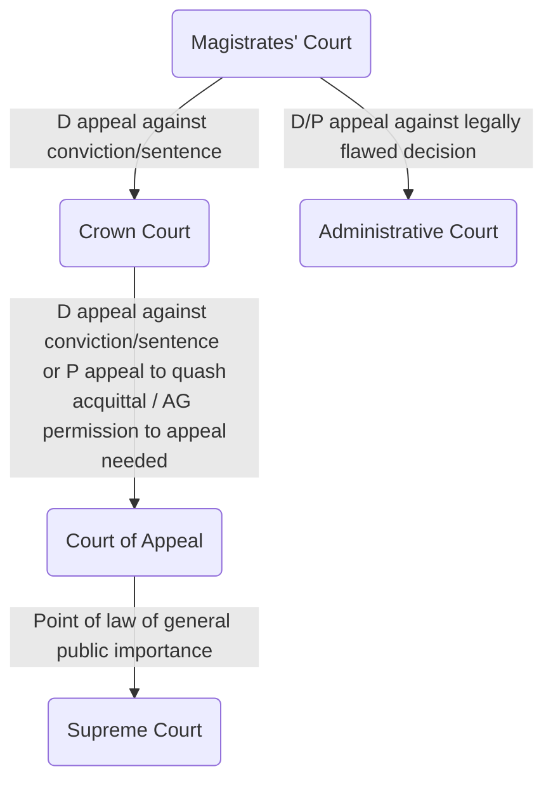

## Criminal Law

- Cases brought by the prosecution, representing the State, against the defendant/ accused.
- Objective to punish people who commit offences against society
- Prosecution brought in the name of the Crown. Written e.g. R v Brown, where R stands for Regina. Say: 'the crown against Brown', or just 'Brown'

## Standard of proof

> The level of certainty to which a party must prove their case in order to succeed at trial. 

In criminal law: beyond reasonable doubt. Prosecution (usually) bears the burden of proof; defendant does not have to prove anything. 

Crown Prosecution Service initiates criminal proceedings. This is independent of the police or any other investigative authorities. Can also be started by other government agencies in specific situations. 

## Plead

Defendant chooses to plead guilty or not guilty. If pleading not guilty, the case goes to trial. Decision at first instance is the **verdict** – either guilty or not guilty. If pleads/ found guilty → **sentence** imposed. 

Once pleaded guilty, defendant treated as convicted, and this cannot be appealed. But they can apply to vacate plea if they change their mind. 

## Chain of courts

Cases typically start in [[Magistrates' Court]], and occasionally progress to [[Crown Court]]. 

#### Appeal from Magistrates' Court to Crown Court

A convicted defendant can appeal to [[Crown Court]] against their conviction, their sentence, or both. If the defendant appeals against conviction, their trial will be heard *de novo* (afresh). The trial will take place before a Crown Court Judge flanked by two Magistrates. 

The prosecution does not have the same right of appeal against an acquittal, or against a sentence imposed by a Magistrate which is considers too lenient.

But defendant risks an even harsher sentence (since [[Crown Court]] has greater sentencing powers). 

If either the prosecution or defence consider that the Magistrates' decision was **legally flawed**, (as opposed to flawed in its assessment of evidence or on sentence), it may appeal to the [[Administrative Court]]. This is a specialist court within the [[Queen's Bench Division]] of the [[High Court]]. This is known as appeal **“by way of case stated”**. 

#### Appeal from Crown Court to Court of Appeal

- With permission from [[Court of Appeal]] (Criminal Division), a defendant convicted and sentenced in the Crown Court can appeal their conviction, sentence or both. 
	- Most commonly, the appeal is against the sentence imposed
		- Criminal tribunals follow 'sentencing guidelines' for offences. These are produced by the Sentencing Council, with the aim of promoting consistency in sentencing.
		- Key grounds for appealing against sentence:
			- Sentence is not justified by law (i.e., the judge made an error of law)
			- The sentence was based on an incorrect version of evidence
			- The judge took irrelevant matters into account when sentencing
			- The judge misapplied or failed to give sufficient weight to sentencing guidelines
- Prosecution can also appeal to the Court of Appeal: 
	- [Criminal Justice Act 2003](https://www.legislation.gov.uk/ukpga/2003/44/contents) lets prosecution appeal to quash acquittal of anyone found not guilty of a serious offence
	- Attorney General can in limited circumstances appeal against unduly lenient sentence.

##### Permission to appeal
There is no automatic right of appeal from the Crown Court to the Court of Appeal. The appellant has to apply, on paper, for permission to appeal. The permission decision is made by a single judge. If permission is refused, that decision can also be appealed. 

##### The Court of Appeal
The Court of Appeal (Criminal Division) will quash a criminal conviction of the Crown court if it is satisfied that the conviction is 'unsafe'. The court will not hear the evidence again, but will base its decision on an assessment of the **oral arguments** made from councils of both sides. 

Common arguments relate to new evidence, errors that occurred during the trial process, or misdirection of law by the trial judge. If the conviction is quashed, any sentence is automatically quashed with it. 

#### Appeal from Court of Appeal to Supreme Court

In principle, either the defendant or prosecution may apply for permission to appeal to the Supreme Court from the Court of Appeal. But the Supreme Court will only hear an appeal which is certified (either by the Court of Appeal or the Supreme Court) as being a “point of law of **general public importance**”. This test is rarely bet in individual criminal cases.

An example of a case in which this public importance test was met is [[R v R [1991] UKHL 12]], in which the House of Lords confirmed that no 'marital defence' to the crime of rape existed in English law. 

#### Judicial Committee of the Privy Council

The final appeal court for UK overseas territories and Crown dependencies is the Judicial Committee of the Privy Council. It is also the final appeal court for those Commonwealth countries which have retained appeal to 'Her Majesty in Council', or (for republics) to the Judicial Committee. 

The purpose of the Judicial Committee is to advise the Crown, so in theory it never decides a case, but instead 'humbly advises Her Majesty'. In practice, the monarch never refuses the advice of the Committee. 

Hears civil and criminal cases. Consists of senior members of the judiciary (usually Supreme Court justices) and senior members of the judiciary of Commonwealth jurisdictions. 

Privy Council decisions are not binding on English courts but super influential.

#### Criminal Cases Review Commission

Criminal Cases Review Commission (CCRC) is a statutory body responsible for reviewing alleged miscarriages of justice in the UK. 

- A case can be sent back to the Court of Appeal for review, if it considers there is a “real possibility” that the Court of Appeal will overturn the conviction or sentence
- If the decision to be reviewed was made in a Magistrates' or Youth Court, the CCRC can send it back to the Crown Court for review. This takes the form of a re-hearing, in which all the evidence is heard again. 

To refer a case for appeal, the Commission has to identify new evidence or a new legal argument that makes the case look significantly different. There is an “exceptional circumstances” caveat allowing the Commission to refer cases with no new evidence or argument, but this happens extremely rarely.