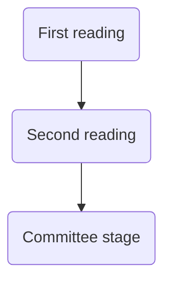

# Passage of legislation

## Primary legislation

A bill is a proposal for new legislation (an Act of Parliament) or a proposal to change an existing law, presented for debate before Parliament. Acts of Parliament are known as primary legislation. 

A bill can be proposed:
- By the government 
- By an MP (Private Member's Bill)
- Proposed by member of Lords (Private Peer's bill)

#### Bill proposed by Government

If a government department has a bill proposal, a bid must be submitted to the Parliamentary Business and legislation Committee (PBLC), chaired by the Leader of Commons. 

This committee decides which bills proceed to Parliament, taking into account:
- Is the legislation needed?
- Does it support government's political priorities?
- Has the proposed bill been published in draft form for consultation?

Then one month before each parliamentary session, the PBLC will finalise legislative agenda, and this will be announced in the Queen's Speech. 

## Secondary legislation

Secondary legislation is made under powers granted to the relevant Secretary of State in primary legislation, known as the 'parent act'. Usually takes the form of Statutory Instruments (SIs).

There are different procedures mandated by the primary legislation. For affirmative resolution procedure, SIs must be debated and approved before both Houses of Parliament. For negative resolution procedure, an SI will automatically become law unless either House passes a motion to reject it (usually within 40 days). 

Before being put to Parliament, the Joint Committee on Statutory Instruments scrutinises the government's secondary legislation to make sure it is clear and within the powers granted by primary legislation. 

#### Bills starting in the Commons

Most[^1] primary legislation can start either in the Commons or the Lords, but will need the Approval of both Houses. 

[^1]: Exception: If the Parliamentary Act procedure is used, in which case it is possible to bypass the Lords.

For Bills introduced by the Government, the PBLC decides whether to start the legislation in the Commons or Lords, to balance the programmes in both Houses. Convention: bills on constitutional matters start in the Commons. Bills will eventually need the approval of both Houses.

Stages of Bill:

The First Reading is a formality: no debate of bill at this stage. 

The Second Reading debates main principles of the bill, held in the chamber. A Government minister will open the debate and set out the case for the bill, explaining its provisions. Opposition will respond, then other members respond. Then Govt closes the debate. No amendments can be made to the text of the bill at this stage. Finally, House will vote on the bill. If the vote is lost by the Government, bill cannot proceed any further (though this is rare).

#### Committee stage

Detailed consideration of the Bill. In the Commons, this can be done in the chamber of by a specially convened Public Bill Committee. In the Lords, detailed reading may also be done in the chamber or outside it. Any peer can participate. Can propose amendments or new clauses, though these need PBLC approval before going to next stage. 

Public Bill Committee in the Commons can:
- Take oral and written evidence about the subject matter of the bill
- Propose amendments
- Propose wholly new clauses. 

Amendments will need the approval of PBLC before going onto the next stage. 

MPs appointed to the relevant legislative committee at this stage have the chance to scrutinise the detail of the bill and propose necessary amendments. MPs are selected on the basis of party strength in the Commons to scrutinise an individual bill. Often referred to as a 'standing' committee. 

#### Report stage and third reading

Takes place in the Chamber; only amendments proposed at the committee stage are discussed. 

In Commons, third reading takes place immediately after the Report (no amendments can take place). At Lords, third readings take place later, and amendments can be tabled. 

#### Final stages

Must be agreed by both Houses, so goes back and forth (“ping pong”). Can take a long time depending on the length of the bill, how controversial it is and whether it is urgent. 

#### Royal Assent

The monarch can give Royal Assent in person but has not happened since 1854. Once Royal Assent has been given, announcement made in both Houses. Then legislation can come into force immediately, or after a specified time following a 'commencement order' by the minister. This is designed to bring into force the whole or part of an Act of Parliament at a date later than Royal Assent. If there is o commencement order, the Bill comes into force on the day on which it receives royal assent. 

#### Private Members' Bills (PMBs)

Can also be introduced in either House and must go through the same stages. Less likely to be successful. In the Commons, Private Members' bills have precedence over government business on thirteen Fridays in each parliamentary session. 

Significant historical ones:
- Murder (Abolition of the Death Penalty) Act 1965 (Sydney Silverman MP)
- Abortion Act 1967 (David Steel MP)
- Sustainable Communities Act 2007

## Parliament Acts 1911 and 1949
> [!defn] Parliament Act procedure
> 
> If the House of Lords does not pass a Bill of Parliament, other than a “money bill”, after a period of one year following its approval in the Commons, the Bill, endorsed by a certificate from the Speaker of the House of Commons, can be sent to the Queen for Royal Assent without the consent of the House of Lords.
1911 Act allowed for a bill sponsored by the government to be sent for Royal Assent without the approval of the House of Lords, if the Lords refuse to consent to it for two years. Time period reduced to 1 year by 1949 Act. 

The procedure came about after the collapse of a long-standing convention under which the House of Lords did not block financial legislation. It has been used quite sparingly, last used in 2004 with the Hunting Act. 

This led to a challenge of the hunting act itself with R (Jackson) v Attorney-General (2005). 

