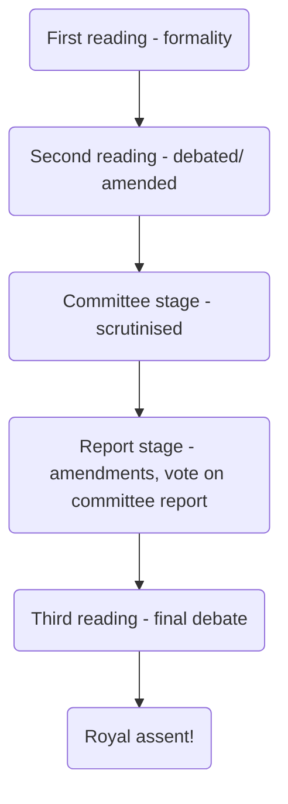

Public (or general) Acts relate to matters of general public concern. Debated in both Houses, and any body outside can lobby an MP/peer to put forward their views in a debate. Most common.

Private/ personal Act of Parliament relates to particular places/ people. Usually concerns large organisation wishing to acquire certain powers. 

## Bills

Primary legislation starts life as a 'Bill' - draft legislation. Public Bills divided into:
- Government Bills
	- Policy of govt of the day, drafted by official draftsman
	- Based on ministerial proposals issued as Green Paper (for discussion) or White Paper (official govt policy)
- Private Members' Bill
	- Promoted by particular MP, normally through a Ballot. Usually given less time, often unsuccessful

## Legislative process

Bills can start in Commons or Lords, except Bills about public finances, which must start in Commons and cannot be defeated in Lords

Note Royal Assent is just a convention, no legal rule (Royal Assent Act 1967).  Act of Parliament takes effect from day it received Royal Assent. 

Legislation does not always come into force on the same day it was enacted. Usually includes commencement section detailing when Act is to come into force.

Power typically delegated to Secretary of state with responsibility for area with which statute is concerned to issue [[Statutory Instruments]] bringing Act into force.

## Structure

Acts of parliament grouped into Parts containing Sections.

## Secondary legislation

Law made by person/ body other than Parliament, usually govt department. Made by powers granted by Parliament. Has equal statutory force to primary. 

Courts can't invalidate primary legislation but can examine whether delegated legislation made within powers of parent Act and 'quash' it if not. 

Most legislation is delegated legislation.

Secondary legislation not subject to parliamentary scrutiny. Parliament can approve or reject a statutory instrument but cannot amend it. Joint Committee on Statutory Instruments checks SIs to make sure law they contain clear and follows parent Act powers. 

A by-law is a form of secondary legislation which local authorities and some other associations use to create local rules and regulations, the authority to create which is initially approved by Parliament. 

