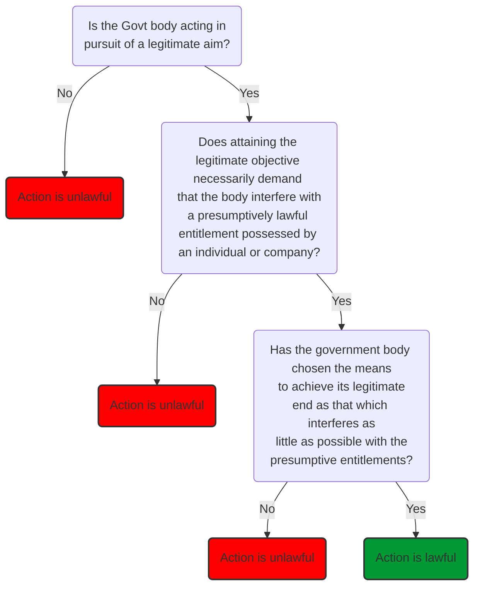

## Loveland
           

By the mid-1980s, the proportionality principle was an established feature in the administrative law of several EC countries, and an integral part of the general principles of Community law established at the ECJ. So whenever domestic courts were assessing the legality of government action within areas of Community competence, the doctrine provided an additional substantive ground of review.

#### Community law manifestation

A good example of the principle is given by [[Bela-Muhle Josef Bergmann KG v Grows-Farm GmbH & Co KG [1977] ECR 1211]] (the ‘skimmed milk powder case’). 

The principle is as readily applicable to the actions of Member States as Community institutions, e.g., see [[Italy v Watson and Belmann [1976] ECR 1185]]. 

Steiner (EC law 3rd edition 1992, p 58): proportionality “puts the burden on an administrative authority to justify its actions and requires some consideration of alternatives. In this respect, it is a more rigorous test than one based on reasonableness”. Proportionality can be presented in an abstract political sense as a constitutional device which requires the courts to accept that the boundaries of moral consensus within which government bodies are confined are discernibly less broad in substantive terms than those which apply to respect of irrationality-based review. 

The court is required to undertake a structured, multi-stage examination of the content of the decision under challenge:

Many government actions considered acceptable against the irrationality principle would fail a substantive proportionality test. 

> [!example] Example: Wednesbury
> - The council's legitimate aim is to encourage children to go to church or play sports on Sunday mornings
> - Interferes with both the children's entitlement to attend the cinema, and the cinema owners' entitlement to sell seats
> - Here interference is modest, but had the prohibition extended through the weekend, it would most likely have failed a proportionality test, but still pass an irrationality test

In [[R v Ministry of Defence, ex parte Smith [1996] QB 517]], insofar as the government's policy was pandering to bigotry among service personnel, it would not have been pursuing a legitimate aim, so would have fallen at the first stage of the test. Even if the aim was found to be legitimate in safeguarding operational efficiency, this could have been better achieved by a policy forbidding inappropriate sexual behaviour than one proscribing particular sexual orientations. 

#### Separation of powers

Proportionality could be seen as constitutionally problematic in both a substantive and jurisdictional sense. 
- Substantively: proportionality might be characterised as something close to an appellate jurisdiction; the court is substituting their own views of the best way for a government to achieve a particular objective for that of the designated decision-maker. 
- Jurisdictionally: appellate jurisdiction is a statutory rather than common law creation. For courts to modify the common law to produce a new ground of review coming close to giving the judiciary an appellate jurisdiction would functionally amount to a usurpation of legislative power. 

These objections were voiced in [[R v Secretary of State for the Home Department, ex parte Brind [1991] 1 AC 696]]. Lord Diplock:
> to apply that principle in the present case would be for the court to substitute its own judgment of what was needed to achieve a particular objective for the judgment of the Secretary of State upon whom that duty has been laid by Parliament. 

Lord Lowry:
> There can be very little room for judges to operate an independent judicial review proportionality doctrine in the space which is left between the conventional judicial review doctrine and the admittedly forbidden appellate approach. 

Objections not compelling to Loveland. Proportionality does not demand that the court adopts an essentially appellate jurisdiction. Irrationality is a lax test, so there should be plenty of legitimate jurisprudential scope for the courts to place further limits on the political merits of government decisions without setting themselves up as appellate tribunals. 

Debatable whether the courts are in fact misapplying the irrationality doctrine and using it to stray close to the detailed political merits of governmental decisions. In [[Hall v Shoreham UDC [1964] 1 WLR 240]], the court explicitly labelled the council's policy as irrational because there were 'better' ways for the council to achieve its policies. 

The courts have occasionally openly advocated a proportionality test ([[R v Barnsley MBC, ex parte Hook [1976] 3 All ER 452]]). 

The requirement that proportionality be applied by domestic courts in matters raising questions of EC law created an obvious inconsistency in domestic administrative law, in both jurisdictional and substantive terms. 

But courts have largely been spared of resolving this by Human Rights Act 1998. 

https://www.cambridge.org/core/services/aop-cambridge-core/content/view/5088442D2650F0EA0788142364804A5B/S1758320900006569a.pdf/proportionality_principle_and_what_it_means_in_practice.pdf

## De Smith

#### EC Proportionality

Action taken by the EU must be proportionate to its objectives. "The individual should not have his freedom of action limited beyond the degree necessary in the public interest to attain the purpose of the measure" ([[Internationale Handelsgesellschaft v Einfuhr und Vorratstelle für Getreide und Futtermittel (Case 11 of 70) ECLI EU C 1970 114]]). 

The principle of proportionality enables the ECJ to review not only the legality, but to some extent the merits, of legislative and administrative measures taken by EU institutions. The intensity with which the principle is applied will range from extremely deferential to rigorous and searching, depending on factors including:
- The interest of the individual at stake
- The importance of the objective alleged to be served by the measure
- The expertise and competence of the ECJ as against the decision-making authority. 

For economic contexts, decisions are complex and so the ECJ tends not to interfere to avoid creating perpetual uncertainty. Similarly, proportionality is applied less stringently in cases where the institution has a wide margin of appraisal. In this case, the exercise of discretion is usually limited to 
> “examining whether it has been vitiated by manifest error or misuse of powers, or whether the institution concerned has manifestly exceeded the limits of its discretion”.
> [[UK v Council (Working TIme) [1996] ECR 1-5755]]

The test of 'manifest' error is similar to the Wednesbury approach, with the difference that in the context of breach of Community law the authority (rather than claimant) bears the burden of justifying the breach of the relevant provision. 

#### UK proportionality

The principle of proportionality can be used to challenge national measures and claim rights in national courts. Again, here, the measure must apply the least restrictive alternative and there must be a rational connection between the ends and means. 

At a European level, the effect of proportionality is to magnify the importance of fundamental EU rights, such as the right to free movement. Similarly, derogations from directives providing for equal treatment must be strictly construed. 

The difficulties of leaving to national courts the application of the principle of proportionality: [[Stoke-on-Trent CC and Norwich CC v B & Q [1991] Ch 8]]. 

So the application of proportionality can go beyond the English ground of unreasonableness or irrationality, and is most strictly applied when the need for a national measure falls to be weighed against a treaty freedom. But its application and the margin of appraisal permitted may vary. 

#### ECHR

> [!quote]
> Necessary in a democratic society
The ECtHR has held that the term necessary requires something more than reasonable, desirable or useful, but less than indispensable. A measure is necessary if it fulfils a pressing social need. A powerful justification is needed to limit ECHR rights. 

The test of necessity must be set against the background of a democratic society, which includes characteristics of plurality and tolerance. 

In assessing the test of proportionality, the ECtHR considers 
- whether the interference affects the essence of the right or is peripheral to it, 
- whether there exist effective safeguards over the interference as a matter of domestic law,
- whether there is a less restrictive alternative which would achieve the State's legitimate aims but involve less interference with Convention rights, and 
- whether the State has advanced relevant and sufficient reasons to justify interference. 

#### Proportionality and unreasonableness

Proportionality was first suggested by Lord Diplock in GCHQ ([[Council for the Civil Service Unions v Minister for the Civil Service [1985] AC 374]]) as a possible fourth ground of judicial review in English law. It has been said that the adoption of proportionality into domestic law would lower the threshold of judicial intervention and involve the courts in considering the merits and facts of administrative decisions. 

Proportionality was a general principle of law under the European Court of Justice and is employed by ECtHR as a standard by which to assess a State's compliance with aspects of ECHR. British courts explicitly applied proportionality in respect of directly effective European Community law and still apply it under the HRA 1998 as a structured test to evaluate compatibility with Convention rights, particularly the qualified rights under Arts 8-11. 

English law has faced the decision whether proportionality should become a separate ground of review, or whether it should supplant unreasonableness as a ground of review. 

In [[R (on the application of British Civilian Internees (Far East Region)) v Secretary of State for Defence [2003] EWCA Civ 473]], Lord Judge said that 
> “the result that follows will often be the same whether the test that is applied is proportionality or Wednesbury unreasonableness”.

But he felt unable to perform the burial rights of unreasonableness without the sanction of the House of Lords. 

##### Proportionality as a test of fair balance

Proportionality provides an implicit explanation for some of the existing judicial interventions on the ground of unreasonableness, particularly decisions:
- held invalid because they manifestly failed to balance one or more relevant considerations
	- Courts evaluate whether manifestly disproportionate weight was attached to one or other of the considerations relevant to the decision
- held to be unreasonably onerous or oppressive. 
	- Courts ask whether there has been a disproportionate interference with the claimant's rights or interests. 

There will always be an examination of rationality in its narrow sense of logical connection between ends and means. 

In these instances, it makes little difference whether the term employed to describe the administrative wrong is “unreasonable” or “disproportionate”, although the latter describes more accurately why the decision is unacceptable. 

Note that in these cases, the burden of asserting the disproportion is on the decision-maker. 

So as a mere test of “fair balance”, proportionality is not alien to English law. Article 20 Magna Carta: 
> For a trivial offence, a free man will be fined only in proportion to the degree of his offence, and for a serious offence correspondingly, but not so heavily as to deprive him of his livelihood.

Recent dicta almost suggest that proportionality might be found the basis of all judicial review(?!). Lord Denning would have struck down a decision suspending a stallholder's licence on the ground that "the punishment is altogether excessive and out of proportion to the occasion" ([[R v Barnsley MBC, ex parte Hook [1976] 3 All ER 452]]). Also invoked in [[R v Brent LBC ex parte Assegai (1987) 151 LGR 891]] and [[R v Secretary of State for Transport Pegasus Holidays (London) Ltd and Airbro (UK) Ltd [1988] 1 LIR 990]]

##### Proportionality as a structured test of justifiability

A more sophisticated version of proportionality provides a structured test. 

###### Structured proportionality in EC law

Proportionality is applied by the ECJ and Court of First Instance to test the lawfulness of Community action or the action of Member States where Community law applies. 

1. Suitability test
	1. Courts ask whether the measure being challenged is suitable to attaining the identified ends
	2. Suitability includes the notion of 'rational connection' between the ends and means
2. Necessity test
	1. Courts ask whether the measure is necessary or whether a less restrictive or onerous method could have been adopted. 
3. Fair balance test
	1. Does the measure achieve a fair balance of means and ends.

The burden of justification here falls on the public authority which has apparently infringed the rights of the claimant or offended a norm of European Community law. 

###### Structured proportionality in Convention rights

ECHR does not specify proportionality as a standard of review, but proportionality is employed in a similar way to European Community law as a structured test, in particular to assess the conformity of a measure with one of the rights which may be limited – the “qualified rights” under Arts 8-12. 

The burden is again on the public authority to justify the departure from the right in question. The Authority will be required to demonstrate:
- that the measures are "prescribed by the law", 
- that they pursue a legitimate end or an end specified in the relevant Article; 
- that they are rationally connected to that end,
that no restrictive alternative could have been adopted, and 
- that they are necessary (and not merely desirable)

Some Articles specify the concept of necessity as being “necessary in a democratic society”. This requirement engages the courts in an exercise of constitutional review. It seeks not merely a 'fair balance' between the measure and social end, but also requires the court to assess the measures by the standards of a constitutional democracy. 

The point is illustrated well by the difference in approach between the Court of Appeal and ECtHR in *Smith* ([[R v Ministry of Defence, ex parte Smith [1996] QB 517]], [[Smith and Grady v UK (2000) 29 EHRR 493]]), where despite applying the test of “anxious scrutiny”, the Court of Appeal upheld the ban on homosexuals in the armed forces. The ECtHR not only required more convincing justification, but also tested it by the democratic requirements of “pluralism, tolerance and broad-mindedness”. 

###### Structured proportionality in English law

In [[R (Daly) v Secretary of State for the Home Department [2001] UKHL 26]], the House of Lords adopted the test of proportionality adopted by the Privy Council in [[de Freitas v Permanent Secretary of Ministry of Agriculture, Fisheries, Land and Housing [1999] 1 AC 69]]. This asks whether:
1. The legislative objective is sufficiently important to justify limiting a fundamental right
2. The measures designed to meet the legislative objective are rationally connected to it
3. The means used to impair the right or freedom are no more than is necessary to accomplish the objective. 

There is also a sneaky fourth question, asking whether the measure genuinely addresses a 'pressing social need' and is not just desirable or reasonable, by the standards of a democratic society. This fourth step should never be overlooked or discounted. 

In [[Attorney General v Guardian Newspapers Ltd (no 2)]], Lord Goff said that 
> “it is established in the jurisprudence of the European Court of Human Rights that … interference with freedom of expression should be no more than is proportionate to the legitimate aim pursued. I have no reason to believe that English law, as applied in the courts, leads to any different conclusion”. 

In [[R v Secretary of State for the Home Department, ex parte Leech (No 2) [1994] QB 198]] the Court of Appeal upheld the constitutional right of a prisoner to access the courts. The language of proportionality was explicitly used, and the Court of Appeal went as far as considering the case law of ECtHR on the matter. In [[R (Daly) v Secretary of State for the Home Department [2001] UKHL 26]], Lord Bingham made it clear that proportionality was also the test under common law constitutional rights:
> The policy provides for a degree of intrusion into the privileged legal correspondence of prisoners which is greater than is justified by the objectives the policy is intended to serve, and so violates the common law rights of prisoners. 

##### Overlap in proportionality and unreasonableness

The standards of proportionality (in both its senses) and unreasonableness are inextricably intertwined. Unreasonableness contains two elements of proportionality when it requires the weight of relevant considerations to be fairly balanced, and when it forbids unduly oppressive decisions. The notion of “rational connection” between means and ends is another element of proportionality. 

The Canadian Supreme Court in [[R v Chaulk [1990] 3 SCR 1303]] defined the notion of “rational connection” under their test of structured proportionality as:
> “The measures must be carefully designed to meet the objective in question. They must not be arbitrary, unfair or based on irrational considerations”

The notion in proportionality of “minimal impairment” has been applied in a number of cases based overtly on unreasonableness. 

## Student law journal proportionality

Traditionally, there have been 3 grounds of review for administrative action. These are labelled by Lord Diplock in GCHQ as:
- Procedural impropriety
- Illegality
- Irrationality

The test for irrationality has been subject to a large amount of litigation and debate. The test was laid down in [[Associated Provincial Picture Houses Ltd v Wednesbury Corporation [1947] 2 All ER 680]] as 'so unreasonable that no reasonable body could ever reach it'. This set a very high standard for invalidating decisions. 

Proportionality is commonplace across continental Europe. It is generally a far more stringent test for irrationality than Wednesbury. Since joining the EU, judges have been applying the proportionality test in cases with a European dimension. 

Pressure for reform has grown since the assent of the HRA, which has required use of the doctrine in cases that involve the breach of ECHR rights. The most common suggestion is to establish proportionality as a separate full ground of judicial review. 

#### Pros and cons

Advantages:
- Preferable to use the same test to deal with all domestic challenges as that used for claims under EU law and HRA, since it is common for applications to include more than one of these grounds. 
- The test can still be applied with varying degrees of intensity to accommodate the different types of decision subject to judicial review. 

Disadvantages:
- Could be dangerous and inappropriate to transplant administrative concepts from other jurisdictions.
- Applying proportionality in England could result in unclear lines of authority and a situation of courts overruling decisions of bodies who derive power from democratically elected institutions ⇾ quasi-executive power. 

It has been considered whether to either incorporate proportionality as a new ground of review or modify the Wednesbury test. 

#### Historical development

The House of Lords first had the opportunity to rule on proportionality in [[R v Secretary of State for the Home Department, ex parte Brind [1991] 1 AC 696]], where the claimant argued that the directives issued under the Broadcasting Act (1981) requiring the BBC to refrain from broadcasting interviews with people representing terrorist organisations, was a disproportionate response to the government's legitimate objective. 

All judges rejected the proportionality argument, and its incorporation as a head of review, though they did not exclude the possibility that it would become a part of domestic law in the future. 

Roskill saw the use of proportionality as necessitating an unlawful imposition into executive power. Judicial review should not become an appeal court. 

Lord Lowry and Roskill did not exclude the possibility that further reform could occur in time, whereas Lord Ackner took a different view.

The courts have explicitly refused to consider proportionality in several cases:
- the *International Stock Exchange Case* 
- [[R v Secretary of State for the Home Department, ex parte Hargreaves [1997] 1 WLR 906]]

But then HRA 1998 triggered a revival in the debate about incorporating proportionality, leading more judges to argue for full domestic use of the doctrine. 

Many of the articles stipulate that any breach of convention rights must be “necessary in a democratic society”. This has been interpreted across continental Europe as requiring the proportionality test. 

Lord Cooke (in the minority) suggested that the Wednesbury test was unfortunately regressive, and 'any decision should be within the scope of judicial intervention on its merits'. 

Lord Slynn in [[R (Alconbury Developments Ltd) v Secretary of State for the Environment [2001] UKHL 23]] said that the time has come to recognise proportionality as a full "part of English administrative law, not only when judges are dealing with Community Acts". But the law is still confused; there have been lots of statements of intention but not a full judicial ruling. 

The nature of the proportionality test applied to EU and HRA cases is also subject to confusion. [[R v Governors of Denbigh High School ex parte Begum]]: the Court of Appeal differentiated between substantive proportionality and procedural proportionality. The school passed the substantive proportionality test (whether the means to achieve a legitimate end were legitimate and fair) but failed the procedural one. So the order failed not because the measure was substantively disproportionate, but because the correct procedure was not observed (e.g., considering the student's convention rights to freedom of religion and any alternatives). This was followed by [[Belfast City Council v Miss Behavin Ltd]]. The academic press criticised the creation of this new category of procedural proportionality, after which the House of Lords overruled both decisions unanimously. 

Lord Bingham stated that in any UK application of the doctrine, "what matters is the practical outcome, not the quality of the decision-making process".

Despite [[R v Secretary of State for the Home Department, ex parte Brind [1991] 1 AC 696]] and [[R (Daly) v Secretary of State for the Home Department [2001] UKHL 26]], the courts have implicitly moved towards the doctrine of proportionality. Several decisions have included reasoning that seems analogous to the proportionality doctrine, so the law is confused. 

#### Current position

Proportionality seems to be entering judicial review on a case by case basis:
- [[Hall v Shoreham UDC [1964] 1 WLR 240]]
- [[R v Barnsley MBC, ex parte Hook [1976] 3 All ER 452]]
- [[R (Nadarajah and Abdi) v Secretary of State for the Home Department [2005] EWCA Civ 1363]]: Laws LJ rules that a public body could resile from a legitimate expectation only when it has a duty to do so, or if it was a proportionate response with regard to a legitimate aim in the public interest
- [[R v Ministry of Defence, ex parte Walker [2000] 1 WLR 806]]: Laws said Wednesbury unreasonableness was an 'old-fashioned legal construct'. 

But for the moment, Supreme Court judges seem to feel constrained by constitutional arguments outlined. In [[Somerville v Scottish Ministers (2008)]], the House of Lords ruled that proportionality was not a standalone ground of review in Scottish cases that did not involve the breach of ECHR rights. 

Similarly, Dyson LJ asserted this in the ABCIFER case, though he said he saw little point in retaining Wednesbury. 

If the Supreme Court continue to feel it is constitutionally incorrect to grant themselves more power, reform would have to be by statute. 