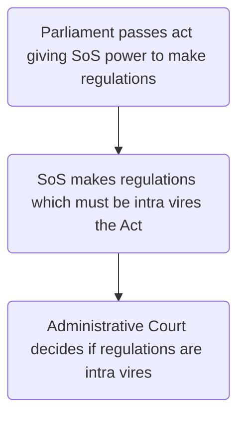

## Theory

- Constitutional theory: the judiciary, executive, and legislature should be separated into different bodies or persons. 
- Lord Acton: "Power tends to corrupt; absolute power corrupts absolutely"
- Montesquieu: this separation of powers is the best way to protect liberty.
- Note this is just a theory, different perspectives around the world
- US most closely associated with the ideal: does not allow for simultaneous membership of the Executive and Legislature
-  But in the UK, the form of government depends on the support and confidence of the legislature

## Separation of powers in the UK

UK values more highly the principle of parliamentary sovereignty. Lack of clear-cut rules between the different branches of government. 

In the US all three arms of state are co-equal, but in the UK parliament is supreme. UK courts do not have the power to quash primary legislation if deemed unconstitutional. The UK Supreme Court is not a constitutional court; it cannot review primary legislation for compliance with constitutional fundamentals. 

 It is often argued that the electoral system accentuates the executive’s hold over Parliament. However, the root cause of the fusion is a rather more basic structural one, namely that the executive in the UK sits within Parliament, creating a partially overlapping membership.

## Consequences

Institutional overlap:
- Fundamental overlaps between all three bodies
- How far does fusion impact the efficiency of and balance to the constitution

Judicial role:
- To what extent, if at all, can the judiciary 'make law'
- Power of judiciary to scrutinise and control actions of executive

## The Executive

We consider the constitutional principles of the separation of powers and [[Rule of Law]]. 	

> “Executive functions are incapable of comprehensive definition, for they are merely the residue of functions of government after legislative and judicial functions have been taken away. They may, however, be said to **entail the formulation or application of general policy in relation to particular situations or cases**, or the making or execution of individual discretionary decisions.
>
> More specifically, they include the execution of law and policy, the maintenance of public order, the management of Crown property, the direction of foreign policy, the conduct of military operations, and the provision, regulation, financing or supervision of such services as education, public health, transport and national insurance.”
> 
> Halsbury's Laws of England, Vol 20 Chapter 1 (1) paragraph 10

Fusion of powers, Walter Bagehot (_The English Constitution 1867_): this is because of the UK's parliamentary democracy rather than a presidential one. In a parliamentary system the legislature selects and contains the political part of the executive branch. Many people warn of dangers, given the whipping system and first past the post large majorities. 

#### Hung parliaments
Changes in political landscape, are these more or less likely?

#### Overlapping roles
The relationship between executive and legislature can be described as a system of 'checks and balances'. 

Govt ministers also MPs (by convention). Parliament confers powers on the government through the enactment of primary legislation. 

The executive has the ability to create secondary legislation, so long as it has the authority to do so from primary legislation. Secondary legislation is usually created from [[Statutory Instruments]]. There are ~3500 SIs made annually. 

Primary legislation takes the form of Acts of Parliament. Powers are conferred on the executive with the words 'the Secretary of State may/shall by regulations/orders make…'. Then the statutory instrument contains the Secretary of State's further rules on the specific area identified in the parent Act. 

#### Henry VIII clauses

Some Acts contain clauses allowing the executive to amend/ repeal provisions in an Act of Parliament using secondary legislation. These are controversial (little parliamentary scrutiny involved).

Named after Henry VIII who gave himself power to make law by royal proclamation with the Statute of Proclamations 1539. 

Significant in context of Brexit: EU Withdrawal Act 2018 providing that retained EU law will continue to apply. This 'retained EU law' will require further amendment because many of the laws mention EU institutions in which the UK no longer participates, or mentions EU law, which is no longer part of the UK legal system. So the Act gives ministers 'Henry VIII powers' to make changes to both primary and secondary legislation using statutory instruments. 

#### Parliamentary control over subordinate legislation

Three 'levels of delegation':

Level of delegation | Explanation
---|---
No scrutiny | Some delegated powers receive no scrutiny, like order to close road while developed
Negative instruments | Become law without debate or vote. Can be rejected but not amended by Parliament
Affirmative instruments | Cannot come into effect until approved by both Houses

#### Some Latin

Term | English
---|---
Vires | Power
Ultra vires | “outside the given power”, i.e., unlawful
Intra vires | “inside the given power”, i.e., lawful

Timeline:

#### Parliamentary committees

Parliamentary committees important in scrutinising statutory instruments, even those which do not need to be put before the House. Ensure that delegated legislation is within the power or intra vires delegated in the parent Act. 

Committee | Responsibility
---|---
Delegated Powers and Regulatory Reform Committee (House of Lords) | Examines delegated powers in primary legislation to see what powers ministers are asking for
Merits of Statutory Instruments Committee | Examines the secondary legislation which results from the exercise of those powers
Joint Committee on Statutory Instruments | Ensures SI complies with requirements of parent Act

#### Judicial functions of executive

The executive has encroached on the judicial sphere over time. Certain aspects of the judicial role can be exercised by members of the executive, notably by the Home Secretary. 

It used to be practice for the Home Secretary to have responsibility for setting the tariff sentence for those convicted to imprisonment 'during her Majesty's Pleasure'. Mostly used for young offenders (James Bulger murder by two ten-year-olds: [[R v Home Secretary, ex parte Venables and Thompson [1998] AC 407]]). In this case, the Home Secretary was found to have acted unlawfully in exercising these powers. 

Judicial power of the Home Secretary to set sentencing was removed in 2000. It is now solely the responsibility of the trial judge. 

#### Reduction in overlaps

Various recent reforms with the aim of reducing the overlap between the power of the executive and that of the judiciary:

- Until recently, the executive had the power to decide some legal disputes through a network of tribunals funded and administered by the same government departments against whose decisions they heard appeals. Following the [Tribunals, Courts and Enforcement Act 2007](https://www.legislation.gov.uk/ukpga/2007/15/contents), tribunals are now administered as part of the court system, and supervised by a new body, the Upper Tribunal. 
- [Constitutional Reform Act 2005](https://www.legislation.gov.uk/ukpga/2005/4/contents): article 6 requires courts and tribunals to be impartial and independent from the executive. 
- In [[McGonnell v UK (2000) 30 EHRR 289]] the trial judge, known as the Bailiff, also played a role in the Guernsey legislative assembly and so was not deemed sufficiently independent, representing a breach of article 6.

The CRA clearly did not introduce the idea of an independent judiciary to the UK, but it arguably enhanced the status of the higher judiciary as well as introducing a series of reforms that ironed out some of the more confusing functional overlaps in the UK’s traditional separation of powers model.

#### Lord Chancellor

The Lord Chancellor is the government minister with responsibility for the administration of justice, including the administration of the court system.

Historically, this office carried a wide portfolio of responsibilities. However, under the [Constitutional Reform Act 2005](https://www.legislation.gov.uk/ukpga/2005/4/contents), the role was reorganised to remove overlaps with the office’s legislative and judicial functions.

In relation to Parliament, the Lord Chancellor ceased to be the Speaker or President of the House of Lords in May 2006. After April 2006 the Lord Chancellor also ceased to be the head of the Judiciary in England and Wales and the office’s powers of judicial appointment were transferred to the Judicial Appointments Commission.

The office of Lord Chancellor has been retained as an executive Cabinet post. However, both the office and underlying department have been reorganised to reflect the new focus on administration. The department was initially renamed as the Department for Constitutional Affairs. This was further reorganised in May 2007, to incorporate part of the old Home Office function, and was renamed the Ministry for Justice, with the position of Lord Chancellor being re-designated as Lord Chancellor and Secretary of State for Justice.

#### The Attorney General

The Attorney General sits in Cabinet as the chief legal adviser to the government. He or she also has a role in deciding whether to bring a prosecution in individual cases.

This has led to separation of powers concerns. A good example of this was the controversy surrounding the legal advice given to the Blair government by the then Attorney General, Lord Goldsmith, in the lead-up to the war in Iraq in 2003, which is covered by section 5 of the Chilcot ‘Report of the Iraq Inquiry’.

In the last two decades, the suspicion that Attorney Generals can be pressured politically into supporting a central government line has been directed particularly at Lord Goldsmith (in relation to the legality of the war in Iraq in 2003) and to Geoffrey Cox (in relation to Brexit, in 2019).

Most recently, Suella Braverman spurred controversy by saying she was carefully considering referring the Edward Colston statute case to the Court of Appeal, in what was widely seen as a partisan move.

## Independence of the judiciary

#### Separate judiciary

Very strict separation of powers between the executive and judiciary. 

#### Independent judiciary

The judiciary must be insulated from political influence. s 3 [Constitutional Reform Act 2005](https://www.legislation.gov.uk/ukpga/2005/4/contents):

> (1) The Lord Chancellor, other Ministers of the Crown and all with responsibility for matters relating to the judiciary or otherwise to the administration of justice must uphold the continued independence of the judiciary. […]
> (5) The Lord Chancellor and other Ministers of the Crown must not seek to influence particular judicial decisions through any special access to the judiciary.
> (6) The Lord Chancellor must have regard to–
> (a) the need to defend that independence;
> (b) the need for the judiciary to have the support necessary to enable them to exercise their functions; […]

Before the Constitutional Reform Act 2005, the highest court in the UK was the House of Lords, regulated as the Appellate Committee in 1876. 

The highest appeal committee was institutionally part of the legislature — peeps said this showed separation of powers was encroached. Law lords were allowed to contribute to debate in the chamber of the House of Lords. 

But all ended in 2009 when CRA 2005 put into place and Supreme Court established. 

See also – [[Wakenshaw v Secretary of State for Justice [2018] EWHC 2089 (Admin)]]

#### Judicial appointments

Appointments of judges were before CRA made by Lord Chancellor. Criticised widely. 

s 6 CRA 2005: provided for the setting-up of an independent Judicial Appointments Commission, intended to improve the quality of the administration of justice and enhance public confidence in the judiciary. 

Independence of the Commission is ensured by 15 commissioners, comprising a mix of professional, lay and judicial members. Under s.63 of the Constitutional Reform Act 2005, judicial appointments are solely to be based on merit and good character.

#### Judicial pay and tenure

Judicial security of tenure has been enjoyed since the Act of Settlement 1701, part of the post-Glorious Revolution constitutional settlement.

The principle has since been re-enacted in section 11 of the Senior Courts Act 1981 for judges in the Crown Court, High Court and Court of Appeal, and in s. 33 of the Constitutional Reform Act 2005 for justices of the Supreme Court.

Both these Acts state that judges hold office 'during good behaviour' and may only be dismissed by the monarch following an address presented by both Houses of Parliament. The statutory retirement age for judges is 70. Judges are paid a salary by the Ministry of Justice, the amount of which is determined by an independent pay review body.

Judicial officers of other courts, including magistrates, coroners, and tribunal members enjoy less security, and their independence is protected by convention rather than by law.

#### Political independence of judges

Full-time judges are disqualified from sitting in the House of Commons under the [House of Commons Disqualification Act 1975](https://www.legislation.gov.uk/ukpga/1975/24/contents).

Parliamentary rules provide that Members of the Cabinet and MPs should not criticise the character or motivation of judges, although this convention is not always respected.

Courts also lack jurisdiction to inquire into proceedings in Parliament. This long-established and important principle of ‘parliamentary privilege’ is enshrined in Article 9 of the Bill of Rights 1689.

#### Judicial immunity from civil actions

Immune from legal proceedings for actions that would otherwise be tortious (e.g., defamation), as long as the action is done in a judicial capacity in a court of justice (so a judge would not be immune when commenting to the media).

The extent of immunity of magistrates is less than that of other judicial office holders, since magistrates may be liable for acts outside their jurisdiction (e.g., imposing a sentence that they do not have power to impose), if it is proved that they acted in bad faith.

In [[Sirros v Moore [1975] QB 118]] it was held that a circuit judge was entitled to immunity from liability in a civil action for damages, because the acts complained of were done by him acting in his capacity as a judge, in good faith, albeit mistakenly.

Per Lord Denning M.R. and Ormrod LJ.: 
> “As a matter of principle every judge of the courts in this land, from the highest to the lowest, should, when he is acting judicially in the bona fide exercise of his office, be protected against personal actions for damages, even where he may be mistaken in fact or ignorant in law. “

#### Open justice

Trials should be conducted in public, given the importance of justice being seen to be done. Cases should only be heard 'in camera' if a hearing in an open court would defeat the ends of justice or if it is necessary to protect the vulnerable.

Article 6 of the European Convention on Human Rights (the right to a fair trial) also plays an important role in this regard.

>“The principal purposes of the open justice principle are two-fold, and there may well be others. The first is to enable public scrutiny of the way in which courts decide cases — to hold judges to account for the decisions they make and to enable the public to have confidence that they are doing their job properly… But the second goes beyond the policing of individual courts and judges. It is to enable the public to understand how the justice system works and why decisions are taken.”
>([[Cape Intermediate Holdings Ltd v Dring [2019] UKSC 38]], per Lady Hale at paragraphs 42 and 43.)

#### Hearings in private

Under [Civil Procedure Rule 39.2](https://www.legislation.gov.uk/uksi/1998/3132/article/39.2/made):
- If publicity would defeat the object of the hearing. This ground is commonly used in applications for a freezing injunction or a search order.
- If it involves matters relating to national security (evidence may also be withheld, under the ‘closed material procedure').
- If it involves confidential information (including information relating to personal financial matters) and publicity would damage that confidentiality.
- If a private hearing is necessary to protect the interests of any child.

## Law-making

#### Constitutional context

> _“[the constitution] is firmly based on the separation of powers; Parliament makes the laws, the judiciary interpret them.”_
> Lord Diplock in [[Duport Steels v Sirs [1980] 1 WLR 142]]

Reality is that the judiciary has made law (mostly private law, like the law of negligence). Most law is now created by statute but the judiciary's constitutional responsibility for interpreting legislation means it has played a notable role in shaping and influencing how law is applied in this respect. 

Organ of state | Function in making laws
---|---
Government | Proposes primary legislation to be considered by Parliament and drafts secondary legislation.
Legislature | Can propose primary legislation of its own (via Private Members' bills) and it decides whether executive proposals become law.
Judiciary | Interprets Parliament's intentions in making legislation and develops the common law (legal principles not found in legislation).

#### Judicial activism

Judiciary sometimes accused of excessive 'judicial activism'. Key case: [[Shaw v Director of Public Prosecutions [1962] AC 220]]. 

In this case, the issue was whether the court could effectively 'create’ a new offence in its capacity as "custos morum" (keeper of morals) in the absence of specific legislation by Parliament, which had been legislating for over 100 years on issues of public morality and decency generally?

The court’s justification, which has subsequently been questioned, was that there was a long line of case law establishing that conduct calculated to corrupt public morals (as opposed to the morals of a particular individual) was an indictable misdemeanour. The court therefore was not 'creating new offences' or making new law; it was applying existing principles of law to the facts. The absence of a statutory basis for an alleged crime is irrelevant if there is an established principle of common law giving rise to it. Application of that principle is not 'making new law' but applying existing law.

#### Judicial deference

[[Malone v Metropolitan Police Commissioner [1979] Ch 344]] judicial deference to Parliament. 

[[Gillick v West Norfolk Health Authority [1986] AC 112]]: ratio for two key points about judicial law-making:
- Judges in the [[Senior Courts]] are often required to make decisions in the absence of any explicit statutory or common law authority.
- A feature of common law is that it develops with the changing political and cultural climate.

#### Modernising the law

Similar approach was taken in [[R v R [1992] 1 AC 599]]. 

The law lords overturned an apparent, long-standing common law principle that, by virtue of marriage, a woman consents to sexual intercourse with her husband. R’s case was that he could not accordingly be convicted of the offence of 'marital rape'.

The judgment contained a comprehensive review of the authorities on the marital exception to the crime of rape and considered whether a change of the apparent common law position was appropriate, in the absence of legislation by Parliament.

The court considered that it was appropriate:

> “It seems to us that where the common law rule no longer even remotely represents what is the true position of a wife in present day society, the duty of the court is to take steps to alter the rule if it can legitimately do so in the light of any relevant Parliamentary enactment.” (per Lord Lane CJ)

The court went on to conclude that the wording of the relevant enactment could be interpreted in such a way as to overturn the existing, archaic common law principle.

#### Societal or medical developments

Where the legislation is unclear or hasn't court up with new societal or medical developments? [[Airedale NHS Trust v Bland [1993] AC 789]] — see case for discussion on modernising the law). 

Some think modern courts are too interventionist: [Judicial Power Project](https://judicialpowerproject.org.uk/)

#### Parliamentary response

Statutory law has a higher status than common law, so a legal principle established by the courts can be overridden by Parliament passing legislation. Parliament, in the words of Professor A.V. Dicey, can 'make or unmake any law whatever'.

Classic example: [[Burmah Oil Company (Burma Trading) Ltd. v Lord Advocate [1965] AC 75]]. 

## Judicial scrutiny of the Executive

The constitutional principle of the [[Rule of Law]], of which the judiciary are the acknowledged guardians, has arguably become more pronounced in recent times.

Yet, the judiciary is not elected and does not share an equal place in the constitutional hierarchy to Parliament, and so it is incumbent on judges to defer where appropriate.

The UK’s executive is potentially very powerful, but the judiciary is able to exercise a degree of control and oversight through the process of judicial review, which has expanded notably in the last 40 years or so. Significantly, this also permits the courts to invalidate secondary legislation, created by the executive, if this is deemed ultra vires the powers given by Parliament.

#### Judicial oversight of legislation

Judges in the UK has no power to scrutinise proceedings in Parliament, nor to 'review' primary legislation. 

Partial exception:
If an Act of Parliament is incompatible with the European Convention on Human Rights, the Court may make a declaration to that effect pursuant to [s. 4 Human Rights Act 1998](https://www.legislation.gov.uk/ukpga/1998/42/section/4) — but note that the courts cannot invalidate it

Secondary legislation can normally be challenged and potentially quashed. The legal mechanism for doing so is judicial review. This is carried out by the Administrative Court, a specialist court within the Queen’s Bench Division of the High Court of Justice. Note that the higher appeal courts also have the legal authority to quash secondary legislation.

#### Judicial Review

Purpose of judicial review is:
- To prevent abuse of power by the executive
- To uphold individual rights or interests

If the executive, or any public body exercising a public function, reaches a decision which is wrong in law, the decision may be 'quashed' — i.e., rendered a nullity — by the Administrative Court.

Note that the legality of a decision is examined, not the merits. The merits of a decision are a matter for the executive (or other public body). This approach is intended to respect the doctrine of the separation of powers.

#### Role and status of the courts

In situations where the executive has ignored/ over-ridden court orders or decisions, this is viewed as a form of disrespect for the constitutional role of the judiciary. 

[[M v Home Office [1994] 1 A.C. 377]]: asylum seeker deported even though new evidence came to light. Court of Appeal found that an order could legitimately be made against the Crown and the Home Secretary had been in contempt of court for ignoring it. 

This reversed the previous position that an injunction could not be made against the Crown. It also symbolised the important rule of law principle that the Crown, in the form of a government minister, is just as much subject to the law as ordinary citizens are. A legal order could not be disregarded; only a higher court could overturn it.

In [[R (Evans) v Attorney General [2015] UKSC 21]] the Supreme Court found that the executive's actions were reviewable by the court. 

#### Judges upholding the will of parliament

The court will sometimes hold the executive legally to account to uphold the sovereignty of Parliament in the face of executive encroachment ([[R v Secretary of State for the Home Department Ex p. Fire Brigades Union [1995] 2 A.C. 513]]). 

Similarly, two high-profile defeats for the government in relation to cases associated with Brexit initiated by Gina Miller. 

- Case involving Article 50 — [[R (Miller) v Secretary of State for Exiting the European Union [2017] UKSC 5]]
- [[R (Miller) v Prime Minister [2019] UKSC 41]] advice given by PM to the Queen to prorogue Parliament was unlawful. 

It was found firstly that the case was justiciable, as it related to the courts’ historic ability to hold the executive to account for its actions. The effect of the PM’s advice to prorogue would have meant that, for a highly significant period of around 5 weeks in the lead-up to the planned exit from the EU at the end of October 2019, Parliament would have been unable to meet either in session or in any committees. This was a far longer period of prorogation than normal, and ‘no justification for taking action with such an extreme effect’ had been put before the court.

The prorogation order was therefore declared void.

It is notable here how the UKSC saw its role as providing a constitutional safeguard to protect Parliament, the sovereign body, against an executive over-reaching its authority (and its use of prerogative power).

In _ex p FBU_ ([[R v Secretary of State for the Home Department, ex parte Fire Brigades Union [1995] 2 AC 513]]) the Home Secretary had been seen as bypassing the will of Parliament. In _Miller 2_, disregard of constitutional norms by the executive was, in the courts’ eyes, more acute still, as the effect of its proposals was to prevent Parliament from carrying out its proper ‘constitutional functions’ at such a significant moment.

#### Scrutiny of executive decisions

In the constitutional sense, it is important to distinguish between 
1. cases where the courts have to address challenges on the basic legality of governmental actions and 
2. those where the challenges are based on the reasonableness or rationality of what government does.

There has been an expansion of the original ‘ultra vires’ principle in judicial review, so that decisions of public bodies can now be challenged on a number of different bases, or “grounds”, including those of unfairness and irrationality.

In the former instance, it is constitutionally orthodox for the courts to be able to intervene — they are effectively deciding if the executive had the authority to do what it did. In the latter type of cases, the balance is much more finely set, and the courts will apply a more deferential approach accordingly. This relates to the idea of variable intensity of review, that will be encountered in more detail in later materials.

>“The constitutional status of the judiciary should not, however, excuse the courts from any scrutiny of policy decisions. Courts are able, and indeed obliged, to require that decisions, even in the realm of “high policy” are within the scope of the relevant legal power or duty and arrived at by the legal standards of procedural fairness.
>The courts display reserve in impinging upon the substance of policy decisions, but even here they may legitimately intervene if the decision is devoid of reason and not properly justified.
>Judges always possess the capacity to probe the evidence and assess whether the reasons and motives for decisions are rationally related to their aims. As will be shown … public law has rapidly advanced recently from a “culture of authority” to a “culture of justification”.”
>De Smith's Judicial Review, 8th Ed, Chapter 1

#### Example: GCHQ

Since 1947, staff employed at the GCHQ communications centre had been permitted to join trade unions. In December 1983 the Prime Minister, with no prior consultation, altered the conditions of service, forbidding membership.

In [[Council for the Civil Service Unions v Minister for the Civil Service [1985] AC 374]] the applicants sought judicial review on the ground of unfairness due to failure to consult. The law lords established, very significantly, that the courts have the power to review how the executive uses its prerogative powers. But they concluded that in this case national security requirements outweighed those of fairness. 

## Other points

Can't be a judge and also a member of the House of Lords (before you could be). Highly contentious issues will be left to Parliament (like euthanasia, financial policy). Acts of Parliament can wipe the slate clean. 