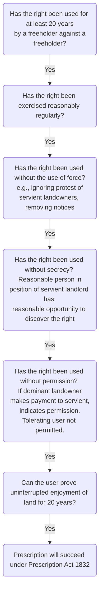
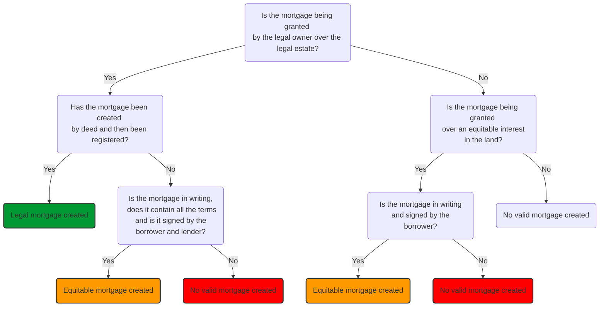
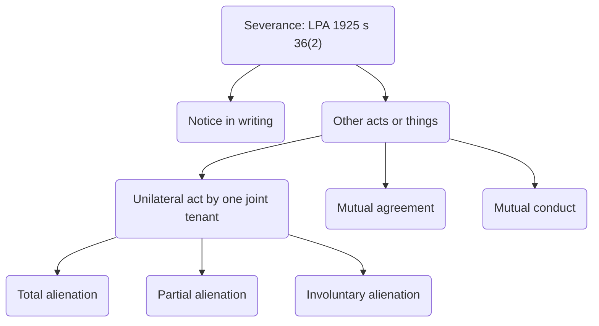

# Land Law

## Freehold Covenants

- Covenantor and covenantee
- Positive or restrictive
	- Hand in pocket test.
- Enforceable as contract between the original parties
	- But want it to be enforceable against the current owner of the land.
- May be enforceable against successors in title.

![[freehold covenants_1.jpg]]

### Introduction

A covenant is a promise relating to land. Covenants are usually contained in a transfer deed made when someone sells part of their land and wants to control what happens on the land sold off. The seller makes it part of the sale deal that the buyer will enter into covenants which have the effect of preserving the amenity and value of the land retained by the seller. Covenants are in effect a means of private control of land use.

#### Context

This is an area of law which arose at the time of the industrial revolution in the mid-nineteenth century, when landowners were selling part of their land for industrial and housing development. In order to preserve the quality and value of what they had left, the landowners imposed strict covenants as to what could and could not be done on the land sold off.

```ad-example
For example, they might require the buyer to covenant not to develop the land without the consent of the seller; or may covenant not to use the land for manufacturing or industrial purposes; or may covenant to use it for residences, maybe even restricting the number of houses which can be built on the land. All of these covenants have the effect of preserving the value of the seller’s retained land because they eliminate the possibility of the adjoining land being used for a purpose which would reduce the attractiveness, quality and value of the retained land.
```

#### Terminology

| Term          | Definition                                                                                                                                                         |
| ------------- | ------------------------------------------------------------------------------------------------------------------------------------------------------------------ |
| Covenantee    | Person who has sold part of their land and has required the buyer to enter into the covenant. The covenantee is the person entitled to sue for breach of covenant. |
| Dominant land | Land owned by the covenantee.                                                                                                                                      |
| Covenantor    | Person giving the promise and entering into the covenant. Often referred to as the grantor of the covenant. Can be sued if covenant is breached.                   |
| Servient land | Land owned by the covenantor which is burdened by the covenant.                                                                                                                                                                    |

Almost inevitably, the dominant and servient land will be sold or transferred to new owners at some point. When the dominant land is transferred, the new owner is successor-in-title to the original covenantee, and is known as the successor covenantee. If the relevant rules have been observed, that person now has the ability to sue for breach of covenant. The rules on the burden of a covenant passing to a successor covenantor are complex.

### Positive and Restrictive Covenants

Covenants impose two main types of obligation: positive and negative.

A positive covenant is a promise actively to do something.

```ad-example
The promise to do something will usually involve spending money: it could be a direct obligation to pay money, perhaps towards the upkeep of a shared facility such as a driveway, a parking area, or a communal garden. The covenant could involve payment of money, which is not directly stated. For example, there could be an obligation for the covenantor to maintain a fence, a wall, or a roof; or to paint the exterior of a house every two years. This will inevitably involve some sort of expenditure. But it does not necessarily involve money. A covenant to keep a garden tidy may not involve expenditure but it does require time and effort to fulfil and is therefore a positive obligation.
```

 A negative or, more properly, a restrictive covenant is a promise not to do a specific thing on the land. It restricts the use of the land in some way.

 ```ad-example
There are many examples: not to use land for industrial, or retail, or hot food takeaways, or manufacturing; not to build above a certain height, or above a certain density of housing; not to install a window overlooking the dominant land...
```

> ‘Only such a covenant as can be complied with without expenditure of money will be enforced’ against a successor covenantor.’  
> Lindley LJ, [[Haywood v Brunswick Permanent Benefit Building Society (1881) 8 QBD 403]]

```ad-test
title: Hand in pocket test

The test for identifying whether a covenant is positive or restrictive is set out in [[Haywood v Brunswick Permanent Benefit Building Society (1881) 8 QBD 403]]

This is known as the ‘hand in pocket’ test. If covenantors have to put their hands in their pockets to find money to spend to perform the covenant, it is positive.

‘Time is money’ so any covenant which requires expenditure of money, effort or time falls within the definition of positive covenants’.
```

Deciding whether a covenant is positive or restrictive is a matter of looking at the substance not form: look beyond the words used and ask ‘what is the essence of the obligation?’

Mixed covenants, which impose positive and restrictive obligations, can be interpreted in one of two ways:

1. as separate covenants or
2. as one obligation with a condition attached

#### Separate Covenants

[[Shepherd Homes Ltd v Sandham (No 2) [1971] 2 All ER 1267]]

This approach can be taken if the positive and restrictive aspects of the obligation can be separated to create two separate ‘stand alone’ covenants; one positive and one restrictive.

```ad-example
A covenant to paint the exterior of a building every two years and not to paint the front door red
This covenant can be split.
- To paint the exterior every two years: positive.
- Not to paint the front door red: restrictive.
```

#### One Obligation with Condition

[[Powell v Hemsley [1909] 2 Ch 252]]

This approach is taken if the mixed covenant cannot be split into two separate obligations.

The covenant is interpreted as being overall positive or restrictive, depending on whether it obliges the covenantor to do or not do something.

The additional element, which cannot stand alone as a covenant, is viewed as being simply a condition attached to an overall positive or restrictive obligation.

```ad-example
A covenant not to build on the servient land without the consent of the dominant owner. This covenant cannot be split. 
- Not to build’ is the main obligation: restrictive covenant.
- ‘Without consent’ is not a stand alone obligation. Seeking consent only operates as part of the main obligation: positive condition attached.
```

### Enforceability of Freehold Covenants

Suppose there is a covenant between A and B. Suppose A sells the dominant land to C and B sells the servient land to D. There is now no direct legal relationship between C and D; there is no contract between them. This presents a problem for enforceability.

To enforce such a covenant, it must be shown that:

- C has the benefit of the covenant, and
- D has the burden of the covenant.

There are two sets of rules which must be applied to see whether the benefit and burden have passed to the successor covenantee and covenantor, respectively. One set is the rules of equity, and the other is the common law rules. It is vitally important that these rules are not muddled or used on a mix and match basis. It is not possible, for example, to apply the common law rules to pass the benefit to C and the rules of equity to pass the burden to D. If the equity rules are applied to pass the burden, then they must be applied to pass the benefit.

### Equitable Rules: Burden

As a general rule, the burden of a covenant does not pass to a successor at common law: [[Austerberry v Oldham Corporation [1885] AC 29 ChD 750]]. This means that at common law, the covenant is unenforceable against a successor in title to the covenantor.

Equity has developed rules which allow the burden of certain covenants to pass to successors, which allows the covenant to be enforced direct against the person in breach. It is equity’s intervention which has created the proprietary right, which we know as the **restrictive covenant**.

The formalities for creating a restrictive covenant are set out in [LPA 1925, s 53(1)(a)](https://www.legislation.gov.uk/ukpga/Geo5/15-16/20/section/53): in writing and signed by the grantor. A restrictive covenant is a proprietary right: [LPA 1925, s 1(3)](https://www.legislation.gov.uk/ukpga/Geo5/15-16/20/section/1).

```ad-test
title: Tulk v Moxhay rules

The equitable rules began with the case of [[Tulk v Moxhay (1848) 2 Ph 774]]. There are 4 aspects to the rule:
1) The covenant must be restrictive
2) It must accommodate the dominant tenement
3) There must be intention for the burden to run
4) There must be notice of the covenant
```

#### The Covenant Must Be Restrictive

In [[Rhone v Stephens [1994] AC 310]] Lord Templemen said

> ‘For over 100 years it has been accepted law that equity will enforce negative covenants against freehold land but has no power to enforce positive covenants against successors in title of the land’.

This means that to enforce a covenant in equity, it must be shown that the substance of the covenant is restrictive. If a covenant is positive, then the common law rules will apply to its enforcement.

Positive covenants can only be enforced at common law.

#### Accommodate Dominant Tenement

There are three aspects:

1. The covenantee and successor covenantee must hold an interest in land at the time of creation and enforcement.
	- The original covenantee and successors must have retained an interest in dominant land at the time of creation and enforcement of the covenant.
	- [[LCC v Allen [1914] 3 KB 642.]]
2. The covenant must touch and concern the dominant land
	- This means that it is the land, and not simply the dominant owner, which must benefit from the covenant.
	- [[P&A Swift Investments Ltd v Combined English Stores Group plc [1989] AC 632]]
3. The dominant land and the servient land must be in proximity.
	- The two pieces of land must be near to each other, although they do not need to share a common boundary, or be directly next to each other
	- [[Bailey v Stephens (1862) 12 CB (NS) 91]]

#### Intention for Burden to Run

This can be shown expressly or impliedly.

##### Expressly

The covenant is worded in such a way as to make it clear that successors are to be bound:

```ad-example
- ‘A hereby covenants with B for himself and his successors in title to land known as…’ or
- ‘A hereby covenants with the intention of binding land known as…’
```

##### Impliedly

[LPA 1925, s 79](https://www.legislation.gov.uk/ukpga/Geo5/15-16/20/section/79) states that a covenant relating to land shall be deemed to be made by the covenantor on behalf of his successors in title, unless a contrary intention is expressed.

The section makes the original covenantor liable for all breaches of covenant by any person who holds the land after the original covenantor has parted with it. It does not pass the burden of the covenant.

##### There Must Be Notice of the Covenant

###### Unregistered Land

The covenant must be entered as a D(ii) Land Charge ([LCA 1972 s 2(5)(ii)](https://www.legislation.gov.uk/ukpga/1972/61/section/2)). If so, a purchaser will be deemed to have notice of the covenant ([LPA 1925, s 198](https://www.legislation.gov.uk/ukpga/Geo5/15-16/20/section/198)).

If the covenant has not been protected by entering a D(ii) Land Charge, a purchaser of a legal estate will take the land free of the covenant, they will not be bound ([LCA 1972, s 4(6)](https://www.legislation.gov.uk/ukpga/1972/61/section/4)).

However, if the successor covenantor has been gifted or inherited the estate, they will still be bound despite the fact it has not been correctly protected.

Whether the successor covenantor is deemed to have notice of the covenant depends on whether it has been properly protected by registration.

###### Registered Land

The covenant must be protected by the entry of a notice in the charges register of the servient title ([LRA 2002, s 32](https://www.legislation.gov.uk/ukpga/2002/9/section/32)).

If so, everyone, including a purchaser for valuable consideration, will be bound ([s 29(2) LRA 2002](https://www.legislation.gov.uk/ukpga/2002/9/section/29)).

If not, a purchaser for valuable consideration will take the land free of it and would not be bound ([s 29(1) LRA 2002](https://www.legislation.gov.uk/ukpga/2002/9/section/29)), but a successor in title covenantor who has been gifted or inherited the land (a ‘volunteer’) will still be bound ([s 28 LRA 2002](https://www.legislation.gov.uk/ukpga/2002/9/section/28)).

### Equitable Rules: Benefit

The various ways in which the benefit of a covenant can pass to a successor covenantee are set out.

#### Context

If a successor covenantee wishes to enforce a breach against a successor covenantor direct, two things must be shown:

1. that the burden of the covenant has passed to the successor covenantor in equity and
2. that the benefit has passed to the successor covenantee in equity.

It is not enough to show that the burden has passed in equity and the benefit passes at common law. If an equitable remedy is required, both the benefit and burden must pass in equity: the rules go hand in hand.

There are two elements which must be fulfilled for the benefit to pass in equity:

1. The covenant must ‘touch and concern’ the dominant land
2. The benefit must pass by one of the methods in [[Renals v Cowlishaw (1878) 9 ChD 125]]

#### Methods of Passing the Benefit

The case of [[Renals v Cowlishaw (1878) 9 ChD 125]] sets out 3 ways in which the benefit of a covenant can pass to a successor covenantee in equity:

1. Annexation
2. Assignment
3. Building Scheme

##### Annexation

```ad-defn
Annexation occurs when the covenant is made in such a way that the benefit becomes a permanent part of the dominant land itself. It therefore passes automatically when the dominant land is sold, without being specifically mentioned in the transfer deed.
```

Annexation occurs in one of two main ways:

1. Express annexation

	- The words of the covenant are sufficient to make the benefit part and parcel of the dominant land from the outset.
	- This occurs where the express words of the covenant make it clear that the original parties intend the benefit to become part of the dominant land, rather than simply a personal advantage to the covenantee.
	- In [[Rogers v Hosegood [1900] 2 Ch 388]] a covenant made ‘for the benefit of the owners and successors in title’ to named land, which was enough to demonstrate express annexation.
	- In [[Renals v Cowlishaw (1878) 9 ChD 125]] a covenant stated to be made with the covenantees, their heirs, executors and assignees was not enough to show express annexation because the benefit was stated to be for people, not for land.

2. Statutory annexation [LPA 1925, s 78](https://www.legislation.gov.uk/ukpga/Geo5/15-16/20/section/78)

	- LPA 1925, s 78(1) was interpreted in the case of [[Federated Homes v Mill Lodge Properties Ltd [1980] 1 WLR 594]] as providing that a covenant relating to any land of the covenantee shall be deemed to be made with the covenantee and his successors in title of the land intended to be benefitted.
	- This would appear to make express words of annexation unnecessary, as it seems to make annexation automatic.
	- However, [[Roake v Chadha [1984] 1 WLR 40]] held that s 78(1) can be expressly excluded. This can happen if an alternative method of passing the benefit is stipulated in the original transfer deed.

```ad-statute
title: s 78(1) LPA 1925
A covenant relating to any land of the covenantee shall be deemed to be made with the covenantee and his successors in title and the persons deriving title under him or them, and shall have effect as if such successors and other persons were expressed.
```

##### Assignment

```ad-defn
Assignment is the express transfer of the benefit of a covenant alongside a transfer of the dominant land.
```

This occurs where the benefit of the covenant has not been annexed at the outset. The benefit can nevertheless be assigned when the dominant land is transferred. As the benefit exists separately from the land itself, it is treated as a separate interest in the land and must be transferred every time the land is transferred.

The separate assignment of the benefit must comply with the formalities in [LPA 1925, s 53(1)(c)](https://www.legislation.gov.uk/ukpga/Geo5/15-16/20/section/53): in writing and signed by the person transferring the benefit.

##### Building Scheme

```ad-defn
If the parties intended to create a scheme of reciprocal local laws in a building scheme, the benefit of restrictive covenants passes to all new owners.
```

When a new housing estate is built, all houses are sold subject to the same covenants. New owners who wish to enforce a covenant against a neighbour may struggle to show that the benefit of a particular covenant has passed to them.

Building schemes resolve this problem relating to restrictive covenants only.

If the conditions of a building scheme are met, the covenants are treated as a set of by-laws enforceable by and against all owners. It is not necessary to show specifically that the benefit of a particular covenant has passed to a claimant.

```ad-test
title: Building scheme
The conditions are set out in [[Ellison v Reacher [1908] 2 Ch 374]]:
1) All buyers buy from the same seller
2) The seller divided the estate into plots
3) The covenants were intended to benefit all plots
4) Each buyer buys on the understanding that the covenants are intended to benefit all plots.

Later cases have interpreted these rules as **guidelines** rather than strict requirements.

A court will need to be satisfied that it was the intention of the parties to create a **scheme of mutually enforceable obligations**.
```

##### Original Covenantee

When dominant land is sold, the original covenantee technically still has the benefit of the covenant and can sue on it. This is based on contractual principles.

However, it is highly unlikely that an original covenantee would wish to enforce a covenant in these circumstances.

Even if action was taken, it is hard to envisage any loss which could be suffered by an original covenantee who no longer owns the dominant land.

```ad-example
A covenant not to build on servient land is of no value to a covenantee once the dominant land is sold. A breach of the covenant causes the original covenantee no loss.
```

### Equitable Remedies

As a restrictive covenant is an equitable interest in land, equitable remedies are available to enforce the breach against the current owner. These remedies are discretionary, there is no automatic right to them. The most common remedy for breach of covenant is an injunction.

| Term                   | Definition                                                          |
| ---------------------- | ------------------------------------------------------------------- |
| Injunction             | An order of the court.                                              |
| Prohibitory injunction | An order requiring a person to refrain from doing a particular act. |
| Mandatory injunction   | An order to undertake a particular act.                                                                    |

Typically, if the breach is threatened or ongoing, the claimant can apply for a prohibitory injunction, ordering the breach to cease. For example, if a servient owner is using the burdened land for an unauthorised use, or is building in breach of covenant, a prohibitory injunction would be appropriate.

If the breach has already occurred, the claimant can apply for a mandatory injunction, ordering the person in breach to do something. For example, if a building has been built in breach of covenant, a mandatory injunction, ordering the demolition of the building, may be appropriate.

#### Equitable Principles

Equitable remedies are awarded subject to general equitable principles and maxims. ‘Delay defeats equity’ – a claimant must not wait too long before applying for an injunction.

```ad-note
A claimant who wishes to apply for an injunction in respect of building work being carried out in breach of covenant must act immediately. If the claimant waits until the building is complete and then applies for a mandatory injunction to knock the building down, the application is likely to be refused.
```

#### Damages in Lieu of Injunctions

Equitable damages are not awarded as of right.

They may be awarded in lieu of an injunction, as an injunction may be refused where it would be oppressive to grant it.

Key case: [[Wrotham Park Estate Co Ltd v Parkside Homes [1974] 1 WLR 798]].

### Common Law Rules: Burden

The rule in [[Tulk v Moxhay (1848) 2 Ph 774]] must be used to pass the burden of a covenant in equity. The first aspect of this is that the covenant must be negative. Therefore the rules in equity cannot be used to enforce positive covenants, or indeed any restrictive covenant which fails any of the other _Tulk v Moxhay_ tests. Only the common law can be used in these circumstances.

It must be shown that the burden has passed to a successor covenantor at common law, and that the benefit has passed to a successor covenantee at common law. It is fairly easy to show that the benefit passes at common law, and for the purposes of this explanation, we will assume that the benefit has indeed passed to C, enabling C to sue for breach of covenant.

On the assumption that C can show that the benefit has passed, the problem as far as C is concerned relates to the burden.

```ad-important
It is the general rule at common law that the burden of the covenant does not pass ([[Austerberry v Oldham Corporation [1885] AC 29 ChD 750]]).
```

The effect of the rule is that at common law, C cannot sue D direct as the burden of the covenant has not passed to D. If the burden of a covenant does not pass, that does not mean that it disappears. It remains with the original covenantor permanently. This means that it is the original covenantor has the burden of the covenant and can be sued.

#### Continuity

This continuity is often found expressly stated in the wording of the covenant. This can be stated in a variety of ways, but common examples are:

> [!example]
> - ‘the covenantor covenants for himself, his successors in title and all those deriving title under him or them to maintain the boundary fence…’ or
> - ‘the covenantor covenants that he and his successors in title will maintain the boundary fence…’ or
> - ‘the covenantor covenants with the intention of binding land known as 9 Main Street to maintain the boundary fence…’.

Even if there is no such express wording in the covenant itself, [LPA 1925, s 79(1)](https://www.legislation.gov.uk/ukpga/Geo5/15-16/20/section/79) can be used to imply such wording. The case of [[Topham Ltd v Earl of Sefton [1967] 1 AC 50]] confirms this. So the effect is that the original covenantor will be liable for any breach of covenant by anyone who holds the servient land in the future.

#### Remedies

The problem from the covenantee’s point of view is that the only remedy available against the original covenantor is damages. This may not be what the covenantee wants. For example, if the successor covenantor has breached a covenant to maintain a fence, the covenantee wants to force the successor covenantor to maintain the fence. However, that is not going to happen as the burden does not pass to the successor covenantor. If the covenantee sues the original covenantor, the original covenantor is not in possession of the land and is not therefore in a position to maintain the fence. Instead, damages may be awarded to the covenantee, but that simply awards money, and does not solve the essential problem.

Original covenantors may have awards of damages made against them for breaches of covenant that they did not commit, did not know about, and had no power to stop. Can the original covenantor do anything to recover money paid out? The answer to that question depends entirely on whether the original covenantor (B in this example) was careful (or had a careful solicitor) when B sold the servient land to D.

As part of the sale process, B should have insisted that D entered into an indemnity covenant in B’s favour. In essence, in the transfer deed, D promises that, in the event of B being sued for a breach of covenant after B parts with the servient land, D will reimburse any damages that B has had to pay out.

This means that if D has to pay out the money for, say, the dilapidated fence, maybe that will make D more likely to maintain the fence in future. This is what is meant by ‘indirect enforcement’. D cannot be sued direct, but suing B, who then recovers damages paid out from D, may encourage D to observe the covenant in future.

#### Chain of Indemnities

If the servient land changes hands several times, there is potentially a ‘chain of indemnity’ as each new servient owner makes an indemnity covenant with the previous servient owner. In our continuing example, there is a covenant to maintain a boundary fence. B may sell the servient land to D, who sells to F, who sells to H. H breaches the covenant and lets the fence fall down in places. As the maintenance covenant is positive, B is sued for the breach, and pays out damages. As D has made an indemnity covenant with B when D bought, B can recover the sums paid out from D. As F has made an indemnity covenant with D when F bought, D can recover any sums paid out to B from F. Note that B cannot sue F direct as there is no direct covenant between B and F.

#### Shortcomings

In this example, in the transfer from F to H, F did not ask H to enter into an indemnity covenant. This means that if H breaches covenant, B will be sued and can recover from D; D in turn can recover from F, but the chain of indemnity is then broken and F cannot recover from H. As H has not had to pay anything out, there is no incentive for H to stop breaching covenant. This is one of the problems with indemnity chains.

Moreover, F may have been declared bankrupt; or may have died; or may not be traceable. In that case, there is no practical possibility of D recovering any outlay, even though technically, everything has been done correctly.

### Exceptions to the Common Law Rule

#### Mutual Benefit and Burden

[[Halsall v Brizell [1957] Ch 169]] gives a limited exception to the general rule, enabling the burden of a covenant to pass to a successor covenantor at common law.

It is known as the **‘mutual benefit and burden’ rule**, and applies where the covenantee grants to the covenantor a benefit in the nature of an easement, and imposes a connected burden.

For example, in the transfer deed selling part of a piece of land, a covenantee grants the covenantor a right to park on the covenantee’s land. In the same deed, the covenantor covenants to contribute to the cost of maintaining the parking area.

In a case like this, a successor covenantor cannot take the benefit of parking but avoid payment by relying on the basic common law rule of the burden not passing.

##### Refinements

The rules has been refined in subsequent cases:

| Case                                               | Ratio                                                                                                                                                                                                                                                      |
| -------------------------------------------------- | ---------------------------------------------------------------------------------------------------------------------------------------------------------------------------------------------------------------------------------------------------------- |
| [[Rhone v Stephens [1994] 2 AC 310]]               | There must be a clear link between the burden and the benefit. There is no general principle that someone who takes a benefit under a deed must submit to any burden which it imposes.                                                                     |
| [[Thamesmead Town Ltd v Allotey (1998) 3 EGLR 97]] | There must be a genuine choice as to whether or not to take the benefit. This choice can be theoretical. The condition of discharging the covenanted burden must be relevant to the exercise of the right (more than incidental). |
| [[Davies v Jones [2009] EWCA Civ 1164]]            | The benefit and burden must have been conferred in the same transaction.                                                                                                                                                                                   |

##### Grant of Long Lease

One way of side-stepping the rule that the burden of a freehold covenant will not pass to a successor covenantor is to dispose of the land by way of long lease.

All covenants in leases except personal ones are enforceable by and against successors in title via the doctrine of privity of estate.

##### Commonhold Development

Commonhold is a way of holding land in units such as blocks of flats. Each unit owner has obligations, such as contributing towards the maintenance of each unit. The rights and obligations attach by statute ([Commonhold and Leasehold Reform Act 2002](https://www.legislation.gov.uk/ukpga/2002/15/contents)) to each unit, so all obligations are enforceable against all unit holders at all times.

Unfortunately, commonhold has not proved a popular way of holding land.

##### Restriction: S 40 LRA 2002

```ad-note
This is the most commonly used way of making the burden of positive covenants run on registered land.
```

A covenantee can put a restriction on the **proprietorship register of the burdened land**. This states that no transfer of the burdened land can be registered without the consent of the covenantee.

As a condition of giving consent to the transaction, the covenantee takes a direct covenant from the purchaser of the burdened land.

In the new covenant, the new owner promises to observe the covenants in the original transfer. This creates a new privity of contract between the covenantee and purchaser, enabling direct enforcement of the covenants.

##### Other Methods

- Reserving a rentcharge annexed to a right of entry
- Reserving a freehold right of entry
- Less commonly used.

### Common Law Rules: Benefit

The original covenantee can enforce a covenant as a matter of contract law. If the dominant land is sold, the successor covenantee must show that the benefit has passed to it at common law.

This enables the successor covenantee to enforce the covenant either against the original covenantor, or (in limited circumstances) against the successor covenantor.

There are two ways the benefit can pass at common law:

#### Express Assignment

Under normal contractual principles, the benefit of a covenant can be expressly assigned to a successor.

[LPA 1925, s 136](https://www.legislation.gov.uk/ukpga/Geo5/15-16/20/section/136) requires the assignment must be in writing and express notice of the assignment must be given to the covenantor. This is to ensure that the covenantor realises that a new person is in a position to enforce the covenant.

#### Implied Assignment

Where there is no express assignment, the benefit of a covenant may pass to a successor covenantee if certain conditions are met. This involves the benefit automatically passing every time the land is transferred, as long as the conditions are met.

```ad-test
title: Implied assignment

The conditions of implied assignment are set out in [[P&A Swift Investments Ltd v Combined English Stores Group plc [1989] AC 632]]:
1. The covenant must touch and concern the land
2. There must have been an intention that the benefit should run with the dominant land
3. The original covenantee must have a legal estate in the dominant land
4. The successor covenantee must hold a legal estate in the dominant land
```

#### The Covenant Must Touch and Concern the Land

The covenant must benefit the dominant land itself, it must affect the nature, quality, use or value of the land. It must not be expressed to be personal and should only benefit the dominant owner for the time being, so that, if separated from the land, it ceases to be of any advantage to them.

```ad-example
A covenant to maintain a house on the burdened land does touch and concern the dominant land as it preserves the quality of the environment and therefore the value of the dominant land.
```

#### Intention That Benefit Runs with Dominant Land

Intention of the parties can be shown expressly or impliedly through statute.

If there is no express intention, [LPA 1925, s 78](https://www.legislation.gov.uk/ukpga/Geo5/15-16/20/section/78) implies an intention for the benefit to pass unless it is expressly excluded.

```ad-example
A covenant drafted ‘for the benefit of land known as 5 High Street’ or ‘with the covenantee and successors in title to land known as 5 High Street’ shows express intention
```

The original covenantee must have a legal estate in the dominant land, and the successor covenantee must hold a legal estate in the dominant land.

The original covenantee must have owned a legal estate when the covenant was made, and that the successor must own a legal estate at the time of enforcement.

The legal estate does not need to be of the same nature: [[Smith and Snipes Hall Farm Ltd v River Douglas Catchment Board [1949] 2 KB 500]].

In that case, the original covenantee held a freehold and the successor held a leasehold. The successor was held to be entitled to the benefit of the covenant and could therefore enforce it.

### Ending Freehold Covenants

The methods by which a freehold covenant can be brought to an end are discharge, modification and release.

#### Problem with Old Covenants

Restrictive covenants, once validly granted, last forever. Over time, these can become obsolete and can unduly restrict the use of the servient land.

```ad-example
A covenant not to build on land might have benefitted the dominant tenement whilst that land was used for residential purposes, but no longer does if the dominant land is now a factory.
```

There are various ways in which a covenant can be discharged or modified. Discharge if a covenant means that it is no longer valid.

Modification of a covenant means that the scope of the covenant is altered, but it is not completely invalidated.

#### Methods of discharging/modifying Covenants

A covenant will be automatically be discharged if the same person becomes the owner of both the dominant and servient land: [[Re Tiltwood, Sussex [1978] Ch 269]].

This is known as merger. A dominant owner may expressly agree to discharge the covenant and will enter into a formal release of covenant, usually in return for a payment.

The release must be made by deed. Alternatively, the dominant owner may impliedly agree to discharge the covenant by doing nothing when the covenant is being breached openly.

#### Statutory Discharge or Modification of Covenants

The dominant owner could hold the servient owner to ransom by asking for a large sum of money to discharge an obsolete covenant.

To avoid this, the servient owner can apply to the [[Tribunals#Upper Tribunal]] (Lands Chamber) for the discharge or modification of any covenant.

[Law of Property Act 1925, s 84(1)](https://www.legislation.gov.uk/ukpga/Geo5/15-16/20/section/84) gives the Lands Chamber the power ‘wholly or partially to discharge or modify any… restriction’.

```ad-warning
This provision only applies to restrictive covenants.
```

```ad-statute
title: [LPA 1925, s 84(1)(a)](https://www.legislation.gov.uk/ukpga/Geo5/15-16/20/section/84)

A servient owner may apply to the tribunal for a declaration to discharge or modify a covenant on the basis that the covenant has become obsolete due to changes in the character of the property or neighbourhood.
```

```ad-example
A covenant to use property only as a residence may be obsolete if the surrounding area is now business, retail of mixed use.
```

[s 84(1)(aa)](https://www.legislation.gov.uk/ukpga/Geo5/15-16/20/section/84) enables an application to be made on the basis that the covenant impedes reasonable use of the servient land. The applicant must show either that the covenant confers no practical value, or that it is contrary to public interest.

The tribunal must be satisfied that financial compensation would be adequate for the dominant owner.

```ad-example
A covenant restricting the density of houses on a plot may confer no practical value on the dominant land if that land is itself densely developed.
```

S 84(1)(b) applies where the dominant owners have agreed, expressly or impliedly, to discharge.

```ad-example
An application here may be appropriate where the parties have expressly agreed a release in principle, or where the dominant owner has tolerated a long-term breach. In this instance, the tribunal will decide the level of compensation to be paid, thereby preventing the dominant owner holding the servient owner to ransom.
```

S 84(1)(c) enables an application to be made where discharge if a covenant will not 'injure' the dominant owners.

This provision means that the tribunal can override spurious or frivolous objections.

However, the tribunal has a balancing act to do: on the one hand it will be wary of discharging covenants on this basis simply because discharge will not injure the current dominant owner. On the other hand it will have regard to social and economic concerns: the wider public interest rather than the interest of one particular dominant owner.

## Easements

- Positive or negative
- Better than a licence (which is just a personal permission to do something which would otherwise be trespass).
- Right in rem!
- As of right, not with permission.
- Expressly Created
	- Created by deed (s 52 LPA 1925)
	- With correct formalities
	- Granted forever or for fixed period
	- Registered against both title.
- Implied Grant or Reservation
	- Strict necessity
	- Common intention
	- [[Wheeldon v Burrows (1879) 12 Ch. D. 31]]
	- s 62 LPA 1925.
	- Recall seller (reservation) can only use necessity or common intention.
- Prescriptive Easements
	- As of right by one freeholder against another for at least 20 years. Must be used without secrecy, without permission, without force.
	- Prescriptive easements are not contained in the register, so need to carry out due diligence.

## Definition

```ad-defn
title: Easement
An easement is a proprietary right to use land which belongs to somebody else. The use is more limited than an exclusive right to occupy or use.
```

The person who receives the benefit of the easement is the grantee and their land, which is benefitted by the easement, is the _dominant tenement_.

The person who grants the easement land is the grantor and their land, which is burdened by the easement, is the _servient tenement_.

### Legal Easements

An easement is capable of being a legal interest in land if it fulfils the requirements as to duration.

```ad-statute
title: LPA 1925, s 1(2)(a)

‘An easement…for an estate equivalent to an estate in fee simple absolute in possession or a term of years absolute’.
```

```ad-example
A right of way granted when part of freehold land is sold will be granted forever. A right of drainage granted in a five-year lease will be granted for the term of that lease.
```

### Equitable Easements

If an easement is **not** granted for the equivalent of a freehold or leasehold estate, it can only be equitable.

```ad-example
A right to park which is granted ‘until the alternative parking facility is completed’ can only be equitable as it is not granted forever or for a set/certain period of time.
```

#### Positive Easements

The overwhelming majority of easements are positive, in that they allow the holder to use the servient land of another in a particular way.

```ad-example
- A right of way allows the holder to use a driveway on neighbouring land.
- A right of drainage allows the holder to use the pipes under that land.
- A right to park allows the holder to drive onto and park on part of neighbouring land.
```

#### Negative Easements

These are rare and treated with caution by the courts. They do not involve entering the neighbouring land, rather, when exercised, they prevent the servient landowner from doing something on their land by giving the dominant landowner a right to receive something.

The only recognised negative easements at law are:

- A right to light (there is no automatic right to light, an easement can exist in relation to a defined aperture)
	- A right to light must be via a defined aperture e.g. a window. Rights to light do not attach to gardens or open land.
- A right to air
- A right of support (e.g., from the dividing wall between semi-detached houses)

#### Distinguishing Easements

There are other types of rights which can easily be confused with easements.

It is important to be able to distinguish between an easement and another type of right or interest, especially a restrictive covenant and an easement.

Do not confuse easements with:

| Right                 | Description                                                                                                                                                                                                                                                                                     |
| --------------------- | ----------------------------------------------------------------------------------------------------------------------------------------------------------------------------------------------------------------------------------------------------------------------------------------------- |
| Quasi-Easements       | Where landowners use, for example, paths on their own land, they are not enjoying easements. They are using the paths as owners of the land. However, the use of the paths could become easements if ever the land was divided. This nebulous or potential easement is called a quasi-easement. |
| Public rights         | Public rights can be similar in scope to easements. The best example is a right of way. However, instead of being exercised by an individual or particular body, the right by its nature is exercised by the general public.                                                                    |
| Licences              | A licence can authorise somebody to use land in the same way as an easement does. A licence is not, however, a proprietary right in land: it merely confers a personal right which cannot be enforced against a third party.                                                                    |
| Profits a prendre     | An easement does not confer on the holder the right to take anything, such as produce, animals, fish, or minerals, from the land. A profit a prendre confers such a right.                                                                                                                      |
| Restrictive covenants | An easement confers a right over the servient land. As a consequence, the servient owner cannot do anything on the servient land which would interfere with the right. By contrast, the primary function of a restrictive covenant is to restrict what is being done on the servient land.

#### Grant

A **grant** exists where C, a landowner, sells or leases part of C’s land to D, and gives to D an easement over the land which C has retained.

```ad-example
- C owns a large piece of land which adjoins a main road.
- C sells part of the land to D and retains the part of the land nearest the road.
- In the transfer deed, C creates a right of way in D’s favour across the driveway on C’s retained land.
```

#### Reservation

A **reservation** exists where C sells or leases part of C’s land to D, and retains a right over the land sold or leased to D.

A reservation is strictly construed against the person reserving it, because they are in a position to reserve exactly what is required and are assumed to have done so. Any attempt by C to extend the right will fail. To interpret the right more widely would be to ‘**derogate from the grant**’ that C has made to D, in that D has a lesser use of the land than originally envisaged ([[Cordell v Second Clanfield Properties Ltd [1969] 2 Ch 9]]).

```ad-example
- C owns a large piece of land which adjoins a main road.
- C sells part of the land nearest the road to D and retains the rest.
- In the transfer deed, C retains a right of way in C’s favour across the driveway on D’s land.
```

### Creation of Easements

#### Express Creation

Most easements, whether grants or reservations are created **expressly.** They commonly arise when land is sold or leased. They are set out in writing in the transfer deed or lease.

Easements can also be expressly created as part of a separate deal, independent of a transfer or lease.

#### Implied Creation

Easements need not necessarily be expressly created. An easement may be deemed to have been created impliedly by one of several recognised methods.

If an easement is impliedly created, it is effectively written into the document from which it was originally omitted.

#### Prescription

Easements may also arise by prescription or ‘long use’. Generally an easement is claimed by prescription where it has been exercised over land for a long time (at least 20 years), yet no express grant or reservation can be traced. Easements acquired by prescription are legal easements.

If the right has the characteristics of an easement and has been exercised openly for the requisite length of time, the servient owner is deemed to have tolerated the creation of the easement.

Three types of prescription:

1. Prescription at Common Law
2. Prescription under the doctrine of Lost Modern Grant
3. [Prescription Act 1832](https://www.legislation.gov.uk/ukpga/Will4/2-3/71/contents)

```ad-note
Prescription will succeed under the Prescription Act 1832 if the user can prove uninterrupted enjoyment for the 20 year period. [No use for 1 year or more = interruption]
```

The basic criteria for a prescription are:

- Continuous user – ‘reasonably regular use’ by a freeholder or successive freehold owners against a freeholder.
- As a right – the right must have been used without force, without secrecy and without permission (‘nec vi; nec clam; nec precario’).



See [[Mills v Silver (1991) Ch 271, CA]] and [[Winterburn v Bennett [2017] 1 WLR 646]].

##### Bevan

- An easement by prescription can only be generated where a right has been exercised by one fee simple owner over another fee simple owner's land ([[Simmons v Dobson (1991)]])
- In [[Union Lighterage Company v London Graving Dock Company [1902] 2 Ch 557]] no easement arose by prescription in circumstances where a dock had been affixed to a wharf for 20 years using underground rods invisible to the servient landowner.
- Where permission is given to the dominant landowner for the exercise of a right over the servient, this will prove fatal to a claim for an easement by prescription ([[Odey v Barber (2007)]])
	- In [[Hill v Rosser (1997)]], the claim to an easement by prescription failed where the servient landowner had granted a licence for the user to the dominant landowner.
	- Permission need not have been solicited by the dominant landowner ([[Odey v Barber (2007)]])
- An easement will only be generated by prescription if it can be lawfully granted and where the user is not illegal in nature.
- Use must be regular and continuous. Long periods of unexplained non-use will be fatal to a claim for prescription.
- No easement can be generated by prescription unless the user by the alleged dominant landowner is in the nature of a right capable of constituting an easement.

See also:

- [[Capability rules]]
- [[Easement acquisition]]

### Enforceability of Easements and Remedies

#### Enforceability by Dominant Owner

In order to enforce an easement, the dominant owner must have the benefit of the easement and thus the ability to sue. As between the original parties, a properly created easement is always enforceable by the dominant owner against the servient owner. If the dominant land changes hands, the benefit, which is part of the land, passes with the transfer of the land.

It does not matter whether the easement is legal or equitable, or whether the land is registered or unregistered: the benefit will pass with the dominant land, enabling the dominant owner to enforce it.

```ad-statute
title: [s 205(1)(ix) LPA 1925](https://www.legislation.gov.uk/ukpga/Geo5/15-16/20/section/205)
‘Land’ includes… an easement, right, privilege, or benefit in, over or derived from land…’
```

```ad-statute
title: [s 62(1) LPA 1925](https://www.legislation.gov.uk/ukpga/Geo5/15-16/20/section/62)

‘A conveyance of land shall be deemed to include and shall by virtue of this Act be deemed to convey, with the land, all… easements, rights and advantages whatsoever...’
```

#### Express Legal Easements: Enforceability Against Servient Owner

| Type of land      | Enforceability against new servient owner                                                                                                                                 |
| ----------------- | ------------------------------------------------------------------------------------------------------------------------------------------------------------------------- |
| Registered land   | A properly created express legal easement will always be enforceable against a new servient owner as it must be substantively registered in order to be a legal easement. |
| Unregistered land | A properly created express legal easement will be enforceable as ‘legal interests bind the world’ [[Mercer v Liverpool, St Helen’s and South Lancashire Railway Co [1904] AC 461]]. However, since the LRA 2002, on transfer of the servient land, the express legal easement will be an interest overriding the first registration of the servient land and will become noted on the charges register of the newly registered servient land [LRA 2002, Sch 1 para 3](https://www.legislation.gov.uk/ukpga/2002/9/schedule/1).                                                                                                                                                                          |

In summary, an express legal easement:

- Must comply with definition on duration and be for a certain term or forever: [LPA 1925, s 1(2)(a)](https://www.legislation.gov.uk/ukpga/Geo5/15-16/20/section/1); and
- Must be created by deed: [LPA 1925, s 52](https://www.legislation.gov.uk/ukpga/Geo5/15-16/20/section/52); [LP(MP)A 1989 s 1](https://www.legislation.gov.uk/ukpga/1989/34/section/1); and
- If over registered land, easement must be substantively registered per [LRA 2002, s 27(2)(d)](https://www.legislation.gov.uk/ukpga/2002/9/section/27)
- Else if over unregistered land, easement ‘binds the world’ and is overriding interest on first registration of servient land per [LRA 2002, Sch 1 para 3](https://www.legislation.gov.uk/ukpga/2002/9/schedule/1).

#### Implied Legal Easements: Enforceability Against Servient Owner

| Type of land      | Enforceability against new servient owner                                                                                                                                                                                                                                                                                                                                         |
| ----------------- | --------------------------------------------------------------------------------------------------------------------------------------------------------------------------------------------------------------------------------------------------------------------------------------------------------------------------------------------------------------------------------- |
| Registered land   | An implied legal easement will be an overriding interest [LRA 2002, Sched 3 para 3](https://www.legislation.gov.uk/ukpga/2002/9/schedule/3) provided that: the easement is within the actual knowledge of the new owner; or it is obvious on a reasonably careful inspection of the servient land; or it has been exercised with a year before the transfer of the servient land. |
| Unregistered land | An implied legal easement is enforceable in exactly the same way as an express legal easement over unregistered land, i.e., under the principle ‘legal interests bind the world’ and as an overriding interest on first registration of the land.                                                                                                                                                                                                                                                                                                                                                                                  |

Note that [[Chaudhary v Yavuz [2011] EWCA Civ 1314]] suggests obiter that an equitable easement could be an overriding interest based on actual occupation (the easement held by someone in actual occupation of the servient land), but there is no direct authority on this.

In summary, an implied legal easement:

- Must comply with definition on duration and be for a certain term or forever: [LPA 1925, s 1(2)(a)](https://www.legislation.gov.uk/ukpga/Geo5/15-16/20/section/1); and
- Must be implied by one of the recognised methods; and
- If over registered land, implied easement is an overriding interest if conditions met: [LRA 2002, Sched 3, para 3](https://www.legislation.gov.uk/ukpga/2002/9/schedule/3).
- Else if over unregistered land, the easement ‘binds the world’ and is an overriding interest on first registration of servient land: [LRA 2002, Sch 1 para 3](https://www.legislation.gov.uk/ukpga/2002/9/schedule/1).

#### Express Equitable Easements

##### Registered Land

A properly created express equitable easement will always be enforceable against the grantor, but must be protected in order to be enforceable against a new servient owner.

To be protected, a **Notice** must be entered in the charges register of the servient land, [LRA 2002, s 32](https://www.legislation.gov.uk/ukpga/2002/9/section/32). If this is done, then this makes the easement binding on a new owner of the servient land, [LRA 2002, s 29(2)](https://www.legislation.gov.uk/ukpga/2002/9/section/29). If this is not done, the easement is not binding on a purchaser for valuable consideration, [LRA 2002, s 29(1)](https://www.legislation.gov.uk/ukpga/2002/9/section/29).

A volunteer (i.e., someone who is gifted or inherits the land) will always be bound, whether the interest is protected or not, [LRA 2002, s 28](https://www.legislation.gov.uk/ukpga/2002/9/section/28).

```ad-summary
- The easements must be properly created: either [LPA 1925, s 53(1)(a)](https://www.legislation.gov.uk/ukpga/Geo5/15-16/20/section/53) or [LP(MP)A 1989, s 2](https://www.legislation.gov.uk/ukpga/1989/34/section/2)
- The easements must be protected by Notice in the charges register of the burdened land: [LRA 2002, s 32](https://www.legislation.gov.uk/ukpga/2002/9/section/32)
- If done, easement binds everyone: [LRA 2002, s 29(2)](https://www.legislation.gov.uk/ukpga/2002/9/section/29)
- If not done, the purchaser for value is not bound: [LRA 2002, s 29(1)](https://www.legislation.gov.uk/ukpga/2002/9/section/29) but the volunteer is: [s 28](https://www.legislation.gov.uk/ukpga/2002/9/section/28)
```

##### Unregistered Land

Properly created express equitable easements over unregistered land must be protected in order to be enforceable against a new servient owner.

To be protected, a Class D(iii) Land Charge must be entered in the Land Charges Register at Plymouth [LCA 1972, s 2(5)(iii)](https://www.legislation.gov.uk/ukpga/1972/61/section/2). If this is done, then this makes the easement binding on a new owner of the servient land,[LPA 1925, s 198](https://www.legislation.gov.uk/ukpga/Geo5/15-16/20/section/198), as this constitutes actual notice of the existence of the easement. If this is not done, the easement is not binding on a purchaser for money or money’s worth of a legal estate in the servient land: [LCA 1972, s 4(6)](https://www.legislation.gov.uk/ukpga/1972/61/section/4).

A volunteer will always be bound.

```ad-summary
- The easements must be properly created: either [LPA 1925, s 53(1)(a)](https://www.legislation.gov.uk/ukpga/Geo5/15-16/20/section/53) or [LP(MP)A 1989, s 2](https://www.legislation.gov.uk/ukpga/1989/34/section/2)
- The easements must be protected by a D(iii) Land Charge: [LCA 1972, s 2(5)(iii)](https://www.legislation.gov.uk/ukpga/1972/61/section/2)
- If done, easement binds everyone: [LRA 2002, s 198](https://www.legislation.gov.uk/ukpga/2002/9/section/198)
- If not done, the purchaser for value is not bound: [LCA 1972, s 4(6)](https://www.legislation.gov.uk/ukpga/1972/61/section/4) but the volunteer is.
```

##### Implied Equitable Easement

Where there is an implied equitable easement, whether the servient land is registered or unregistered, the method for protection and rules on enforceability are exactly the same as for express equitable easements.

The problem is that it if someone has the benefit of an implied equitable easement, it is highly unlikely that they would ever consider that they have to protect their interest in some way: it is illogical to expect some one to protect an interest formally when the interest itself arose completely without formality.

An implied equitable easement is therefore vulnerable to being defeated when the servient land is sold.

##### Remedies

- Prohibitory injunction to prevent interference with the enjoyment of the easement
- Damages in lieu of injunction or in addition to it
- [[Mandatory injunction]] to remove obstruction

### Easement Analysis Structure

1. Is the right in question capable of being an easement? Does it satisfy the capability requirements? Is the right disqualified?
	1. Test set out in re Ellenborough Park
		1. There must be a dominant and servient tenement
		2. The right must accommodate the dominant tenement
			1. Benefits land, not individual
			2. Proximity
		3. No common ownership of the tenement (diversity of ownership/occupation)
		4. The right must lie in grant
			1. Capable grantor/grantee
			2. Sufficient description
			3. Judicially recognised
	2. Disqualifying factors
		1. Exclusive possession;
		2. Permission;
		3. Payment of rent.
2. If the right is capable of being an easement, has it been successfully acquired as an easement? If not expressly, could it have been acquired impliedly?
3. Even if it is a properly acquired easement, is it actually enforceable against the parties you are trying to enforce it against? Has it been properly protected? If not, is it an OI?

## Case Study

![[lecture-case-study.png]]

Case study on the above.

- Right of way
- Vehicular right of way
- Right to services running under land sold
- Wall/ fence

May include covenants:

- To maintain boundary fence
- To limit noise from industry at particular times
- Maintain pathway etc.
- Restrictive covenant to not run service utilities under existing buildings

## Mortgages

![[mortgages 1_1.jpg]]

```ad-defn
A mortgage is a bundle of proprietary rights granted to the lender (the mortgagee) as security for a loan.
```

### Legal Mortgages

Per LPA 1925, s 1(2)(c) a mortgage is capable of being a legal interest in land. In order to be recognised as a legal interest, the mortgage must be created in compliance with the formalities for a legal interest over registered land. These are deed and registration.

#### Deed

```ad-statute
title: [s 52(1) LPA 1925](https://www.legislation.gov.uk/ukpga/Geo5/15-16/20/section/52)

All conveyances of land or of any interest therein are void for the purpose of conveying or creating a legal estate unless made by deed.
```

To be valid, the deed must comply with the requirements set out in [s 1 LP(MP)A 1989](https://www.legislation.gov.uk/ukpga/1989/34/section/1):

- A deed must be clear on the face of the document that it is intended to be a deed.
- The deed must be validly executed.
- The deed must be delivered.

#### Registration

The mortgage deed must then be registered at the Land Registry ([s 27(2)(f) LRA 2002](https://www.legislation.gov.uk/ukpga/2002/9/section/27)). If it is not registered, the mortgage will not take effect as a legal mortgage in the land (s 27(1)) but could still be an equitable interest.

Dispositions are required to be registered:

```ad-statute
title: [s 27 LRA 2002](https://www.legislation.gov.uk/ukpga/2002/9/section/27)

(1) If a disposition of a registered estate or registered charge is required to be completed by registration, it does not operate at law until the relevant registration requirements are met.

(2) In the case of a registered estate, the following are the dispositions which are required to be completed by registration—…

(f) the grant of a legal charge
```

### Legal Vs Equitable

If the mortgage is being granted over a legal estate by the legal owner, the mortgage is capable of being a legal interest. Consider if the mortgage has been granted by deed and properly registered. If it has, the parties have created a valid legal mortgage. You do not need to consider equitable mortgages in this scenario.

If:

1. the mortgagor (the borrower) only holds an equitable interest in the land (rather than being a legal owner), or
2. the mortgage is a defective legal mortgage (it does not comply with the requirements of a deed, or it has not been registered)

Then consider if there is an equitable mortgage on the facts.

### Equitable Mortgages

An equitable mortgage can arise for a number of reasons.

#### Mortgages of Equitable Interests

Where the borrower holds an equitable interest in the land (i.e., they are not a legal owner, e.g., a beneficiary in a trust of land), any mortgage of that interest will be equitable in nature.

Such a mortgage can be created very informally. In accordance with [s 53(1)(c) LPA 1925](https://www.legislation.gov.uk/ukpga/Geo5/15-16/20/section/53), such a mortgage need only be in writing and signed by the grantor in order to be validly created.

#### Defective Legal Mortgages

A mortgage over registered land which is not granted by a valid deed or that is not completed by registration will not take effect as a legal mortgage (it will be defective).

However, it may be regarded as an equitable mortgage if it complies with [s 2 LP(MP)A 1989](https://www.legislation.gov.uk/ukpga/1989/34/section/2). Equity will recognise it as a ‘contract to grant a legal mortgage’ providing it is in writing, contains all the agreed terms and is signed by both the mortgagor and mortgagee.

#### Discharge of Mortgages

Once a mortgage has been repaid in full, the mortgage entries at the Land Registry must be cancelled. A mortgage is only considered to be fully discharged when all reference to it has been removed from the Charges Register at the Land Registry.

Discharge of a registered charge is done by using a specific Land Registry form. A [DS1 form](https://assets.publishing.service.gov.uk/government/uploads/system/uploads/attachment_data/file/808695/DS1__2019-06-17_.pdf) is used to discharge a mortgage over the whole of the land in a title.

If only part of the land in the title is being released from the mortgage, for example if only part of the land is being sold to a buyer, a [DS3 form](https://assets.publishing.service.gov.uk/government/uploads/system/uploads/attachment_data/file/713043/DS3__2018-05-25_.pdf) is used.

### Summary



See [[Equity of redemption]].

### Undue Influence

See [[Undue influence]].

#### Context

Consider a scenario where a married couple own the freehold to their family home. A bank lends some money to the wife's business on the condition that the bank is granted a mortgage over the property.

In the ordinary rules of priority, interests rank according to which was created first. This means the bank's right in the land would rank behind the husband’s and wife’s as the freehold owners – their interest (i.e., their freehold ownership) was created before the bank’s.

The mortgage deed will contain a provision stating that the bank interest ranks in priority to the freehold ownership, which means the bank can possess and sell if the land if the repayments stop. The effect of this priority provision is that the Bank’s interest in the land will rank ahead of the husband and wife’s interest. This happens in all mortgage deals and means the bank and lender will be able to repossess and then sell the land in the event of default.

Suppose the mortgage repayments stop and the bank wishes to enforce its security over the house. The issue for the bank here is that the loan was not for the joint benefit of both the husband and wife. If the husband can successfully argue that he was unduly influenced into entering the mortgage deed then the effect is that the mortgage will be unenforceable against him ([[Barclays Bank plc v O'Brien [1994] 1 AC 180]]) because the clause which postpones his interest in favour of the bank’s is ineffective.

To ensure that the bank has priority, it must follow the guidelines set out in [[RBS v Etridge (No 2) [2002] 2 AC 773]].

These guidelines provide that the lender must write to the party who is granting the mortgage not for their benefit (the husband in the example we’ve looked at) explaining that the Bank needs confirmation from an independent solicitor that he/she has explained the transaction to him/her.

- The bank will ask that party to nominate an independent solicitor
- Provide all information to that independent solicitor
- And the bank must not proceed to lend until confirmation received from the independent solicitor that the transaction has been fully explained.

The solicitor must:

- Meet the party who is entering into the mortgage not for their own benefit face to face, on their own (i.e., not with the partner for whose benefit the mortgage loan is for!)
- Explain why they have to come to see him/her, i.e., to stop them from being able to claim UI later
- explain documents and transaction in a meaningful way using non-technical language
- Point out the risks
- Emphasise he/she has a choice
- keep a detailed attendance note and confirm everything in writing
- send certificate to Bank.

```ad-warning
The House of Lords in Etridge said these steps should be taken in every non-commercial case where a private individual offers his property as security for another person's debts.
```

### Priority of Mortgages Over Registered Land

There is an order of priority for mortgages on a piece of land.

#### Legal Mortgages

Under the LRA all mortgages over registered land must themselves be registered substantively in order to attain the status of a legal mortgage ([LRA 2002, s 27(2)(f)](https://www.legislation.gov.uk/ukpga/2002/9/section/27)).

Once registered, they take effect as a ‘registered charge’ under the LRA.

A mortgage over registered land which is not completed by substantive registration will not take effect as a legal mortgage ([s 27(1) LRA 2002](https://www.legislation.gov.uk/ukpga/2002/9/section/27)).

Under [LRA 2002, s 48](https://www.legislation.gov.uk/ukpga/2002/9/section/48) priority between registered charges depends upon the order in which they are entered on the register. This is regardless of the order of creation. Where two or more mortgages are created at the same time (i.e., first and second mortgage simultaneously), the application for registration will specify the order of priority.

Priority between registered charges depends upon the order in which they are registered.

#### Equitable Mortgages

An equitable mortgage can arise for a number of reasons. The two most common are:

- Mortgages of equitable interests
- Defective legal mortgages.

##### Basic Rule

As against another equitable mortgagee, equitable mortgages rank in order of creation ([LRA 2002, s 28](https://www.legislation.gov.uk/ukpga/2002/9/section/28)).

This is the ‘basic rule’ of priority that applies to all equitable interests because an equitable interest in the land can be validly created and exist without registration.

##### Protected Equitable Mortgage

Although not required in order to validly create it, an equitable mortgage over registered land can be protected by the entering of a notice on the charges register ([LRA 2002, s 32](https://www.legislation.gov.uk/ukpga/2002/9/section/32)).

If protected by the entry of a notice, an equitable mortgage over registered land will take **priority** over a subsequent legal mortgage, [LRA 2002, s 29(1)](https://www.legislation.gov.uk/ukpga/2002/9/section/29). As between competing equitable mortgages, this **does not** affect the priority, which will always be determined by creation.

However, an equitable mortgage not protected by a notice, will not take priority (i.e., lose its priority) to a subsequent registrable disposition of either a registered estate or a registered charge ([LRA 2002, s 29(1)](https://www.legislation.gov.uk/ukpga/2002/9/section/29)). (i.e., a transfer of the legal estate for value or the grant of a legal mortgage)

```ad-example
A borrower grants a mortgage to Lender A. Although the mortgage is granted by a valid deed, Lender A fails to register the mortgage at the Land Registry – it is a **defective legal mortgage**. However, because it is in writing, signed by both the borrower and Lender A and contains the agreed mortgage term, the mortgages take effect an **equitable mortgage**.

The borrower subsequently enters into a second mortgage with Lender B. The mortgage is granted by valid deed, which Lender B registers. The mortgage therefore takes effect as **a valid legal mortgage**.

As a **registrable disposition of a legal charge over a registered estate**, the legal mortgage in favour of Lender B will rank ahead of the equitable mortgage in favour of Lender A.

The borrower then enters into a further mortgage with Lender C. Although the borrower and Lender C enter into a document labelled as a deed, the borrower’s signature is not witnessed. There is no valid execution and the **legal mortgage is defective**. As the document is in writing, contains all the agreed terms and is signed by the borrower and Lender C, there is an **equitable mortgage**, which Lender C proceeds to **note on the charges register** of the borrower’s registered title.

If the borrower defaults in their mortgage repayments and the land has to be sold, who then gets paid first? Which mortgage ranks in priority?

Lender A has an equitable mortgage which was created first, but not protected. Lender B has a legal mortgage. Lender C has an equitable mortgage which has been duly protected.

Lender B will get paid first. It take priority of Lender A’s equitable mortgage because the equitable mortgage was not protected by notice at the Land Registry.

Lender A will then get paid second because Lender A and C both have equitable mortgages and as between competing equitable mortgages, the order of creation determines priority.

The fact Lender C protected its equitable mortgage by the entry of a notice, does not affect priority here. However, if a subsequent legal mortgage were entered into by the borrower, Lender C would take priority over this because it has protected its interest.
```

##### Postponement

The priority rules discussed can be modified to allow a mortgage to take priority over a pre-existing interest which could otherwise enjoy priority if there is a postponement of that pre-existing interest.

Lenders can agree to alter the position that would apply according to the priority rules by entering into a **deed of priority** or **intercreditor deed**.

Any agreement would need to be **registered** at the Land Registry.

```ad-important
Mortgagees will also often require an express waiver or postponement to be included in a mortgage agreement so that the rights of any person living at the mortgaged property with the mortgagor are postponed to the interests of the mortgagee.

This is important for the lender to be able to enforce their security and take possession of the mortgaged property in the event of default.

If the lender’s interest in the land does not rank in priority to the interest of a person in occupation (not a party to the mortgage) then the lender would not be able to take possession of the land in order to exercise its power of sale.
```

### Rights of the Lender

![[rights of a lender_1.jpg]]

It is inherent in the nature of a mortgage that the lender’s right to repayment of the loan is secured against the mortgaged property itself. This security is very important to lenders, as without it, they may take the view that it is simply too much of a risk to advance large sums of money to borrowers.

If the mortgagor fails to make the mortgage payments, the lender will wish to take steps to protect itself against losses. The lender can always sue the borrower in contract for the debt, but this can be a long and ultimately fruitless process if the borrower has insufficient money. The fact that a mortgage is a proprietary right in the lender’s favour means that the lender has several remedies available to it. These remedies are:

- Debt action
- Possession
- Sale
- Receiver
- Foreclosure.

There is no obligation for a lender to exercise any particular remedy, or indeed any remedy at all. The choice of remedy is a matter for the particular lender in the particular circumstances. However, if the lender does decide to pursue a remedy, it will be under a duty to act fairly and reasonably, and may be subject to additional duties to the borrower, depending on the remedy sought.

The lender who holds the security of a legal mortgage, rather than an equitable one, has a wider choice of remedies than an equitable mortgagee.

An equitable mortgagee has the same rights to bring a debt action under the mortgage contract for money owed, to apply for foreclosure, and to appoint a receiver. However, the equitable lender does not, generally speaking, have the right to repossess or sell without a court order.

#### Debt Action

The contractual debt action is a personal action against the borrower. As the lender has a proprietary right and can enforce it against the property itself, it may be thought that the contractual right to sue for the outstanding debt is rarely used. In fact, it is used in addition to, not instead of, one of the other remedies, and in recent years, has been used in particular situations.

If the value of the mortgaged property is less than the outstanding mortgage debt, there is said to be **negative equity**. The lender may take possession of and sell the property, but if the sale proceeds so not cover the outstanding debt, the lender will wish to pursue a personal debt action against the borrower for the shortfall.

The limitation period for a contractual debt is not straightforward: if the mortgage has been created by deed, as all legal mortgages must be, then the period for recovery of the debt stated in the deed (the capital) is **twelve years**. The limitation period for recovery of interest is **six years**. What this means in reality is that borrowers can find themselves involved in contractual debt actions many years after repossession, when they may have thought that their troubles were behind them.

#### Possession

A legal lender may wish to enforce its security by taking possession of the mortgaged property as a precursor to sale. There are two reasons a lender may wish to do this:

- Possession will enable the lender to offer the property for sale with vacant possession, free from any rights of the borrower. Vacant possession makes a property more attractive to a potential buyer and will enable a higher price to be obtained.
- Possession will enable the lender to manage the property and derive an income from it. The income can then be used to reduce the outstanding mortgage debt.

Since 2008, the **Pre-Action Protocol** in residential cases, possession must be a last resort. The mortgage lender is expected to explore alternative arrangements with the borrower, such as extending the mortgage term and/or scheduling a new payment plan.

#### Sale

The power of sale is the strongest right which the lender can use against a defaulting borrower. If exercised, the borrower loses all rights to the property. The sale proceeds are applied towards the outstanding debt. If there is a surplus, this will be forwarded to the borrower; but if there is a shortfall, the borrower may be sued personally by the lender for the outstanding contractual debt.

Because the power of sale has such drastic consequences for the borrower, there are procedural steps which must be adhered to:

- The power of sale must have arisen in accordance with statutory rules;
- The power of sale must be exercisable in accordance with statutory rules; and
- The lender must fulfil its duties on sale, which have largely arisen from case law.

#### Receiver

A receiver acts as manager of the mortgaged property if the lender does not wish to take possession or to sell. The power to appoint a receiver arises under [LPA 1925, s 101(1)(iii)](https://www.legislation.gov.uk/ukpga/Geo5/15-16/20/section/101). The receiver is an administrator whose function is to get an income from the land, for example by continuing an existing business, and will apply it towards the outstanding mortgage debt.

The receiver is deemed to be the borrower’s agent. This may seem odd, as the receiver is appointed by the lender, but it means that the lender is not liable for the receiver’s negligence. Thus, the appointment of a receiver is a safer option for the lender than taking possession and running the business itself.

A receiver must act with due diligence, subject always to the main duty of paying off the mortgage debt ([[Medforth v Blake [2000] Ch 86]]).

#### Foreclosure

Foreclosure is a historic way of enforcing a mortgage which is rarely used nowadays. It allows a lender to take the mortgaged property in satisfaction of the debt, meaning that the freehold will vest in the lender, and the borrower will lose all rights to the property. This could happen even though there may be only a very small amount outstanding on the mortgage security, when compared to the value of the property as a whole.

From the lender’s point of view, the procedure is lengthy and complex. The court may order a sale in lieu of foreclosure, and almost certainly will do so if the property is worth a lot more than the outstanding debt. Even after the final decree of foreclosure, the borrower can re-open the case if he can show that he has the means to pay.

From the borrower’s point of view, there are some advantages in that an order of foreclosure extinguishes all other mortgages secured on the property. It also extinguishes the mortgagor’s contractual debt, so the lender cannot pursue the borrower for any surplus debt over and above the value of the property.

Today, foreclosure is viewed as a particularly Draconian remedy and is rarely encountered in practice. The Law Commission has recommended that it be abolished and replaced by wider powers for the lender to sell the property.

### Lender's Right to Possess

#### Legal Mortgage

A legal mortgage comprises both a proprietary interest and a contractual debt. If the borrower defaults, it is unlikely that a debt action will be worthwhile. The lender will therefore wish to enforce its security by selling the property and recovering the outstanding debt from the sale proceeds. The Lender will need to repossess the mortgaged property in order to sell ‘with vacant possession’ and acquire the best possible price. The lender may also require possession in order to manage the property and generate an income to pay the outstanding mortgage debt.

[LPA 1925, s 95(4)](https://www.legislation.gov.uk/ukpga/Geo5/15-16/20/section/95) acknowledges ‘the right of a mortgagee of land… to take possession’, and in [[Four Maids v Dudley Marshall (Properties) Ltd [1957] Ch 317]] it was confirmed that the right arises as soon as the mortgage is granted, ‘before the ink… becomes dry’ on the mortgage deed. Possession is thus strictly a **right** of the lender, and **not simply a remedy**. Having said that, lenders do not exercise the right arbitrarily. It is a last resort, used when the borrower is in default with little hope of repayment. Mortgage deeds almost always contain a term which recognises that the right to possess is postponed for as long as the borrower pays the agreed instalments.

#### Exercising Right of Possession

The right to possess is exactly what it says: a right. It is not therefore strictly necessary for the lender to obtain a court order prior to taking possession.

However, a series of safeguards for the borrower has evolved through statute and case law, modifying the strict rule that a lender has a right to possess mortgaged land even if the borrower is not in arrears with payments.

Most of the protections are relevant for residential mortgages only. However, all lenders have general duties to borrowers and the [Criminal Law Act 1977, s 6](https://www.legislation.gov.uk/ukpga/1977/45/section/6) applies to all mortgage lenders.

##### S 6 CLA 1977

[Criminal Law Act 1977, s 6](https://www.legislation.gov.uk/ukpga/1977/45/section/6) makes it a criminal offence to use or threaten violence for the purpose of gaining entry to property. This means that exercising the right to repossess by ‘self-help’ is risky, unless the lender is certain that the property is unoccupied at the time.

A prudent lender will make an application to the court for an order for possession, even though this may not be strictly necessary.

##### Pre-Action Protocol 2008

The [Pre-Action Protocol for Possession Claims 2008](https://www.justice.gov.uk/courts/procedure-rules/civil/protocol/prot_mha) sets out the steps which a court will expect a lender to have taken before resorting to possession of residential property, which should be a last resort. Lenders should try to discuss the debt with the borrower and accept reasonable requests for a new payment plan.

Most lenders observe the Protocol. However, if they do not, they can suffer delays in obtaining possession and may be ordered to pay the borrower’s legal costs. Non-compliance of itself does not mean that possession is denied.

###### Statutory Jurisdiction to Postpone

```ad-statute
title: [Administration of Justice Act (AJA) 1970, s 36](https://www.legislation.gov.uk/ukpga/1970/31/section/36)

(1) Where the mortgagee under a mortgage of land which consists of or includes a dwelling-house brings an action in which he claims possession of the mortgaged property, not being an action for foreclosure in which a claim for possession of the mortgaged property is also made, the court may exercise any of the powers conferred on it by subsection (2) below if it appears to the court that in the event of its exercising the power the mortgagor is likely to be able within a reasonable period to pay any sums due under the mortgage or to remedy a default consisting of a breach of any other obligation arising under or by virtue of the mortgage. 

(2) The court—

(a) may adjourn the proceedings, or

(b) on giving judgment, or making an order, for delivery of possession of the mortgaged property, or at any time before the execution of such judgment or order, may—

- (i) stay or suspend execution of the judgment or order, or
- (ii) postpone the date for delivery of possession,

for such period or periods as the court thinks reasonable. 

(3) Any such adjournment, stay, suspension or postponement as is referred to in subsection (2) above may be made subject to such conditions with regard to payment by the mortgagor of any sum secured by the mortgage or the remedying of any default as the court thinks fit.
```

The section does not:

- enable the court to prevent the lender from exercising its right to possess altogether; nor
- enable the court to postpone possession in cases where there has been no application for an order for possession: [[Ropaigelach v Barclays Bank plc [2000] QB 263]]; nor
- enable the court to prevent a lender from exercising a power of sale without first obtaining a court order: [[Horsham Properties Group Ltd v Clark [2009] 1 WLR 1255]].

The section does apply where the property is wholly or partly residential, although need not be the borrower’s home. It enables the court to adjourn possession proceedings or stay or postpone execution of the possession order. In order to be able to do this, it must appear to the court that the borrower is likely to be able to pay any sums due (or remedy any other default) within a reasonable period.

```ad-summary
- Possession proceedings must have started
- The mortgaged property must be fully or partly residential
- Borrower must be able to pay ‘any sums due’
	- ‘any sums due’ means the arrears and accrued interest, and not the whole of the mortgage debt.
- ‘within a reasonable period’
	- In [[Cheltenham & Gloucester Building Society v Norgan [1996] 1 All E.R. 449]] the Court of Appeal said that the starting point for pinpointing a ‘reasonable period’ was the remainder of the mortgage term.
- Subject to such conditions ‘as the court thinks fit’
```

More cases:

| Case                                                                   | Ratio                                                                                                                                                                                                                                                                                                                       |
| ---------------------------------------------------------------------- | --------------------------------------------------------------------------------------------------------------------------------------------------------------------------------------------------------------------------------------------------------------------------------------------------------------------------- |
| [[National & Provincial Building Society v Lloyd [1996] 1 All ER 630]] | A borrower requesting a postponement of possession should present a detailed financial plan to the court, showing how the loan and arrears will be paid off before the term expires.                                                                                                                                        |
| [[Bristol and West Building Society v Ellis (1997) 73 P&CR 158]]       | A postponement was granted to allow the borrowers to achieve a sale of the property themselves. The court needed to see that the sale proceeds would be sufficient to cover the debt due. An estate agent’s optimistic estimate of the price likely to be achieved would not be enough.                                     |
| [[Mortgage Services Funding plc v Steele (1996) 72 P&CR 40]]           | In order to grant a postponement to allow the borrower to sell, the court required firm evidence of an imminent exchange of contracts. Simply instructing a solicitor to handle the conveyancing will not be enough: courts are suspicious of mortgagor’s delaying tactics, enabling them to stay in possession for longer. |
| [[Target Home Loans Ltd v Clothier [1994] 1 All ER 439]]               | The court awarded a short, three-month postponement of possession to allow the borrower to sell the property. There was evidence from an estate agent that a genuine offer had been received.                                                                                                                                                                                                                                                                                                                            |

### Lender's Right to Sell and Duties

The right to sell is the strongest of the lender’s rights and there are strict rules as to when the power arises and when it becomes exercisable. As this power of sale is a right of the lender, no court order is required.

The power of sale must exist, have arisen and become exercisable.

The lender’s statutory power of sale which arises under the Law of Property Act 1925 is explored. If there are co-owners of the property who are not a party to the mortgage, the lender will instead rely on the provisions of the [Trusts of Land and Appointment of Trustees Act 1996](https://www.legislation.gov.uk/ukpga/1996/47/contents).

#### When is There a Right to Sell

##### Express Power of Sale

Most mortgage documents will include an express power of sale and will set out exactly how and when the power will be exercised. The lender will not need to rely on **any** statutory provisions, although it will be subject to duties on sale, in the same was as a lender relying on statutory powers.

##### Implied Power of Sale

In the absence of an express power, a right to sell can be implied under [LPA 1925, s 101(1)(i)](https://www.legislation.gov.uk/ukpga/Geo5/15-16/20/section/101) unless it is excluded or modified in the mortgage deed.

```ad-statute
title:  [LPA 1925, s 101(1)(i)](https://www.legislation.gov.uk/ukpga/Geo5/15-16/20/section/101)
(1) A mortgagee, where the mortgage is made by deed, shall, by virtue of this Act, have the following powers, to the like extent as if they had been in terms conferred by the mortgage deed, but not further (namely):

(i) A power, **when the mortgage money has become due**, to sell, or to concur with any other person in selling, the mortgaged property, or any part thereof, either subject to prior charges or not, and **either together or in lots, by public auction or by private contract**, subject to such conditions respecting title, or evidence of title, or other matter, as the mortgagee thinks fit, with power to vary any contract for sale, and to buy in at an auction, or to rescind any contract for sale, and to re-sell, without being answerable for any loss occasioned thereby;
```

##### When Does the Right Arise?

The lender’s statutory power of sale arises ‘when the mortgage money has become due’:

- If a borrower has a capital and interest repayment mortgage [[Payne v Cardiff [1932] 1 KB 241]] confirms that the power of sale arises as soon as one portion of capital is due, meaning that it arises as soon as one payment is unpaid.
- Where a mortgage is an interest-only mortgage, the capital is not due until the end of the loan term. In these cases, the mortgage money will ‘become due’ at the **legal redemption date**, usually about six months from the start of the mortgage.

If the lender sells after the power has arisen but before it is exercisable, a sale to an innocent purchaser will be valid, but the lender will be liable in damages to the borrower,[LPA 1925, s 104](https://www.legislation.gov.uk/ukpga/Geo5/15-16/20/section/104).

##### When is the Right Exercisable?

Where the right to sell has been expressly conferred, the wording will set out in what circumstances the power can be exercised.

If the power arises under [LPA 1925, s 101(1)(i)](https://www.legislation.gov.uk/ukpga/Geo5/15-16/20/section/101), the power will become exercisable only when at least one of the criteria in [s 103 LPA 1925](https://www.legislation.gov.uk/ukpga/Geo5/15-16/20/section/103) applies:

1. Notice requiring payment of the whole loan has been served by the lender and the borrower has defaulted – No arrears are necessary here: the lender can request the full loan at any time.
2. Interest is unpaid and arrears for at least two months. This does not mean that two months’ interest must be owed: there must be some interest outstanding for two months: it does not need to be a large sum!
3. There has been some breach of another mortgage provision, such as a covenant to keep the mortgaged property insured or in good repair. Examples: failure to insure the property or allowing it to fall into disrepair: basically something which could affect the value of the security.

##### Lender's Duties When Selling

When the lender exercises its right to sell mortgaged property, whether the right is conferred expressly or by statute, it owes duties to the borrower. The lender’s basic motive is to recover the debt due, meaning the capital sum, interest and costs. It is not necessarily interested in achieving the best possible price. The cases show that the lender cannot simply consider its own interests: these must be balanced against the interests of the borrower.

After the sale, the lender is trustee of the surplus proceeds of the sale [(LPA 1925, s 105](https://www.legislation.gov.uk/ukpga/Geo5/15-16/20/section/105)) and must hand them to the person next entitled. That may be another lender, or the borrower.

| Case                                                                       | Ratio                                                                                                                                                                                                    |
| -------------------------------------------------------------------------- | -------------------------------------------------------------------------------------------------------------------------------------------------------------------------------------------------------- |
| [[Cuckmere Brick Co Ltd v Mutual Finance Ltd [1971] Ch 949]]               | The lender owed the borrower a duty to take reasonable care to obtain the ‘true market value’ or ‘proper price’ for the property.                                                                        |
| [[Michael v Miller [2004] EWCA Civ 282]]                                   | Perfection as to price is not required: the lender will not be liable for losses if the price is within the correct bracket or within an acceptable ‘margin of error’.                                   |
| [[Tse Kwong Lam v Wong Chit Sen [1983] 1 WLR 1349]]                        | A lender cannot simply put the property ‘under the hammer’ as a matter of course. Lenders are under a duty to take expert advice as to the method of sale, the marketing strategy and the reserve price. |
| [[Silven Properties Ltd v Royal Bank of Scotland plc [2004] 4 All ER 484]] | A lender has an ‘unfettered discretion’ as to when to sell and can not be expected to delay in order to improve the property or wait for an upturn in the property market.                           |

See also [[Scott v Southern Pacific Mortgages Limited [2014] UKSC 52]].

- Or 'charge by way of legal mortgage'
- Security for loan created by deed
- If completed by registration, will be binding on successors in title
- Remove from title on completion.

## Co-ownership

![[Co-Ownership_1.jpg]]

### Introduction

Concurrent co-ownership arises where two or more people together own the same estate in the same piece of land at the same time. Where a couple buys a house together, both people share the ownership of the freehold and are said to own the freehold concurrently.

Prior to 1925, concurrent co-ownership was relatively uncommon. Most families lived in residential accommodation held on short-term tenancies; and if the family home was owned outright, it would generally be owned by the husband or father.

With increased prosperity throughout the 20th century, and as the status of women changed, it was increasingly common for husbands and wives to own their homes jointly. Today, development has continued, with unmarried and same-sex couples jointly purchasing their own homes.

Co-ownership is all about the legal relationship between co-owners of land.

#### Imposition of a Trust

Today, whenever land is owned jointly, a trust of land is imposed. This has the effect of separating the legal title to the land, which is held by trustees, from the equitable title, which is held by the beneficiaries.

Ownership of the legal title does not confer any rights of enjoyment over the land. Instead, it carries with it powers and duties of management. The people who benefit from the trust are the beneficiaries.

It is important to understand the historical reasons for imposing a trust, as it explains the rationale behind today’s law.

The distinction between legal and equitable title can be summarised as follows:

| Legal title                          | Equitable title                                                                                |
| ------------------------------------ | ---------------------------------------------------------------------------------------------- |
| Held by trustees                     | Held by beneficiaries                                                                          |
| Owner(s) registered at Land Registry | Names kept private and arrangements relating to equitable title do not appear on the registers |
| Powers and duties of management      | Enjoyment over the land.                                                                                               |

#### Historical Background

Historically, under[Law of Property Act 1925, s 34(2)](https://www.legislation.gov.uk/ukpga/Geo5/15-16/20/section/34) and [s 36](https://www.legislation.gov.uk/ukpga/Geo5/15-16/20/section/36), the trust which was automatically imposed when property was jointly owned was a trust for sale. The purpose of this was to reflect attitudes to land ownership. Land was a commodity to be invested in, in the same way as happened with wheat, oil, and coal. Ownership was designed to provide an income for the family. If a better investment became available, it was imperative that the existing investment in land could be readily sold and the proceeds invested elsewhere. To enable this to happen, land was transferred to trustees who had a primary duty to sell the land, and reinvest the proceeds, although they did have a power to postpone sale.

As attitudes towards land ownership changed, and property was bought as a long-term home rather than a short-term investment, trustees inevitably exercised their power to postpone sale more and more often, and for an indefinite period. This meant that the law was out of step with society’s attitudes which viewed land, and particularly the home, as an asset to keep. The [Trusts of Land and Appointment of Trustees Act 1996](https://www.legislation.gov.uk/ukpga/1996/47/contents) came into effect on 1 January 1997 and reformed the law. Under [s 1](https://www.legislation.gov.uk/ukpga/1996/47/section/1), all previous trusts for sale and all future trusts involving land are trusts of land; and the statute governs the rights and duties of trustees, the rights of beneficiaries, and the resolution of disputes.

### Types of Trust

#### Express Trust

Where a trust is expressly created, there are formalities which must be followed by the person who sets up the trust:

[LPA 1925, s 53(1)(b)](https://www.legislation.gov.uk/ukpga/Geo5/15-16/20/section/53):

> ‘a declaration of trust respecting any land or interest therein must be manifested and proved by some writing signed by some person who is able to declare such trust or by his will.’

These formalities, which require the declaration of trust to be evidenced in signed writing, apply in the following situations:

- Where the trust is deliberately set up, either during the owner’s lifetime or in his will.
- Where land is gifted to a minor. Here, there must be a trust as minors cannot own property in their own right: [LPA 1925, s 1(6)](https://www.legislation.gov.uk/ukpga/Geo5/15-16/20/section/1). It is therefore necessary to transfer the land to a trustee to hold it for the beneficiary.
- Where land is bought by more than one person in joint names.

#### Implied Trust

Trusts may arise informally, without any writing at all. There are no formalities for the creation of such trusts.

[LPA 1925, s 53(2)](https://www.legislation.gov.uk/ukpga/Geo5/15-16/20/section/53):

> ‘this section [which sets out the formalities for creating an express trust] does not affect the creation or operation of resulting, implied or constructive trusts.’

Implied trusts may arise:

- If a property is bought in A’s name, but B makes a financial contribution. A trust will be implied in favour of B to reflect B’s contribution, by way of resulting trust. So if B paid 25% of the price, A will hold the property on trust for A and B in a 75%:25% ratio. (In the context of the family home, a resulting trust no longer has any place, and a common intention constructive trust will be used instead.
- Constructive trusts arise in a wider range of circumstances, but all respond to unconscionability. They will therefore be imposed in cases where it is unconscionable for the legal owner of the land to deny the interest of another person.

```ad-example
title: Express trust
A grandfather made a Will in which he left his house on trust for this six grandchildren in equal shares. He appointed A and B as trustees.

After the grandfather’s death, the executors of his estate transferred the legal title of the house to A and B. As the Will set out the declaration of trust in writing which was signed (LPA 1925, s 53(1)(b)), the trust is properly declared in favour of the grandchildren. They hold the equitable interest.

The trustees have the power to sell the house, but they cannot keep the proceeds: they are bound as trustees to account to the beneficiaries or reinvest for them.
```

```ad-example
title: Express trust
A brother and sister, X and Y, bought a home together. X paid 75% of the price and Y paid 25%.

The transfer deed transferred the legal title to them both. In the transfer deed X and Y made an express declaration that they hold the property for themselves beneficially in proportion to their contributions (75% for X and 25% for Y.)

Here, X and Y hold both the legal and equitable title. The flexible rules relating to the equitable title enable them to reflect their individual contributions.
```

```ad-example
title: Implied trust

V and W decided to buy a home together. Although they both contributed to the purchase price, the property was transferred to V as sole legal owner.

As the property was bought as a family home, and W paid part of the price, they may be able to establish an interest under a common intention constructive trust. No formalities are required for this to happen: LPA 1925, s 53(2). V will hold the property as trustee for V and W in shares quantified by the court.

If the property is mortgaged or sold, V as trustee will be the person who has the power to execute the mortgage or transfer deed.
```

### Legal and Equitable Titles

#### Background

Whenever land is co-owned, a trust of land is automatically imposed (Trusts of Land and Appointment of Trustees Act 1996) which involves the separation of the legal and equitable titles.

In cases of joint title, the joint owners are trustees and both are registered at the Land Registry as the legal owners. The joint owners are also the beneficiaries, who hold the property on trust for themselves in equity.

This may seem a strange way of dealing with co-ownership, but it is actually very efficient. The rules for holding the legal title are kept as simple as possible to make it easy to buy, sell and mortgage land. For example, there is a limit on the number of trustees who can hold the legal title. This means that a buyer or lender only has a limited number of people to deal with, making the process quicker and easier.

#### Types of Co-ownership

A preliminary issue to consider is the nature of the co-ownership relationship between the co-owning parties, and how this relates to legal and equitable titles.

A common feature of co-owned land is that all co-owners are simultaneously entitled to possession of it. No co-owner is entitled to exclusive possession of any part. This is known as **unity of possession,** and this is what distinguishes co-ownership from sole ownership. Both the joint tenancy and the tenancy in common share the common characteristic of unity of possession: without it there simply is no co-ownership.

There are two types of co-ownership: the joint tenancy and the tenancy in common.

##### Joint Tenancy

Where there is a joint tenancy, all co-owners are deemed to constitute one single entity, and own the whole property as one collective entity.

As joint tenants are viewed as a single entity, they must hold the four unities: [[A G Securities v Vaughan [1990] 1 AC 417]].

##### Tenancy in Common

A tenancy in common requires only unity of possession, although the other unities may be present.

This is because tenants in common are not viewed as a single entity, but as each having a ‘distinct but undivided share’ in the land. Each has a clearly quantified share of the whole, say 25%, but cannot point to any particular part of the land and say ‘that is my 25%’. If they could, that would mean that there was no unity of possession!

##### The Four Unities

| Unity               | Description                                                                                                                                                                                                                                                                                                                               |
| ------------------- | ----------------------------------------------------------------------------------------------------------------------------------------------------------------------------------------------------------------------------------------------------------------------------------------------------------------------------------------- |
| Unity of possession | Each co-owner is as much entitled to possession of any part of the land as the others. No co-owner can be excluded from any part of the land.                                                                                                                                                                                             |
| Unity of interest   | The interest in land held by each co-owner must be of the same nature and duration. For example, in a leasehold context, all owners must hold the lease for the same length of time, with joint obligations. In a freehold context, the owners must hold the same freehold interest, such as a legal fee simple or an equitable freehold. |
| Unity of title      | All co-owners must acquire their title from the same document. This will be satisfied if they all obtain title from the same transfer deed or lease.                                                                                                                                                                                      |
| Unity of time       | The interest of each co-owner must vest at the same time. This does not mean that they must all sign the document at the same time, or move into the property at the same time. To have unity of time, the interest of each co-owner must take effect at the same time.                                                                                                                                                                                                                                                                                                                                          |

##### Survivorship

The practical significance of holding land as a joint tenant or as a tenant in common arises when one co-owner dies. Joint tenants are regarded as a single entity, and therefore when one joint tenant dies, survivorship _orius acccrescendi_ (literally: right of survivorship) applies.

This means that the notional interest of the deceased joint tenant accrues to the surviving joint tenants. It is incorrect to say that the deceased joint tenant’s ‘share’ goes to the surviving joint tenants, as of course a joint tenant does not have a ‘share’ in the first place.

```ad-note
The right of survivorship will only apply to co-owners holding the land as joint tenants.
```

Survivorship operates automatically as soon as the joint tenant dies. This means that the interest accrues immediately on death and is unaffected by any provision in a will, or by the intestacy rules if there is no will. This is because a will is of no effect until after death, by which time the survivorship has already operated. Therefore, any provision in a will which purports to leave a joint tenant’s interest to someone will have no effect: [[Re Caines deceased [1978] 1 WLR 540]].

When there are two joint tenants, on the death of one, the interest accrues to the survivor who becomes sole owner.

Survivorship does not apply to an interest held by a tenant in common, which will pass in accordance with the deceased’s will, or under the intestacy rules if there is no will.

| Joint tenancy                    | Tenancy in common                           |
| -------------------------------- | ------------------------------------------- |
| Single entity                    | Each person has own share                   |
| No shares: composite ownership   | Individual but 'undivided' shares           |
| Level of contribution irrelevant | Shares can be proportionate to contribution |
| Must have 4 unities              | Must have unity of possession               |
| Survivorship applies             | No survivorship: shares passes with will                                            |

##### Legal Title

The legal title is the ‘public’ face of co-ownership: the trustees are named as registered proprietors on the proprietorship register at the Land Registry and are the people who deal with buyers and lenders.

To keep the title as simple as possible, the following rules apply:

- There must be a maximum of four legal owners: [Trustee Act 1925, s 34(2)](https://www.legislation.gov.uk/ukpga/Geo5/15-16/19/section/34).
- The trustees must be ‘sui juris’: of full age and sound mind: [LPA 1925, s 1(6)](https://www.legislation.gov.uk/ukpga/Geo5/15-16/20/section/1) and [s 22](https://www.legislation.gov.uk/ukpga/Geo5/15-16/20/section/22).
- If land is transferred to more than four people, the first four named who are sui juris will be the legal titleholders: [LPA 1925, s 34(2)](https://www.legislation.gov.uk/ukpga/Geo5/15-16/20/section/1).

The legal titleholders must hold the property as joint tenants, meaning that they have the four unities, are a single entity, and collectively hold the whole legal estate. Nobody has a separate interest. Thus, on the death of any legal joint tenant, the right of survivorship operates, and the interest accrues to the surviving joint tenants.

The legal joint tenancy cannot be severed to make a tenancy in common: [LPA 1925, s 36(2)](https://www.legislation.gov.uk/ukpga/Geo5/15-16/20/section/36). This avoids the complications which would arise if the legal owners could leave their separate share to their heirs, because on the death of a joint tenant the number of legal owners will reduce rather than increase.

##### Equitable Title

The equitable title is the ‘private’ face of co-ownership: the names of the equitable owners do not appear on the registers of title, and the way the equitable interests are held is not disclosed. The equitable title is much more flexible and can be constructed to reflect the wishes of the owners.

There is no limit on the number of people who can hold an equitable interest in a piece of land; nor is there any requirement that they be sui juris. Property is often held on trust for under-18s, for example. The equitable owners can choose whether they hold the equitable title as joint tenants or tenants in common, although they must of course hold the four unities to be joint tenants.

If they hold as tenants in common, each owner will have what is called a ‘distinct but undivided’ share in the property. That means that if a tenant in common holds a 25% share of the equitable interest, that person cannot point to any particular area of the property and say ‘that is my 25%’; instead they will have a 25% of the whole.

An equitable joint tenancy can be severed by any joint tenant so that that person in future holds a separate share as a tenant in common.

###### Characterisation

The equitable title can be held as a joint tenancy if the four unities are present. If they are not, then there will be a tenancy in common as long as unity of possession exists.

It is possible, and good practice, for the parties to make an express declaration that they hold the beneficial interest as joint tenants. These words will be found in the will or transfer deed. It is important to remember that an express declaration by itself will not be enough: the four unities must also be present.

The equitable title will be held as a tenancy in common if unity of time, title or interest is missing.

Even if the four unities are present, an express declaration that the owners hold as tenants in common will prevail: [[Pink v Lawrence [1978] 36 P&CR]]. Falling short of an express declaration, words such as ‘in equal shares’ or ‘equally’ may be present, which indicate that the parties intend to have ‘shares’.

Where there is no specific wording, a rebuttable presumption of a tenancy in common will arise where:

- land is a business asset ([[Lake v Craddock (1732) 3 P Wms 158]]); and
- the purchase price of a non-domestic property has been paid in unequal shares ([[Bull v Bull [1955] 1 QB 234]]).

```ad-summary
Legal Title
- Maximum of 4 Trustees (i.e. 4 legal owners registered at the Land Registry)
- All must be ‘sui juris’ (+18 and of sound mind)
- Must hold as joint tenants. This means the 4 unities must be present and the right of survivorship applies.
- The joint tenancy cannot be severed into a tenancy in common

Equitable Title
- Unlimited number can hold
- Can be held by U18’s and those that lack mental capacity
- Can be held as joint tenancy or tenancy in common
- Equitable joint tenancy can be severed into tenancy in common
- Survivorship also applies to equitable joint tenancy, but not to an equitable tenancy in common
```

### Severance

![[severance-diagram.png]]

The imposition of a trust involves the separation of legal and equitable title. Legal title cannot be severed, but equitable title can be.

#### Definition

> Severance…is the process of separating off the share of a joint tenant, so that the concurrent ownership will continue, but the right of survivorship will no longer apply. The parties will hold separate shares as tenants in common.  
> Dillon LJ in [[Harris v Goddard [1983] 1 WLR 1203]]

```ad-note
Severance does not destroy co-ownership but simply changes the basis on which the parties hold the equitable interest in the future.
```

#### Details

- Legal title
	- Maximum of 4 Trustees (i.e., 4 legal owners registered at the Land Registry)
	- All must be ‘sui juris’ (+18 and of sound mind)
	- Must hold as joint tenants. This means the 4 unities must be present and the right of survivorship applies.
	- The joint tenancy cannot be severed
- Equitable title
	- Unlimited number can hold
	- Can be held by U18’s and those that lack mental capacity
	- Can be held as joint tenancy or tenancy in common
	- Equitable joint tenancy can be severed into tenancy in common.

If a beneficial (equitable) joint tenancy is created, it is open to any joint tenant to sever that joint tenancy to create a tenancy in common. A joint tenant may want to so this in order to exclude the operation of survivorship, so that a distinct share in the property can be left to someone other than the surviving joint tenant(s) on death. This may be required because there has been a breakdown in the relationship between the joint tenants, meaning that one person does not wish the other to take the property by survivorship. However, sometimes the joint tenancy is severed because, for example, the parties wish to enter a tax-planning scheme which requires survivorship to be ruled out.

It is important to understand that severance does not bring co-ownership to an end: it simply changes the basis on which the equitable co-owners continue to hold the equitable title. Severance is the process of converting an equitable interest held as a joint tenancy into an interest held as a tenancy in common.

```ad-statute
title: s 36(2) LPA 1925

No severance of a joint tenancy of a legal estate, so as to create a tenancy in common in land, shall be permissible, whether by operation of law or otherwise, but this subsection does not affect the right of a joint tenant to release his interest to the other joint tenants, or the right to sever a joint tenancy in an equitable interest whether or not the legal estate is vested in the joint tenants:

Provided that, where a legal estate (not being settled land) is vested in joint tenants beneficially, and any tenant desires to sever the joint tenancy in equity, he shall give to the other joint tenants a notice in writing of such desire or do such other acts or things as would, in the case of personal estate, have been effectual to sever the tenancy in equity, and thereupon the land shall be held in trust on terms which would have been requisite for giving effect to the beneficial interests if there had been an actual severance.

Nothing in this Act affects the right of a survivor of joint tenants, who is solely and beneficially interested, to deal with his legal estate as if it were not held in trust.
```

It is not possible to sever a legal joint tenancy; only an equitable one. This is to preserve the simplicity of the legal title. If legal trustees could sever the joint tenancy and leave an interest held as a tenancy in common to other(s), that would complicate the legal title for two reasons: first, the number of legal owners could grow, not shrink! Second, documents would be required to prove that the new holders had actually acquired title properly. With a joint tenancy, the only document required on the death of a joint tenant is a copy of that person’s death certificate.

#### Methods of Severing

S 36(2) also states that the equitable joint tenancy can be severed and states two basic ways that this can happen:

1. The severing joint tenant can give a **notice in writing** to all of the other equitable joint tenants.
	- The writing can be in any form and need not be signed.
	- It must, however, demonstrate an unequivocal and irrevocable intention to sever the equitable joint tenancy immediately.
	- Notice must also be served correctly if it is to have effect:
		- It must be given to all of the other equitable joint tenants
		- The notice can be handed over or left at the last known place of abode or business of the other joint tenants
	- Case law makes it clear that the notice does not have to be read to be effective and severance takes place the moment the notice is served
2. The joint tenant can do **‘other acts or things’**, or behave in such a way that the joint tenancy is severed.
	- This piece of statute, deliberately vague, was intended so that the modes of severance recognised by [[Williams v Hensman (1861) 1 J & H 546]] would continue to apply.
	- In Williams v Hensmen, three possible ways in which a joint tenancy in personal property and land could be severed were identified. These 3 ways falls under the ‘other acts of things’ mode of severance in s 36(2).
	1. The first of these is a unilateral act by a joint tenant operating on his own share.
		- The most important point to note here is that the act can be unilateral: there is no requirement for the other joint tenant(s) to know or consent to the act for severance to take place.
		- The unilateral act can be subdivided into 3 types of alienation.
			1. Total alienation
				- Acts of ‘total’ alienation occur when the severing owner disposes of the interest permanently, by way of sale or gift of the equitable interest in land.
				- For example, It is very common for one joint tenant to ‘buy out’ another. The sale will have the effect of severing the equitable joint tenancy, and the purchaser will acquire the interest as a tenant in common.
			2. Partial alienation
				- Acts of ‘partial’ alienation occur where the severing owner temporarily disposes of the interest, by way of mortgage or lease. This is partial alienation because when the loan is repaid or the lease expires, the holder will take the interest back unencumbered.
				- If an equitable joint tenant [[mortgages]] his or her equitable interest, that will be an act of severance, resulting in a tenancy in common. Please do not get confused with a legal mortgage, which would be where the joint tenants together charge the legal estate.
			3. Involuntary alienation
				- occurs when a joint tenant is declared bankrupt by the court. It is ‘involuntary’ as this will happen against the will of the joint tenant.
				- If one of the co-owners is declared bankrupt, this will also operate to automatically sever their equitable interest in the land, which vests in the trustee in bankruptcy.
	2. Mutual agreement of joint tenants
		- Severance by mutual agreement will occur only when all equitable joint tenants agree that one person’s interest is severed, thereby creating a tenancy In common.
		- The agreement need not go as far as being a specifically enforceable contract to sell the interest; but it must amount to an agreement that one person’s interest is separate or severed.
	3. Mutual conduct (any course of dealing which indicates that interests were mutually treated as constituting a tenancy in common)
		- There is real overlap here with mutual agreement, and it is not always clear where the dividing line lies.
		- If you cannot point to any moment where the parties have reached a mutual agreement, there may still be severance by mutual conduct.
		- For example, if the parties have been negotiating over a prolonged period of time, then their conduct may suggest that they do recognise and are treating one person’s interest as being separate. It will always be dependent on the facts of the case in hand, and the reality is that this mode of severance is hard to prove.

The severance must take place during the joint tenant’s lifetime. Making a will does not sever a joint tenancy as it takes effect after death, whereas severance takes place immediately on death: [[Re Caines deceased [1978] 1 WLR 540]].

#### Effect of Severance

If a joint tenant successfully severs the equitable joint tenancy, that person will, in future, hold a tenancy in common which is an equal share, based on the number of former joint tenants not on the proportion of contributions made to the initial price: [[Goodman v Gallant [1986] Fam 106]].

```ad-example
A, B, C and D are the legal owners of property, which they hold on trust for themselves and E and F as joint tenants in equity. D wishes to sever the joint tenancy so that he can leave his share of the property to G in his will.

It is not possible to sever the legal joint tenancy, so D will continue to have the administrative responsibilities of a legal trustee. The equitable joint tenancy can be severed, and if D does this by one of the methods recognised in **LPA s 36(2)**, D will have a one-sixth separate equitable share as tenant in common.
- A B C and D hold legal title as joint tenants.
- A B C E F hold 5/6 as JTs.
- D has 1/6 as TIC.
```

```ad-example
A and B are the legal owners of property, which they hold on trust for themselves as joint tenants in equity. B wishes to sever the joint tenancy so that he can leave his share of the property to C in his will.

It is not possible to sever the legal joint tenancy, so B will continue to have the administrative responsibilities of a legal trustee. The equitable joint tenancy can be severed, and if B does this by one of the methods recognised in LPA s 36(2), A and B will each have a 50% equitable share as tenant in common. It is not possible for A to continue as a joint tenant.
- A and B hold legal title as joint tenants.
- A and B hold 50% each as TIC.
```



#### Notice in Writing

S 36(2) states that the equitable joint tenancy can be severed. One way this can be done is for the severing joint tenant to give a notice in writing to all of the other equitable joint tenants.

Rules concerning the content and service of such notices must be observed if the notice is to have the effect of severing the joint tenancy.

The writing could be deliberately intended to sever the joint tenancy, such as where it is the starting point to a tax planning scheme. However, writing which is primarily intended for another purpose could have the unintended consequence of severing the joint tenancy.

##### Form and Intention

There are no particular formalities to be observed for the notice: it does not even need to be signed. However, it must demonstrate an unequivocal and irrevocable intention to sever the equitable joint tenancy immediately.

Two cases with similar facts, but different results demonstrate the ‘intention’ aspect perfectly. In each, one co-owner had died, and the dispute had arisen between the surviving co-owner and the deceased’s next of kin. The surviving co-owner argued that the deceased had died as a joint tenant and that they took the property by survivorship. The next of kin argued that the deceased died as a tenant in common and that the share passed to them.

- [[Re Draper’s Conveyance [1969] 1 Ch 486]]
- [[Harris v Goddard [1983] 1 WLR 1203]]
- [[Quigley v Masterson [2011] EWHC 2529]]

##### Service

A notice in writing must be served correctly in order to sever the joint tenancy. Section 36(2) makes it clear that the severing joint tenant must ‘give to the other joint tenants’ a notice in writing. It must therefore be served on all of the other equitable joint tenants. In the vast majority of cases this does not present a problem as there are only two joint tenants to start with, but if there are more, then all must be served.

Difficulties regarding when and whether a notice has been properly served are resolved by **Law of Property Act 1925, s 196(3) and s 196(4)** and related case law.

```ad-statute
title: s 196 LPA 1925

(1) Any notice required or authorised to be served or given by this Act shall be in writing.

(2) Any notice required or authorised by this Act to be served on a lessee or mortgagor shall be sufficient, although only addressed to the lessee or mortgagor by that designation, without his name, or generally to the persons interested, without any name, and notwithstanding that any person to be affected by the notice is absent, under disability, unborn, or unascertained.

(3) Any notice required or authorised by this Act to be served shall be sufficiently served if it is left at the last-known place of abode or business in the United Kingdom of the lessee, lessor, mortgagee, mortgagor, or other person to be served, or, in case of a notice required or authorised to be served on a lessee or mortgagor, is affixed or left for him on the land or any house or building comprised in the lease or mortgage, or, in case of a mining lease, is left for the lessee at the office or counting-house of the mine.

(4) Any notice required or authorised by this Act to be served shall also be sufficiently served, if it is sent by post in a registered letter addressed to the lessee, lessor, mortgagee, mortgagor, or other person to be served, by name, at the aforesaid place of abode or business, office, or counting-house, and if that letter is not returned [F1by the postal operator (within the meaning of [F2Part 3 of the Postal Services Act 2011]) concerned] undelivered; and that service shall be deemed to be made at the time at which the registered letter would in the ordinary course be delivered.
```

A notice can be served by handing it over personally. If it is posted it will be deemed to be served if it has been left at the ‘last known place of abode or business’ of the joint tenants. This means that it could be served by the severing joint tenant leaving it there, or by postal delivery there. If it is made by registered post and not returned undelivered, it will be deemed served at the time a registered item would in the ordinary course of events be delivered.

Note that the provision says that the notice is deemed to have been served when it has been delivered. It does not say that the notice has to be received or read.

- [[Kinch v Bullard [1999] 1 WLR 423]]
- [[Re 88 Berkeley Road [1971] Ch 648]]

#### Other Acts or Things

S 36(2) states that the equitable joint tenancy can be severed. One way this can be done is by other acts or things which would have the effect of severing a joint tenancy in personal property.

In [[Williams v Hensman (1861) 1 J & H 546]] Page-Wood VC identified three possible ways in which a joint tenancy in personal property and land could be severed:

(1) A unilateral act by a joint tenant operating on his own share  
(2) Mutual agreement of the joint tenants  
(3) Any course of dealing which indicates that the interests were mutually treated as constituting a tenancy in common.

##### Unilateral Act by One Joint Tenant

There is a logical inconsistency in saying that a joint tenancy can be severed by one joint tenant ‘acting on his own share’ as we already know that the joint tenant does not have a ‘share’ in the first place. However we can interpret this as meaning that the act itself creates the share: it does not exist unless and until the act takes place.

The most important point to note here is that the act can be unilateral: there is no requirement for the other joint tenant(s) to know or consent to the act for severance to take place.

The unilateral acts can be subdivided into acts of total alienation; partial alienation; and involuntary alienation.

- Total alienation: acts of ‘total’ alienation occur when the severing owner disposes of the interest permanently, by way of sale or gift of the interest.
- Partial alienation: acts of ‘partial’ alienation occur where the severing owner temporarily disposes of the interest, by way of mortgage or lease. This is partial alienation because when the loan is repaid or the lease expires, the holder will take the interest back unencumbered.
- Involuntary alienation: this occurs when the joint tenant is declared bankrupt by the court. It is ‘involuntary’ as this will happen against the will of the joint tenant!

```ad-example
title: Sale as an act of total alienation
It is very common for one joint tenant to ‘buy out’ another. The sale will have the effect of severing the equitable joint tenancy and the purchaser will acquire the interest as a tenant in common. The legal title will remain unaffected as the legal joint tenancy cannot be severed. Imagine that A B C and D own property as beneficial joint tenants. B has been offered a job in another city and sells his equitable interest to C.

Position before the sale: the usual rules on co-ownership operate and ABC & D are legal joint tenants holding the property on trust for themselves as equitable joint tenants.

Position after the sale: ABC & D continue as legal joint tenants as the legal title cannot be severed. B’s equitable interest is severed on sale to C, who holds it as a tenant in common. C remains a joint tenant with A & D as to the remaining equitable title.
```

```ad-example
title:Mortgage as an act of partial alienation
Most property purchases are funded by mortgage finance. Where all legal joint tenants act together to create a legal mortgage or charge over the property as security for a loan, this does not result in severance, because the joint tenants are charging the legal estate. The equitable estate remains unaffected.

If an equitable joint tenant mortgages his/her equitable interest, that will be an act of severance, resulting in a tenancy in common.

Where one joint tenant fraudulently tries to mortgage/sell the entire property. In this case, the disposition is deemed to be a mortgage/sale of the equitable interest.
```

See [[First National Security v Hegarty [1985] QB 850]]

##### Mutual Agreement

Severance by mutual agreement will occur only when all equitable joint tenants agree that one person’s interest is severed, thereby creating a tenancy in common. The agreement need not go as far as the ‘unilateral acts’ operating on a share. The agreement need not go as far as being a specifically enforceable contract to sell the interest; but it must amount to an agreement that one person’s interest is separate or severed.

This mode of severance is closely linked to severance by mutual conduct, and it is unclear where the dividing line lies. The leading case here is [[Burgess v Rawnsley [1975] Ch 429]].

[[Hunter v Babbage (1995) 69 P&CR 548]]

##### Mutual Conduct

Where the parties have not reached a point where there can be said to be ‘mutual agreement’ to sever the joint tenancy, there may still be severance by ‘mutual conduct’. In [[Williams v Hensman (1861) 1 J & H 546]] Page-Wood VC defined mutual conduct as:

> ‘ any course of dealing sufficient to intimate that the interests of all were mutually treated as constituting a tenancy in common…’

The question of severance by mutual conduct is most likely to arise where the parties have not reached a point where there could be said to be a ‘mutual agreement’ to sever. However the fact that they are negotiating over a prolonged period of time suggests that they do recognise and are treating one person’s interest as being separate.

In [[Burgess v Rawnsley [1975] Ch 429]], Sir John Pennycuick acknowledged that severance could be inferred from negotiations, but this was obiter as the decision in that case was made on the basis of mutual agreement. The reality is that it will prove difficult to show that there has been severance by mutual conduct, as the fact that the negotiations are ongoing means that it is unlikely that there is any mutuality at all!

See [[Gore and Snell v Carpenter [1990] 60 P&CR 456]] and [[Davis v Smith [2011] EWCA Civ 1603]].

```ad-summary
**Law of Property Act 1925, s 36(2)** states that an equitable joint tenancy can be severed by ‘other acts or things…’.

According to the case of **Williams v Hensman** this behaviour can be unilateral acts, mutual agreement or mutual conduct.

Examples of unilateral acts operating on a share include selling, mortgaging, or gifting a share; or being declared bankrupt.

Severance by mutual agreement occurs when the joint tenants all agree, expressly or impliedly, to change the basis on which they continue to hold the equitable title to the property

Severance by mutual conduct may occur when the parties embark on a ‘course of dealings’ which demonstrates that they are treating their shares in the property as separate. This may cover ongoing negotiations, but it is unclear exactly what will suffice here.
```

#### Bevan

Concurrent ownership is one of the most common forms of land holding, and poses many challenges. The law must finely balance all parties' interests, and the interests of co-owners against any creditors. Two fundamental features:

- The distinguishing feature of co-ownership is “unity of possession”, meaning each co-owner enjoys an entitlement to possess the co-owned land.
- Under English law, all forms of shared ownership must operate behind a trust, so wherever there is co-ownership, a trust will arise. This involves the separation of the formal legal title to land from the underlying equitable ownership of the land.

The two forms of co-ownership recognised in English law today are the joint tenancy and tenancy in common.

##### Joint Tenancy

Each co-owner is regarded as wholly entitled to the land. No single co-owner has any 'share' in the co-owned land, and collectively all co-owners are treated as a single unit. If there is an express declaration of joint tenancy, this will give rise to a joint tenancy even if the contributions to the purchase price are unequal.

A joint tenancy can only exist where the four unities are present. These are:

- Unity of possession
- Unity of interest
- Unity of title
- Unity of time

The most important practical significance of co-ownership under a joint tenancy is that between joint tenants, the doctrine of survivorship (_ius accrescendi_) operates. When one joint tenant dies, her interest automatically passes to or 'survives to' the remaining joint tenants. This operates automatically upon death, and takes precedence over the terms of a will.

When all but one joint tenant has deceased, the remaining joint tenant is no longer a co-owner and becomes absolutely entitled to the land. What if the final surviving joint tenants die simultaneously? Then the younger will be deemed to have survived the older (s 184 LPA 1925).

Survivorship has several advantages:

1. Often reflects the wishes of parties
2. Simplifies probate
3. Simplifies purchases of co-owned land (only one title vested in several joint tenants).

##### Tenancy in Common

Joint tenants can separate their interest from other joint tenants through the process of severance. This transforms a joint tenant's interest in the co-owned land into a notional share of the co-owned land, and that co-owner becomes a tenant in common. The size of the share is calculated as a proportion of the total number of co-owners. On death, the interest of the tenant in common does not survive automatically to the remaining co-owners; the co-owner is free to bequeath her interest to her heirs. A tenant in common is even able to sell or mortgage their share. Only unity of possession is needed for a tenancy in common to arise.

##### Position in Law

- At law, co-ownership can only exist under a joint tenancy. There can be no tenancy in common at law ([s 1(6) LPA 1925](https://www.legislation.gov.uk/ukpga/Geo5/15-16/20/section/1)).
- Consequently, there can be no severance of a joint tenancy at law ([s 36(2) LPA 1925](https://www.legislation.gov.uk/ukpga/Geo5/15-16/20/section/36)). This does not affect a joint tenant's ability to 'release' her interest to the other joint tenants and simply drop out of legal co-ownership of land.
- There can be no more than four legal co-owners of land ([s 34(2) LPA 1925](https://www.legislation.gov.uk/ukpga/Geo5/15-16/20/section/34)) – though in equity, there is no limit on the number of co-owners that can exist nor any rule against co-owners under 18.

##### Position in Equity

Co-ownership in equity is far more flexible: co-owners may be either joint tenants or tenants in common. To determine which category co-owners fall into, consider:

1. Any express declarations of trust
2. The presence of the four unities
3. The application of various equitable presumptions.

###### Express Declaration of Trust

An express declaration may indicate how the property is to be held in equity. A clear expression of intention will be conclusive and not usurped by any implication drawn on the facts (though it could be usurped by vitiating factors, e.g., fraud) – [[Goodman v Gallant [1986] Fam 106]], [[Pankhania v Chandegra [2012] EWCA Civ 1438]]

### Rights and Duties of Trustees and Beneficiaries

All co-owned land is held under a trust of land.

The trust is governed by the [Trusts of Land and Appointment of Trustees Act 1996](https://www.legislation.gov.uk/ukpga/1996/47/contents) (TLATA 1996). The Act governs the way the trust of land operates and confers rights and powers on both trustees and beneficiaries, and sets out the duties of the trustees.

When looking at the provisions of **TLATA 1996** it must be remembered that the statute does not simply cover trusts which arise as a result of land being co-owned. Many of the provisions apply to trusts of land set up in wills, or express lifetime trusts created by a settlor.

#### Powers and Duties of Trustees

The legal title to land is vested in the trustees who have the powers of an absolute owner: [TLATA 1996, s 6(1)](https://www.legislation.gov.uk/ukpga/1996/47/section/6). This means that they can sell, mortgage, lease, grant easements and so on. However, the power is not absolute: the trustees have the powers of an absolute owner subject to the brakes imposed in the Act. [TLATA 1996, s 6(5)](https://www.legislation.gov.uk/ukpga/1996/47/section/6) says that the trustees must have regard to the rights of the beneficiaries when exercising their powers, and act in accordance with the duty of care imposed in [TLATA 1996, s 6(9)](https://www.legislation.gov.uk/ukpga/1996/47/section/6) and [Trustee Act 2000 s 1](https://www.legislation.gov.uk/ukpga/2000/29/section/1).

One of the most important brakes on the trustee’s powers is contained in [TLATA 1996, s 11](https://www.legislation.gov.uk/ukpga/1996/47/section/11). The trustees must, in the exercise of any function relating to the land, so far as practicable consult the beneficiaries of full age, and so far as is consistent with the general interest of the trust, give effect to the wishes of those beneficiaries or, in the case of a dispute, to the wishes of the majority by value of the combined interests.

This means that if the trustees wish to sell the property they are obliged to consult the beneficiaries, but need not give effect to their wishes unless it is deemed to be in the general interest of the trust.

```ad-statute
title: s 6 TLATA 1996
(1) For the purpose of exercising their functions as trustees, the trustees of land have in relation to the land subject to the trust all the powers of an absolute owner.

(2) Where in the case of any land subject to a trust of land each of the beneficiaries interested in the land is a person of full age and capacity who is absolutely entitled to the land, the powers conferred on the trustees by subsection (1) include the power to convey the land to the beneficiaries even though they have not required the trustees to do so; and where land is conveyed by virtue of this subsection—

- (a) the beneficiaries shall do whatever is necessary to secure that it vests in them, and

- (b) if they fail to do so, the court may make an order requiring them to do so.

(3) The trustees of land have power to acquire land under the power conferred by section 8 of the Trustee Act 2000.

(5) In exercising the powers conferred by this section trustees shall have regard to the rights of the beneficiaries.

(6) The powers conferred by this section shall not be exercised in contravention of, or of any order made in pursuance of, any other enactment or any rule of law or equity.

(7) The reference in subsection (6) to an order includes an order of any court or of the Charity Commission.

(8) Where any enactment other than this section confers on trustees authority to act subject to any restriction, limitation or condition, trustees of land may not exercise the powers conferred by this section to do any act which they are prevented from doing under the other enactment by reason of the restriction, limitation or condition.

(9) The duty of care under section 1 of the Trustee Act 2000 applies to trustees of land when exercising the powers conferred by this section.
```

```ad-summary
Trustees - hold legal title
- Have the powers of an absolute owner (s 6(1)) but must have regard to the rights of the beneficiaries (s 6(5))
- Duty of care imposed in s 6(9) and Trustee Act 2000 s 1
- Duty to consult beneficiaries of full age and give effect to the wishes of those beneficiaries or, in the case of a dispute, to the wishes of the majority by value of the combined interests.
```

#### Rights of Beneficiaries

Before TLATA 1996 was enacted, beneficiaries’ interests were regarded as being in the proceeds of sale of land and not in land itself. This is known as the doctrine of conversion, whereby the interests were seen as being personal interests in money even though there had been no sale!

[TLATA 1996, s 3](https://www.legislation.gov.uk/ukpga/1996/47/section/3) abolished the doctrine of conversion and beneficiaries now enjoy proprietary interests in the land itself. They have two main rights: the right to be consulted and the right to occupy trust land, but these rights are hedged and bound by qualifications.

As has been seen, the trustees hold the land for the beneficiaries and the trustees’ powers are to be exercised in their best interests. The trustees owe the beneficiaries a duty of care: [TLATA 1996, s 1](https://www.legislation.gov.uk/ukpga/1996/47/section/1), and [s 6(5)](https://www.legislation.gov.uk/ukpga/1996/47/section/6) obliges the trustees to have regard to the rights of the beneficiaries when exercising their powers. They must also, in the exercise of any function, consult the beneficiaries, but need not give effect to their wishes unless it is deemed to be in the general interest of the trust: [TLATA 1996, s 11](https://www.legislation.gov.uk/ukpga/1996/47/section/11).

The right to be consulted is very important if the beneficiaries’ views are to be heard, especially in trusts of land where equitable owners are not also legal owners. However, as stated above, the trustees are not obliged to act on their wishes.

##### Right to Occupy

Beneficiaries have a right to occupy trust property: [TLATA 1996, s 12](https://www.legislation.gov.uk/ukpga/1996/47/section/12). The right will only arise where two criteria are met:

1. It must be shown that the land was intended for occupation by those beneficiaries: TLATA 1996, s 12(1).
2. It must be shown that the land is suitable for occupation by the particular beneficiaries: TLATA 1996, s 12(2).

```ad-statute
title: s 12 TLATA 1996

(1) A beneficiary who is beneficially entitled to an interest in possession in land subject to a trust of land is entitled by reason of his interest to occupy the land at any time if at that time—

- (a) the purposes of the trust include making the land available for his occupation (or for the occupation of beneficiaries of a class of which he is a member or of beneficiaries in general), or

- (b) the land is held by the trustees so as to be so available.

(2) Subsection (1) does not confer on a beneficiary a right to occupy land if it is either unavailable or unsuitable for occupation by him.

(3) This section is subject to section 13.
```

It is clear from above that where a couple owns a home jointly, each will have the right to occupy it, as the property is both intended and suitable for occupation by them.

However, if the land was bought as an investment, say as a buy-to-let property, then there may be no right to occupy, as it was not intended for occupation by beneficiaries.

Note that TLATA 1996, s 12(2) states that there is no right to occupy if the land is unsuitable for occupation by a beneficiary. The land does not have to be unsuitable for occupation altogether, it must simply be unsuitable for occupation by that particular beneficiary. For example, land which is a farm may not be suitable for occupation by a beneficiary who is not a farmer.

##### Restrictions

If two or more beneficiaries have a right to occupy the same land, the trustees can exclude or restrict the right for one or more, but not all, of them: [TLATA 1996, s 13(1)](https://www.legislation.gov.uk/ukpga/1996/47/section/13); although they may not unreasonably exclude any beneficiary, or restrict to an unreasonable extent: [TLATA 1996, s 13(2)](https://www.legislation.gov.uk/ukpga/1996/47/section/13).

In exercising the power to exclude or restrict, the trustees must have regard to the purpose for which the land was bought, and the circumstances and wishes of each beneficiary who is entitled to occupy: [TLATA 1996, s 13(4)](https://www.legislation.gov.uk/ukpga/1996/47/section/13).

The trustees may impose conditions such as paying outgoings and expenses, on beneficiaries in occupation: TLATA 1996, s 13(3) ands 13(6). If a beneficiary has been excluded, the trustees may require the occupying beneficiaries to pay compensation to him/them: TLATA 1996, s 13(6).

If a beneficiary is already in occupation of the land, the trustees cannot exercise their powers so as to exclude that person, nor in a manner likely to make the beneficiary leave, unless the beneficiary consents or the court approves.

These provisions weaken the apparently strong right to occupy considerably.

```ad-summary
Beneficiaries - hold Equitable title
- Right to be consulted if 18+ (s 11)
- Right to occupy the land (s 12) if the land was intended for and is suitable for occupation, but can be restricted if two or more beneficiaries have the right to occupy (s 13). Conditions can also be imposed, such as paying outgoings.
```

### Dispute Resolution

By its very nature, co-ownership involves two or more people owning the same land at the same time. It is inevitable that there will be differences of opinion affecting ownership, particularly as to whether the land should be sold or not.

Where the trustees and the beneficiaries are different people, and the land is owned as a commercial venture or as an investment, any difference of opinion may be dealt with by the trustees using their discretion.

However, where the property has been purchased as a home, and the trustees and the beneficiaries being the same people whose relationship has ended, the chances of any dispute being resolved amicably are much reduced. Further, if one or more co-owners is in debt, the creditors may wish to press for a sale of the property in order to recover the money due to them, although the co-owners may not want this.

#### TLATA 1996

Trusts of Land and Appointment of Trustees Act 1996 (TLATA 1996) does not simply govern the way the trust of land operates. It also contains provisions as to how disputes relating to land held in trust are to be resolved.

[TLATA 1996, s 14](https://www.legislation.gov.uk/ukpga/1996/47/section/14) gives courts jurisdiction to hear applications regarding disputes which involve co-owned land. Anyone with an interest in the land can apply to the court for an order relating to it.

```ad-statute
title: s 14 TLATA 1996
(1) Any person who is a trustee of land or has an interest in property subject to a trust of land may make an application to the court for an order under this section.

(2) On an application for an order under this section the court may make any such order—
- (a) relating to the exercise by the trustees of any of their functions (including an order relieving them of any obligation to obtain the consent of, or to consult, any person in connection with the exercise of any of their functions), or
- (b) declaring the nature or extent of a person’s interest in property subject to the trust,
as the court thinks fit.

(3) The court may not under this section make any order as to the appointment or removal of trustees.

(4) The powers conferred on the court by this section are exercisable on an application whether it is made before or after the commencement of this Act.
```

- Applicants could be trustees; beneficiaries; mortgagees of the legal or equitable title; trustees in bankruptcy; people who hold charging orders etc.
- The court may order trustees to do something eg: sell; or allow a beneficiary into occupation. It cannot order one beneficiary to ‘buy out’ the another
- Orders which may be made include orders for sale (which may be postponed); orders as to who occupies; and orders as to the nature or extent of a beneficiary’s interest.

#### Court Decision-making

The court must apply all factors in [s 15 TLATA 1996](https://www.legislation.gov.uk/ukpga/1996/47/section/15) in reaching its decision in relation to s 14 applications. It cannot pick and choose which factors to apply: all relevant factors must be considered equally. Each must be considered carefully and a decision made as to whether it leans towards granting an application for, say, an order for sale, or against it.

```ad-statute
title: s 15 TLATA 1996
(1) The matters to which the court is to have regard in determining an application for an order under section 14 include—
- (a) the intentions of the person or persons (if any) who created the trust,
- (b) the purposes for which the property subject to the trust is held,
- (c) the welfare of any minor who occupies or might reasonably be expected to occupy any land subject to the trust as his home, and
- (d) the interests of any secured creditor of any beneficiary.

(2) In the case of an application relating to the exercise in relation to any land of the powers conferred on the trustees by section 13, the matters to which the court is to have regard also include the circumstances and wishes of each of the beneficiaries who is (or apart from any previous exercise by the trustees of those powers would be) entitled to occupy the land under section 12.

(3) In the case of any other application, other than one relating to the exercise of the power mentioned in section 6(2), the matters to which the court is to have regard also include the circumstances and wishes of any beneficiaries of full age and entitled to an interest in possession in property subject to the trust or (in case of dispute) of the majority (according to the value of their combined interests).

(4) This section does not apply to an application if section 335A of the M1Insolvency Act 1986 (which is inserted by Schedule 3 and relates to applications by a trustee of a bankrupt) applies to it.
```

When we are considering co-owned land, we need not be concerned with the factor in **TLATA 1996, s 15(a)** as this relates to expressly created lifetime trusts, or will trusts, and not to everyday co-ownership. It is where someone sits down to bequeath their assets through a trust to create wealth for their family. TLATA 1996, s 15(b) requires the court to consider: "the purposes for which the property subject to the trust is held".

If that purpose is still continuing, it will weigh against an order for sale being made. The contrasting cases [[In re Ever’s Trust [1980] 1 WLR 1327]] and [[Jones v Challenger [1961] 1 QB 176]] illustrate this.

```ad-note
These cases were decided under a different statutory regime, before TLATA 1996 came into force, but there is no reason to think that, were they to be decided today, the outcome would be any different.
```

##### S 15(c)

TLATA 1996, s 15(c) requires the court to consider ‘the welfare of any minor who occupies or might reasonably be expected to occupy any land subject to the trust as his home’. This factor is heavily dependent on circumstances. Children aged six and seven may well have great weight attached to their welfare, with the continuity of their living arrangements being given priority over the interests of the applicant who wants a sale. On the other hand, a young person who is seventeen and still a child for these purposes, but may well be at work, and relatively independent. In that case, less weight will be given to their interests.

##### S 15(d)

TLATA 1996, s 15(d) requires the court to consider ‘the interests of any secured creditor of any beneficiary’.

The approach of the court to the interests of the creditor has changed over time. Pre-TLATA 1996, the presumption was always in favour of a sale, and the interests of the creditors tended to take precedence even where there were children in the property and the purpose for which the property was bought continued. Post-TLATA 1996 the interests of the secured creditors are just one factor to be considered. There is no presumption for or against a sale at the start. The new approach is illustrated by [[Mortgage Corporation v Shaire [2001] Ch 743]].

Further cases:

| Case                                                       | Summary                                                                                                                                                                                                                                                                                                                                                                                                                                                |
| ---------------------------------------------------------- | ------------------------------------------------------------------------------------------------------------------------------------------------------------------------------------------------------------------------------------------------------------------------------------------------------------------------------------------------------------------------------------------------------------------------------------------------------ |
| [[Bank of Ireland Home Mortgages v Bell [2001] 2 FLR 809]] | The Court of Appeal ordered a sale. The purpose of a family home, and the interests of a minor were not material factors, as Mr and Mrs Bell had divorced and their son was almost 18. The bank was owed £300,000 and no payment had been made for almost eight years. The level of debt was rising daily. Without a sale the bank had no real prospect of recovering anything, which the court felt was very unfair to the bank in the circumstances. |
| [[C Putnam and Sons v Taylor [2009] EWCH 317 (Ch)]]          | The secured creditor of a husband was granted an order for sale of a jointly owned property when his debts became unmanageable. The purpose of a family home still continuing, but the court ordered the sale as the wife held enough equity in the property to enable her to buy a smaller property outright.                                                                                                                                         |
| [[Fred Perry v Genis [2015] 1 P&CR DG5]]                   | A sale was ordered even though the children’s education at a specialist school would be disrupted. The court specifically stated that commercial interests should take precedence over the residential security of the family. However it postponed the order for a year to give the family time to relocate.                                                                                                                                                                                                                                                                                                                                                                                                                                                       |

#### S 15(3)

Finally, do not forget the general sweeper in s 15(3). The court must have regard to the wishes of the beneficiaries who are over 18. If there is a dispute, the court shall have regard to the majority (in respect of value of interest held.)

```ad-summary
**TLATA 1996 s 14** allows anyone with an interest in land to apply to the court for an order in relation to that land.

The usual form of order requested is an order for sale of the property, which can be postponed for a period of time.

In making its decision, the court must have regard to the criteria in **TLATA 1996, s 15.**

All criteria should be weighed even-handedly: the purpose for which the land was bought; the interests of minors; the interests of secured creditors; and the circumstances and wishes of beneficiaries of full age.

In practice, greater weight tends to be given to the interests of creditors, especially where the debt has spiralled out of control, or there is sufficient equity in the property to purchase an alternative.
```

When land is co-owned, owned under a trust of land.

Two types:

- Joint tenancy (legal and equitable interest)
- Tenancy in common (equitable interest).
