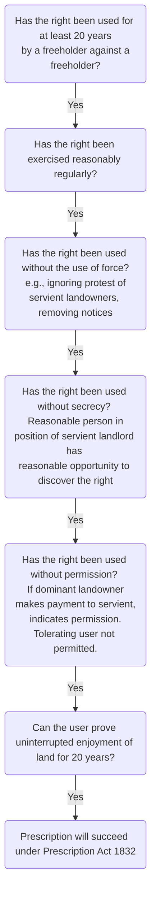
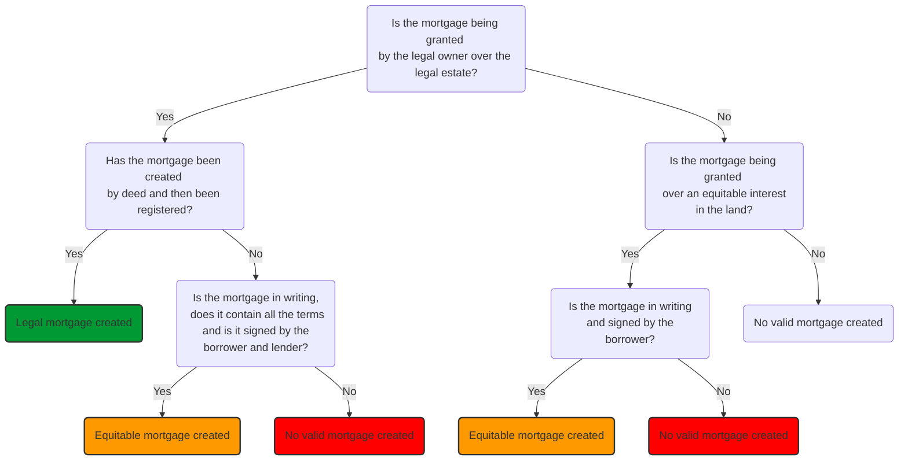
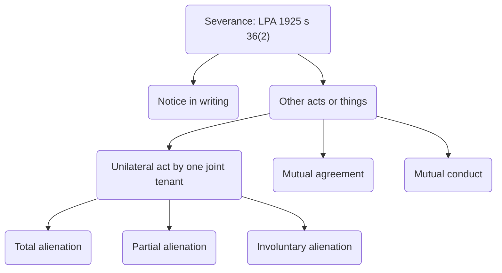

# MERMAID

```mermaid
graph TD

id1(Has the right been used for at least 20 years<br/> by a freeholder against a freeholder?)
id1 -->|Yes| id2(Has the right been exercised reasonably regularly?)
id2 -->|Yes| id3(Has the right been used without the use of force?<br/> e.g., ignoring protest of servient landowners, removing notices)
id3 -->|Yes|id4(Has the right been used without secrecy? <br/> Reasonable person in position of servient landlord has <br/>reasonable opportunity to discover the right)
id4 -->|Yes|id5(Has the right been used without permission? <br/> If dominant landowner makes payment to servient,<br/> indicates permission. Tolerating user not permitted.)
id5 -->|Yes|id6(Can the user prove uninterrupted enjoyment of land for 20 years?)
id6 -->|Yes|id7(Prescription will succeed under Prescription Act 1832)
```

```mermaid
graph TD

id1(Is the mortgage being granted <br/>by the legal owner over the legal estate?)
id2.1(Has the mortgage been created <br/>by deed and then been registered?)
id2.2(Is the mortgage being granted <br/> over an equitable interest in the land?)

id1 -->|Yes| id2.1
id1 -->|No| id2.2

id3.1(Legal mortgage created)
id3.2(Is the mortgage in writing,<br/> does it contain all the terms<br/> and is it signed by the borrower and lender?)

id2.1 -->|Yes| id3.1
id2.1 -->|No| id3.2

id4.1(Equitable mortgage created)
id4.2(No valid mortgage created)

id3.2 -->|Yes| id4.1
id3.2 -->|No| id4.2

id5.1(Is the mortgage in writing<br/> and signed by the borrower?)
id5.2(No valid mortgage created)

id2.2 -->|Yes| id5.1
id2.2 -->|No| id5.2

id6.1(Equitable mortgage created)
id6.2(No valid mortgage created)

id5.1 -->|Yes| id6.1
id5.1 -->|No| id6.2

classDef red fill:#ff0000,stroke:#333,stroke-width:2px;
classDef green fill:#009933,stroke:#333,stroke-width:2px;
classDef yellow fill:#ff9900,stroke:#333,stroke-width:2px;

class id3.1 green
class id4.1,id6.1 yellow
class id4.2,id6.2 red
```

```mermaid
graph TD

id1("Severance: LPA 1925 s 36(2)") -->id2.1(Notice in writing) & id2.2(Other acts or things)
id2.2 --> id3.1(Unilateral act by one joint tenant) & id3.2(Mutual agreement) & id3.3(Mutual conduct)
id3.1 --> id4.1(Total alienation) & id4.2(Partial alienation) & id4.3(Involuntary alienation)
```
