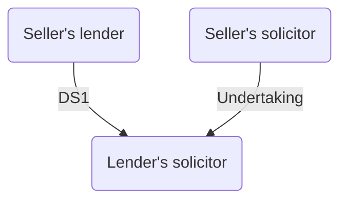
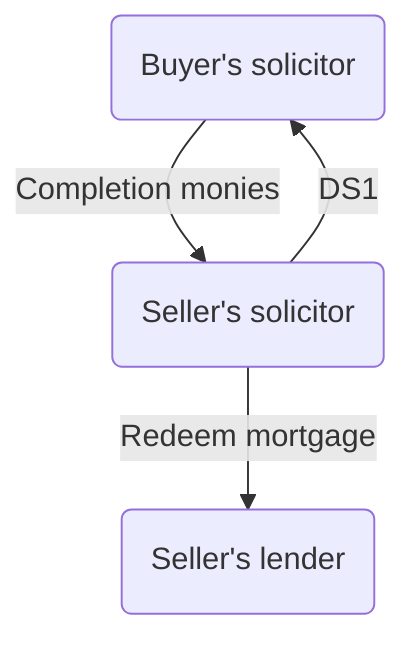

# Completion

## Effect

For registered land, title does not pass to the buyer until the buyer becomes registered at the Land Registry as proprietor of the land. On completion, the contract merges with the transfer deed in so far as the contract and transfer deed cover the same ground.

So generally it is not possible to bring a claim arising out of one of the terms of the contract unless the provision has been expressly preserved by a term of the contract. Contract usually contains a non-merger clause (SCPC 10.4) preserving the right to sue on the contract even though completion has taken place.

## Date of Completion

Agreed between the parties' solicitors shortly before exchange of contracts. May have to be synchronised in a chain.

### Standard Conditions

SCPC 9.1: in the absence of express agreement, completion takes place on the 20th working day after exchange. Time is not "of the essence" (so the completion date is just a warranty, not a condition). Breach of the completion date will activate the compensation provisions in SCPC 10.3.

Very unusual to make time of the essence (e.g., what if there is a postal delay).

## Time of Completion

In a linked sale and purchase, the sale must be completed before the purchase (so there are sufficient funds), and there must be a sufficient interval between the two to allow the money received from the sale to be transferred to and used in the purchase transaction. Generally, everything should happen between 10am and 3pm because of restrictions on banking hours. Completion time later than 2.30pm inadvisable.

### Standard Conditions

SCPC 9.12: if completion does not take place by 2pm on the day of completion, interest for late completion becomes payable (completion deemed to have taken place on the next working day). Noncompliance with this condition is a deemed late completion which invokes the compensation provisions of SCPC 10.3, requiring payment of compensation at the contractual interest rate for the delay.

SCPC 9.1.2 does not apply where sale is with vacant possession and the seller has not vacated the property by 2pm on the day of actual completion.

## Place of Completion

SCPC 9.2: completion is to take place in England and Wales, either at the seller’s solicitor’s office or at some other place which the seller reasonably specifies. If not at the seller's solicitor's office, give buyer's solicitor sufficient notice. For a chain transaction, might be helpful to have all the solicitors meet at one place.

Completion can be effected by post, which is especially common in residential transactions, using Law Society's Code for Completion by Post.

## Money

### Method of Payment

SCPC 9.7: payment is to be made only by a direct transfer of cleared funds and an unconditional release of a deposit held by a stakeholder.

Electronic bank transfer known as “telegraphic transfer”. The seller's bank should be asked to phone the seller's solicitor to inform them of the receipt of the funds immediately on arrival.

- Cleared funds
	- Payment of completion money should only be made from cleared funds in client account. Recall solicitor's accounts.
- Discharge of seller's mortgage
	- Often discharged immediately after completion by sending part of the proceeds of sale to the lender's solicitor/ having lender's solicitor receive the full sum, and transferring the balance.
- Release of deposit
	- If held as stakeholder, the buyer's solicitor should provide the seller's solicitor with a written release addressed to the stakeholder, authorising payment of the deposit to the seller.
	- If held by the seller's solicitor as stakeholder, no written release needed.

## Completion in Person

Process:

- Appointment for completion fixed
- Balance of purchase price transferred to seller's solicitor.
- Take to completion:
	- Contract
	- Evidence of title
	- Copy of approved draft transfer deed and any other document to be executed by the seller
	- Replies to the Request for Completion Information
	- Completion checklist and completion statement.
	- Any documents to be handed over to the seller's solicitor on completion.
- Title documents
	- Planning consents, building regulation approvals and indemnity insurance policies in relation to title defects
- Transfer deed
	- Should be dated at completion after being checked by the buyer's solicitor.
- Schedule of deeds and documents
	- Two copies prepared, one to be signed by the seller's solicitor.
- Inspection of receipts
	- May be necessary to inspect receipts, e.g., for utility bills to be apportioned.  
- Chattels
	- Receipt of money paid for the items signed by seller's solicitor and handed to buyer's solicitor.
- Discharge of seller's mortgage
	- Will have been agreed between parties at the Request for Completion Information stage.
	- If the mortgage is a first mortgage of a property, parties may have agreed to permit the seller to discharge the mortgage after actual completion.
	- Seller's lender's solicitor should hand buyer's solicitor on completion an undertaking (Law Society wording) to discharge the mortgage and forward Form DS1 to the buyer's solicitor as soon as it is received from the lender.
	- Undertaking should only be accepted from a solicitor or licenced conveyor.

Law Society wording:

> In consideration of you today completing the purchase of [insert description of property] we hereby undertake forthwith to pay over to [insert name of lender] the money required to discharge the mortgage/legal charge dated [insert date of charge] and to forward the receipted mortgage/Form DS1 to you as soon as it is received by us from [insert name of lender].

```ad-note
Above wording should be amended if ED or e-DS1 system is used. 
```

Although acceptance of such an undertaking is not entirely risk-free, it is not negligent to rely on such undertakings except in “exceptional circumstances” ([[Pat el v Daybells  
[2001] EWCA Civ 1229]]).

### CLLS Protocol

Intended for use in commercial property transactions and high value residential transactions where the seller's lenders will be releasing the property from its charge and the buyer has a lender taking a first legal charge over the property.

Prior to completion,

1. DS1 executed by the outgoing lender to be obtained and held undated by either the seller’s solicitors or the outgoing lender’s solicitors.
2. Undertaking to be given by the seller’s solicitors to the seller’s lender’s solicitors to forward the funds needed to redeem the mortgage immediately after completion. The amount needed to redeem the mortgage will have been agreed with the seller’s lender’s solicitors.

At completion, the buyer’s solicitors would release the completion monies to the seller, and the seller’s solicitors (or seller’s lender’s solicitors) would release the DS1 to the buyer. The seller’s solicitors can then redeem the seller’s mortgage using the completion monies, and the buyer’s solicitors (if in personal attendance) are immediately in receipt of the DS1.

BEFORE:



AFTER:



### Copy Documents

There are cases in which the buyer is entitled to have only a copy of a document relating to the seller's title (e.g., purchases from PRs, who are entitled to retain the original grant). Buyer's solicitor should check the copy is the same as the original, and then mark it as such. If a certified copy is needed, ask the solicitor to write:

> I certify this to be a true copy of the [insert type of document] dated [insert date of document being certified] signed [signature of solicitor] and dated [insert date of certification].

## Postal Completion

### Law Society's Code for Completion by Post

Any variations should be agreed in writing before completion. Written instructions should be sent from the buyer's solicitor to the seller's solicitor. Money sent by electronic transfer to arrive in time for completion at the agreed time.

Seller's solicitor will act as the buyer's solicitor's **agent** for the purposes of carrying out the completion procedure. Seller's solicitor must carry out the buyer's instructions and effect completion on his behalf. Immediately phone or email the buyer's solicitor to tell them completion has taken place, and post documents which the buyer is entitled to receive on completion to the buyer (first-class/ DX).

## Telephone Completion

CLLS Protocol can be adopted, or partly adopted by the parties.

- Executed DS1 will already be held by the seller's solicitors (or the solicitors of their lender) by the time of completion.
- DS1 released to buyer in return for the release of completion monies (sent in advance to the seller's solicitor and held to the order of the buyer's solicitor).
- Parties agree to date all relevant documentation during phone calls.
- Seller's solicitor undertakes to send TR1, title deeds and DS1 to buyer's solicitor.

## Lender's Requirements

If the buyer's solicitor is acting for the buyer's lender, they should check the lender's requirements for completion when preparing checklist and making arrangements for completion.
