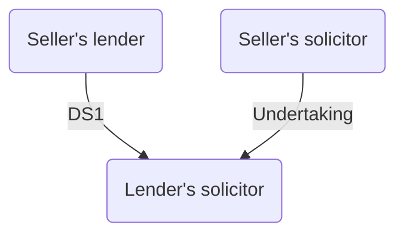
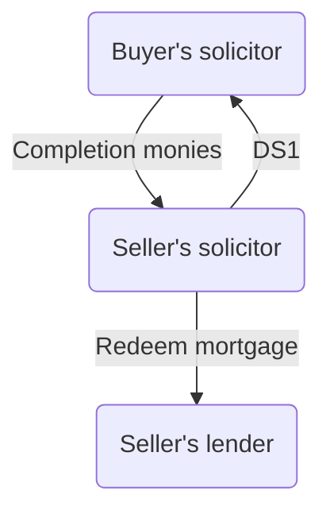

# MERMAID

```mermaid
graph TD
id1("Seller's lender") --> |DS1| id2("Lender's solicitor")
id3("Seller's solicitor") --> |Undertaking| id2
```

```mermaid
graph TD

id1(Buyer's solicitor) --> |Completion monies| id2(Seller's solicitor)
id2 --> |DS1| id1
id2 --> |Redeem mortgage| id3(Seller's lender)
```
