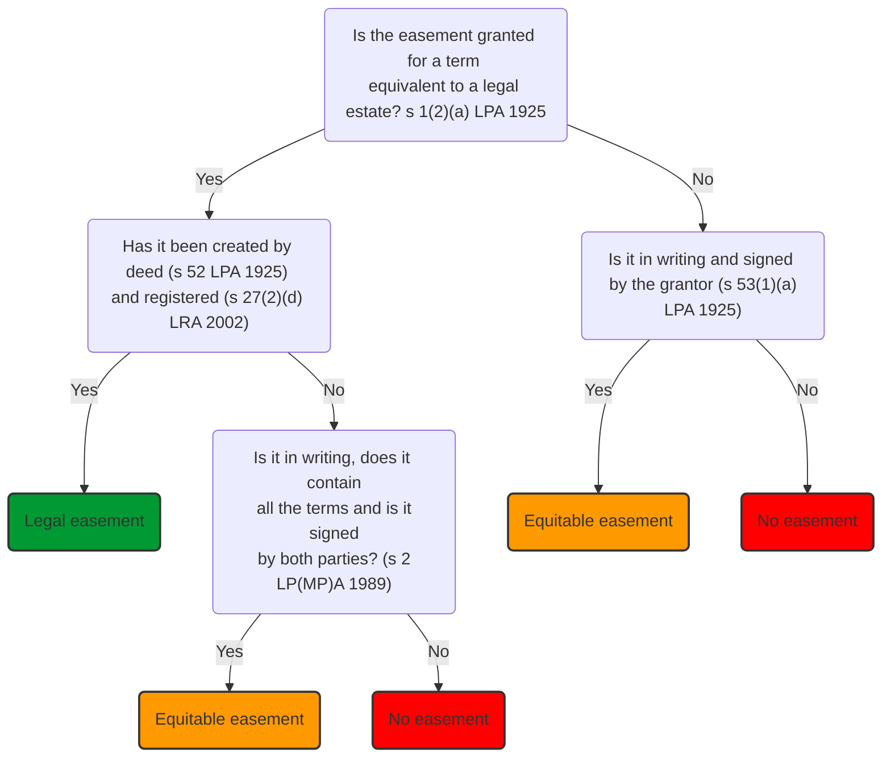

Recall that an easement can be acquired expressly, impliedly or by prescription.

# Express Acquisition

Most [[easements]], whether grants or reservations, are created expressly. They commonly arise when land is sold or leased, and are set out in writing in the transfer deed or lease. [[Easements]] can also be expressly created as part of a separate deal, independent of a transfer or lease.

Easements are very powerful proprietary rights. The fact that they exist necessarily affects the value and amenity of both the dominant and servient land.

> [!example]
> The existence of a right of way adds value to the dominant land by enhancing accessibility; but the same right adversely affects the servient land. The servient owner cannot build over the route of the right of way, and cannot block it. That will affect the value and amenity of the servient land.

Easements are capable of being legal [[interests in land]]:

> [!statute] [s 1(2) LPA 1925](https://www.legislation.gov.uk/ukpga/Geo5/15-16/20/section/1)
> 
> ‘The only interests or charges in or over land which are capable of being created or subsisting at law are:
> (a) An easement…for an interest equivalent to an estate in fee simple absolute in possession or a term of years absolute’

Therefore, an easement granted or reserved potentially forever can be legal, and an easement granted or reserved for a set period can be legal.

> [!example] Example: legal easement
> 
> A owns a large piece of freehold land which adjoins a main road. A sells part of the freehold land to B. In the transfer deed, A grants B a right of way across the driveway on A’s retained land. There is no time limit to the easement. As it is granted for the benefit of B’s freehold land it is deemed to be granted for the equivalent of the freehold estate and potentially legal as it fits the definition in LPA 1925, s 1(2)(a).

> [!example] Example: legal easement
> 
> A owns a large piece of freehold land which adjoins a main road. A grants a ten-year lease of part of the land to B. In the lease, A grants B a right of way across the driveway on A’s retained land. This right is deemed to be granted for the equivalent of the leasehold term and potentially legal as it fits the definition in LPA 1925, s 1(2)(a).

An easement for a period which is not forever and is not a set term can only ever be equitable:

> [!statute] [s 1(3) LPA 1925](https://www.legislation.gov.uk/ukpga/Geo5/15-16/20/section/1)
> 
> ‘All other estates, interests, and charges in or over land take effect as equitable interests.’

> [!example] Example: equitable easement
> 
> A owns a large piece of freehold land which adjoins a main road. A sells part of it to B. B intends to construct a parking area on B’s land. In the transfer deed, A grants B a right to park two cars on A’s retained land until six months after B obtains planning permission for alternative parking on B’s land. The parking right is granted for a term that is neither forever or for a set period of time. It does not fit the definition in LPA 1925, s 1(2)(a) and can only ever be an equitable easement.

## Express Legal Easement Formalities

All expressly granted legal interests must be created by deed: [s 52 LPA 1925](https://www.legislation.gov.uk/ukpga/Geo5/15-16/20/section/52).

To be a deed, a document must comply with the formalities in [s 1 LP(MP)A 1989](https://www.legislation.gov.uk/ukpga/1989/34/section/1):

- Must be clear it is intended to be a deed
- Signed by grantor and witnessed
- Delivered /dated

The easement must be substantively registered at the Land Registry to be legal: [s 27(2)(d) LRA 2002](https://www.legislation.gov.uk/ukpga/2002/9/section/27).

Once this is done, the benefit of the easement is noted on the Property Register of the dominant land’s title and the burden is noted in the Charges register of the servient land’s title. If any formalities or registration requirements are not met, the easement may be recognised as an equitable easement.

## Express Equitable Easement Formalities

Easements which fall within the definition of legal easements in [s 1(2)(a) LPA 1925](https://www.legislation.gov.uk/ukpga/Geo5/15-16/20/section/1) but have not been created correctly may be recognised in [[equity]] as estate contracts. This means that equity may interpret the failed legal transaction as an enforceable contract to create an equitable easement.

To be interpreted this way, the failed legal easement must comply with the formalities for an estate contract set out in [s 2 LP(MP)A 1989](https://www.legislation.gov.uk/ukpga/1989/34/section/2):

- Must be made in writing
- Must include all expressly agreed terms
- Must be signed by both parties

No substantive registration is needed for an equitable easement to exist.

Easements which do not fall within the definition of legal easements in LPA 1925, s 1(2)(a) because they are not granted or reserved for a freehold or leasehold term can only be equitable. These can be described as ‘inherently equitable’ easements. This type of equitable easement is much less formally created. The minimum formalities are set out in [s 53(1)(a) LPA 1925](https://www.legislation.gov.uk/ukpga/Geo5/15-16/20/section/53):

- Must be made in writing
- Must be signed by the grantor.

# Implied Acquisition

## Necessity

### Context

In circumstances where someone has not acquired an easement expressly, it may be possible for him to rely upon the easement having been impliedly acquired. There are four methods of implied acquisition, one of which is necessity.

This method of implied acquisition is available where someone is claiming to have been **granted** an easement impliedly, based on the doctrine of non-derogation from grant (i.e. when a seller or landlord transfers an estate / grants a lease yet withholds the easements necessary to make that grant effective). It is also theoretically possible, though rare, to find that an easement has been impliedly **reserved** by necessity for the benefit of the land that the seller or landlord is retaining.

The easement may be implied into a document from which it was omitted, either a transfer or a lease.

### Scope

This method is of **very narrow scope.**

> [!important]
> An easement will be implied by necessity where it can be shown that its existence is essential in order that any use of the dominant tenement can be made. It is not enough that the right in question merely adds to the enjoyment of the dominant tenement. The only type of easement which can be implied this way is a right of way to otherwise landlocked land. Without a right of way, the land cannot be accessed at all. Any other rights merely enhance the use of the land; they are not essential to it.

> “An easement of necessity is an easement without which the property cannot be used at all, and not merely necessary to the reasonable enjoyment of the property.”  
> Stirling J in [[Union Lighterage Company v London Graving Dock Company [1902] 2 Ch 557]]

Other cases:

| Case                                                                   | Ratio                                                                                                                          |
| ---------------------------------------------------------------------- | ------------------------------------------------------------------------------------------------------------------------------ |
| [[Manjang v Drammeh (1991) 61 P. & C.R. 194]]                          | Necessity will fail if there is alternative access, even if inconvenient/ difficult.                                           |
| [[Pryce v McGuinness [1966] Qd R 591]]                                 | Necessity will fail for easements which are not a right of way.                                                                |
| [[Adealon International Property Ltd v Merton BC [2007] EWCA Civ 362]] | Necessity will fail if it is possible that a third party could grant a right of way over their neighbouring land to the buyer. |
| [[Sweet v Sommer [2005] EWCA Civ 227]]                                 | Right of way in vehicle can be implied by necessity, even if a right of way on foot already exists (this case represented a potentially widening scope of necessity).                                                                                                                          |

## Common Intention

### Context

Easements can be implied into a transfer or lease to give effect to the common intention of the parties, even though the easement is not absolutely necessary for the enjoyment of the land.

This method of implied acquisition is available where someone is claiming to have been granted an easement impliedly. It is also possible, though rarer, to find that an easement has been impliedly reserved by common intention for the benefit of the land that the seller/lessor is retaining.

The easement may be implied into a document from which it was omitted, either a transfer or a lease.

### Scope

This method has a narrow scope.

> [!test] Common intention
> 
> An easement will be implied by common intention where 
> 1. Land is sold or leased for a particular purpose
> 2. The purpose is known to both parties
> 3. The easement is essential to achieve the common purpose.

An easement may also be implied by the common intention of the parties when it is necessary for the enjoyment of some expressly granted easement. For example, a right to park in a parking space usually also requires a right of way to enable the holder of the right to reach the parking space.

Key case: [[Wong v Beaumont Property Trust Ltd [1965] 1 QB 173]]. See also [[Stafford v Lee (1993) 65 P. & C.R. 172]]

#### Common Intention

The parties must have had a specific intention that the land was to be used for a certain purpose, in circumstances where a court is satisfied that the easement claimed is necessary to achieve that specific intention.

A general intention as to how the property should be used is not enough; the parties must intend for the property to be used in some definite and particular manner: [[Pwllbach Colliery Co Ltd v Woodman (1915)]].

In [[Donovan v Rana [2014] EWCA Civ 99]] an easement to provide services such as electricity and sewerage was implied where the common intention of the parties was that the plot in question was purchased as a building plot and would be developed as such. The plot had been sold with the benefit of planning permission for a single dwelling, which was enough to show common intention.

#### Reservations

In [[Wong v Beaumont Property Trust Ltd [1965] 1 QB 173]] the easement was implied into the original lease as a grant by the landlord to the tenant. The court also said that the method could be used to imply a reservation in favour of the original seller or landlord.

In a situation where a seller or landlord wishes to rely upon an easement having been impliedly reserved by common intention, there is a heavy burden of proof to show that the specific easement was mutually intended. It would not be enough to show that the seller or landlord had openly exercised the right prior to the first transaction.

In [[Yeung v Patel [2014] EWCA Civ 481]] the Court of Appeal refused to extend an express reservation relating to renewal of gas pipes across the servient land to include laying new pipes, because the claimant landlord had had two opportunities to reserve this expressly, in the original lease and in a later deed of variation of that lease.

### Status

| Type of easement           | Cases                                                                                                                                                                                |
| -------------------------- | ------------------------------------------------------------------------------------------------------------------------------------------------------------------------------------ |
| Implied legal easement     | An easement which is implied into a transfer deed or a legal lease is an implied legal easement as the easement takes its status from the status of the document it is implied into. |
| Implied equitable easement | If the easement were implied into a contract or an equitable lease it is an implied equitable easement. If the easement is implied into a lease it will come to an end when the lease comes to an end; if it is implied into a transfer deed, then the easement will last along with the freehold.                                                                                                                                                                                     |

If the tenant acquired an equitable lease (arising by reason of the specifically enforceable contract to grant a lease: [[R v Tower Hamlets LBC ex parte Von Goetz [1999] QB 1019]]), any easements implied into that lease would be equitable.

## Wheeldon V Burrows

### Context

This method of implied acquisition is available where someone is claiming to have been **granted** an easement impliedly. It is **not** possible for an easement to have been impliedly **reserved** by the rule in Wheeldon v Burrows. The easement may be implied into a document from which it was omitted, either a transfer, lease or contract.

### Rule

> On the grant by the owner of a tenement or part of that tenement as it is then used or enjoyed, there will pass to the grantee all those continuous and apparent easements (by which, of course, I mean quasi-easements), or, in other words, all those easements which are necessary to the reasonable enjoyment of the property granted, and which have been and are at the time of the grant used by the owners of the entirety for the benefit of the part granted.  
> Thesinger LJ in [[Wheeldon v Burrows (1879) 12 Ch. D. 31]]

Requirements:

- Only applies where the right being claimed would have been a **grant** to the claimant.
- The right must have been enjoyed as a **quasi-easement** by the seller or the landlord before the land was divided.
	- The rule can only operate on a sale or lease of part when, immediately prior to the transfer or lease, there was a **common owner and occupier** of the whole.
	- As soon as there is a division of ownership and occupation of the land, any ‘quasi-easements’ that existed at the time of the division can become full easements benefiting the land which has now become the dominant tenement, provided the requirements under this rule are met.
- The quasi-easement must have been ‘**continuous and apparent**’.
	- Both elements must be satisfied
	- To be continuous, the right need not have been enjoyed constantly or incessantly, but there must be some degree of permanence. The right must not have been transitory or intermittent.
	- To be apparent, there must be some clue as to the existence of the right from a careful inspection of the land. An easement cannot be seen – it is an intangible right – but there can be evidence on the land that it exists, for example a track or a drain cover.
- The quasi-easement must be **necessary** for the reasonable enjoyment of the dominant land.
	- This test is met if the right enhances the land in some way: the right is necessary for the convenient and comfortable enjoyment of the land.
	- This seems to be a fairly easy test to satisfy, being much less strict than the tests for easements implied by necessity and the common intention of the parties.
	- e.g., [[Wheeler v JJ Saunders Ltd [1995] 3 WLR 466]]
- The quasi-easement must be **in use by the common owner** at the date of the transfer or lease of the dominant land.
	- This means it must have been enjoyed as a quasi-easement by the seller or the landlord before the land was divided, at the time of the transfer or lease of the dominant land.
	- This is a matter of fact. It does not mean that the right being claimed as an easement must have been in use immediately prior to the sale or lease of what is to become the dominant land, but it must be shown to have been enjoyed in the recent past, and that it is expected to be used again in the near future.

Since the operation of the rule in Wheeldon v Burrows can lead to easements being created without the parties involved having given due regard to them, in practice the rule in Wheeldon v Burrows is commonly expressly excluded from the relevant transfer, contract, or lease.

> [!example]
> A seller owns two fields and uses an access road across one field to gain access to the other field from the road. There is common ownership and a quasi-easement.
> 
> The seller sells/leases the dominant land without granting an express easement to the dominant owner to use the access road. The dominant land is not landlocked, it has a less convenient route to the road.
> 
> The right to use the access is continuous and apparent, necessary for the reasonable enjoyment of the dominant land and in use by the common owner at the date of the transfer/lease. The Dominant land has an implied easement over the main access running across the servient land.
> 
> Note that the rule would also operate if the common owner sold the servient land to A and the dominant land to B contemporaneously.

### Status

| Type of easement           | Cases                                                                                                                                                                                |
| -------------------------- | ------------------------------------------------------------------------------------------------------------------------------------------------------------------------------------ |
| Implied legal easement     | An easement which is implied into a transfer deed or a legal lease is an implied legal easement as the easement takes its status from the status of the document it is implied into. |
| Implied equitable easement | If the easement were implied into a contract or an equitable lease it is an implied equitable easement. If the easement is implied into a lease it will come to an end when the lease comes to an end; if it is implied into a transfer deed, then the easement will last along with the freehold.                                                                                                                                                                                     |

## S 62 LPA 1925

### Context

In circumstances where someone has not acquired an easement expressly, it may be possible for him to rely upon the easement having been impliedly acquired. There are four methods of implied acquisition, one of which is via the LPA 1925, s 62.

This method of implied acquisition is available where someone is claiming to have been **granted** an easement impliedly; it is **not** possible for an easement to have been impliedly **reserved** by the LPA 1925, s 62. It will only imply an easement into a **conveyance** (i.e., a deed), not into a contract.

> [!statute] [s 62 LPA 1925](https://www.legislation.gov.uk/ukpga/Geo5/15-16/20/section/62)
> 
> “a conveyance of land includes all easements, rights and advantages enjoyed with that land.”

### Traditional Interpretation

The traditional or ‘ordinary’ interpretation of this statutory provision is that it is a word-saving provision. It ensures that when someone buys freehold land or leases land, the buyer or tenant will receive the benefit of (amongst other things) all existing easements which affect that land, whether they have been expressly or impliedly granted.

### Upgrade Effect

Using what could be termed the ‘upgrade’ effect, the LPA 1925, s 62 has also been given a much wider function: it has been interpreted as a method by which a brand-new easement can be implied into a document.

This may well be an unintended effect of the original draftsmen, but it has nevertheless become a recognised method of acquiring an easement impliedly. It is known by some as the ‘upgrade’ method because it operates to ‘upgrade’ informal rights into full legal easements.

Key case: [[Wright v Macadam [1949] 2 kb 744]].

### Requirements

- Only applies where the right being claimed would have been a grant to the claimant.
- There must have been prior diversity of occupation of the dominant and servient land
- An informal permission or licence must have been granted to the occupier of the dominant tenement to use the servient land in some way.
- There must have been a conveyance (i.e., a transfer by deed or a legal lease) of the dominant tenement.

The last three requirements are sequential, so there must firstly have been prior diversity of the two pieces of land, followed by an informal permission being granted, followed by a conveyance of the dominant tenement.

### Explanation

This interpretation of the statute is of course controversial and the operation of the LPA 1925, s 62 in this respect is excluded as a matter of routine in property deals, to avoid any unintended consequences.

The requirement of prior diversity of occupation under the LPA 1925, s 62 was for many years thought to be a prerequisite for this method of implied acquisition.

However, more recent cases of [[P&S Platt v Crouch [2003] EWCA Civ 1110]] and [[Wood v Waddington [2015] EWCA Civ 538]] have held that the requirement for prior diversity of occupation of the dominant and servient land is not necessary where the right is **continuous and apparent**.

“Continuous and apparent” means that the right must have been **exercised recently and regularly,** and there must be some expectation that it will be used regularly in the future. And there must be some **physical evidence** of the exercise of the right – such as a track for a right of way; or a manhole cover for a right of drainage.

These cases have therefore applied LPA 1925, s 62 to a different set of circumstances.

> [!tip]
> So the upgrade effect operates in two circumstances:
> 1. When there is prior diversity of occupation, in other words landlord and tenant situations like in [[Wright v Macadam [1949] 2 kb 744]]. In these cases, the easement is implied when the lease has expired and the land is re-let to the same tenant; or to a different tenant; or may even be sold to the same or a different owner.
> 2. It also applies to quasi-easement situations like [[P&S Platt v Crouch [2003] EWCA Civ 1110]] to imply the easement into the first lease or transfer deed. The right must be continuous and apparent.

### Status

The rule from the LPA 1925, s 62 will only imply easements into conveyances, i.e. a transfer by deed or a legal lease. An easement which is implied into a transfer deed or a legal lease is an implied legal easement as the easement takes its status from the status of the document it is implied into. Therefore, all easements implied by the LPA 1925, s 62 are implied legal easements.

If the easement is implied into a lease it will come to an end when the lease comes to an end; if it is implied into a transfer deed, then the easement will last along with the freehold. The rule in the LPA 1925, s 62 will not imply an easement into a contract, in other words it will not imply an equitable easement into a sale contract or equitable lease.

| THE RULE IN WHEELDON V BURROWS | SECTION 62 OF THE LPA 1925 |
| :--- | :--- |
| Operates upon a pre-existing quasi-easement | Operates upon a pre-existing legal right: proprietary or non-proprietary (e.g. a licence) |
| Operates where the land was in single ownership prior to transfer | Operates where either: (1) there was prior diversity of occupation/ownership; or (2) there was no prior diversity of occupation but the right was 'continuous and apparent' (Wood v Waddington (2015)) |
| Operates to create legal as well as equitable easements (i.e. can be used to imply easements into legal conveyances as well as equitable transfers) | Operates to imply and to create legal easements only-applies only to legal conveyances |
| Operates only where the right is 'continuous and apparent' and/or 'reasonably necessary' for the enjoyment of the land | Where there is prior diversity of occupation, operates automatically upon a conveyance of land |
| Operates only as to rights capable of constituting easements under the Re Ellenborough Park (1956) principles | Also only operates as to rights capable of constituting easements under the Re Ellenborough Park (1956) principles |
| The rule can be excluded by express words or by implication | Section 62 can also be excluded by express words or by implication |
| Operates only by means of implied grant and not by implied reservation | Also only operates by means of implied grant and not by implied reservation |

## Bevan

What is the rationale for the implication of easements? Hopkins argues that the underlying logic is the principle of non-derogation from grant (a grantor shouldn't be able to take away what has been given). The four methods can also be said to respond to the intentions of the parties in varying degrees. Finally, on policy grounds, easements are implied so that the utility and value of the land in question is not stymied.

### Necessity

“An easement of necessity… means an easement without which the property retained cannot be used at all, and not merely necessary to the reasonable enjoyment of the property” – Stirling J in [[Union Lighterage Company v London Graving Dock Company [1902] 2 Ch 557]].

In [[Manjang v Drammeh (1991) 61 P. & C.R. 194]] a court refused to imply an easement of necessity as the claimant was able to access its land via boat along a river. In [[Re MRA Engineering (1988)]] the court refused to imply an easement to permit vehicular access to land where land could be reached on foot. However, the test was applied slightly less stringently in [[Sweet v Sommer [2005] EWCA Civ 227]].

This was an important decision in several respects:

1. More liberal approach to what constitutes necessity. It seems that a right of way can be impliedly reserved even in circumstances where the land in question is not entirely inaccessible.
2. The court has shown itself prepared to accept that land inaccessible to vehicles is not capable of meaningful use, even where other routes of access are theoretically possible.
3. One of only a small number of examples of implied reservation of an easement by necessity.

The [[Court of Appeal]] in [[Adealon International Property Ltd v Merton BC [2007] EWCA Civ 362]] accepted that easements of necessity arise from the intention of parties rather than public policy grounds. Consequences:

1. An easement of necessity will not arise from adverse possession or from a case of compulsory purchase
2. If there is evidence of a contrary intention, then this must be weighed as part of the court's assessment and will surely prevent the implication of an easement by necessity

### Common Intention

Lord Parker in [[Pwllbach Colliery v Woodman [1915] AC 63]] identified two circumstances when an easement might be implied to give effect to a common intention.

1. Where it is necessary for the enjoyment of a right that has been expressly granted
	1. In Pwllbach, where a right to draw water from a spring was expressly granted, an easement of common intention might be implied to allow the grantee of the right to access the land to draw that water.
2. Where it is necessary for the dominant landowner to make use of the land for a definite particular purpose, where the land was sold for that stated purpose.
	1. In [[Wong v Beaumont Property Trust Ltd [1965] 1 QB 173]], Mr Wong was permitted to erect a ventilation duct to comply with the terms of the lease – for the purposes of running a restaurant.

The question of what is required for a claim to an implied easement of common intention was revisited in [[Stafford v Lee (1993) 65 P. & C.R. 172]]. The existence of a common intention was to be determined 'on the balance of probabilities' and certainty was not required.

So the law can be summarised as:

> [!test] Common intention (Stafford v Lee)
> An easement of common intention will be implied where, on the balance of probabilities and considering all the circumstances of the case, 
> - there is evidence of a common intention between the parties that the land was to be put to some definite and particular use or purpose, and 
> - an easement is necessary to give effect to that stated use or purpose. 

This criterion was applied in [[Donovan v Rana [2014] EWCA Civ 99]], where the Ranas were allowed to dig up land to install and connect utilities to the main services, which was implied by the sale of land for the purposes of residential development.

### Wheeldon V Burrows

The rule applies in circumstances where an individual is selling or leasing part of their own land. If the conditions are met, an easement will be implied into the conveyance and the purchaser or tenant will enjoy a right benefitting the land. The rule only operates to grant easements.

Where an individual conveys their own land to another, there will be implied into that conveyance the grant of all quasi-easements exercised by the seller/ landlord prior to the transfer.

Where the quasi-easement was not in use at the time of the transfer, the rule in *Wheeldon v Burrows* cannot apply ([[Alford v Hanaford (2011)]]). It is unclear whether the quasi-easement needs to be continuous and apparent, **and** necessary for the reasonable enjoyment of the dominant land, or just one of these. The judicial weight leans towards far less emphasis on the continuous and apparent requirement. So best is to consider all three requirements and acknowledge the continuing uncertainty that surrounds the relationship between the three elements of Thesiger's test.

- Continuous derives from the French Civil Code and requires an obvious and permanent alteration to the land, as apposed to repeated, continuous use of the land. So take the word continuous as connoting that the quasi-easement is available for exercise if and when it is needed
- For a right to be apparent it must be discoverable on a reasonably careful inspection of the land ([[Pyer v Carter (1857)]]). This will be satisfied by evidence of a visible, physical, non-transitory feature on the land such as a pathway or road surface.
- 'Reasonably necessary' is not a strict test of necessity (*Millman*). But the precise scope of this requirement is not always easy to identify.

### S 62

This has been interpreted so as to elevate, convert, or transform pre-existing lesser rights exercised over the land into fully effective legal easements. Key case: [[Wright v Macadam [1949] 2 kb 744]]. The judgment made several points:

- The right to use the coal shed was a right capable of existing as an easement
- There was no evidence that the parties intended the right of storage to be temporary in duration
- The parties had not expressed an intention in the 1943 tenancy agreement that the operation of s 62 be excluded.

s 62 also operates to convert pre-existing licences into fully effective easements in circumstances where an existing tenant purchases the freehold from her landlord ([[International Tea Stores Co v Hobbs (1903)]]).

This effect has proved controversial and its abolition has been recommended by the Law Commission.

 Conditions attached:

 - There must be a legal conveyance of land
	 - There must be a grant or transfer of a legal estate or legal mortgage by deed (s 205(1)(ii) LPA 1925)
 - Only rights capable of constituting easements will be converted into easements
	 - Even where the right is capable of constituting an easement, it will not pass where it is expressed to be personally for the benefit of an individual or where it is temporary or precarious in nature ([[Green v Ashco Horticulturist Ltd (1966)]])
	 - So in [[Goldberg v Edwards (1950)]] while a right of access through a house did pass under s 62, further rights (including the right to install advertising signage, a bell and letterbox) were held to be mere personal favours and not falling within the purview of s 62
 - Only rights exercised at the time of the conveyance will be converted into easements
	 - "Section 62 was apt for conveying existing rights, but did not resurrect mere memories of past rights" - Megarry V-C in [[Penn v Wilkins (1974) 236 E.G. 203]]
	 - The burden rests on the party claiming their right has been transformed to adduce evidence that it was in use prior to the conveyance
 - s 62 must not have been expressly or impliedly excluded
	 - s 62 will not apply if expressly excluded within the terms of the conveyance (s 62(4)).
	 - s 62 will not apply if it has been impliedly excluded having regard to all the circumstances of the case ([[Hair v Gillman]]).
	 - Reference to specific easements which were to be granted upon conveyance was insufficient to exclude the wider operation of s 62 ([[Wood v Waddington [2015] EWCA Civ 538]]).
 - Where there is no prior diversity of occupation or ownership, exercise of the right claimed to be an easement must have been continuous and apparent ([[P&S Platt v Crouch [2003] EWCA Civ 1110]], affirmed in [[Wood v Waddington [2015] EWCA Civ 538]]).
	 - Provided there is a legal conveyance and no contrary intention is expressed ex
	 - cluding the application of s 62, claimants will no longer need to resort to Wheeldon v Burrows, which is much more complicated
