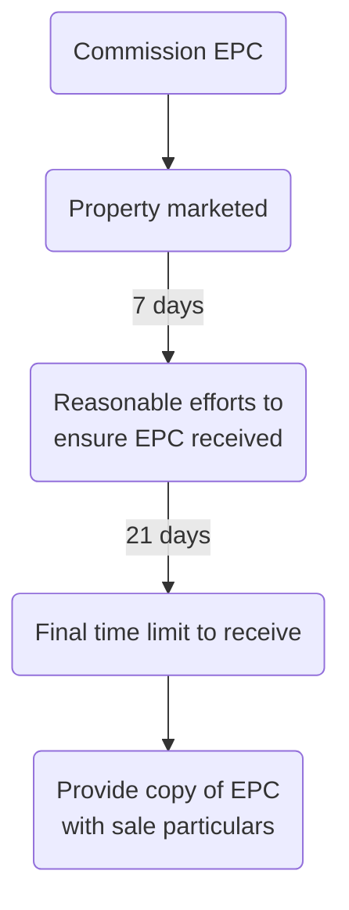

```toc
min_depth: 1
```

# Marketing Property and Instructions

## Energy

### Energy Performance Certificates

Seller will need these to hand at an early stage.

> [!statute]
> EPCs were introduced to comply with the European Energy Performance of Buildings Directive (Directive 2002/91), which has now been revoked and replaced by the Energy Performance of Buildings Directive 2010 (EPB Directive 2010/31/EU). The requirements for EPCs are contained in the Energy Performance of Buildings (England and Wales) Regulations 2012 (SI 2012/3118). 

These require, where a building is to be sold or rented out, that the seller or landlord must make an EPC available free of charge at the earliest opportunity.

The EPC must have been commissioned before the property can be marketed, and there is an obligation to use all reasonable efforts to ensure that it is received within seven days of marketing. If it is not received within the seven days, there is a further 21 days in which to obtain it.



It remains the responsibility of the seller or landlord to ensure that a valid EPC has been given, free of charge, to the person who ultimately becomes the buyer or tenant.

There are financial penalties (enforceable by Trading Standards Officers) for failing to comply with the Regulations.

### Green Deal

The Green Deal was launched in January 2013 and is a government initiative that enables property owners and tenants to carry out a range of energy efficiency measures with no upfront cost.

Repayments are spread over a period of up to 25 years through a separate charge added to the property owner’s electricity bill. The charge (which should not be more than the estimated energy bill savings) is payable by the occupier from time to time, so on a sale and purchase it will transfer to the buyer.

> [!action]
> Ensure that the contract for sale includes an acknowledgement by the buyer that the bill payer at the property is obliged to make payments under the Green Deal plan.

If the seller fails to disclose the existence of a Green Deal plan or obtain the necessary acknowledgment from the buyer, the Secretary of State may (but is not obliged to) cancel the liability of the buyer to make payments under the Green Deal plan and may require the seller to pay compensation.

In July 2015, the Government stopped funding the Green Deal Finance Company, set up to lend money to Green Deal providers, although new applicants may still be able to get Green Deal funding from providers financing the scheme themselves.

### Minimum Energy Efficiency Standard

> [!important]
> From April 2018 it has been unlawful to grant or renew tenancies of buildings that do not have at least a rating of E, the minimum energy efficiency standard (MEES). 

MEES was introduced by the Energy Efficiency (Private Rented Property) (England and Wales) Regulations 2015 (SI 2015/ 962) (the MEES Regulations), which also provide that a landlord cannot continue to let a domestic privately rented (PR) property on or after 1 April 2020, or a non-domestic PR property on or after 1 April 2023, unless the property complies with MEES.

There are certain exemptions, to do with market value, impact on the structure of the property, and the consent of the tenant.

A breach of the MEES Regulations is not a criminal offence. If a landlord lets out a building which does not meet MEES, it may be subject to a fine and/or adverse publicity.

## Purpose of Taking Instructions

> [!tip]
> The purpose of taking instructions is for the solicitor to obtain from their client sufficient information to enable them to carry out the whole of the client’s transaction, not just to enable them to take the first or next step in that transaction.

Unless full instructions are taken, the solicitor is in danger of overlooking matters which are relevant to the transaction but which the client had not thought to mention specifically to them.

### Personal Interview

Where possible, take instructions from the client in person. This allows for rapport, and also it is sensible for money laundering provisions etc.

### Indirect Instructions

Say the estate agent contacts the solicitor with instructions. These must be confirmed directly with the client. Where there is more than one client, direct confirmation of instructions must be obtained from all clients ([[Penn v Bristol and West Building Society and Others [1995] 2 FLR 938]]).

> [!warning]
> A solicitor who acts for a client without authority may be liable to anyone who suffers loss as a result of this under the principle of **breach of warranty of authority**. Under the law of agency, an agent (i.e. the solicitor) is deemed to warrant that they have the authority to act on behalf of their principal (i.e. the client) and is liable for any loss suffered by someone who relies on this.

### Preparing for Interview

See [[Interviewing and Advising]].

- In particular, check whether the firm has acted for the client before, and if so, read the file.
- Do a conflict check before the first interview.
- Use checklists for the interview.
- Obtain evidence of identity asap after first contact with client has been made.

## Acting for Seller

Obtain:

- Full names and addresses of sellers and buyers
- Phone numbers
- Name and address of estate agents
- Name and address of other party's solicitors
- Full address of property being sold
- Tenure
	- Freehold or leasehold
	- Terms of lease
- Price agreed for property sale
- Preliminary deposit paid?
- Fixtures and fittings to remain in property and to be removed
- Enquiries of the seller
	- Where the buyer is a ‘consumer’ (an individual acting for purposes that are wholly or mainly outside that individual’s business) and the seller is a ‘trader’ (anyone acting for purposes relating to that person’s business), the Consumer Protection from Unfair Trading Regulations 2008 (SI 2008/1277) will apply to the transaction.
	- See ‘Consumer Protection Regulations in conveyancing’ practice note (Law Society).
	- The solicitor should make the seller client aware at the outset of the transaction that neither the seller nor the solicitor must mislead the buyer by providing incorrect or ambiguous information, or by omitting to provide material information.
	- Advise that buyer could have redress against seller for incorrect/ misleading information.
	- In commercial transactions, the seller will also be required to reply to enquiries raised by the buyer; a different standard form, the Commercial Property Standard Enquiries.
- Anticipated completion date
- Present use of the property
- Does the transaction attract VAT?
	- More important for commercial property, see [[Property Taxation#VAT]]
- Who is in occupation?
- Synchronisation?
- Any terms agreed between parties?
- Money – all costs of transaction, check there is enough!
- Title deed and documents whereabouts.
- Outstanding mortgages?
	- Needs to be discharged.
- Amount of deposit
	- Customarily 10% of purchase price
- Proceeds of sale
- Capital gains tax.
	- In some circumstances, sale of property will be a disposal for CGT purposes.

## Acting for Buyer

- Use of property
- Money
	- Land registry fees and SDLT (Stamp Duty Land Tax)
	- Source of funds?
		- Solicitor must advise the lender, with the client's authority, if the remainder of funds are not from the buyer's own funds.
		- If client does not give authority, decline to act.
		- Also check money laundering: is it reasonable that the client has the required level of savings?
- Deposit
	- Usually 10%
- Mortgage
	- Some type of mortgage funding usually required
- Survey
	- Caveat emptor
- Situation of the property? Think proximity to rivers etc., any special searches needed
- Insurance
	- Life insurance
	- Building contents insurance
	- Property insurance
- Who is buying?
	- Co-ownership, think about beneficial ownership.
	- Consider conflicts
- Custody of deed
	- Client's instructions in relation to custody of deeds should be obtained
- Client's present property.

For a transaction concerning a newly-constructed property, leasehold or a dealing with only part of seller's property, additional information will be required.

# Finance for Buyer

## Introduction

Check the client has sufficient funds available for the purchase and related expenses.

- Ask when taking instructions
- Ask again just before exchange of contracts.

Secured debt finance considered.

### Arranged Mortgage

If the client has already arranged a mortgage, just check the figures. If the mortgage is a rip-off, suggest the client reconsiders her choice of finance.

### FSMA 2000

If you are carrying out a ‘specified activity’ in relation to a regulated mortgage contract, you must be authorised under the Financial Services and Markets Act 2000 (FSMA 2000).

See [[Professional Conduct and Regulation 1#Financial Services Regulation]].

‘Specified activities’ will include arranging or advising on a regulated mortgage contract,

unless you are arranging the execution of a mortgage chosen independently by the client or on the advice of an authorised person. General advice as to what type of loan to take out will not require authorisation as it will not amount to a ‘specified activity’.

> [!defn] Regulated Mortgage Contract
> A regulated mortgage contract is a contract which meets the following conditions at the time it is entered into:
> 1. the borrower is an individual or a trustee;
> 2. the lender takes a first legal charge over property in the UK; and
> 3. at least 40% of the property is occupied by the borrower or a member of his immediate family, or is intended for their occupation.

If a specified activity is involved, and you are not authorised, need to rely on the 'professional firms exemption'. Allows firms operating under it to arrange or advise on a

regulated mortgage contract, subject to certain conditions, even though they are not authorised by the regulators.

> [!note]
> The ability to ‘advise’ under the
> professional firms' exemption does not include recommending a client to enter into a regulated mortgage contract, except where that advice consists of an endorsement of a recommendation given to the client by an authorised person.

## Sources of Finance

Mortgage finance is available from:

1. banks;
2. building societies;
3. the client’s employer;
4. a private mortgage (eg, a loan from a relative or from a trust fund); and
5. finance houses.

### Banks and Building Societies

Banks have the reputation of being slightly more flexible in the application of their lending criteria and of being more willing to consider unusual property and higher-value loans.

### Client's Employer

Some large company employers (e.g., banks) offer mortgages at concessionary rates to their employees.

### Private Mortgage

A client may sometimes be able to arrange mortgage finance through a loan from a relative or rom a private trust fund. The terms of such a loan are a matter for agreement between the parties involved, which must always be separately advised.

### Finance Houses

- Not generally considered to be a primary source of finance for a client who is seeking a loan for the purchase of property, particularly a residential client.
- May be approached from a second loan
- Affected by [s 58 Consumer Credit Act 1974](https://www.legislation.gov.uk/ukpga/1974/39/section/58) (opportunity for withdrawal from prospective land mortgage)

### Government Schemes

e.g., help to buy.

## Amount of Loan

A residential borrower will typically be asked to provide evidence of salary and details of the number of dependants, debts and household outgoings

Lenders will look more favourably on borrowers with a positive credit rating and a stable financial position.

The maximum sum is usually subject to the further qualification that the amount of the loan does not exceed a fixed percentage of the lender’s valuation of the property (not the purchase price).

The loan-to-value ratio will not currently usually exceed 90%.

### MIG

Remember that the lender’s valuation of the property is frequently less than the asking price for the property. Where the lender agrees to lend a sum in excess of the normal percentage of the valuation, it may be a term of the loan that the borrower pays for a single premium insurance policy (‘a mortgage guarantee policy’ or ‘MIG’) which is taken out by the lender. If the lender has to exercise its power of sale, it is insured against any loss it may incur due to having lent more than the normal percentage of the value.

### Letting Property

Where the property is let, the lender will also apply the interest rate cover ratio. T

Typically, a lender will insist that the expected rental income must exceed the mortgage repayments by a certain percentage.

## Types of Mortgage

Two types: repayment or interest-only.

### Repayment Mortgage

Throughout the term of the loan the borrower will make monthly repayments to the lender, part of which represents a repayment of the capital sum borrowed. The balance is interest on the loan. At the end of the mortgage term, the loan has been completely repaid and the mortgage is discharged.

### Interest-only Mortgage

With an interest-only mortgage, the borrower pays off only the interest on the loan, so that the whole of the capital remains outstanding at the end of the loan term. The borrower will usually enter into a separate investment plan, such as an endowment policy, an ISA or a pension plan, to enable him to pay off the outstanding capital.

These are more risky.

### Combined Mortgage

A combination of the above.

## Interest Rate

### Residential

The borrower will have to choose the method by which the interest on the loan is set.

- Standard Variable Mortgage Rate
	- Simplest
	- Based on base rate
- Fixed rate mortgage
	- Set for a specified period
- Capped rate mortgage
	- Puts a max limit on the interest rate
- Discount rate mortgage
	- Offers a percentage discount from Standard Variable Mortgage Rate
- Tracker mortgage
	- Percentage above base rate

In most cases, lender charges a redemption penalty if the borrower repays the loan during the special rate period.

### Commercial

Interest rates tend to be higher and loan periods shorter to reflect the higher risk.

## Payment Protection (residential)

Problems will arise if the borrower or one of the co-borrowers dies, suffers a critical illness or becomes unemployed during the term of the mortgage. Lenders will sometimes require the borrower to take out a ‘mortgage protection policy’, which guarantees to repay the balance outstanding on the mortgage in the event of the borrower’s death.

Usual for stuff like this to be covered in insurance policies/ can be taken out separately. Such policies are regulated by FSMA 2000.

# Surveys

## When to Survey

A valuation will be undertaken by the buyer’s lender in order to establish whether the property  
being purchased will be adequate security for the amount of the loan. The buyer pays the cost  
of this valuation and is usually permitted to see the valuer’s report. But the valuation just assesses the value of the property. If the lender has concerns about the condition of the property, it may insist on a full survey as a condition of the mortgage offer.

The caveat emptor rule places on the buyer the onus of discovering any physical faults in the  
property agreed to be sold. For this reason alone, a survey is always advisable in order to  
discover physical defects which are not readily apparent on inspection of the property by the  
lay client.

## Types

From June 2020, surveyors undertaking residential surveys should be offering standardised  
forms of survey at three differing levels of detail (and therefore cost)–level 1 is the cheapest and least thorough.

Surveys of commercial properties are not standardised in the same way as residential surveys  
and the extent of the survey will depend on the scope of the instructions. The client might be reminded that incurring the cost of a survey is preferable to discovering that many thousands of pounds need to be spent on carrying out structural repairs to the property he has just purchased without the benefit of a survey.

## Additional Surveys

- Drainage survey
- Environmental survey
- Asbestos survey
	- Control of Asbestos Regulations 2012 (SI 2012/632) impose a duty to identify and manage asbestos in non-domestic buildings.

## Flats

Where the property to be purchased is a flat or is a property which is structurally attached to  
a neighbouring property, a full survey is desirable.

Ask about fire safety and any combustible cladding.

## Surveyor's Liability

The surveyor owes a duty of care to their client to carry out their survey with reasonable skill and care. This common law duty is reinforced by statutory provisions which imply into a contract for services a term that the work will be carried out with reasonable skill and care (see [[Supply of Goods and Services Act 1982]], s 13 and [[Consumer Rights Act 2015]], s 49(1)).

Where the client suffers loss after having relied on a lender’s valuer’s report, a claim in tort may lie against the surveyor. No claim in contract can be sustained because the survey was commissioned by the lender, and so there is no contractual relationship between the buyer and the surveyor. The success of such a claim may again depend on the validity of any exclusion clause contained in the valuation. However, it was held by the House of Lords in [[Smith v Eric Bush [1990] 1 AC 831]] that a valuer instructed by a lender to carry out a mortgage valuation of a modest house, in the knowledge that the buyer would rely on the valuation without obtaining an independent survey, owed a duty of care to the buyer to exercise reasonable care and skill in carrying out the valuation.
