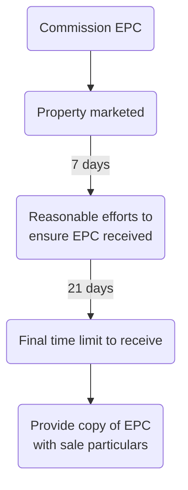

# Marketing Property and Instructions

## Energy

### Energy Performance Certificates

Seller will need these to hand at an early stage.

> [!statute]
> EPCs were introduced to comply with the European Energy Performance of Buildings Directive (Directive 2002/91), which has now been revoked and replaced by the Energy Performance of Buildings Directive 2010 (EPB Directive 2010/31/EU). The requirements for EPCs are contained in the Energy Performance of Buildings (England and Wales) Regulations 2012 (SI 2012/3118). 

These require, where a building is to be sold or rented out, that the seller or landlord must make an EPC available free of charge at the earliest opportunity.

The EPC must have been commissioned before the property can be marketed, and there is an obligation to use all reasonable efforts to ensure that it is received within seven days of marketing. If it is not received within the seven days, there is a further 21 days in which to obtain it.

It remains the responsibility of the seller or landlord to ensure that a valid EPC has been given, free of charge, to the person who ultimately becomes the buyer or tenant.

There are financial penalties (enforceable by Trading Standards Officers) for failing to comply with the Regulations.

### Green Deal

The Green Deal was launched in January 2013 and is a government initiative that enables property owners and tenants to carry out a range of energy efficiency measures with no upfront cost.

Repayments are spread over a period of up to 25 years through a separate charge added to the property owner’s electricity bill. The charge (which should not be more than the estimated energy bill savings) is payable by the occupier from time to time, so on a sale and purchase it will transfer to the buyer.

> [!action]
> Ensure that the contract for sale includes an acknowledgement by the buyer that the bill payer at the property is obliged to make payments under the Green Deal plan.

If the seller fails to disclose the existence of a Green Deal plan or obtain the necessary acknowledgment from the buyer, the Secretary of State may (but is not obliged to) cancel the liability of the buyer to make payments under the Green Deal plan and may require the seller to pay compensation.

In July 2015, the Government stopped funding the Green Deal Finance Company, set up to lend money to Green Deal providers, although new applicants may still be able to get Green Deal funding from providers financing the scheme themselves.

### Minimum Energy Efficiency Standard

> [!important]
> From April 2018 it has been unlawful to grant or renew tenancies of buildings that do not have at least a rating of E, the minimum energy efficiency standard (MEES). 

MEES was introduced by the Energy Efficiency (Private Rented Property) (England and Wales) Regulations 2015 (SI 2015/ 962) (the MEES Regulations), which also provide that a landlord cannot continue to let a domestic privately rented (PR) property on or after 1 April 2020, or a non-domestic PR property on or after 1 April 2023, unless the property complies with MEES.

There are certain exemptions, to do with market value, impact on the structure of the property, and the consent of the tenant.

A breach of the MEES Regulations is not a criminal offence. If a landlord lets out a building which does not meet MEES, it may be subject to a fine and/or adverse publicity.

## Purpose of Taking Instructions

> [!tip]
> The purpose of taking instructions is for the solicitor to obtain from their client sufficient information to enable them to carry out the whole of the client’s transaction, not just to enable them to take the first or next step in that transaction.

Unless full instructions are taken, the solicitor is in danger of overlooking matters which are relevant to the transaction but which the client had not thought to mention specifically to them.

### Personal Interview

Where possible, take instructions from the client in person. This allows for rapport, and also it is sensible for money laundering provisions etc.

### Indirect Instructions

Say the estate agent contacts the solicitor with instructions. These must be confirmed directly with the client. Where there is more than one client, direct confirmation of instructions must be obtained from all clients ([[Penn v Bristol and West Building Society and Others [1995] 2 FLR 938]]).

> [!warning]
> A solicitor who acts for a client without authority may be liable to anyone who suffers loss as a result of this under the principle of **breach of warranty of authority**. Under the law of agency, an agent (i.e. the solicitor) is deemed to warrant that they have the authority to act on behalf of their principal (i.e. the client) and is liable for any loss suffered by someone who relies on this.

### Preparing for Interview

See [[Interviewing and Advising]].

- In particular, check whether the firm has acted for the client before, and if so, read the file.
- Do a conflict check before the first interview.
- Use checklists for the interview.
- Obtain evidence of identity asap after first contact with client has been made.

## Acting for Seller

Obtain:

- Full names and addresses of sellers and buyers
- Phone numbers
- Name and address of estate agents
- Name and address of other party's solicitors
- Full address of property being sold
- Tenure
	- Freehold or leasehold
	- Terms of lease
- Price agreed for property sale
- Preliminary deposit paid?
- Fixtures and fittings to remain in property and to be removed
- Enquiries of the seller
	- Where the buyer is a ‘consumer’ (an individual acting for purposes that are wholly or mainly outside that individual’s business) and the seller is a ‘trader’ (anyone acting for purposes relating to that person’s business), the Consumer Protection from Unfair Trading Regulations 2008 (SI 2008/1277) will apply to the transaction.
	- See ‘Consumer Protection Regulations in conveyancing’ practice note (Law Society).
	- The solicitor should make the seller client aware at the outset of the transaction that neither the seller nor the solicitor must mislead the buyer by providing incorrect or ambiguous information, or by omitting to provide material information.
	- Advise that buyer could have redress against seller for incorrect/ misleading information.
	- In commercial transactions, the seller will also be required to reply to enquiries raised by the buyer; a different standard form, the Commercial Property Standard Enquiries.
- Anticipated completion date
- Present use of the property
- Does the transaction attract VAT?
	- More important for commercial property, see [[Property Taxation#VAT]]
- Who is in occupation?
- Synchronisation?
- Any terms agreed between parties?
- Money – all costs of transaction, check there is enough!
- Title deed and documents whereabouts.
- Outstanding mortgages?
	- Needs to be discharged.
- Amount of deposit
	- Customarily 10% of purchase price
- Proceeds of sale
- Capital gains tax.
	- In some circumstances, sale of property will be a disposal for CGT purposes.

## Acting for Buyer

- Use of property
- Money
	- Land registry fees and SDLT (Stamp Duty Land Tax)
	- Source of funds?
		- Solicitor must advise the lender, with the client's authority, if the remainder of funds are not from the buyer's own funds.
		- If client does not give authority, decline to act.
		- Also check money laundering: is it reasonable that the client has the required level of savings?
- Deposit
	- Usually 10%
- Mortgage
	- Some type of mortgage funding usually required
- Survey
	- Caveat emptor
- Situation of the property? Think proximity to rivers etc., any special searches needed
- Insurance
	- Life insurance
	- Building contents insurance
	- Property insurance
- Who is buying?
	- Co-ownership, think about beneficial ownership.
	- Consider conflicts
- Custody of deed
	- Client's instructions in relation to custody of deeds should be obtained
- Client's present property.

For a transaction concerning a newly-constructed property, leasehold or a dealing with only part of seller's property, additional information will be required.
