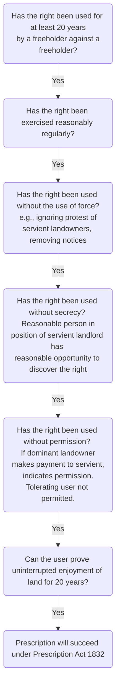

# Easements

## Introduction

```ad-defn
An easement is a proprietary right to use land which belongs to somebody else. The use is more limited than an exclusive right to occupy or use.
```

The person who receives the benefit of the easement is the grantee and their land, which is benefitted by the easement, is the *dominant tenement*.

The person who grants the easement land is the grantor and their land, which is burdened by the easement, is the *servient tenement*.

## Legal Easements

An easement is capable of being a legal interest in land if it fulfils the requirements as to duration.

```ad-statute
title: LPA 1925, s 1(2)(a)

‘An easement…for an estate equivalent to an estate in fee simple absolute in possession or a term of years absolute’.
```

```ad-example
A right of way granted when part of freehold land is sold will be granted forever. A right of drainage granted in a five-year lease will be granted for the term of that lease.
```

## Equitable Easements

If an easement is **not** granted for the equivalent of a freehold or leasehold estate, it can only be equitable.

```ad-example
A right to park which is granted ‘until the alternative parking facility is completed’ can only be equitable as it is not granted forever or for a set/certain period of time.
```

### Positive Easements

The overwhelming majority of easements are positive, in that they allow the holder to use the servient land of another in a particular way.

```ad-example
- A right of way allows the holder to use a driveway on neighbouring land.
- A right of drainage allows the holder to use the pipes under that land.
- A right to park allows the holder to drive onto and park on part of neighbouring land.
```

### Negative Easements

These are rare and treated with caution by the courts. They do not involve entering the neighbouring land, rather, when exercised, they prevent the servient landowner from doing something on their land by giving the dominant landowner a right to receive something.

The only recognised negative easements at law are:

- A right to light (there is no automatic right to light, an easement can exist in relation to a defined aperture)
	- A right to light must be via a defined aperture e.g. a window. Rights to light do not attach to gardens or open land.
- A right to air
- A right of support (e.g., from the dividing wall between semi-detached houses)

### Distinguishing Easements

There are other types of rights which can easily be confused with easements.

It is important to be able to distinguish between an easement and another type of right or interest, especially a restrictive covenant and an easement.

Do not confuse easements with:

| Right                 | Description                                                                                                                                                                                                                                                                                     |
| --------------------- | ----------------------------------------------------------------------------------------------------------------------------------------------------------------------------------------------------------------------------------------------------------------------------------------------- |
| Quasi-Easements       | Where landowners use, for example, paths on their own land, they are not enjoying easements. They are using the paths as owners of the land. However, the use of the paths could become easements if ever the land was divided. This nebulous or potential easement is called a quasi-easement. |
| Public rights         | Public rights can be similar in scope to easements. The best example is a right of way. However, instead of being exercised by an individual or particular body, the right by its nature is exercised by the general public.                                                                    |
| Licences              | A licence can authorise somebody to use land in the same way as an easement does. A licence is not, however, a proprietary right in land: it merely confers a personal right which cannot be enforced against a third party.                                                                    |
| Profits a prendre     | An easement does not confer on the holder the right to take anything, such as produce, animals, fish, or minerals, from the land. A profit a prendre confers such a right.                                                                                                                      |
| Restrictive covenants | An easement confers a right over the servient land. As a consequence, the servient owner cannot do anything on the servient land which would interfere with the right. By contrast, the primary function of a restrictive covenant is to restrict what is being done on the servient land.

### Grant

A **grant** exists where C, a landowner, sells or leases part of C’s land to D, and gives to D an easement over the land which C has retained.

```ad-example
- C owns a large piece of land which adjoins a main road.
- C sells part of the land to D and retains the part of the land nearest the road.
- In the transfer deed, C creates a right of way in D’s favour across the driveway on C’s retained land.
```

### Reservation

A **reservation** exists where C sells or leases part of C’s land to D, and retains a right over the land sold or leased to D.

A reservation is strictly construed against the person reserving it, because they are in a position to reserve exactly what is required and are assumed to have done so. Any attempt by C to extend the right will fail. To interpret the right more widely would be to ‘**derogate from the grant**’ that C has made to D, in that D has a lesser use of the land than originally envisaged ([[Cordell v Second Clanfield Properties Ltd [1969] 2 Ch 9]]).

```ad-example
- C owns a large piece of land which adjoins a main road.
- C sells part of the land nearest the road to D and retains the rest.
- In the transfer deed, C retains a right of way in C’s favour across the driveway on D’s land.
```

## Creation of Easements

### Express Creation

Most easements, whether grants or reservations are created **expressly.** They commonly arise when land is sold or leased. They are set out in writing in the transfer deed or lease.

Easements can also be expressly created as part of a separate deal, independent of a transfer or lease.

### Implied Creation

Easements need not necessarily be expressly created. An easement may be deemed to have been created impliedly by one of several recognised methods.

If an easement is impliedly created, it is effectively written into the document from which it was originally omitted.

### Prescription

Easements may also arise by prescription or ‘long use’. Generally an easement is claimed by prescription where it has been exercised over land for a long time (at least 20 years), yet no express grant or reservation can be traced. Easements acquired by prescription are legal easements.

If the right has the characteristics of an easement and has been exercised openly for the requisite length of time, the servient owner is deemed to have tolerated the creation of the easement.

Three types of prescription:

1. Prescription at Common Law
2. Prescription under the doctrine of Lost Modern Grant
3. [Prescription Act 1832](https://www.legislation.gov.uk/ukpga/Will4/2-3/71/contents)

```ad-note
Prescription will succeed under the Prescription Act 1832 if the user can prove uninterrupted enjoyment for the 20 year period. [No use for 1 year or more = interruption]
```

The basic criteria for a prescription are:

- Continuous user – ‘reasonably regular use’ by a freeholder or successive freehold owners against a freeholder.
- As a right – the right must have been used without force, without secrecy and without permission (‘nec vi; nec clam; nec precario’).



See [[Mills v Silver (1991) Ch 271, CA]] and [[Winterburn v Bennett [2017] 1 WLR 646]].

#### Bevan

- An easement by prescription can only be generated where a right has been exercised by one fee simple owner over another fee simple owner's land ([[Simmons v Dobson (1991)]])
- In [[Union Lighterage Company v London Graving Dock Company [1902] 2 Ch 557]] no easement arose by prescription in circumstances where a dock had been affixed to a wharf for 20 years using underground rods invisible to the servient landowner.
- Where permission is given to the dominant landowner for the exercise of a right over the servient, this will prove fatal to a claim for an easement by prescription ([[Odey v Barber (2007)]])
	- In [[Hill v Rosser (1997)]], the claim to an easement by prescription failed where the servient landowner had granted a licence for the user to the dominant landowner.
	- Permission need not have been solicited by the dominant landowner ([[Odey v Barber (2007)]])
- An easement will only be generated by prescription if it can be lawfully granted and where the user is not illegal in nature.
- Use must be regular and continuous. Long periods of unexplained non-use will be fatal to a claim for prescription.
- No easement can be generated by prescription unless the user by the alleged dominant landowner is in the nature of a right capable of constituting an easement.

See also:

- [[Capability rules]]
- [[Easement acquisition]]

## Enforceability of Easements and Remedies

### Enforceability by Dominant Owner

In order to enforce an easement, the dominant owner must have the benefit of the easement and thus the ability to sue. As between the original parties, a properly created easement is always enforceable by the dominant owner against the servient owner. If the dominant land changes hands, the benefit, which is part of the land, passes with the transfer of the land.

It does not matter whether the easement is legal or equitable, or whether the land is registered or unregistered: the benefit will pass with the dominant land, enabling the dominant owner to enforce it.

```ad-statute
title: [s 205(1)(ix) LPA 1925](https://www.legislation.gov.uk/ukpga/Geo5/15-16/20/section/205)
‘Land’ includes… an easement, right, privilege, or benefit in, over or derived from land…’
```

```ad-statute
title: [s 62(1) LPA 1925](https://www.legislation.gov.uk/ukpga/Geo5/15-16/20/section/62)

‘A conveyance of land shall be deemed to include and shall by virtue of this Act be deemed to convey, with the land, all… easements, rights and advantages whatsoever...’
```

### Express Legal Easements: Enforceability Against Servient Owner

| Type of land      | Enforceability against new servient owner                                                                                                                                 |
| ----------------- | ------------------------------------------------------------------------------------------------------------------------------------------------------------------------- |
| Registered land   | A properly created express legal easement will always be enforceable against a new servient owner as it must be substantively registered in order to be a legal easement. |
| Unregistered land | A properly created express legal easement will be enforceable as ‘legal interests bind the world’ [[Mercer v Liverpool, St Helen’s and South Lancashire Railway Co [1904] AC 461]]. However, since the LRA 2002, on transfer of the servient land, the express legal easement will be an interest overriding the first registration of the servient land and will become noted on the charges register of the newly registered servient land [LRA 2002, Sch 1 para 3](https://www.legislation.gov.uk/ukpga/2002/9/schedule/1).                                                                                                                                                                          |

In summary, an express legal easement:

- Must comply with definition on duration and be for a certain term or forever: [LPA 1925, s 1(2)(a)](https://www.legislation.gov.uk/ukpga/Geo5/15-16/20/section/1); and
- Must be created by deed: [LPA 1925, s 52](https://www.legislation.gov.uk/ukpga/Geo5/15-16/20/section/52); [LP(MP)A 1989 s 1](https://www.legislation.gov.uk/ukpga/1989/34/section/1); and
- If over registered land, easement must be substantively registered per [LRA 2002, s 27(2)(d)](https://www.legislation.gov.uk/ukpga/2002/9/section/27)
- Else if over unregistered land, easement ‘binds the world’ and is overriding interest on first registration of servient land per [LRA 2002, Sch 1 para 3](https://www.legislation.gov.uk/ukpga/2002/9/schedule/1).

### Implied Legal Easements: Enforceability Against Servient Owner

| Type of land      | Enforceability against new servient owner                                                                                                                                                                                                                                                                                                                                         |
| ----------------- | --------------------------------------------------------------------------------------------------------------------------------------------------------------------------------------------------------------------------------------------------------------------------------------------------------------------------------------------------------------------------------- |
| Registered land   | An implied legal easement will be an overriding interest [LRA 2002, Sched 3 para 3](https://www.legislation.gov.uk/ukpga/2002/9/schedule/3) provided that: the easement is within the actual knowledge of the new owner; or it is obvious on a reasonably careful inspection of the servient land; or it has been exercised with a year before the transfer of the servient land. |
| Unregistered land | An implied legal easement is enforceable in exactly the same way as an express legal easement over unregistered land, i.e., under the principle ‘legal interests bind the world’ and as an overriding interest on first registration of the land.                                                                                                                                                                                                                                                                                                                                                                                  |

Note that [[Chaudhary v Yavuz [2011] EWCA Civ 1314]] suggests obiter that an equitable easement could be an overriding interest based on actual occupation (the easement held by someone in actual occupation of the servient land), but there is no direct authority on this.

In summary, an implied legal easement:

- Must comply with definition on duration and be for a certain term or forever: [LPA 1925, s 1(2)(a)](https://www.legislation.gov.uk/ukpga/Geo5/15-16/20/section/1); and
- Must be implied by one of the recognised methods; and
- If over registered land, implied easement is an overriding interest if conditions met: [LRA 2002, Sched 3, para 3](https://www.legislation.gov.uk/ukpga/2002/9/schedule/3).
- Else if over unregistered land, the easement ‘binds the world’ and is an overriding interest on first registration of servient land: [LRA 2002, Sch 1 para 3](https://www.legislation.gov.uk/ukpga/2002/9/schedule/1).

### Express Equitable Easements

#### Registered Land

A properly created express equitable easement will always be enforceable against the grantor, but must be protected in order to be enforceable against a new servient owner.

To be protected, a **Notice** must be entered in the charges register of the servient land, [LRA 2002, s 32](https://www.legislation.gov.uk/ukpga/2002/9/section/32). If this is done, then this makes the easement binding on a new owner of the servient land, [LRA 2002, s 29(2)](https://www.legislation.gov.uk/ukpga/2002/9/section/29). If this is not done, the easement is not binding on a purchaser for valuable consideration, [LRA 2002, s 29(1)](https://www.legislation.gov.uk/ukpga/2002/9/section/29).

A volunteer (i.e., someone who is gifted or inherits the land) will always be bound, whether the interest is protected or not, [LRA 2002, s 28](https://www.legislation.gov.uk/ukpga/2002/9/section/28).

```ad-summary
- The easements must be properly created: either [LPA 1925, s 53(1)(a)](https://www.legislation.gov.uk/ukpga/Geo5/15-16/20/section/53) or [LP(MP)A 1989, s 2](https://www.legislation.gov.uk/ukpga/1989/34/section/2)
- The easements must be protected by Notice in the charges register of the burdened land: [LRA 2002, s 32](https://www.legislation.gov.uk/ukpga/2002/9/section/32)
- If done, easement binds everyone: [LRA 2002, s 29(2)](https://www.legislation.gov.uk/ukpga/2002/9/section/29)
- If not done, the purchaser for value is not bound: [LRA 2002, s 29(1)](https://www.legislation.gov.uk/ukpga/2002/9/section/29) but the volunteer is: [s 28](https://www.legislation.gov.uk/ukpga/2002/9/section/28)
```

#### Unregistered Land

Properly created express equitable easements over unregistered land must be protected in order to be enforceable against a new servient owner.

To be protected, a Class D(iii) Land Charge must be entered in the Land Charges Register at Plymouth [LCA 1972, s 2(5)(iii)](https://www.legislation.gov.uk/ukpga/1972/61/section/2). If this is done, then this makes the easement binding on a new owner of the servient land,[LPA 1925, s 198](https://www.legislation.gov.uk/ukpga/Geo5/15-16/20/section/198), as this constitutes actual notice of the existence of the easement. If this is not done, the easement is not binding on a purchaser for money or money’s worth of a legal estate in the servient land: [LCA 1972, s 4(6)](https://www.legislation.gov.uk/ukpga/1972/61/section/4).

A volunteer will always be bound.

```ad-summary
- The easements must be properly created: either [LPA 1925, s 53(1)(a)](https://www.legislation.gov.uk/ukpga/Geo5/15-16/20/section/53) or [LP(MP)A 1989, s 2](https://www.legislation.gov.uk/ukpga/1989/34/section/2)
- The easements must be protected by a D(iii) Land Charge: [LCA 1972, s 2(5)(iii)](https://www.legislation.gov.uk/ukpga/1972/61/section/2)
- If done, easement binds everyone: [LRA 2002, s 198](https://www.legislation.gov.uk/ukpga/2002/9/section/198)
- If not done, the purchaser for value is not bound: [LCA 1972, s 4(6)](https://www.legislation.gov.uk/ukpga/1972/61/section/4) but the volunteer is.
```

#### Implied Equitable Easement

Where there is an implied equitable easement, whether the servient land is registered or unregistered, the method for protection and rules on enforceability are exactly the same as for express equitable easements.

The problem is that it if someone has the benefit of an implied equitable easement, it is highly unlikely that they would ever consider that they have to protect their interest in some way: it is illogical to expect some one to protect an interest formally when the interest itself arose completely without formality.

An implied equitable easement is therefore vulnerable to being defeated when the servient land is sold.

#### Remedies

- Prohibitory injunction to prevent interference with the enjoyment of the easement
- Damages in lieu of injunction or in addition to it
- [[Mandatory injunction]] to remove obstruction

## Easement Analysis Structure

1. Is the right in question capable of being an easement? Does it satisfy the capability requirements? Is the right disqualified?
	1. Test set out in re Ellenborough Park
		1. There must be a dominant and servient tenement
		2. The right must accommodate the dominant tenement
			1. Benefits land, not individual
			2. Proximity
		3. No common ownership of the tenement (diversity of ownership/occupation)
		4. The right must lie in grant
			1. Capable grantor/grantee
			2. Sufficient description
			3. Judicially recognised
	2. Disqualifying factors
		1. Exclusive possession;
		2. Permission;
		3. Payment of rent.
2. If the right is capable of being an easement, has it been successfully acquired as an easement? If not expressly, could it have been acquired impliedly?
3. Even if it is a properly acquired easement, is it actually enforceable against the parties you are trying to enforce it against? Has it been properly protected? If not, is it an OI?
