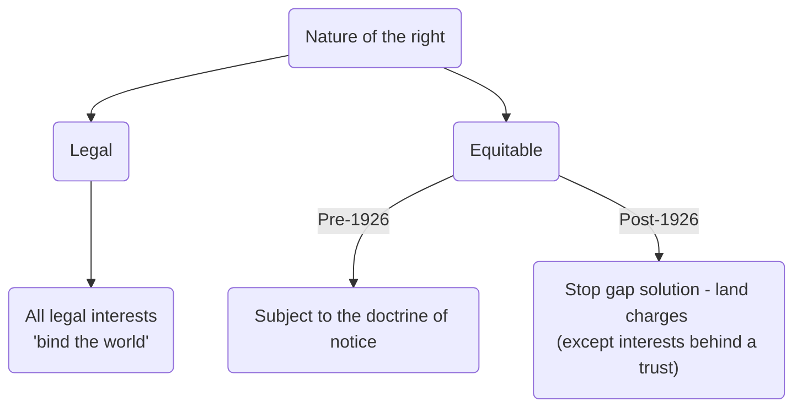
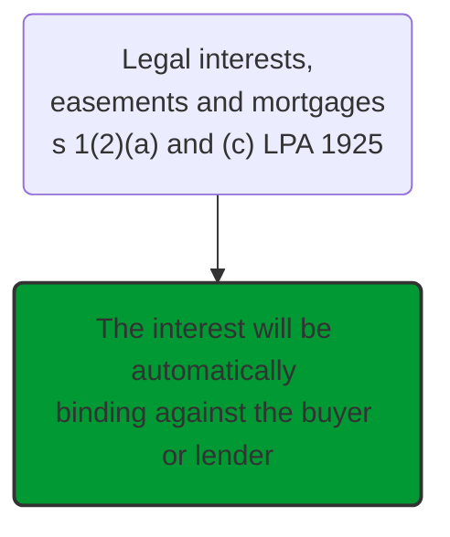
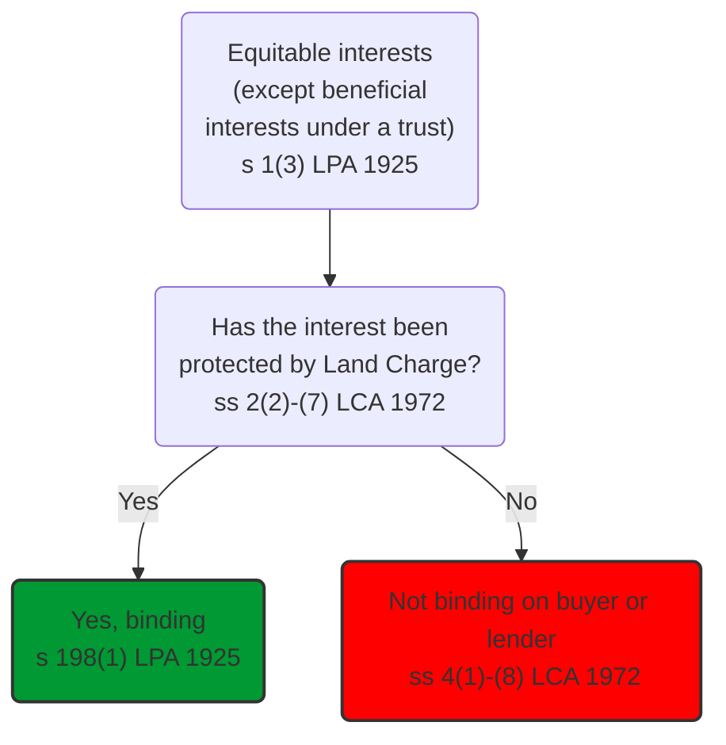
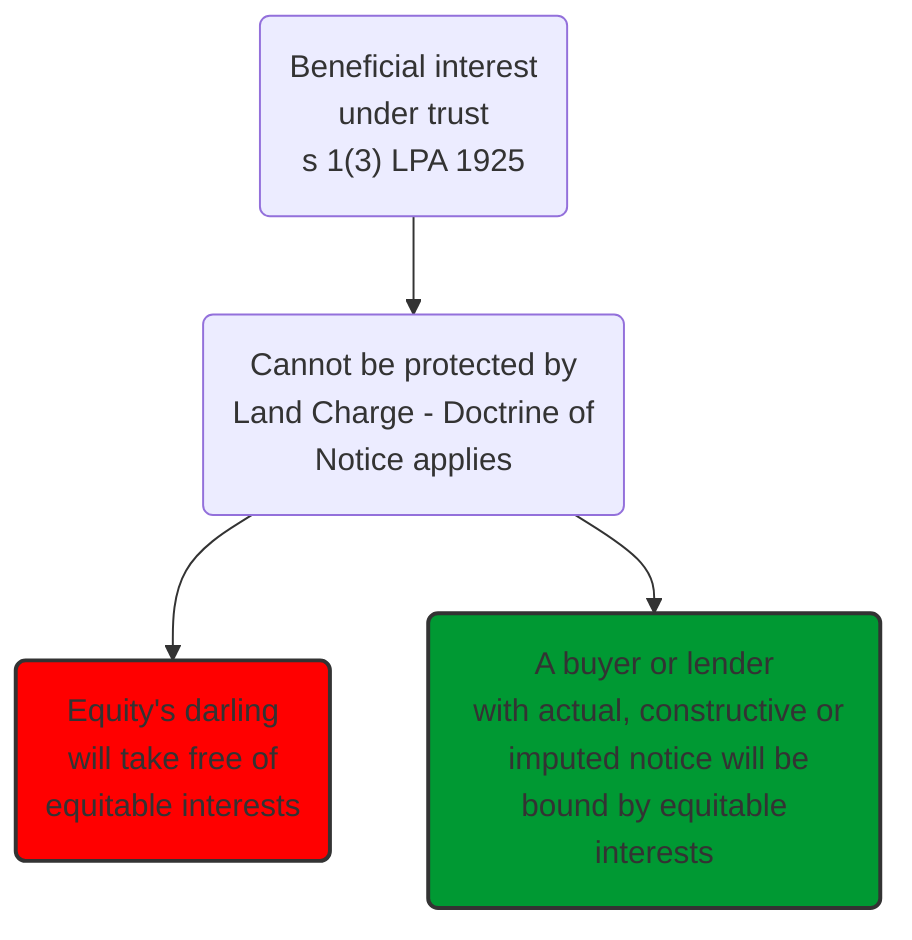

# Overview

Essentially, the old conveyances must be examined. The seller solicitor must identify a bundle of unregistered title deeds, collectively known as the **epitome of title**, and send these to the buyer solicitor.

As the seller may have lots of old title deeds of varying degrees of usefulness relating to the property, s/he must only select those which contain relevant detail about the property and then make a copy of these documents. This bundle of relevant copy documents is called an epitome of title. On a sale, the seller is required to show the epitome of title to the buyer. This is called deducing title.

The buyer solicitor must then use these to register the land for the first time. This registration must be done within **2 months** of completion. The land is then held under the registered land system.

The buyer must also ascertain if the land is subject to any third party rights.



## Current Position







There are lots of flaws when this system. Prior to 1926, the enforceability of a right against a new owner of the land depended on whether the right was legal or equitable. If legal, it would always be binding.

Pre-1926, equitable rights would be binding on all new owners except “equity's darling”. To be exempt from such rights, the new owner must have been a purchaser for value, and would have to make extensive enquiries about the property, since they would be deemed to have notice of a right if they should reasonably have known about it.

Equity's darling is the purchaser of a legal estate without any notice.

The stop-gap solutions remains for post-1926 equitable rights. Land charges were introduced. This can be entered against the name of the landowner who granted the right, to ensure that the right will be binding.

Note that the two systems are completely distinct.

# Land Charges

The majority of equitable interests created after 1926 over unregistered land will need to be protected by way of a Land Charge, under the [Land Charges Act 1972](https://www.legislation.gov.uk/ukpga/1972/61/contents) (LCA). This was intended as a ‘stop-gap’ solution lasting only a few years until all land in England and Wales was registered.

However, there still exists unregistered land and the time has not yet arrived where we can abandon this ‘temporary’ system completely.

There is one exception to the rule that only equitable interests are registered as land charges, and that is a puisne mortgage. A puisne mortgage is a second legal mortgage.

A first legal mortgage over unregistered land is protected by the depositing of the title deeds with the mortgage lender (the mortgagee). It is not possible for a second legal mortgage to be protected this way because the title deeds are already held by the first mortgage lender. For this reason, a second mortgage holder must protect their interest by the entry of a land charge.

## Interests That Can Be Protected

Interests that can be protected by entry into the LCA 1972 include:

| Class        | Interest                                                                                                   |
| ------------ | ---------------------------------------------------------------------------------------------------------- |
| Class C(I)   | puisne mortgage (i.e., second or subsequent legal mortgage)                                                |
| Class C(IV)  | estate contract (e.g., a contract to buy land, an option, or a contract to have a lease granted over land) |
| Class D(II)  | restrictive covenant created after 1926                                                                    |
| Class D(III) | equitable easement created after 1926                                                                      |
| Class F      | spouse’s matrimonial right of occupation.                                                                                                           |

The only equitable interests that cannot be protected by way of a land charge are:

- beneficial interests behind a trust,
- equitable easements created pre-1926, and
- restrictive covenants created pre-1926.

## Effect of Entry of Land Charge

Once the land charge is entered on the Land Charges Register, the interest will be binding on a purchaser ([LPA, s 198](https://www.legislation.gov.uk/ukpga/Geo5/15-16/20/section/198)). This is so irrespective of the state of the purchaser’s knowledge. This overcomes the uncertainty associated with the old doctrine of notice, at least in respect of those interests which are able to be protected by a land charge.

```ad-warning
Of course, entry of a land charge does not guarantee the validity of the interest in question, so that if something is protected which is not actually an interest in land, protection by entry of a land charge will not confer validity on it.
```

```ad-statute
title:s 198 LPA 1925

(1) The registration of any instrument or matter in any register kept under the Land Charges Act 1972 or any local land charges register, **shall be deemed to constitute actual notice of such instrument or matter**, and of the fact of such registration, to all persons and for all purposes connected with the land affected, as from the date of registration or other prescribed date and so long as the registration continues in force.

(2) This section operates without prejudice to the provisions of this Act respecting the making of further advances by a mortgagee, and applies only to instruments and matters required or authorised to be registered in any such register. 
```

## Effect of Non-entry of Land Charge

```ad-statute
title: s 4 LCA 1972

(5) A land charge of Class B and a land charge **of Class C (other than an estate contract**) created or arising on or after 1st January 1926 shall be **void as against a purchaser of the land** charged with it, or of any interest in such land, unless the land charge is registered in the appropriate register before the completion of the purchase.

(6) An **estate contract** and a **land charge of Class** D created or entered into on or after 1st January 1926 shall be **void as against a purchaser for money or money’s worth …** of a legal estate in the land charged with it, unless the land charge is registered in the appropriate register before the completion of the purchase.

(8) A land charge of **Class F** shall be **void as against a purchaser of the land** charged with it, or of any interest in such land, unless the land charge is registered in the appropriate register before the completion of the purchase.
```

```ad-warning
There is a difference betweeen 'purchaser for value' and purchaser for money or monies worth. The latter doesn't include marriage consideration and stuff. 
```

Although different is terminology used depending on the land charge in question, the effect of this provision is that non-protection of an interest will make it void against a purchaser of the land, but not against someone who is gifted or who inherits the land

The state of the purchaser's knowledge is irrelevant. This can be seen in the case of [[Midland Bank Trust Co Ltd v Green [1981] AC 513 1]].

The land charge is entered against the **name of the landowner** at the time the right is granted/created, [LCA 1972, s 3(1)](https://www.legislation.gov.uk/ukpga/1972/61/section/3). In [[Standard Property Investment plc v British Plastics Federation [1985] 53 P&CR 25 1]], this was held to mean the version of the name(s) as it appears in the title deeds and not as it may appear in other contexts, such as a birth certificate.

Should the land charge be entered against an incorrect name (for example, because there has been an omission of one of the estate owner’s names which appears in the title deeds), the protection is a nullity: [[Diligent Finance Co Ltd v Alleyne (1972) 23 P & CR 346 1]]

To discover the existence of a registered land charge, a search must be made of the register against the full name(s) of the estate owner(s) as spelt in the title deeds.

In view of the provisions of LPA 1925, s 198(1) (entry of a land charge is notice to all persons for all purposes), a search should be made, wherever possible, against all previous estate owners back to 1 January 1926.

This is a cumbersome process when investigating title of unregistered land.

```ad-summary
- Land charges are a means of protecting the majority of equitable interests created over unregistered land post 1926.

- The Land Charges Register is a mini scheme of registration that therefore applies to unregistered land only.

- The holder of an equitable interest created post 1926 must register the correct land charge (eg Class C(IV)for an estate contract) against the name (as it appears in the title deeds) of the unregistered landowner of the burdened land.

- Correct registration of a land charge constitutes ‘actual notice’ and means the equitable interest will be binding on a third party.

- Failure to register a land charge correctly means it will not be binding on a purchaser of the land. Actual knowledge is irrelevant. It would still, however, be binding on someone who is gifted or inherits the land.

- A purchaser of unregistered land must do a full search of the Land Charges Register against the full names of all estate owners as spelt in the title deeds in order to discover the existence of any equitable interests.
```

# Doctrine of Notice

The enforceability of certain equitable interests in unregistered land depends on the doctrine of notice.

- Pre-1926, the doctrine of notice applied to all equitable interests.
- Post-1926, the majority of equitable interests will need to be protected by way of a Land Charge, under the LCA 1972.

Unfortunately, not all equitable interests could be protected under the LCA 1972. The doctrine of notice therefore **continues to apply** for:

- Equitable easements and restrictive covenants created before 1926.
- Equitable interests under a trust that have not been overreached and therefore transferred from the land to the purchase money.

## Equity's Darling

```ad-defn
'Equity’s Darling' is a '**bona fide purchaser for value of a legal estate without notice'** of the equitable interest.
```

A buyer has to prove all of the elements below if he is to take property free from any of these equitable interests which affect that property i.e., to be ‘equity’s darling’:

| Term           | Definition                                                                                                                                             |
| -------------- | ------------------------------------------------------------------------------------------------------------------------------------------------------ |
| Bona fide      | The buyer must act in good faith                                                                                                                       |
| Purchaser      | Any person who acquires an interest in the land other than by operation of law (obtaining land upon intestacy would be an example of operation of law) |
| Value          | Means money or money’s worth or future marriage (including nominal consideration, as the adequacy or otherwise of the value is not investigated).      |
| Legal estate   | A freehold or leasehold estate (or, for this purpose, a charge by way of legal mortgage – see LPA 1925, s 87)                                          |
| Without notice | Without any of the three kinds of notice described below: actual, constructive or imputed notice.                                                                                                                                                       |

## Actual Notice

The purchaser actually knows of the equitable interest.

## Constructive Notice

This is governed by the [LPA 1925, s 199(1)(ii)(a)](https://www.legislation.gov.uk/ukpga/Geo5/15-16/20/section/199), which requires a purchaser to act as a prudent person. He cannot attempt to avoid being bound by equitable interests by shutting his eyes and ears, and thus not having actual notice.

A purchaser will be fixed with constructive notice of an interest if he fails to pursue a line of enquiry which ought reasonably to have been made. For example, if a purchaser is aware that there are, or may be, covenants restricting the use of the land but fails to discover their exact content; he will nevertheless take the land subject to such restrictions as may exist.

The obligations on a purchaser to make enquiries so as to discover the existence of any equitable interests which may affect the land he is about to purchase are limited to making a proper investigation of the title deeds, and making a proper inspection of the land.

When checking the land, the purchaser must take care to see who has use of the land. The purchaser should also ensure that he makes enquiry of all the occupiers of the land. Where the purchaser discovers that he is not dealing with the legal owner, the purchaser should enquire of that person what interest, if any, they hold in the land.

For example, in the case of [[Hunt v Luck [1902] 1 Ch 428 1]] the presence of a tenant on the land placed the purchaser on constructive notice of the tenant’s leasehold interest.

## Imputed Notice

This is governed by [LPA 1925, s 199(1)(ii)(b)](https://www.legislation.gov.uk/ukpga/Geo5/15-16/20/section/199).

```ad-defn
Imputed notice is notice received by the buyer’s agent, for example the solicitor on a land purchase. Where the agent has notice, whether actual or constructive, of an interest, that knowledge is imputed to the buyer.
```

Key case: [[Kingsnorth Finance Co Ltd v Tizard [1986] 1 WLR 783 1]].

## Consequences

The full rule is that an equitable interest is void against such a purchaser or someone claiming through him. It follows that once an equitable interest becomes void for want of notice, it cannot be revived so as to bind a subsequent buyer who does have notice of the equitable right, for otherwise Equity’s Darling might not be able to realise the full value he paid for the land on a subsequent sale.

For example, in [[Wilkes v Spooner [1911] 2 KB 473 1]] a restrictive covenant not to open a butcher’s shop was void for lack of notice. It was not binding on the defendant, a subsequent owner, even though he had notice of the previous covenant. His predecessor in title was a bona fide purchaser for value without notice, who was not bound by the covenant, and the covenant did not revive when the land passed to the defendant.

## Issues

From the perspective of the buyer:

- The buyer would have to satisfy all the requirements of being a bona fide purchaser for value of a legal estate without notice in order to take free from the interest.
- The buyer would need to carry out extensive investigations of both the property and associated documents to find out about existing equitable interests, otherwise it might find itself bound.
- This is time consuming, expensive and may not guarantee discovery of those interests which should be discovered.

From the perspective of the owner of the interest, the interest is fragile because it could be destroyed forever if a bona fide purchaser for value of a legal estate without notice purchased the land. This would be through no fault of the owner of the interest and in circumstances where the owner could not have done anything to protect it.

```ad-summary
Before 1926, the doctrine of notice applied to all equitable interests over unregistered land. A purchaser of unregistered land would be bound by an equitable interest unless it could show it was ‘equity’s darling’.

‘Equity’s darling’ is a bona fide purchaser for value without notice. Most purchasers of land can establish they are a ‘bona fide purchaser for value’. However, it is harder for a purchaser to establish they are ‘without notice’.

Notice can be actual, constructive or imputed knowledge of the equitable interest.
- Actual notice is that the purchaser actually knows of the equitable interest.
- A purchaser will have constructive notice of an interest a prudent person would have found out about.
- A purchaser will have imputed notice of anything its agent knows about or ought to know about.

The doctrine of notice now only applies to equitable [[easements]] and restrictive covenants created pre-1926 and beneficial interests behind a trust.
```
