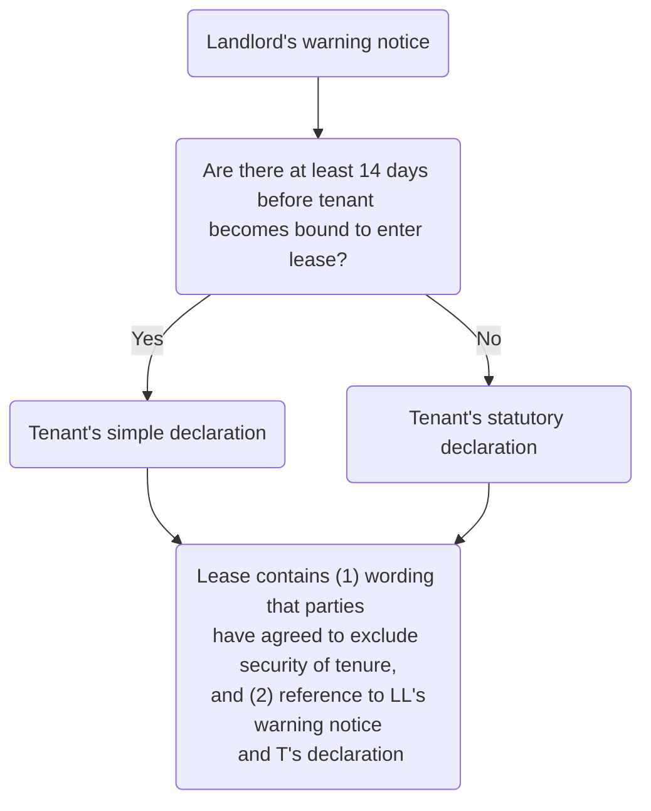

# Leases

![[leases 1_1 1.jpg]]

## Introduction

A lease is created when one person with an estate in land (the Landlord) grants the temporary right to another person (the Tenant) to use and enjoy that land exclusively. The right may be granted for weeks, months or years. It may be in a residential or commercial context.

A lease is a recognised proprietary right in the land [s 1(1)(b) LPA 1925](https://www.legislation.gov.uk/ukpga/Geo5/15-16/20/section/1), known technically as a 'term of years absolute' and defined in [s 205(1)(xxvii) LPA 1925](https://www.legislation.gov.uk/ukpga/Geo5/15-16/20/section/205).

For many individuals and businesses that cannot afford, or do not want, to buy a freehold estate, entering into a lease is the most practical option. Further, in some residential instances a long (e.g. 125 years) leasehold estate is the most commonly available to buy.

### Terminology

- A lease is also called a tenancy or leasehold
- If the lease is granted out of a superior lease it will be referred to as a: Sublease or Underlease.
- The landlord may also be described as: The Lessor.
- The tenant may also be described as: The Lessee.

### Licence

A lease must be distinguished from a licence, which simply confers a personal permission (personal right) to be on someone’s land. The licence justifies what would otherwise be a trespass.

The personal/proprietary divide is therefore very important in the context of this area of law.

Whether someone occupies a piece of land under a lease or a licence has huge implications for their right and the enforceability of it.

### Lease Vs Licence

| Lease                                                                                                                                             | Licence                                                      |
| ------------------------------------------------------------------------------------------------------------------------------------------------- | ------------------------------------------------------------ |
| Proprietary right to land                                                                                                                         | Personal permission to be on someone's land                  |
| Capable of being enforced against third parties                                                                                                   | Can only be enforced against the grantor                     |
| A tenant can sue a third party for nuisance or trespass                                                                                           | No entitlement to sue a third party for nuisance or trespass |
| Can also confer the right of security of tenure – the right to remain after the formal arrangement ends and request a new lease                   | No security of tenure                                        |
| Enforceable in rem (can get property back if enjoyment disturbed in any way)                                                                      | Enforceable in personam (damages only)                       |
| Receive various statutory protections (such as business protections under LTA 1954, and residential protections, which include repair covenants). | No statutory protections.                                     |

It is not always easy to determine whether a lease has been granted or whether the parties have simply created a licence.

Initially, the courts began by looking at the stated intention of the arrangement and gave weight to the label, rather than the underlying substance. So if the parties called an agreement a licence, then it was a licence and vice versa.

This approach continued until the decision of the House of Lords in the leading case of [[Street v Mountford [1985] AC 809]].

Street v Mountford makes it clear that for a lease to exist there must be:

1. Certainty of Term and
2. Exclusive Possession.

Although Lord Templeman indicated that ‘payment of rent’ is also essential, [LPA 1925, s 205(1)(xxvii)](https://www.legislation.gov.uk/ukpga/Geo5/15-16/20/section/205) makes it clear that rent is not essential. This was confirmed in the case of [[Ashburn Anstalt v Arnold [1989] Ch 1]].

[[Lease characteristics]]

## Factors That Defeat a Lease

For a lease to exist, rather than a licence, there needs to be…

1. Certain Term
2. Exclusive Possession
3. Correct Formalities.

However, even though these requirements of a lease may be present, there are other factors that could defeat an agreement from being a lease. The main situations where something which would otherwise be a lease is merely a licence are:

1. Where there is no intention to create legal relations

In the case of [[Facchini v Bryson [1952] 1 TLR 1386]] Denning LJ set out the circumstances from which a lack of intention to create legal relations can be deduced, making an arrangement simply a licence.

He said that where there is a family arrangement, an act of friendship or generosity, it can be presumed that there is a lack of such intention.

However, just because there is a family relationship between the parties, it does not automatically follow that there is no intention to create legal relations.

If there is a degree of formality to the agreement and/or a rent is paid then this would evidence an intention to create legal relations

1. Where there is a service occupancy

It is important to realise that this type of occupancy only arises where there is an employer/employee relationship between the landowner and the occupier. Where the occupier is required to live in the premises for the better performance of his duties as an employee, there is no tenancy, even though a rent may be paid.

Examples include a caretaker’s flat, gamekeeper’s cottage and domestic staff accommodation.

[[Norris v Checksfield [1991] 1 WLR 1241]] can be contrasted with [[Royal Philanthropic v Country (1985) 276 EG 1068]]. The key question to ask therefore is whether the employee is in occupation for ‘the better performance of their job role’.

## Multiple Occupancy of a Lease

The way in which multiple occupiers can together have exclusive possession of premises in order to have a lease is examined.

- Where two or more people share premises, can they still have a lease?
- Do they still have exclusive possession if they cannot exclude each other?

For a lease to exist, rather than a licence, the essential requirements of a lease, certainty of term and exclusive possession, must be met. The lease must also be created in accordance with the correct formalities.

### Multiple Occupiers

If the occupiers together have the right to exclude all others, including the landowner, then prima facie there is a lease arrangement.

The question is whether they have one single lease (a 'joint tenancy') or several individual leases.

```ad-defn
title: Joint tenancy
Where there is a joint tenancy all co-owners/tenant are deemed to constitute one single entity, and own/lease the whole property as one collective entity. Nobody owns a single/specific share; rather each are jointly and severally liable for the terms of the agreement.
```

As joint tenants are viewed as a single entity, they must hold the four unities: [[A G Securities v Vaughan [1990] 1 AC 417]]: unity of possession; unity of interest; unity of time; and unity of title.

| Unity               | Description                                                                                                                                                                                                                                                                                                                                                                                    |
| ------------------- | ---------------------------------------------------------------------------------------------------------------------------------------------------------------------------------------------------------------------------------------------------------------------------------------------------------------------------------------------------------------------------------------------- |
| Unity of possession | All must be entitled to occupy the whole of the premises. No-one has exclusive use of any part. If the occupiers can show that they each have exclusive possession of a part of the property then it is possible for them to have **individual leases of their own part.**                                                                                                                                                                                                                                                                                                                                                                                               |
| Unity of interest   | All occupiers must have a leasehold interest for the **same term** under the **same conditions** and must be **jointly liable for the rent.** Joint liability in a lease means if one occupier left, the remaining occupier(s) would be liable for the whole rent payment, not an individual share of it.                                                                                      |
| Unity of time       | All of the occupiers interests must start at the same time.                                                                                                                                                                                                                                                                                                                                    |
| Unity of title      | All of the occupiers interests must derive from the **same document** or from separate but identical documents which are **interdependent**. If it is found that the occupants do not have all of the four unities, they cannot have a joint tenancy. If neither a joint tenancy nor an individual tenancy exists then the occupants can only be individual licensees sharing with each other. |

In [[A G Securities v Vaughan [1990] 1 AC 417]] the occupants, at least at first, did not know each other. They all signed separate agreements setting out the terms of their occupancy (no unity of title); the agreements contained different monthly payments (no unity of interest) and began at different times (no unity of time). For these reasons, the court held that the occupiers were not joint tenants.

In [[Antoniades v Villiers [1990] 1 AC 417]] the occupiers, a couple, had been looking for somewhere to live together for several months. They signed separate agreements which were identical, including the level of payments, for the small attic flat. The court held there was 'an air of total unreality about these documents read as separate and individual licences in the light of the circumstance that the appellants were together seeking a flat as a quasi-matrimonial home' i.e., the separate agreements would not defeat unity of interest or title on these facts and the court will always look at the substance of the arrangement.

As Lord Templemen said:

> '…the two agreements were interdependent. Both would have been signed or neither. The two agreements must therefore be read together. Mr. Villiers and Miss Bridger applied to rent the flat jointly and sought and enjoyed joint and exclusive occupation of the whole of the flat. They shared the rights and the obligations imposed by the terms of their occupation. They acquired joint and exclusive occupation of the flat in consideration of periodical payments, and they therefore acquired a tenancy jointly.'

```ad-important
If it is found that the occupants do not have the four unities, they cannot have a joint tenancy. But if they can show that they each have exclusive possession of a part of the property then it is possible for them to have individual leases of their own part. If neither a joint tenancy nor an individual tenancy exists then the occupants can only be individual licensees sharing with each other.
```

## Lease, Licence, Tenancy at Will

### Lease

Key characteristics of a lease:

- Legal interest in the property (proprietary interest) A leasehold estate is a proprietary interest, and thus can bind successors in title to the land affected by it.
- Exclusive possession (so only the occupier can be in possession of the property and can excluded everyone else)
- Specified term (be that periodic or fixed term) and has certainty of term. Certainty of term can be a periodic tenancy which is one that continues until either the tenant or the landlord gives written notice to end it. Or you can have certainty of term by having a fixed-term tenancy which only lasts for a set amount of time – for example, one year. The amount of time must be written on the tenancy agreement.
- Tenant can use property as if it were the owner
- Parties to a lease are subject to statutory regulation, which offers various rights and obligations. – such as security of tenure which I will come on to later.
- Can be a lengthy document to draft and agree
- Will bind new owners of land A leasehold estate is an interest that can in principle be assigned to third parties.

### Licence

Key characteristics of a licence:

- Personal permission to be on land
- Not a proprietary interest
- Will not bind new owners of land
- Licensee has no control
- Usually provides that the licensor can move the licensee to another part of the building (i.e., no exclusive possession)
- Does not grant the licensee security of tenure. A licence cannot be protected by the 1954 Act because it is not a tenancy.
- Simple document to draft and agree.

```ad-example
In a commercial context, examples of where a licence to occupy may be encountered include:
- staying in a hotel room;
- paying to use a commercial car park;
- occupying ‘serviced offices’ for short periods of time;
- a ‘concession’ arrangement in a department store e.g. the Clarins counter in Debenhams; and
- in a conveyancing transaction – sometimes during the period between exchange and completion a seller allows the buyer in occupation to redecorate - that arrangement is often a licence and written in the contract as such.
```

### Tenancy at Will

Key characteristics:

- Personal permission to be on land
- Not a proprietary interest. A tenancy at will is not a legal estate, as it does not fall within the definition of a term of years absolute in the Law of Property Act 1925.
- Will not bind new owners of land
- Tenant at will has no control
- Either party may end the tenancy at any time – hence it is called a tenancy ‘at will’ at the will of either party. (i.e., so no certainty of term)
- Does not grant the tenant at will security of tenure
- Simple document to draft and agree

In practice, this usually occurs where there are ongoing negotiations for a new lease to be granted.

### Security of Tenure

The LTA 1954 was introduced to address a chronic shortage of commercial premises, exacerbated by the bombing raids of the German air force. Tenants were vulnerable to exploitative landlords using the end of the contractual term to demand greatly increased rents for a renewal lease.

The LTA 1954 was urgently needed. It provided business tenants with security by providing that, at the end of their contractual term, the tenancy would continue unless given up by the tenant or brought to an end using the statutory procedures. It also allowed tenants to request a new tenancy on terms derived from the original lease, and at a rent fixed by the court if the parties could not agree. It was a good thing for landlords because in post-war Britain (which was a depressed market) then secured tenancies were all the rage as landlords wanted to give tenants a reason to come and settle into say Oxford Street.

#### Requirements

There are three requirements for a tenant to acquire security of tenure under the [Landlord and Tenant Act 1954, Part II](https://www.legislation.gov.uk/ukpga/Eliz2/2-3/56/part/II).

1. There has to be a tenancy
2. the tenant has to be in occupation of the property and
3. the tenant must be occupying for the purposes of a business.

In part II of the 1954 Act the expression ‘business’ is given a very wide interpretation and includes a trade, profession or employment and includes any activity carried on by a body of persons, whether corporate or unincorporated. It is not necessary to establish that the business is carried out for the purposes of making a profit and a trading activity that is carried on for the purposes of making a profit will be a business for the purposes of the LTA 1954, even if that profit cannot be distributed because the tenant is a not-for-profit organisation.

A members’ club is also carrying on a business for the purposes of the LTA 1954, even if it only trades with its members.

So the tenant does not have to be a company, it could be a partnership or a sole trader. It could also be a sports club. Thus, a body of persons running a tennis club was held to be a business in [[Addiscombe Garden Estates v Crabbe [1958] 1 QB 513]].

```ad-warning
A tenancy at will is not a legal estate as it does not fall within the definition of a term of years absolute in the Law of Property Act 1925. [[Hagee (London) Ltd v AB Erikson and Larson [1975] 3 All ER 234]] confirmed that a tenancy at will does not fall within the protection of the 1954 Act.
```

#### Effect

In a business context, this gives a business tenant who is in occupation of a tenancy and using the property as a business **two layers of** protections –

1. It doesn’t matter if the lease expires on x date – you can stay on past that day so past the contractual expiry date, and
2. it gives that tenant a right to apply to the court for a new tenancy and if successful, the landlord has to give the tenant a new tenancy.

Sometimes landlords like to know when the lease ends, it ends, as it’s not sure what it’s plans are. Maybe the landlord wants to take back possession of the property and use it for its own offices etc, or maybe he plans on redeveloping the property.

Or perhaps he just prefers to be in absolute control on lease expiry because protected tenants – to bring the lease to an end you have to serve statutory notices giving at least 6 months minimum notice to bring the lease to an end and then can only defeat the t’s claim for a new lease in limited circumstances. It’s also tricky and as a landlord you would want to employ a solicitor and a surveyor to advise you, so it will be costly for you as a landlord to engage such professionals.

It is possible to grant a lease and the tenant not have security of tenure, and these are in two circumstances.

1. ‘Contracted out’ leases ([s 38A LTA 1954](https://www.legislation.gov.uk/ukpga/Eliz2/2-3/56/section/38A))
	- A lease where a procedure is followed whereby the tenant declares that they understand they are taking a lease without security of tenure rights afforded by the legislation.
	- In reality, if you have a lease of say less than 10 years, not many landlords want to grant a lease which has protection, particularly in London.
	- Also, the shorter the lease the more likely that it will be a ‘contracted out’.
2. Grant an 'excluded' tenancy ([s 43 LTA 1954](https://www.legislation.gov.uk/ukpga/Eliz2/2-3/56/section/43)) – e.g., a service tenancy, a fixed term tenancy of 6 months or less.

## Application of LTA 1954 (Part II)

![[LTA 1954_1.jpg]]

Under the Landlord and Tenant Act 1927, the lettings market was weighted heavily in favour of the landlord, meaning that only tenants who could demonstrate sufficient goodwill, such that compensation at the end of their tenancy would be inadequate, were entitled to renew their tenancy.

The 1954 Act was introduced to strike a fairer balance between the landlord and tenant in business lettings. Now, if a business tenant wants to remain in occupation of its rented premises at the end of its lease term it can, if the lease qualifies for protection and the tenant complies with specified procedures. Landlords are only able to end commercial leases if they can prove that one or more of the grounds specified by the 1954 Act exist.

[s 23(1) LTA 1954](https://www.legislation.gov.uk/ukpga/Eliz2/2-3/56/section/23) defines when the 1954 Act applies:

> ‘Subject to the provisions of this Act, this Part of this Act applies to any tenancy where the property comprised in the tenancy is or includes premises which are occupied by the tenant and are so occupied for the purposes of a business carried on by him or for those and other purposes’.

The key elements to be satisfied are: tenancy, occupation and business purposes.

### Tenancy

This must fulfil the requirements established by [[Street v Mountford [1985] AC 809]] (exclusive possession and for a term absolute). ‘Tenancy’ includes periodic as well as fixed term tenancies and oral as well as written tenancies. ‘Tenancy’ excludes licences and tenancies at will (which are terminable at any time by either party). Some tenancies are also specifically excluded from the protection of the 1954 Act by s 43 LTA 1954.

Excluded tenancies under [s 43 LTA 1954](https://www.legislation.gov.uk/ukpga/Eliz2/2-3/56/section/43):

- Tenancies of agricultural holdings (they have their own statutory regime of protection)
- Mining leases
- Service tenancies (a lease granted as part of a tenant’s employment e.g. a security guard’s flat)
- Fixed term tenancies not exceeding six months (although protection can arise if the same business or tenant has been in occupation of the premises for 12 or more months through successive tenancies or if the tenancy is renewable beyond six months).

### Occupation

The tenant must be the occupier of at least part of the premises to obtain protection (the tenant will only be entitled to apply for a new lease of the part of the premises that it occupies). As a result, if a tenant underlets all the premises, it will lose the protection of the 1954 Act. When deciding if a tenant is in occupation for the purposes of the 1954 Act, the courts will consider the measure of control the tenant exercises over anyone else using the premises.

### Business

This is widely defined by the 1954 Act as ‘trade, profession or employment’. Case law has refined this, e.g., a members’ tennis club and a charity are businesses for the purposes of the 1954 Act but not a Sunday School. Incidental residential use is acceptable, so long as operating a business is a significant purpose of the occupation.

### Protection

If the 1954 Act applies, [s 24(1) LTA 1954](https://www.legislation.gov.uk/ukpga/Eliz2/2-3/56/section/24) sets out two layers of protection given to the protected tenant:

- The tenancy will continue after its contractual expiry date (the date, set out in the lease, on which the term of the lease is due to end) until terminated in one of the ways specified by the 1954 Act; and
- The tenant will have the right to apply for a new tenancy on termination of the current tenancy.

### 'Contracted Out' Tenancies

Under [s 38A LTA 1954](https://www.legislation.gov.uk/ukpga/Eliz2/2-3/56/section/38A), before completing the lease, the landlord and tenant can agree to exclude the lease from the protection of the 1954 Act.

- This is usual for short term lettings, where the landlord wants to be certain it can regain the premises at the end of the lease term. The decision as to whether or not a commercial lease is contracted out from the protection of the 1954 Act will be a part of the normal negotiation process prior to the grant of a lease. A protected lease could potentially command a higher rent than a contracted out lease.
- Prior to June 2004, the contracting out procedure involved obtaining a court order. The lease also had to refer to the court order. From June 2004, the procedure for contracting out changed. It no longer involves a court order, but the lease does still have to make reference to the fact that the parties have agreed to exclude the protection of the 1954 Act (known as security of tenure).

The simplest way to check whether a lease has been contracted out of the protection of the 1954 Act is to check the lease for the reference to the court order or to the parties agreeing to contract out.

### Contracting Out Procedure

The agreement to contract out must be carried out in accordance with the procedure set out in the Regulatory Reform (Business Tenancies) (England and Wales) Order 2003 (the Reform Order).

#### Warning Notice

The landlord must serve a warning notice on the tenant at least 14 days before the tenant becomes bound to enter the lease (i.e. before the tenant completes the lease or an agreement for lease). There is a prescribed form of warning notice which must be used.

#### Tenant’s Declaration

The tenant must sign either a **simple declaration** or a **statutory declaration** (both have prescribed forms). Which one is needed depends on whether the 14 days of the landlord’s warning notice can be complied with or not. If there are 14 days between the warning notice and the tenant becoming bound to enter the lease, a simple declaration can be used by the tenant. If time is short, the 14 day period of the warning notice can be waived and the tenant must sign a statutory declaration instead.

| Declaration           | Details                                                                                                                   |
| --------------------- | ------------------------------------------------------------------------------------------------------------------------- |
| Simple declaration    | In a prescribed form, states that the tenant has received and accepted the consequences of the landlord’s warning notice. |
| Statutory declaration | In a prescribed form and made in front of an independent solicitor, is to the effect that the warning notice has been received and the tenant accepts the consequences.                                                                                                                          |

```ad-warning
The warning notice is served by the landlord on the tenant and the tenant makes a declaration.
```

### Lease Wording

Whether the simple or statutory declaration procedure is used, the lease must contain:

1. Wording that the parties have agreed to exclude security of tenure; and
2. Reference to both the warning notice and the tenant’s declaration.

The contracting out procedure is carried out by the landlord and tenant of the proposed lease or underlease. If an underlease is to be contracted out, it is the immediate landlord (tenant under the head-lease) who serves the warning notice on their prospective tenant (the undertenant) and not the superior landlord (owner of the freehold).


