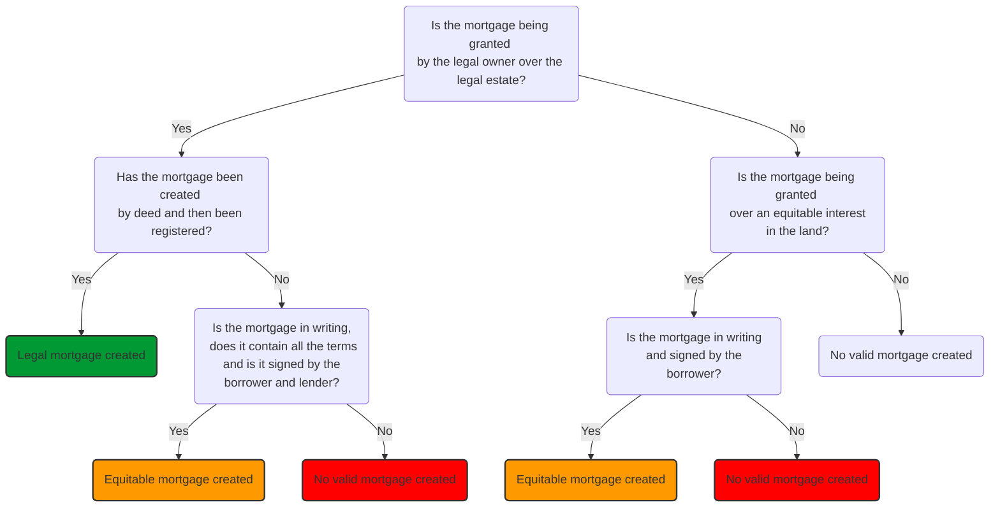

# Mortgages

![[mortgages 1_1.jpg]]

> [!defn]
> A mortgage is a bundle of proprietary rights granted to the lender (the mortgagee) as security for a loan.

## Legal Mortgages

Per LPA 1925, s 1(2)(c) a mortgage is capable of being a legal interest in land. In order to be recognised as a legal interest, the mortgage must be created in compliance with the formalities for a legal interest over registered land. These are deed and registration.

### Deed

> [!statute] [s 52(1) LPA 1925](https://www.legislation.gov.uk/ukpga/Geo5/15-16/20/section/52)
> 
> All conveyances of land or of any interest therein are void for the purpose of conveying or creating a legal estate unless made by deed.

To be valid, the deed must comply with the requirements set out in [s 1 LP(MP)A 1989](https://www.legislation.gov.uk/ukpga/1989/34/section/1):

- A deed must be clear on the face of the document that it is intended to be a deed.
- The deed must be validly executed.
- The deed must be delivered.

### Registration

The mortgage deed must then be registered at the Land Registry ([s 27(2)(f) LRA 2002](https://www.legislation.gov.uk/ukpga/2002/9/section/27)). If it is not registered, the mortgage will not take effect as a legal mortgage in the land (s 27(1)) but could still be an equitable interest.

Dispositions are required to be registered:

> [!statute] [s 27 LRA 2002](https://www.legislation.gov.uk/ukpga/2002/9/section/27)
> 
> (1) If a disposition of a registered estate or registered charge is required to be completed by registration, it does not operate at law until the relevant registration requirements are met.
> 
> (2) In the case of a registered estate, the following are the dispositions which are required to be completed by registration—…
> 
> (f) the grant of a legal charge

## Legal Vs Equitable

If the mortgage is being granted over a legal estate by the legal owner, the mortgage is capable of being a legal interest. Consider if the mortgage has been granted by deed and properly registered. If it has, the parties have created a valid legal mortgage. You do not need to consider equitable mortgages in this scenario.

If:

1. the mortgagor (the borrower) only holds an equitable interest in the land (rather than being a legal owner), or
2. the mortgage is a defective legal mortgage (it does not comply with the requirements of a deed, or it has not been registered)

Then consider if there is an equitable mortgage on the facts.

## Equitable Mortgages

An equitable mortgage can arise for a number of reasons.

### Mortgages of Equitable Interests

Where the borrower holds an equitable interest in the land (i.e., they are not a legal owner, e.g., a beneficiary in a trust of land), any mortgage of that interest will be equitable in nature.

Such a mortgage can be created very informally. In accordance with [s 53(1)(c) LPA 1925](https://www.legislation.gov.uk/ukpga/Geo5/15-16/20/section/53), such a mortgage need only be in writing and signed by the grantor in order to be validly created.

### Defective Legal Mortgages

A mortgage over registered land which is not granted by a valid deed or that is not completed by registration will not take effect as a legal mortgage (it will be defective).

However, it may be regarded as an equitable mortgage if it complies with [s 2 LP(MP)A 1989](https://www.legislation.gov.uk/ukpga/1989/34/section/2). Equity will recognise it as a ‘contract to grant a legal mortgage’ providing it is in writing, contains all the agreed terms and is signed by both the mortgagor and mortgagee.

### Discharge of Mortgages

Once a mortgage has been repaid in full, the mortgage entries at the Land Registry must be cancelled. A mortgage is only considered to be fully discharged when all reference to it has been removed from the Charges Register at the Land Registry.

Discharge of a registered charge is done by using a specific Land Registry form. A [DS1 form](https://assets.publishing.service.gov.uk/government/uploads/system/uploads/attachment_data/file/808695/DS1__2019-06-17_.pdf) is used to discharge a mortgage over the whole of the land in a title.

If only part of the land in the title is being released from the mortgage, for example if only part of the land is being sold to a buyer, a [DS3 form](https://assets.publishing.service.gov.uk/government/uploads/system/uploads/attachment_data/file/713043/DS3__2018-05-25_.pdf) is used.

## Summary

See [[Equity of redemption]].

## Undue Influence

See [[Undue influence]].

### Context

Consider a scenario where a married couple own the freehold to their family home. A bank lends some money to the wife's business on the condition that the bank is granted a mortgage over the property.

In the ordinary rules of priority, interests rank according to which was created first. This means the bank's right in the land would rank behind the husband’s and wife’s as the freehold owners – their interest (i.e., their freehold ownership) was created before the bank’s.

The mortgage deed will contain a provision stating that the bank interest ranks in priority to the freehold ownership, which means the bank can possess and sell if the land if the repayments stop. The effect of this priority provision is that the Bank’s interest in the land will rank ahead of the husband and wife’s interest. This happens in all mortgage deals and means the bank and lender will be able to repossess and then sell the land in the event of default.

Suppose the mortgage repayments stop and the bank wishes to enforce its security over the house. The issue for the bank here is that the loan was not for the joint benefit of both the husband and wife. If the husband can successfully argue that he was unduly influenced into entering the mortgage deed then the effect is that the mortgage will be unenforceable against him ([[Barclays Bank plc v O'Brien [1994] 1 AC 180]]) because the clause which postpones his interest in favour of the bank’s is ineffective.

To ensure that the bank has priority, it must follow the guidelines set out in [[RBS v Etridge (No 2) [2002] 2 AC 773]].

These guidelines provide that the lender must write to the party who is granting the mortgage not for their benefit (the husband in the example we’ve looked at) explaining that the Bank needs confirmation from an independent solicitor that he/she has explained the transaction to him/her.

- The bank will ask that party to nominate an independent solicitor
- Provide all information to that independent solicitor
- And the bank must not proceed to lend until confirmation received from the independent solicitor that the transaction has been fully explained.

The solicitor must:

- Meet the party who is entering into the mortgage not for their own benefit face to face, on their own (i.e., not with the partner for whose benefit the mortgage loan is for!)
- Explain why they have to come to see him/her, i.e., to stop them from being able to claim UI later
- explain documents and transaction in a meaningful way using non-technical language
- Point out the risks
- Emphasise he/she has a choice
- keep a detailed attendance note and confirm everything in writing
- send certificate to Bank.

> [!warning]
> The House of Lords in Etridge said these steps should be taken in every non-commercial case where a private individual offers his property as security for another person's debts.

## Priority of Mortgages Over Registered Land

There is an order of priority for mortgages on a piece of land.

### Legal Mortgages

Under the LRA all mortgages over registered land must themselves be registered substantively in order to attain the status of a legal mortgage ([LRA 2002, s 27(2)(f)](https://www.legislation.gov.uk/ukpga/2002/9/section/27)).

Once registered, they take effect as a ‘registered charge’ under the LRA.

A mortgage over registered land which is not completed by substantive registration will not take effect as a legal mortgage ([s 27(1) LRA 2002](https://www.legislation.gov.uk/ukpga/2002/9/section/27)).

Under [LRA 2002, s 48](https://www.legislation.gov.uk/ukpga/2002/9/section/48) priority between registered charges depends upon the order in which they are entered on the register. This is regardless of the order of creation. Where two or more mortgages are created at the same time (i.e., first and second mortgage simultaneously), the application for registration will specify the order of priority.

Priority between registered charges depends upon the order in which they are registered.

### Equitable Mortgages

An equitable mortgage can arise for a number of reasons. The two most common are:

- Mortgages of equitable interests
- Defective legal mortgages.

#### Basic Rule

As against another equitable mortgagee, equitable mortgages rank in order of creation ([LRA 2002, s 28](https://www.legislation.gov.uk/ukpga/2002/9/section/28)).

This is the ‘basic rule’ of priority that applies to all equitable interests because an equitable interest in the land can be validly created and exist without registration.

#### Protected Equitable Mortgage

Although not required in order to validly create it, an equitable mortgage over registered land can be protected by the entering of a notice on the charges register ([LRA 2002, s 32](https://www.legislation.gov.uk/ukpga/2002/9/section/32)).

If protected by the entry of a notice, an equitable mortgage over registered land will take **priority** over a subsequent legal mortgage, [LRA 2002, s 29(1)](https://www.legislation.gov.uk/ukpga/2002/9/section/29). As between competing equitable mortgages, this **does not** affect the priority, which will always be determined by creation.

However, an equitable mortgage not protected by a notice, will not take priority (i.e., lose its priority) to a subsequent registrable disposition of either a registered estate or a registered charge ([LRA 2002, s 29(1)](https://www.legislation.gov.uk/ukpga/2002/9/section/29)). (i.e., a transfer of the legal estate for value or the grant of a legal mortgage)

> [!example]
> A borrower grants a mortgage to Lender A. Although the mortgage is granted by a valid deed, Lender A fails to register the mortgage at the Land Registry – it is a **defective legal mortgage**. However, because it is in writing, signed by both the borrower and Lender A and contains the agreed mortgage term, the mortgages take effect an **equitable mortgage**.
> 
> The borrower subsequently enters into a second mortgage with Lender B. The mortgage is granted by valid deed, which Lender B registers. The mortgage therefore takes effect as **a valid legal mortgage**.
> 
> As a **registrable disposition of a legal charge over a registered estate**, the legal mortgage in favour of Lender B will rank ahead of the equitable mortgage in favour of Lender A.
> 
> The borrower then enters into a further mortgage with Lender C. Although the borrower and Lender C enter into a document labelled as a deed, the borrower’s signature is not witnessed. There is no valid execution and the **legal mortgage is defective**. As the document is in writing, contains all the agreed terms and is signed by the borrower and Lender C, there is an **equitable mortgage**, which Lender C proceeds to **note on the charges register** of the borrower’s registered title.
> 
> If the borrower defaults in their mortgage repayments and the land has to be sold, who then gets paid first? Which mortgage ranks in priority?
> 
> Lender A has an equitable mortgage which was created first, but not protected. Lender B has a legal mortgage. Lender C has an equitable mortgage which has been duly protected.
> 
> Lender B will get paid first. It take priority of Lender A’s equitable mortgage because the equitable mortgage was not protected by notice at the Land Registry.
> 
> Lender A will then get paid second because Lender A and C both have equitable mortgages and as between competing equitable mortgages, the order of creation determines priority.
> 
> The fact Lender C protected its equitable mortgage by the entry of a notice, does not affect priority here. However, if a subsequent legal mortgage were entered into by the borrower, Lender C would take priority over this because it has protected its interest.

#### Postponement

The priority rules discussed can be modified to allow a mortgage to take priority over a pre-existing interest which could otherwise enjoy priority if there is a postponement of that pre-existing interest.

Lenders can agree to alter the position that would apply according to the priority rules by entering into a **deed of priority** or **intercreditor deed**.

Any agreement would need to be **registered** at the Land Registry.

> [!important]
> Mortgagees will also often require an express waiver or postponement to be included in a mortgage agreement so that the rights of any person living at the mortgaged property with the mortgagor are postponed to the interests of the mortgagee.
> 
> This is important for the lender to be able to enforce their security and take possession of the mortgaged property in the event of default.
> 
> If the lender’s interest in the land does not rank in priority to the interest of a person in occupation (not a party to the mortgage) then the lender would not be able to take possession of the land in order to exercise its power of sale.

## Rights of the Lender

![[rights of a lender_1.jpg]]

It is inherent in the nature of a mortgage that the lender’s right to repayment of the loan is secured against the mortgaged property itself. This security is very important to lenders, as without it, they may take the view that it is simply too much of a risk to advance large sums of money to borrowers.

If the mortgagor fails to make the mortgage payments, the lender will wish to take steps to protect itself against losses. The lender can always sue the borrower in contract for the debt, but this can be a long and ultimately fruitless process if the borrower has insufficient money. The fact that a mortgage is a proprietary right in the lender’s favour means that the lender has several remedies available to it. These remedies are:

- Debt action
- Possession
- Sale
- Receiver
- Foreclosure.

There is no obligation for a lender to exercise any particular remedy, or indeed any remedy at all. The choice of remedy is a matter for the particular lender in the particular circumstances. However, if the lender does decide to pursue a remedy, it will be under a duty to act fairly and reasonably, and may be subject to additional duties to the borrower, depending on the remedy sought.

The lender who holds the security of a legal mortgage, rather than an equitable one, has a wider choice of remedies than an equitable mortgagee.

An equitable mortgagee has the same rights to bring a debt action under the mortgage contract for money owed, to apply for foreclosure, and to appoint a receiver. However, the equitable lender does not, generally speaking, have the right to repossess or sell without a court order.

### Debt Action

The contractual debt action is a personal action against the borrower. As the lender has a proprietary right and can enforce it against the property itself, it may be thought that the contractual right to sue for the outstanding debt is rarely used. In fact, it is used in addition to, not instead of, one of the other remedies, and in recent years, has been used in particular situations.

If the value of the mortgaged property is less than the outstanding mortgage debt, there is said to be **negative equity**. The lender may take possession of and sell the property, but if the sale proceeds so not cover the outstanding debt, the lender will wish to pursue a personal debt action against the borrower for the shortfall.

The limitation period for a contractual debt is not straightforward: if the mortgage has been created by deed, as all legal mortgages must be, then the period for recovery of the debt stated in the deed (the capital) is **twelve years**. The limitation period for recovery of interest is **six years**. What this means in reality is that borrowers can find themselves involved in contractual debt actions many years after repossession, when they may have thought that their troubles were behind them.

### Possession

A legal lender may wish to enforce its security by taking possession of the mortgaged property as a precursor to sale. There are two reasons a lender may wish to do this:

- Possession will enable the lender to offer the property for sale with vacant possession, free from any rights of the borrower. Vacant possession makes a property more attractive to a potential buyer and will enable a higher price to be obtained.
- Possession will enable the lender to manage the property and derive an income from it. The income can then be used to reduce the outstanding mortgage debt.

Since 2008, the **Pre-Action Protocol** in residential cases, possession must be a last resort. The mortgage lender is expected to explore alternative arrangements with the borrower, such as extending the mortgage term and/or scheduling a new payment plan.

### Sale

The power of sale is the strongest right which the lender can use against a defaulting borrower. If exercised, the borrower loses all rights to the property. The sale proceeds are applied towards the outstanding debt. If there is a surplus, this will be forwarded to the borrower; but if there is a shortfall, the borrower may be sued personally by the lender for the outstanding contractual debt.

Because the power of sale has such drastic consequences for the borrower, there are procedural steps which must be adhered to:

- The power of sale must have arisen in accordance with statutory rules;
- The power of sale must be exercisable in accordance with statutory rules; and
- The lender must fulfil its duties on sale, which have largely arisen from case law.

### Receiver

A receiver acts as manager of the mortgaged property if the lender does not wish to take possession or to sell. The power to appoint a receiver arises under [LPA 1925, s 101(1)(iii)](https://www.legislation.gov.uk/ukpga/Geo5/15-16/20/section/101). The receiver is an administrator whose function is to get an income from the land, for example by continuing an existing business, and will apply it towards the outstanding mortgage debt.

The receiver is deemed to be the borrower’s agent. This may seem odd, as the receiver is appointed by the lender, but it means that the lender is not liable for the receiver’s negligence. Thus, the appointment of a receiver is a safer option for the lender than taking possession and running the business itself.

A receiver must act with due diligence, subject always to the main duty of paying off the mortgage debt ([[Medforth v Blake [2000] Ch 86]]).

### Foreclosure

Foreclosure is a historic way of enforcing a mortgage which is rarely used nowadays. It allows a lender to take the mortgaged property in satisfaction of the debt, meaning that the freehold will vest in the lender, and the borrower will lose all rights to the property. This could happen even though there may be only a very small amount outstanding on the mortgage security, when compared to the value of the property as a whole.

From the lender’s point of view, the procedure is lengthy and complex. The court may order a sale in lieu of foreclosure, and almost certainly will do so if the property is worth a lot more than the outstanding debt. Even after the final decree of foreclosure, the borrower can re-open the case if he can show that he has the means to pay.

From the borrower’s point of view, there are some advantages in that an order of foreclosure extinguishes all other mortgages secured on the property. It also extinguishes the mortgagor’s contractual debt, so the lender cannot pursue the borrower for any surplus debt over and above the value of the property.

Today, foreclosure is viewed as a particularly Draconian remedy and is rarely encountered in practice. The Law Commission has recommended that it be abolished and replaced by wider powers for the lender to sell the property.

## Lender's Right to Possess

### Legal Mortgage

A legal mortgage comprises both a proprietary interest and a contractual debt. If the borrower defaults, it is unlikely that a debt action will be worthwhile. The lender will therefore wish to enforce its security by selling the property and recovering the outstanding debt from the sale proceeds. The Lender will need to repossess the mortgaged property in order to sell ‘with vacant possession’ and acquire the best possible price. The lender may also require possession in order to manage the property and generate an income to pay the outstanding mortgage debt.

[LPA 1925, s 95(4)](https://www.legislation.gov.uk/ukpga/Geo5/15-16/20/section/95) acknowledges ‘the right of a mortgagee of land… to take possession’, and in [[Four Maids v Dudley Marshall (Properties) Ltd [1957] Ch 317]] it was confirmed that the right arises as soon as the mortgage is granted, ‘before the ink… becomes dry’ on the mortgage deed. Possession is thus strictly a **right** of the lender, and **not simply a remedy**. Having said that, lenders do not exercise the right arbitrarily. It is a last resort, used when the borrower is in default with little hope of repayment. Mortgage deeds almost always contain a term which recognises that the right to possess is postponed for as long as the borrower pays the agreed instalments.

### Exercising Right of Possession

The right to possess is exactly what it says: a right. It is not therefore strictly necessary for the lender to obtain a court order prior to taking possession.

However, a series of safeguards for the borrower has evolved through statute and case law, modifying the strict rule that a lender has a right to possess mortgaged land even if the borrower is not in arrears with payments.

Most of the protections are relevant for residential mortgages only. However, all lenders have general duties to borrowers and the [Criminal Law Act 1977, s 6](https://www.legislation.gov.uk/ukpga/1977/45/section/6) applies to all mortgage lenders.

#### S 6 CLA 1977

[Criminal Law Act 1977, s 6](https://www.legislation.gov.uk/ukpga/1977/45/section/6) makes it a criminal offence to use or threaten violence for the purpose of gaining entry to property. This means that exercising the right to repossess by ‘self-help’ is risky, unless the lender is certain that the property is unoccupied at the time.

A prudent lender will make an application to the court for an order for possession, even though this may not be strictly necessary.

#### Pre-Action Protocol 2008

The [Pre-Action Protocol for Possession Claims 2008](https://www.justice.gov.uk/courts/procedure-rules/civil/protocol/prot_mha) sets out the steps which a court will expect a lender to have taken before resorting to possession of residential property, which should be a last resort. Lenders should try to discuss the debt with the borrower and accept reasonable requests for a new payment plan.

Most lenders observe the Protocol. However, if they do not, they can suffer delays in obtaining possession and may be ordered to pay the borrower’s legal costs. Non-compliance of itself does not mean that possession is denied.

##### Statutory Jurisdiction to Postpone

> [!statute] [Administration of Justice Act (AJA) 1970, s 36](https://www.legislation.gov.uk/ukpga/1970/31/section/36)
> 
> (1) Where the mortgagee under a mortgage of land which consists of or includes a dwelling-house brings an action in which he claims possession of the mortgaged property, not being an action for foreclosure in which a claim for possession of the mortgaged property is also made, the court may exercise any of the powers conferred on it by subsection (2) below if it appears to the court that in the event of its exercising the power the mortgagor is likely to be able within a reasonable period to pay any sums due under the mortgage or to remedy a default consisting of a breach of any other obligation arising under or by virtue of the mortgage. 
> 
> (2) The court—
> 
> (a) may adjourn the proceedings, or
> 
> (b) on giving judgment, or making an order, for delivery of possession of the mortgaged property, or at any time before the execution of such judgment or order, may—
> 
> - (i) stay or suspend execution of the judgment or order, or
> - (ii) postpone the date for delivery of possession,
> 
> for such period or periods as the court thinks reasonable. 
> 
> (3) Any such adjournment, stay, suspension or postponement as is referred to in subsection (2) above may be made subject to such conditions with regard to payment by the mortgagor of any sum secured by the mortgage or the remedying of any default as the court thinks fit.

The section does not:

- enable the court to prevent the lender from exercising its right to possess altogether; nor
- enable the court to postpone possession in cases where there has been no application for an order for possession: [[Ropaigelach v Barclays Bank plc [2000] QB 263]]; nor
- enable the court to prevent a lender from exercising a power of sale without first obtaining a court order: [[Horsham Properties Group Ltd v Clark [2009] 1 WLR 1255]].

The section does apply where the property is wholly or partly residential, although need not be the borrower’s home. It enables the court to adjourn possession proceedings or stay or postpone execution of the possession order. In order to be able to do this, it must appear to the court that the borrower is likely to be able to pay any sums due (or remedy any other default) within a reasonable period.

> [!summary]
> - Possession proceedings must have started
> - The mortgaged property must be fully or partly residential
> - Borrower must be able to pay ‘any sums due’
> 	- ‘any sums due’ means the arrears and accrued interest, and not the whole of the mortgage debt.
> - ‘within a reasonable period’
> 	- In [[Cheltenham & Gloucester Building Society v Norgan [1996] 1 All E.R. 449]] the Court of Appeal said that the starting point for pinpointing a ‘reasonable period’ was the remainder of the mortgage term.
> - Subject to such conditions ‘as the court thinks fit’

More cases:

| Case                                                                   | Ratio                                                                                                                                                                                                                                                                                                                       |
| ---------------------------------------------------------------------- | --------------------------------------------------------------------------------------------------------------------------------------------------------------------------------------------------------------------------------------------------------------------------------------------------------------------------- |
| [[National & Provincial Building Society v Lloyd [1996] 1 All ER 630]] | A borrower requesting a postponement of possession should present a detailed financial plan to the court, showing how the loan and arrears will be paid off before the term expires.                                                                                                                                        |
| [[Bristol and West Building Society v Ellis (1997) 73 P&CR 158]]       | A postponement was granted to allow the borrowers to achieve a sale of the property themselves. The court needed to see that the sale proceeds would be sufficient to cover the debt due. An estate agent’s optimistic estimate of the price likely to be achieved would not be enough.                                     |
| [[Mortgage Services Funding plc v Steele (1996) 72 P&CR 40]]           | In order to grant a postponement to allow the borrower to sell, the court required firm evidence of an imminent exchange of contracts. Simply instructing a solicitor to handle the conveyancing will not be enough: courts are suspicious of mortgagor’s delaying tactics, enabling them to stay in possession for longer. |
| [[Target Home Loans Ltd v Clothier [1994] 1 All ER 439]]               | The court awarded a short, three-month postponement of possession to allow the borrower to sell the property. There was evidence from an estate agent that a genuine offer had been received.                                                                                                                                                                                                                                                                                                                            |

## Lender's Right to Sell and Duties

The right to sell is the strongest of the lender’s rights and there are strict rules as to when the power arises and when it becomes exercisable. As this power of sale is a right of the lender, no court order is required.

The power of sale must exist, have arisen and become exercisable.

The lender’s statutory power of sale which arises under the Law of Property Act 1925 is explored. If there are co-owners of the property who are not a party to the mortgage, the lender will instead rely on the provisions of the [Trusts of Land and Appointment of Trustees Act 1996](https://www.legislation.gov.uk/ukpga/1996/47/contents).

### When is There a Right to Sell

#### Express Power of Sale

Most mortgage documents will include an express power of sale and will set out exactly how and when the power will be exercised. The lender will not need to rely on **any** statutory provisions, although it will be subject to duties on sale, in the same was as a lender relying on statutory powers.

#### Implied Power of Sale

In the absence of an express power, a right to sell can be implied under [LPA 1925, s 101(1)(i)](https://www.legislation.gov.uk/ukpga/Geo5/15-16/20/section/101) unless it is excluded or modified in the mortgage deed.

> [!statute] [LPA 1925, s 101(1)(i)](https://www.legislation.gov.uk/ukpga/Geo5/15-16/20/section/101)
> (1) A mortgagee, where the mortgage is made by deed, shall, by virtue of this Act, have the following powers, to the like extent as if they had been in terms conferred by the mortgage deed, but not further (namely):
> 
> (i) A power, **when the mortgage money has become due**, to sell, or to concur with any other person in selling, the mortgaged property, or any part thereof, either subject to prior charges or not, and **either together or in lots, by public auction or by private contract**, subject to such conditions respecting title, or evidence of title, or other matter, as the mortgagee thinks fit, with power to vary any contract for sale, and to buy in at an auction, or to rescind any contract for sale, and to re-sell, without being answerable for any loss occasioned thereby;

#### When Does the Right Arise?

The lender’s statutory power of sale arises ‘when the mortgage money has become due’:

- If a borrower has a capital and interest repayment mortgage [[Payne v Cardiff [1932] 1 KB 241]] confirms that the power of sale arises as soon as one portion of capital is due, meaning that it arises as soon as one payment is unpaid.
- Where a mortgage is an interest-only mortgage, the capital is not due until the end of the loan term. In these cases, the mortgage money will ‘become due’ at the **legal redemption date**, usually about six months from the start of the mortgage.

If the lender sells after the power has arisen but before it is exercisable, a sale to an innocent purchaser will be valid, but the lender will be liable in damages to the borrower,[LPA 1925, s 104](https://www.legislation.gov.uk/ukpga/Geo5/15-16/20/section/104).

#### When is the Right Exercisable?

Where the right to sell has been expressly conferred, the wording will set out in what circumstances the power can be exercised.

If the power arises under [LPA 1925, s 101(1)(i)](https://www.legislation.gov.uk/ukpga/Geo5/15-16/20/section/101), the power will become exercisable only when at least one of the criteria in [s 103 LPA 1925](https://www.legislation.gov.uk/ukpga/Geo5/15-16/20/section/103) applies:

1. Notice requiring payment of the whole loan has been served by the lender and the borrower has defaulted – No arrears are necessary here: the lender can request the full loan at any time.
2. Interest is unpaid and arrears for at least two months. This does not mean that two months’ interest must be owed: there must be some interest outstanding for two months: it does not need to be a large sum!
3. There has been some breach of another mortgage provision, such as a covenant to keep the mortgaged property insured or in good repair. Examples: failure to insure the property or allowing it to fall into disrepair: basically something which could affect the value of the security.

#### Lender's Duties When Selling

When the lender exercises its right to sell mortgaged property, whether the right is conferred expressly or by statute, it owes duties to the borrower. The lender’s basic motive is to recover the debt due, meaning the capital sum, interest and costs. It is not necessarily interested in achieving the best possible price. The cases show that the lender cannot simply consider its own interests: these must be balanced against the interests of the borrower.

After the sale, the lender is trustee of the surplus proceeds of the sale [(LPA 1925, s 105](https://www.legislation.gov.uk/ukpga/Geo5/15-16/20/section/105)) and must hand them to the person next entitled. That may be another lender, or the borrower.

| Case                                                                       | Ratio                                                                                                                                                                                                    |
| -------------------------------------------------------------------------- | -------------------------------------------------------------------------------------------------------------------------------------------------------------------------------------------------------- |
| [[Cuckmere Brick Co Ltd v Mutual Finance Ltd [1971] Ch 949]]               | The lender owed the borrower a duty to take reasonable care to obtain the ‘true market value’ or ‘proper price’ for the property.                                                                        |
| [[Michael v Miller [2004] EWCA Civ 282]]                                   | Perfection as to price is not required: the lender will not be liable for losses if the price is within the correct bracket or within an acceptable ‘margin of error’.                                   |
| [[Tse Kwong Lam v Wong Chit Sen [1983] 1 WLR 1349]]                        | A lender cannot simply put the property ‘under the hammer’ as a matter of course. Lenders are under a duty to take expert advice as to the method of sale, the marketing strategy and the reserve price. |
| [[Silven Properties Ltd v Royal Bank of Scotland plc [2004] 4 All ER 484]] | A lender has an ‘unfettered discretion’ as to when to sell and can not be expected to delay in order to improve the property or wait for an upturn in the property market.                           |

See also [[Scott v Southern Pacific Mortgages Limited [2014] UKSC 52]].
