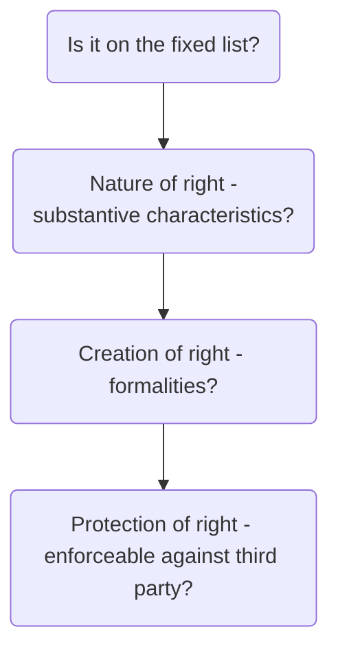

# Nature of Land

## Introduction

There is a distinction in English law between rules applying to land (real property) and rules applying to other types of property.

Following the Norman Conquest, all land in England and Wales belongs to the Crown as sovereign. This rule is still valid today, so land ownership is really ownership of a right in the land. The most powerful such right is the right to possess and use the land.

```ad-defn
title: Land law

The study of proprietary (or property) rights in the land and the responsibilities and duties in land related relationships
```

### Legislation

Foundation of modern land law: [Law of Property Act 1925](https://www.legislation.gov.uk/ukpga/Geo5/15-16/20/contents). The [Land Registration Act 2002](https://www.legislation.gov.uk/ukpga/2002/9/contents) governs the system of [[Land registration]]: a national record of land ownership in England and Wales. The national record is managed by HM Land Registry, a government department.

## Proprietary Rights in the Land

A right which relates to the land can either be proprietary or personal in nature. This distinction is important in the context of:

- The remedy available to someone who is deprived of their right; and
- The enforceability of it against third parties.

```ad-defn
title: Third Party
A new owner of the land burdened by the right.
```

A proprietary right in land can be enforced by an **action in rem**, meaning that use or possession of the land can be recovered. The holder of the right does not have to settle for damages if they are deprived of their right. A proprietary right is also capable of **being enforced against a third party** (though it is not automatically enforceable against a third party).

A personal right in land can only be enforced by a **personal action** ('in personam') for damages if the right is breached. Use (or occupation) of the right cannot be recovered. Personal rights will bind **only the original parties** to the right, there can be no recourse against a third party.

### Proprietary Vs Personal

There is a **fixed list** of the rights which are capable of being proprietary. This list is not written definitively anywhere, rather there are a number of statutory sections and case law judgments which together inform us of the rights that have proprietary status. Therefore, some rights over the land will never be proprietary in nature; they will only operate as a personal permission.

The rights that are on the ‘fixed list’ of right that have proprietary status are:

- The freehold estate
- The leasehold estate
- An easement
- A mortgage
- A restrictive covenant
- An estate contract
- A beneficial interest in a trust of land

The holder of a proprietary right in the land will have a right to occupy or use or restrict what can be done on the land is some way.

Just because a particular use of land has been recognised as having proprietary status (i.e., is on the fixed list) it does not mean that the actual right under consideration will have proprietary status.

Land law is all about looking at the **nature, creation**, and **protection** of rights in land to determine if they are proprietary or personal.

### Nature of a Right

For a right in question to have proprietary status, it must also satisfy certain **substantive (definitional) characteristics**. These differ depending upon the right in question.

### Creation of a Right

Substantive characteristics alone may be enough to work out whether the right in question is proprietary, although usually we will have to look further and examine the issue of **formalities**.

Most proprietary rights in land are subject to strict requirements as to the formalities – rules for how they must be acquired (e.g., by deed) for their acquisition/creation. Compliance, or otherwise, with such formalities may ultimately determine whether the right is proprietary or not.

An obvious characteristic of proprietary rights is their invisibility: you can't see a mortgage or easement or lease. To minimise this risk to a purchaser, while at the same time protecting the rights of those holding a proprietary right in the land, systems have been developed by which proprietary rights in the land must be made apparent by registration if they are to bind a purchaser or subsequent rights in the same land.



```ad-example
title: Proprietary right example

A person has a right of way over their neighbour’s back yard. This right of way could be an easement, which is a recognised proprietary right in the land – it is on the **fixed list of rights** recognised as having proprietary status.

Whether the right of way will be an easement depends on whether the right in question satisfies the **substantive requirements** of an easement. Even if it does it will have had to be created using the correct **formalities** in order to have proprietary status.

If the right of way is an easement, then the person will be able to recover use of the right of way if their neighbour blocked the right of way so to prevent the person from using it, they would not have to settle for damages as compensation for loss of a right.

In addition, if the right of way is an easement, the person would be able to enforce the right of way against any new owner of their neighbour’s back yard providing the easement is **registered at the Land Registry**.
```

```ad-example
title: Personal right example

A person owns a house by the sea. From this house, the owner runs a guesthouse and people pay to stay in one of the bedrooms. The owner is granting their guests a licence to stay, and they enter into a contract with them. Such a right is not a recognised proprietary right; it is a personal right against the owner to stay in the house.

If the owner stopped a guest from staying at the guesthouse, then the guest would only be able to seek damages for breach of contract and they would not be able to recover the right to stay at the guesthouse.

If the owner sold the house to a third party, then the guests would not be able to enforce the contract against the third party. The guests would have to seek damages for breach of contract.
```

## Land Contracts

In the majority of land purchases/sales, the parties will enter into a contract to buy/sell the land.

This is the first step in the process of conveyancing. The three steps of conveyancing are:

- Exchange of Contracts
- Completion of the Deed
- Registration

Once exchange of contracts occurs, the parties become contractually committed to buy/sell the land. A contract to buy/sell land is not the only type of land contract.

### Formalities

As per [s 2 LP(MP)A 1989](https://www.legislation.gov.uk/ukpga/1989/34/section/2), for a valid land contract:

- The contract must be in writing
- It must contain all the expressly agreed [[terms]]
	- The contractual terms may be incorporated into the contractual document either by being set out in the document or by referring to some other document ('by reference'), which is very common in practice.
	- For both commercial and residential sale transactions, there are Law Society standard conditions of sale, which are incorporated by reference into the majority of contracts for the sale of land.
- It must be signed by both parties.
	- The terms may either be contained in one document, which is signed by both parties, or if the contracts are to be exchanged, in two documents provided they are identical (LP(MP)A 1989, s 2(1)).
	- The standard conveyancing practice is to exchange contracts. Two copies of the contract are drawn up. One copy is signed by the seller and the other by the buyer. To create a binding contract, the parties then exchange their copies.

```ad-statute
title: s 2 LP(MP)A
(1) A contract for the sale or other disposition of an interest in land can only be made in writing and only by incorporating all the terms which the parties have expressly agreed in one document or, where contracts are exchanged, in each.

(2) The terms may be incorporated in a document either by being set out in it or by reference to some other document.

(3) The document incorporating the terms or, where contracts are exchanged, one of the documents incorporating them (but not necessarily the same one) must be signed by or on behalf of each party to the contract.

(4) Where a contract for the sale or other disposition of an interest in land satisfies the conditions of this section by reason only of the rectification of one or more documents in pursuance of an order of a court, the contract shall come into being, or be deemed to have come into being, at such time as may be specified in the order.
```

This is in addition to the normal contract law requirements and relates to all contracts where the subject of the contract is land.

Note it is possible that contracts may be signed by electronic signature pursuant to the Electronic Communications Act 2000 if the parties agree a procedure for that, but it is not the current practice.

The typing or printing of a name does not constitute a signature for the purposes of s 2 of this act ([[Firstpost Homes Ltd v Johnson [1995] 4 All E.R. 355]]). See also [[Neocleous v Rees [2019] EWHC 2462 (Ch)]]: an automatically generated email footer constituted signing for the purposes of s 2 LP(MP)A.

It must be considered whether an email chain is a contract, or merely evidence of [[offer and acceptance]] ([[Kuznetsov v London Borough of Camden [2019] EWHC 805 (Ch)]]).

### Variation of a Land Contract

Whenever a material term in a land contract is varied, that variation must also comply with LP(MP)A 1989 s.2 ([[McCausland v Duncan Lawrie Ltd [1997] 1 WLR 38]]).

The court did not specifically define what is meant by a 'material' term. It seems, however, that where a term, such as a completion date, is essential to the nature of the contract then it will be considered 'material'.

### Proprietary Effect of Contract

The effect of a binding land contract is to pass an equitable interest in the land to the buyer, called an estate contract.

A contract to create or transfer a legal property right will create a proprietary right in [[equity]] if the remedy of [[specific performance]] is available ([[Walsh v Lonsdale (1882) 21 Ch D 9]]). A land contract will be used in a variety of situations.

The following are the most usual land contracts you will encounter which create a contractual right to a legal estate:

- As part of the process of buying/selling land (conveyancing), the buyer and seller may choose to enter into a **sale contract** to record the terms of the agreement and to commit themselves legally to the purchase/sale.
- Prior to the grant of a lease, the landlord and tenant may choose to enter into a contract to commit themselves to enter into the lease in the future. This is common in practice where the premises are not ready for immediate occupation, but the parties want the certainty that a lease will be entered into. In practice, this is called an '**agreement for lease**' or 'contract for lease'.
- An **Option Agreement** is a type of land contract ([[Spiro v Glencrown Properties Ltd [1991] Ch 537]]) that gives another party a right, during the option period, to serve notice that they wish to buy the land. If notice is served during the option period, the seller must sell the land to the buyer. However, the buyer is not obliged to exercise the option.
- A **Right of pre-emption** is a type of land contract that gives another party a right of first refusal in the event the landowner decides to sell their land. This means that the landowner cannot sell the land without first offering it to the party holding the right. There is no obligation to sell, and there is no ability for the party who has the benefit of the right to require the land be sold to them.

A land contract may be created deliberately, or it may be that the parties try to create a valid deed (i.e., a legal interest/estate), but fail. The courts will recognise an equitable interest in the land (examples below) providing:

1. There is a document that complies with LP(MP)A 1989, s 2
2. The remedy of specific performance is available.

```ad-example
- A contract to transfer a legal estate (ie a sale contract / option agreement / right of pre-emption) will create an estate contract.
- A contract to create a legal lease will create an equitable lease.
- A contract to create a legal mortgage will create an equitable mortgage.
- A contract to create a legal easement will create an equitable easement.
```

As an estate contract is a proprietary right in land it is capable of binding and being specifically enforceable against third parties (i.e. subsequent owners of the freehold estate). In order to be binding on third parties purchasers, an estate contract must be protected against third parties. The method of doing this varies depending upon whether it has been created over registered or unregistered land.

```ad-note
If the interest holder fails to protect the estate contract and the third party is a donee (someone who is gifted or inherits the land) they will be bound by a properly created estate contract, regardless of registration.

This rule applies if the burdened land is registered or unregistered, though the legal authority is different.
```

### Remedies for Breach of Land Contract

Where there is a valid land contract, either party will be entitled to a remedy should the other party breach any of the terms of the contract.

| Remedy                 | Description                                                                                                                                                                            |
| ---------------------- | -------------------------------------------------------------------------------------------------------------------------------------------------------------------------------------- |
| Damages                | Common law remedy. The usual measure of damages is the loss which the claimant has suffered as a result of the breach, e.g., legal and surveyor's fees, including the loss of the bargain. |
| [[Specific performance]]   | This is a court order compelling the defaulting party to carry out positive contractual obligations.                                                                                   |
| Prohibitory injunction | A court order restraining someone from doing something, including breaching a contract by selling the land to someone else.                                                                                                                                                                                       |

Both specific performance and injunctions are [[equitable remedies]]. This means they are not available 'as a right' (unlike common law damages) and are entirely at the discretion of the court. This means there is no automatic right a claimant will get the remedy they seek ([[Coatsworth v Johnson [1886-90] All EER Rep 547]]).
