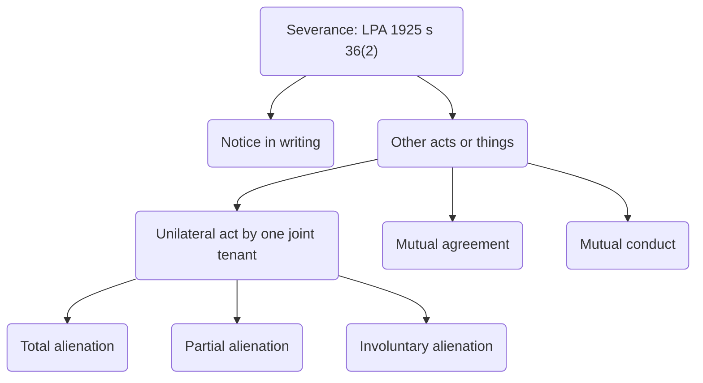

# Severance

![[severance-diagram.png]]

The imposition of a trust involves the separation of legal and equitable title. Legal title cannot be severed, but equitable title can be.

## Definition

> Severance…is the process of separating off the share of a joint tenant, so that the concurrent ownership will continue, but the right of survivorship will no longer apply. The parties will hold separate shares as tenants in common.  
> Dillon LJ in [[Harris v Goddard [1983] 1 WLR 1203]]

```ad-note
Severance does not destroy co-ownership but simply changes the basis on which the parties hold the equitable interest in the future.
```

## Details

- Legal title
	- Maximum of 4 Trustees (i.e., 4 legal owners registered at the Land Registry)
	- All must be ‘sui juris’ (+18 and of sound mind)
	- Must hold as joint tenants. This means the 4 unities must be present and the right of survivorship applies.
	- The joint tenancy cannot be severed
- Equitable title
	- Unlimited number can hold
	- Can be held by U18’s and those that lack mental capacity
	- Can be held as joint tenancy or tenancy in common
	- Equitable joint tenancy can be severed into tenancy in common.

If a beneficial (equitable) joint tenancy is created, it is open to any joint tenant to sever that joint tenancy to create a tenancy in common. A joint tenant may want to so this in order to exclude the operation of survivorship, so that a distinct share in the property can be left to someone other than the surviving joint tenant(s) on death. This may be required because there has been a breakdown in the relationship between the joint tenants, meaning that one person does not wish the other to take the property by survivorship. However, sometimes the joint tenancy is severed because, for example, the parties wish to enter a tax-planning scheme which requires survivorship to be ruled out.

It is important to understand that severance does not bring co-ownership to an end: it simply changes the basis on which the equitable co-owners continue to hold the equitable title. Severance is the process of converting an equitable interest held as a joint tenancy into an interest held as a tenancy in common.

```ad-statute
title: s 36(2) LPA 1925

No severance of a joint tenancy of a legal estate, so as to create a tenancy in common in land, shall be permissible, whether by operation of law or otherwise, but this subsection does not affect the right of a joint tenant to release his interest to the other joint tenants, or the right to sever a joint tenancy in an equitable interest whether or not the legal estate is vested in the joint tenants:

Provided that, where a legal estate (not being settled land) is vested in joint tenants beneficially, and any tenant desires to sever the joint tenancy in equity, he shall give to the other joint tenants a notice in writing of such desire or do such other acts or things as would, in the case of personal estate, have been effectual to sever the tenancy in equity, and thereupon the land shall be held in trust on terms which would have been requisite for giving effect to the beneficial interests if there had been an actual severance.

Nothing in this Act affects the right of a survivor of joint tenants, who is solely and beneficially interested, to deal with his legal estate as if it were not held in trust.
```

It is not possible to sever a legal joint tenancy; only an equitable one. This is to preserve the simplicity of the legal title. If legal trustees could sever the joint tenancy and leave an interest held as a tenancy in common to other(s), that would complicate the legal title for two reasons: first, the number of legal owners could grow, not shrink! Second, documents would be required to prove that the new holders had actually acquired title properly. With a joint tenancy, the only document required on the death of a joint tenant is a copy of that person’s death certificate.

## Methods of Severing

S 36(2) also states that the equitable joint tenancy can be severed and states two basic ways that this can happen:

1. The severing joint tenant can give a **notice in writing** to all of the other equitable joint tenants.
	- The writing can be in any form and need not be signed.
	- It must, however, demonstrate an unequivocal and irrevocable intention to sever the equitable joint tenancy immediately.
	- Notice must also be served correctly if it is to have effect:
		- It must be given to all of the other equitable joint tenants
		- The notice can be handed over or left at the last known place of abode or business of the other joint tenants
	- Case law makes it clear that the notice does not have to be read to be effective and severance takes place the moment the notice is served
2. The joint tenant can do **‘other acts or things’**, or behave in such a way that the joint tenancy is severed.
	- This piece of statute, deliberately vague, was intended so that the modes of severance recognised by [[Williams v Hensman (1861) 1 J & H 546]] would continue to apply.
	- In Williams v Hensmen, three possible ways in which a joint tenancy in personal property and land could be severed were identified. These 3 ways falls under the ‘other acts of things’ mode of severance in s 36(2).
	1. The first of these is a unilateral act by a joint tenant operating on his own share.
		- The most important point to note here is that the act can be unilateral: there is no requirement for the other joint tenant(s) to know or consent to the act for severance to take place.
		- The unilateral act can be subdivided into 3 types of alienation.
			1. Total alienation
				- Acts of ‘total’ alienation occur when the severing owner disposes of the interest permanently, by way of sale or gift of the equitable interest in land.
				- For example, It is very common for one joint tenant to ‘buy out’ another. The sale will have the effect of severing the equitable joint tenancy, and the purchaser will acquire the interest as a tenant in common.
			2. Partial alienation
				- Acts of ‘partial’ alienation occur where the severing owner temporarily disposes of the interest, by way of mortgage or lease. This is partial alienation because when the loan is repaid or the lease expires, the holder will take the interest back unencumbered.
				- If an equitable joint tenant [[mortgages]] his or her equitable interest, that will be an act of severance, resulting in a tenancy in common. Please do not get confused with a legal mortgage, which would be where the joint tenants together charge the legal estate.
			3. Involuntary alienation
				- occurs when a joint tenant is declared bankrupt by the court. It is ‘involuntary’ as this will happen against the will of the joint tenant.
				- If one of the co-owners is declared bankrupt, this will also operate to automatically sever their equitable interest in the land, which vests in the trustee in bankruptcy.
	2. Mutual agreement of joint tenants
		- Severance by mutual agreement will occur only when all equitable joint tenants agree that one person’s interest is severed, thereby creating a tenancy In common.
		- The agreement need not go as far as being a specifically enforceable contract to sell the interest; but it must amount to an agreement that one person’s interest is separate or severed.
	3. Mutual conduct (any course of dealing which indicates that interests were mutually treated as constituting a tenancy in common)
		- There is real overlap here with mutual agreement, and it is not always clear where the dividing line lies.
		- If you cannot point to any moment where the parties have reached a mutual agreement, there may still be severance by mutual conduct.
		- For example, if the parties have been negotiating over a prolonged period of time, then their conduct may suggest that they do recognise and are treating one person’s interest as being separate. It will always be dependent on the facts of the case in hand, and the reality is that this mode of severance is hard to prove.

The severance must take place during the joint tenant’s lifetime. Making a will does not sever a joint tenancy as it takes effect after death, whereas severance takes place immediately on death: [[Re Caines deceased [1978] 1 WLR 540]].

## Effect of Severance

If a joint tenant successfully severs the equitable joint tenancy, that person will, in future, hold a tenancy in common which is an equal share, based on the number of former joint tenants not on the proportion of contributions made to the initial price: [[Goodman v Gallant [1986] Fam 106]].

```ad-example
A, B, C and D are the legal owners of property, which they hold on trust for themselves and E and F as joint tenants in equity. D wishes to sever the joint tenancy so that he can leave his share of the property to G in his will.

It is not possible to sever the legal joint tenancy, so D will continue to have the administrative responsibilities of a legal trustee. The equitable joint tenancy can be severed, and if D does this by one of the methods recognised in **LPA s 36(2)**, D will have a one-sixth separate equitable share as tenant in common.
- A B C and D hold legal title as joint tenants.
- A B C E F hold 5/6 as JTs.
- D has 1/6 as TIC.
```

```ad-example
A and B are the legal owners of property, which they hold on trust for themselves as joint tenants in equity. B wishes to sever the joint tenancy so that he can leave his share of the property to C in his will.

It is not possible to sever the legal joint tenancy, so B will continue to have the administrative responsibilities of a legal trustee. The equitable joint tenancy can be severed, and if B does this by one of the methods recognised in LPA s 36(2), A and B will each have a 50% equitable share as tenant in common. It is not possible for A to continue as a joint tenant.
- A and B hold legal title as joint tenants.
- A and B hold 50% each as TIC.
```



## Notice in Writing

S 36(2) states that the equitable joint tenancy can be severed. One way this can be done is for the severing joint tenant to give a notice in writing to all of the other equitable joint tenants.

Rules concerning the content and service of such notices must be observed if the notice is to have the effect of severing the joint tenancy.

The writing could be deliberately intended to sever the joint tenancy, such as where it is the starting point to a tax planning scheme. However, writing which is primarily intended for another purpose could have the unintended consequence of severing the joint tenancy.

### Form and Intention

There are no particular formalities to be observed for the notice: it does not even need to be signed. However, it must demonstrate an unequivocal and irrevocable intention to sever the equitable joint tenancy immediately.

Two cases with similar facts, but different results demonstrate the ‘intention’ aspect perfectly. In each, one co-owner had died, and the dispute had arisen between the surviving co-owner and the deceased’s next of kin. The surviving co-owner argued that the deceased had died as a joint tenant and that they took the property by survivorship. The next of kin argued that the deceased died as a tenant in common and that the share passed to them.

- [[Re Draper’s Conveyance [1969] 1 Ch 486]]
- [[Harris v Goddard [1983] 1 WLR 1203]]
- [[Quigley v Masterson [2011] EWHC 2529]]

### Service

A notice in writing must be served correctly in order to sever the joint tenancy. Section 36(2) makes it clear that the severing joint tenant must ‘give to the other joint tenants’ a notice in writing. It must therefore be served on all of the other equitable joint tenants. In the vast majority of cases this does not present a problem as there are only two joint tenants to start with, but if there are more, then all must be served.

Difficulties regarding when and whether a notice has been properly served are resolved by **Law of Property Act 1925, s 196(3) and s 196(4)** and related case law.

```ad-statute
title: s 196 LPA 1925

(1) Any notice required or authorised to be served or given by this Act shall be in writing.

(2) Any notice required or authorised by this Act to be served on a lessee or mortgagor shall be sufficient, although only addressed to the lessee or mortgagor by that designation, without his name, or generally to the persons interested, without any name, and notwithstanding that any person to be affected by the notice is absent, under disability, unborn, or unascertained.

(3) Any notice required or authorised by this Act to be served shall be sufficiently served if it is left at the last-known place of abode or business in the United Kingdom of the lessee, lessor, mortgagee, mortgagor, or other person to be served, or, in case of a notice required or authorised to be served on a lessee or mortgagor, is affixed or left for him on the land or any house or building comprised in the lease or mortgage, or, in case of a mining lease, is left for the lessee at the office or counting-house of the mine.

(4) Any notice required or authorised by this Act to be served shall also be sufficiently served, if it is sent by post in a registered letter addressed to the lessee, lessor, mortgagee, mortgagor, or other person to be served, by name, at the aforesaid place of abode or business, office, or counting-house, and if that letter is not returned [F1by the postal operator (within the meaning of [F2Part 3 of the Postal Services Act 2011]) concerned] undelivered; and that service shall be deemed to be made at the time at which the registered letter would in the ordinary course be delivered.
```

A notice can be served by handing it over personally. If it is posted it will be deemed to be served if it has been left at the ‘last known place of abode or business’ of the joint tenants. This means that it could be served by the severing joint tenant leaving it there, or by postal delivery there. If it is made by registered post and not returned undelivered, it will be deemed served at the time a registered item would in the ordinary course of events be delivered.

Note that the provision says that the notice is deemed to have been served when it has been delivered. It does not say that the notice has to be received or read.

- [[Kinch v Bullard [1999] 1 WLR 423]]
- [[Re 88 Berkeley Road [1971] Ch 648]]

## Other Acts or Things

S 36(2) states that the equitable joint tenancy can be severed. One way this can be done is by other acts or things which would have the effect of severing a joint tenancy in personal property.

In [[Williams v Hensman (1861) 1 J & H 546]] Page-Wood VC identified three possible ways in which a joint tenancy in personal property and land could be severed:

(1) A unilateral act by a joint tenant operating on his own share  
(2) Mutual agreement of the joint tenants  
(3) Any course of dealing which indicates that the interests were mutually treated as constituting a tenancy in common.

### Unilateral Act by One Joint Tenant

There is a logical inconsistency in saying that a joint tenancy can be severed by one joint tenant ‘acting on his own share’ as we already know that the joint tenant does not have a ‘share’ in the first place. However we can interpret this as meaning that the act itself creates the share: it does not exist unless and until the act takes place.

The most important point to note here is that the act can be unilateral: there is no requirement for the other joint tenant(s) to know or consent to the act for severance to take place.

The unilateral acts can be subdivided into acts of total alienation; partial alienation; and involuntary alienation.

- Total alienation: acts of ‘total’ alienation occur when the severing owner disposes of the interest permanently, by way of sale or gift of the interest.
- Partial alienation: acts of ‘partial’ alienation occur where the severing owner temporarily disposes of the interest, by way of mortgage or lease. This is partial alienation because when the loan is repaid or the lease expires, the holder will take the interest back unencumbered.
- Involuntary alienation: this occurs when the joint tenant is declared bankrupt by the court. It is ‘involuntary’ as this will happen against the will of the joint tenant!

```ad-example
title: Sale as an act of total alienation
It is very common for one joint tenant to ‘buy out’ another. The sale will have the effect of severing the equitable joint tenancy and the purchaser will acquire the interest as a tenant in common. The legal title will remain unaffected as the legal joint tenancy cannot be severed. Imagine that A B C and D own property as beneficial joint tenants. B has been offered a job in another city and sells his equitable interest to C.

Position before the sale: the usual rules on co-ownership operate and ABC & D are legal joint tenants holding the property on trust for themselves as equitable joint tenants.

Position after the sale: ABC & D continue as legal joint tenants as the legal title cannot be severed. B’s equitable interest is severed on sale to C, who holds it as a tenant in common. C remains a joint tenant with A & D as to the remaining equitable title.
```

```ad-example
title:Mortgage as an act of partial alienation
Most property purchases are funded by mortgage finance. Where all legal joint tenants act together to create a legal mortgage or charge over the property as security for a loan, this does not result in severance, because the joint tenants are charging the legal estate. The equitable estate remains unaffected.

If an equitable joint tenant mortgages his/her equitable interest, that will be an act of severance, resulting in a tenancy in common.

Where one joint tenant fraudulently tries to mortgage/sell the entire property. In this case, the disposition is deemed to be a mortgage/sale of the equitable interest.
```

See [[First National Security v Hegarty [1985] QB 850]]

### Mutual Agreement

Severance by mutual agreement will occur only when all equitable joint tenants agree that one person’s interest is severed, thereby creating a tenancy in common. The agreement need not go as far as the ‘unilateral acts’ operating on a share. The agreement need not go as far as being a specifically enforceable contract to sell the interest; but it must amount to an agreement that one person’s interest is separate or severed.

This mode of severance is closely linked to severance by mutual conduct, and it is unclear where the dividing line lies. The leading case here is [[Burgess v Rawnsley [1975] Ch 429]].

[[Hunter v Babbage (1995) 69 P&CR 548]]

### Mutual Conduct

Where the parties have not reached a point where there can be said to be ‘mutual agreement’ to sever the joint tenancy, there may still be severance by ‘mutual conduct’. In [[Williams v Hensman (1861) 1 J & H 546]] Page-Wood VC defined mutual conduct as:

> ‘ any course of dealing sufficient to intimate that the interests of all were mutually treated as constituting a tenancy in common…’

The question of severance by mutual conduct is most likely to arise where the parties have not reached a point where there could be said to be a ‘mutual agreement’ to sever. However the fact that they are negotiating over a prolonged period of time suggests that they do recognise and are treating one person’s interest as being separate.

In [[Burgess v Rawnsley [1975] Ch 429]], Sir John Pennycuick acknowledged that severance could be inferred from negotiations, but this was obiter as the decision in that case was made on the basis of mutual agreement. The reality is that it will prove difficult to show that there has been severance by mutual conduct, as the fact that the negotiations are ongoing means that it is unlikely that there is any mutuality at all!

See [[Gore and Snell v Carpenter [1990] 60 P&CR 456]] and [[Davis v Smith [2011] EWCA Civ 1603]].

```ad-summary
**Law of Property Act 1925, s 36(2)** states that an equitable joint tenancy can be severed by ‘other acts or things…’.

According to the case of **Williams v Hensman** this behaviour can be unilateral acts, mutual agreement or mutual conduct.

Examples of unilateral acts operating on a share include selling, mortgaging, or gifting a share; or being declared bankrupt.

Severance by mutual agreement occurs when the joint tenants all agree, expressly or impliedly, to change the basis on which they continue to hold the equitable title to the property

Severance by mutual conduct may occur when the parties embark on a ‘course of dealings’ which demonstrates that they are treating their shares in the property as separate. This may cover ongoing negotiations, but it is unclear exactly what will suffice here.
```

## Bevan

Concurrent ownership is one of the most common forms of land holding, and poses many challenges. The law must finely balance all parties' interests, and the interests of co-owners against any creditors. Two fundamental features:

- The distinguishing feature of co-ownership is “unity of possession”, meaning each co-owner enjoys an entitlement to possess the co-owned land.
- Under English law, all forms of shared ownership must operate behind a trust, so wherever there is co-ownership, a trust will arise. This involves the separation of the formal legal title to land from the underlying equitable ownership of the land.

The two forms of co-ownership recognised in English law today are the joint tenancy and tenancy in common.

### Joint Tenancy

Each co-owner is regarded as wholly entitled to the land. No single co-owner has any 'share' in the co-owned land, and collectively all co-owners are treated as a single unit. If there is an express declaration of joint tenancy, this will give rise to a joint tenancy even if the contributions to the purchase price are unequal.

A joint tenancy can only exist where the four unities are present. These are:

- Unity of possession
- Unity of interest
- Unity of title
- Unity of time

The most important practical significance of co-ownership under a joint tenancy is that between joint tenants, the doctrine of survivorship (*ius accrescendi*) operates. When one joint tenant dies, her interest automatically passes to or 'survives to' the remaining joint tenants. This operates automatically upon death, and takes precedence over the terms of a will.

When all but one joint tenant has deceased, the remaining joint tenant is no longer a co-owner and becomes absolutely entitled to the land. What if the final surviving joint tenants die simultaneously? Then the younger will be deemed to have survived the older (s 184 LPA 1925).

Survivorship has several advantages:

1. Often reflects the wishes of parties
2. Simplifies probate
3. Simplifies purchases of co-owned land (only one title vested in several joint tenants).

### Tenancy in Common

Joint tenants can separate their interest from other joint tenants through the process of severance. This transforms a joint tenant's interest in the co-owned land into a notional share of the co-owned land, and that co-owner becomes a tenant in common. The size of the share is calculated as a proportion of the total number of co-owners. On death, the interest of the tenant in common does not survive automatically to the remaining co-owners; the co-owner is free to bequeath her interest to her heirs. A tenant in common is even able to sell or mortgage their share. Only unity of possession is needed for a tenancy in common to arise.

### Position in Law

- At law, co-ownership can only exist under a joint tenancy. There can be no tenancy in common at law ([s 1(6) LPA 1925](https://www.legislation.gov.uk/ukpga/Geo5/15-16/20/section/1)).
- Consequently, there can be no severance of a joint tenancy at law ([s 36(2) LPA 1925](https://www.legislation.gov.uk/ukpga/Geo5/15-16/20/section/36)). This does not affect a joint tenant's ability to 'release' her interest to the other joint tenants and simply drop out of legal co-ownership of land.
- There can be no more than four legal co-owners of land ([s 34(2) LPA 1925](https://www.legislation.gov.uk/ukpga/Geo5/15-16/20/section/34)) – though in equity, there is no limit on the number of co-owners that can exist nor any rule against co-owners under 18.

### Position in Equity

Co-ownership in equity is far more flexible: co-owners may be either joint tenants or tenants in common. To determine which category co-owners fall into, consider:

1. Any express declarations of trust
2. The presence of the four unities
3. The application of various equitable presumptions.

#### Express Declaration of Trust

An express declaration may indicate how the property is to be held in equity. A clear expression of intention will be conclusive and not usurped by any implication drawn on the facts (though it could be usurped by vitiating factors, e.g., fraud) – [[Goodman v Gallant [1986] Fam 106]], [[Pankhania v Chandegra [2012] EWCA Civ 1438]]
