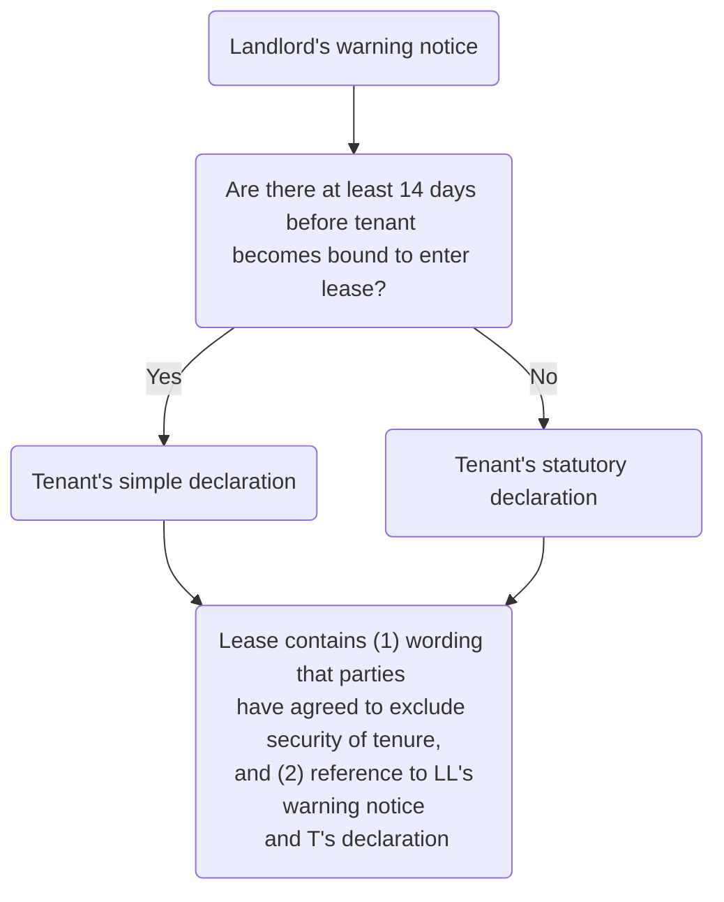
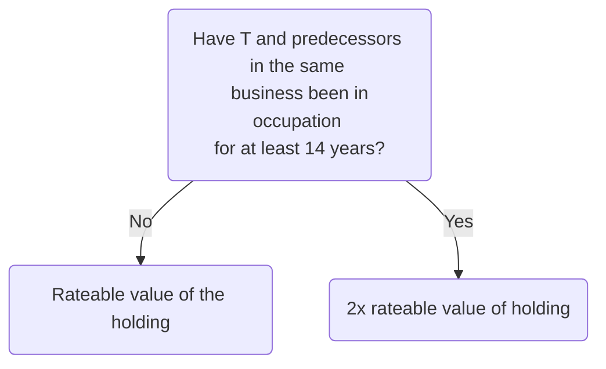

# LTA 1954 (Part II)

“Security of tenure” refers to statutory rights granted to tenants to protect their interest under leases. This may include the right to renew or extend an existing tenancy.

## Application of LTA 1954 (Part II)

![[LTA 1954_1.jpg]]

Under the Landlord and Tenant Act 1927, the lettings market was weighted heavily in favour of the landlord, meaning that only tenants who could demonstrate sufficient goodwill, such that compensation at the end of their tenancy would be inadequate, were entitled to renew their tenancy.

The 1954 Act was introduced to strike a fairer balance between the landlord and tenant in business lettings. Now, if a business tenant wants to remain in occupation of its rented premises at the end of its lease term it can, if the lease qualifies for protection and the tenant complies with specified procedures. Landlords are only able to end commercial leases if they can prove that one or more of the grounds specified by the 1954 Act exist.

> [!statute] [s 23(1) LTA 1954](https://www.legislation.gov.uk/ukpga/Eliz2/2-3/56/section/23)
> Subject to the provisions of this Act, this Part of this Act applies to any tenancy where the property comprised in the tenancy is or includes premises which are occupied by the tenant and are so occupied for the purposes of a business carried on by him or for those and other purposes.

The key elements to be satisfied are: tenancy, occupation and business purposes.

### Tenancy

This must fulfil the requirements established by [[Street v Mountford [1985] AC 809]] (exclusive possession and for a term absolute). ‘Tenancy’ includes periodic as well as fixed term tenancies and oral as well as written tenancies. ‘Tenancy’ excludes licences and tenancies at will (which are terminable at any time by either party). Some tenancies are also specifically excluded from the protection of the 1954 Act by s 43 LTA 1954.

Excluded tenancies under [s 43 LTA 1954](https://www.legislation.gov.uk/ukpga/Eliz2/2-3/56/section/43):

- Tenancies of agricultural holdings (they have their own statutory regime of protection)
- Mining leases
- Service tenancies (a lease granted as part of a tenant’s employment e.g. a security guard’s flat)
- Fixed term tenancies not exceeding six months (although protection can arise if the same business or tenant has been in occupation of the premises for 12 or more months through successive tenancies or if the tenancy is renewable beyond six months).
	- So if the tenant has occupied a property for 12 months and a new tenancy is granted, the new tenancy is protected (but not a tenancy granted within the 12 months).
- Tenancies at will ([[Wheeler v Mercer [1957] AC 416]])

### Occupation

The tenant must be the occupier of at least part of the premises to obtain protection (the tenant will only be entitled to apply for a new lease of the part of the premises that it occupies). As a result, if a tenant underlets all the premises, it will lose the protection of the 1954 Act. When deciding if a tenant is in occupation for the purposes of the 1954 Act, the courts will consider the measure of control the tenant exercises over anyone else using the premises.

If there is a sub-tenant in occupation of the whole of the premises originally let to the head-tenant, the head-tenant will not benefit from security of tenure (but the sub-tenant may). If only part of the premises is sublet, the head-tenant will be protected in relation to the part he still occupies for business purposes, and the sub-tenant will be protected in respect of the part occupied.

If the tenant named in the lease has a controlling interest in the business carried out at the premises, this will be sufficient to satisfy "occupation" for business purposes.

### Business

This is widely defined by the 1954 Act as ‘trade, profession or employment’. Case law has refined this, e.g., a members’ tennis club and a charity are businesses for the purposes of the 1954 Act but not a Sunday School. Incidental residential use is acceptable, so long as operating a business is a significant purpose of the occupation (so a shop with a flat above it is included).

A tenancy does not attract security of tenure where the business use is in breach of a term of the tenancy. s 23 LTA 1954:even if the landlord has agreed to the breach, the tenant still does not obtain security of tenure where the business use is solely for the purposes of a “home business”.  

### Protection

If the 1954 Act applies, [s 24(1) LTA 1954](https://www.legislation.gov.uk/ukpga/Eliz2/2-3/56/section/24) sets out two layers of protection given to the protected tenant:

- The tenancy will continue after its contractual expiry date (the date, set out in the lease, on which the term of the lease is due to end) until terminated in one of the ways specified by the 1954 Act; and
- The tenant will have the right to apply for a new tenancy on termination of the current tenancy.

### 'Contracted Out' Tenancies

Under [s 38A LTA 1954](https://www.legislation.gov.uk/ukpga/Eliz2/2-3/56/section/38A), before completing the lease, the landlord and tenant can agree to exclude the lease from the protection of the 1954 Act.

> [!warning]
> Contracting out is not possible in respect of a periodic tenancy. 

- This is usual for short term lettings, where the landlord wants to be certain it can regain the premises at the end of the lease term. The decision as to whether a commercial lease is contracted out from the protection of the 1954 Act will be a part of the normal negotiation process prior to the grant of a lease. A protected lease could potentially command a higher rent than a contracted out lease.
- Prior to June 2004, the contracting out procedure involved obtaining a court order. The lease also had to refer to the court order. From June 2004, the procedure for contracting out changed. It no longer involves a court order, but the lease does still have to make reference to the fact that the parties have agreed to exclude the protection of the 1954 Act (known as security of tenure).

The simplest way to check whether a lease has been contracted out of the protection of the 1954 Act is to check the lease for the reference to the court order or to the parties agreeing to contract out.

### Contracting Out Procedure

The agreement to contract out must be carried out in accordance with the procedure set out in the Regulatory Reform (Business Tenancies) (England and Wales) Order 2003 (the Reform Order). The procedure must be completed before the lease is granted, or, if earlier, before the tenant becomes contractually bound to take the lease.

#### Warning Notice

The landlord must serve a warning notice on the tenant at least 14 days before the tenant becomes bound to enter the lease (i.e. before the tenant completes the lease or an agreement for lease). There is a prescribed form of warning notice which must be used.

#### Tenant’s Declaration

The tenant must sign either a **simple declaration** or a **statutory declaration** (both have prescribed forms). Which one is needed depends on whether the 14 days of the landlord’s warning notice can be complied with or not. If there are 14 days between the warning notice and the tenant becoming bound to enter the lease, a simple declaration can be used by the tenant. If time is short, the 14-day period of the warning notice can be waived and the tenant must sign a statutory declaration instead.

| Declaration           | Details                                                                                                                   |
| --------------------- | ------------------------------------------------------------------------------------------------------------------------- |
| Simple declaration    | In a prescribed form, states that the tenant has received and accepted the consequences of the landlord’s warning notice. |
| Statutory declaration | In a prescribed form and made in front of an independent solicitor, is to the effect that the warning notice has been received and the tenant accepts the consequences.                                                                                                                          |

> [!warning]
> The warning notice is served by the landlord on the tenant and the tenant makes a declaration.

> [!example] Suggested wording
> 
> 1. The Tenant confirms that before [the date of this Lease] [it became contractually bound to enter into the tenancy created by this Lease]:
> 	1. the Landlord served on the Tenant a notice dated [      ] in relation to the tenancy       created by this Lease ("the Notice") in a form complying with the requirements of Schedule 1 to the Regulatory Reform (Business Tenancies) (England and Wales Order 2003 ("the Order")
> 	2. the Tenant or a person duly authorised by the Tenant in relation to the Notice made [a declaration] [a statutory declaration] ("the Declaration") dated [ ] in a form complying with the requirements of Schedule 2 of the Order
> 2. The Tenant further confirms that where the Declaration was made by a person other than the Tenant the declaration was duly authorised by the Tenant to make the Declaration on the Tenant's behalf.
> 3. [The Landlord and Tenant agree that there is no agreement for lease to which this Lease gives effect]  
> 4. The Landlord and Tenant agree to exclude the provisions of sections 24 to 28 (inclusive) of the 1954 Act in relation to the tenancy created by this Lease.

#### Lease Wording

Whether the simple or statutory declaration procedure is used, **the lease must contain**:

1. Wording that the parties have agreed to exclude security of tenure; and
2. Reference to both the warning notice and the tenant’s declaration.

The contracting out procedure is carried out by the landlord and tenant of the proposed lease or underlease. If an underlease is to be contracted out, it is the immediate landlord (tenant under the head-lease) who serves the warning notice on their prospective tenant (the undertenant) and not the superior landlord (owner of the freehold).

![[LTA1954-protection.png]]

## Termination

The Act provides for only seven methods of termination:

1. Section 25 notice by Landlord to terminate the tenancy (initiated by Landlord)
2. Section 26 request by Tenant for a new tenancy (initiated by Tenant)
3. Forfeiture (initiated by Landlord)
4. Surrender (initiated by Landlord and Tenant)
5. Notice to quit a periodic tenancy (initiated by Tenant)
	1. In the case of a periodic tenancy, the Act allows the tenant to serve a notice to quit which follows the common law method. However, you’ll see this doesn’t work both ways. The landlord can’t serve notice to quit on the tenant.
6. Section 27 notice by tenant to end a fixed term tenancy (initiated by Tenant)
	1. Similarly, section 27 allows the tenant to serve a notice on the landlord to end a fixed term tenancy but doesn’t afford the landlord the same right.
7. Section 27(1A) by Tenant ceasing to be in occupation for business purposes at end of the lease (initiated by Tenant)
	1. 27 (1A) enables the tenancy to end by effluxion of time where the tenant ceases to be in occupation for business purposes at the end of the lease.

> [!question] If you are the tenant in a protected tenancy and do not wish to renew once the term expires in 4 months, what should you do?
> Serve notice in writing to the landlord at least 3 months before the end of the tenancy. Or serve notice now to terminate in exactly 3 months. 

> [!question] If you are the tenant in a protected tenancy and do not wish to renew once the term expires tomorrow, what should you do?
> Move out before the tenancy ends. Then the lease will come to the end as you are not in occupation. This action was approved in [[Esselte AB v Pearl Assurance plc (1997)]].

## S 25 Notice

Landlord starts the process of terminating the lease by serving a s 25 LTA 1954 notice on the tenant.

> [!statute] s 25 LTA 1954 - Termination of tenancy by the landlord.
> 
> (1) The landlord may terminate a tenancy to which this Part of this Act applies by a notice given to the tenant in the prescribed form specifying the date at which the tenancy is to come to an end (hereinafter referred to as “ the date of termination ”)...
> 
> (2) Subject to the provisions of the next following subsection, a notice under this section shall not have effect unless it is given not more than twelve nor less than six months before the date of the termination specified therein.
> 
> (3) In the case of a tenancy which apart from this Act could have been brought to an end by notice to quit given by the landlord—
> - (a) the date of termination specified in a notice under this section shall not be earlier than the earliest date on which apart from this Part of this Act the tenancy could have been brought to an end by notice to quit given by the landlord on the date of the giving of the notice under this section; and
> - (b) where apart from this Part of this Act more than six months’ notice to quit would have been required to bring the tenancy to an end, the last foregoing subsection shall have effect with the substitution for twelve months of a period six months longer than the length of notice to quit which would have been required as aforesaid.
> 
> (4) In the case of any other tenancy, a notice under this section shall not specify a date of termination earlier than the date on which apart from this Part of this Act the tenancy would have come to an end by effuxion of time.
> 
> (6) A notice under this section shall not have effect unless it states whether the landlord is opposed to the grant of a new tenancy to the tenant.
> 
> (7) A notice under this section which states that the landlord is opposed to the grant of a new tenancy to the tenant shall not have effect unless it also specifies one or more of the grounds specified in section 30(1) of this Act as the ground or grounds for his opposition.
> 
> (8) A notice under this section which states that the landlord is not opposed to the grant of a new tenancy to the tenant shall not have effect unless it sets out the landlord’s proposals as to—
> - (a) the property to be comprised in the new tenancy (being either the whole or part of the property comprised in the current tenancy);
> - (b) the rent to be payable under the new tenancy; and
> - (c) the other terms of the new tenancy.

### Prescribed Form

- Notice must be in the prescribed form
- Must be given $6 \leq T \leq 12$ months prior to the date of termination specified in it.
- The date of termination specified cannot be before the contractual termination date of the lease.
- Notice must state whether the landlord will oppose an application by the tenant to the court for a new tenancy, and if so on what grounds.
- Landlord can oppose the application on one of 7 grounds set out in s 30 LTA 1954.
- Often the landlord will be happy to grant a new lease – on more favourable terms.
- There are two versions of the prescribed form: Form 1 to be used when the landlord won’t oppose a new lease being granted to the tenant and Form 2 for use when the landlord wants vacant possession and will oppose a new lease.

### Application to Court

- Parties may enter into negotiations for a new lease.
- But unless T applies to the court before the expiry of the s 25 notice, will lose rights under the Act.
- Parties can agree to extend the time limit between them.
- L can apply to court for a new lease to be granted.

> [!warning]
> If a tenant wishes to preserve its security of tenure rights under LTA54 following the service of a valid s. 25 notice by the landlord, it must ensure that it applies to court for a new lease before the termination date specified in the s. 25 notice (or any extension agreed in writing before the end of that period).  If it fails to do this, the tenant will lose its protection under LTA54 and will be reliant on the landlord's willingness to grant a lease to the tenant in the absence of this protection. This is the case even if the landlord has stated that it will not oppose the grant of a new lease to the tenant in the s. 25 notice served by it.

![[s 25 LTA 1954.png]]

## S 26 Request

> [!statute] s 26 LTA 1954 - Tenant’s request for a new tenancy.
> 
> (1) A tenant’s request for a new tenancy may be made where the current tenancy is a tenancy granted for a term of years certain exceeding one year, whether or not continued by section twenty-four of this Act, or granted for a term of years certain and thereafter from year to year.
> 
> (2) A tenant’s request for a new tenancy shall be for a tenancy beginning with such date, not more than twelve nor less than six months after the making of the request, as may be specified therein: Provided that the said date shall not be earlier than the date on which apart from this Act the current tenancy would come to an end by effluxion of time or could be brought to an end by notice to quit given by the tenant.
> 
> (3) A tenant’s request for a new tenancy shall not have effect unless it is made by notice in the prescribed form given to the landlord and sets out the tenant’s proposals as to the property to be comprised in the new tenancy (being either the whole or part of the property comprised in the current tenancy), as to the rent to be payable under the new tenancy and as to the other terms of the new tenancy.
> 
> (4) A tenant’s request for a new tenancy shall not be made if the landlord has already given notice under the last foregoing section to terminate the current tenancy, or if the tenant has already given notice to quit or notice under the next following section; and no such notice shall be given by the landlord or the tenant after the making by the tenant of a request for a new tenancy.
> 
> (5) Where the tenant makes a request for a new tenancy in accordance with the foregoing provisions of this section, the current tenancy shall... terminate immediately before the date specified in the request for the beginning of the new tenancy.
> 
> (6) Within two months of the making of a tenant’s request for a new tenancy the landlord may give notice to the tenant that he will oppose an application to the court for the grant of a new tenancy, and any such notice shall state on which of the grounds mentioned in section thirty of this Act the landlord will oppose the application.

- The tenant can take the initiative and serve a request for a new tenancy under s 26.
- The procedure is not available for periodic tenants or those for a fixed term $\leq 1$ year.
- Usually not advisable $\rightarrow$ the rent will probably go up.
	- But may be if rent is currently payable is too high; or
	- Lease is to be sold and may be more marketable with a new fixed term.

> [!note] Reasons for serving s26 notice
> 1. Rents falling
> 	- If the tenant believes that rents have fallen and the current rent is more than what could be achieved under a new lease in the current market, then the tenant will want to terminate the current tenancy and obtain a new one at a reduced rent.
> 2. Rents increased
> 	- Conversely, the tenant may be making a pre-emptive move to prolong the current tenancy. If rents have increased, the landlord will want to bring the current tenancy to an end and can only do that by service of a section 25 notice giving at least six months' notice.
> 	- If however the tenant can step in first and serve their section 26 request for a new tenancy the tenant could give up to 12 months' notice and prolong their current tenancy – at the same rent – for another six months.
> 3. Tenants want to sell leasehold with new fixed term
> 	- The tenant may have plans to sell the lease and the tenancy would be more attractive to a buyer if a new fixed term has been granted.

### Prescribed Form

- s 26 notice must be in prescribed form
- Must be given $6 \leq T \leq 12$ months prior to the start date specified in it.
- Must state proposed terms of new tenancy.

### Application to Court

- To oppose, the landlord must serve a counter-notice on the tenant within 2 months of the service of T's s 26 request.
- Must state s 30 grounds of opposition.
- If L does this, T must apply to court for a new lease, or rights under the Act will be lost.
	- Application must be made prior to the commencement date of the new tenancy specified in s 26 request.
- Parties may choose to negotiate and/or extend the time limit under the request.

![[s26-LTA-54.png]]

![[s25-26-LTA-timings.bmp]]

## S 30 Landlord's Grounds

7 grounds for opposing the grant of a new lease:

- (a) T's failure to repair
- (b) Persistent delay in paying rent
- (c) Substantial breaches of other obligations
- (d) Alternative accommodation
- (e) Sub-letting of part where higher rent can be obtained by a single letting of the whole building.
- (f) L intends to demolish/ reconstruct and could not reasonably do so without obtaining possession.
	- Must be a firm and settled intention to carry out the relevant work.
	- Demolition/ reconstruction of the premises/ a substantial part of them substantial construction.
	- Cannot reasonably… is a question of fact.
	- As long as a landlord has a genuine intention, if it subsequently and honestly changes its mind after having obtained possession, the ground will be made out ([[Fisher v Taylor’s Fur nishings [1956] 2 QB 78]]).
- (g) L's intention to occupy the holding for his own business/ as a residence.
	- Firm and settled intention.
	- L must have a reasonable prospect of achieving intention.
	- L **cannot** rely on this ground if his interest was purchased or created within 5 years before the end of the current tenancy.
		- Logic: to prevent L buying the reversion cheaply within 5 years of the end of the lease and acquiring vacant possession using this ground.
	- L **can** rely on the ground if she bought the property with vacant possession, let it, and then sought to possess within 5 years of buying.
	- May be used by a competitor to drive out a business rival ([[Humber Oil Terminals Trustee Ltd v Associated British Ports [2011] EWHC 2043 (Ch)).]])

> [!important]
> (1) to (3) are discretionary grounds - L must:
> 1. Establish the ground; and
> 2. Show T ought not to be granted a new tenancy in view of the facts giving rise to the ground. 

> [!statute] s 30(1) LTA 1954  Opposition by landlord to application for new tenancy.
> 
> The grounds on which a landlord may oppose an application under section 24(1) of this Act, or make an application under section 29(2) of this Act, are such of the following grounds as may be stated in the landlord’s notice under section 25 of this Act or, as the case may be, under subsection (6) of section 26 thereof, that is to say:—
> - (a) where under the current tenancy the tenant has any obligations as respects the repair and maintenance of the holding, that the tenant ought not to be granted a new tenancy in view of the state of repair of the holding, being a state resulting from the tenant’s failure to comply with the said obligations;
> - (b) that the tenant ought not to be granted a new tenancy in view of his persistent delay in paying rent which has become due;
> - (c) that the tenant ought not to be granted a new tenancy in view of other substantial breaches by him of his obligations under the current tenancy, or for any other reason connected with the tenant’s use or management of the holding;
> - (d) that the landlord has offered and is willing to provide or secure the provision of alternative accommodation for the tenant, that the terms on which the alternative accommodation is available are reasonable having regard to the terms of the current tenancy and to all other relevant circumstances, and that the accommodation and the time at which it will be available are suitable for the tenant’s requirements (including the requirement to preserve goodwill) having regard to the nature and class of his business and to the situation and extent of, and facilities afforded by, the holding;
> - (e) where the current tenancy was created by the sub-letting of part only of the property comprised in a superior tenancy and the landlord is the owner of an interest in reversion expectant on the termination of that superior tenancy, that the aggregate of the rents reasonably obtainable on separate lettings of the holding and the remainder of that property would be substantially less than the rent reasonably obtainable on a letting of that property as a whole, that on the termination of the current tenancy the landlord requires possession of the holding for the purpose of letting or otherwise disposing of the said property as a whole, and that in view thereof the tenant ought not to be granted a new tenancy;
> - (f) that on the termination of the current tenancy the landlord intends to demolish or reconstruct the premises comprised in the holding or a substantial part of those premises or to carry out substantial work of construction on the holding or part thereof and that he could not reasonably do so without obtaining possession of the holding;
> - (g) subject as hereinafter provided, that on the termination of the current tenancy the landlord intends to occupy the holding for the purposes, or partly for the purposes, of a business to be carried on by him therein, or as his residence.

## Interim Rent

- Where T has applied to the court for a new tenancy, the current tenancy will not end on the expiry of the s 25 notice/ s 26 request.
- Will continue at the same rent until **3 months** after the conclusion of the proceedings (s 64 LTA 1954).
- L/ T can apply for an interim rent to apply pending the outcome of proceedings.
	- Typically, the rent payable under the new lease.
	- But in certain cases, interim rent set at the market rent for a yearly tenancy of the premises, having regard to the rent under the old lease.

## Terms of New Lease

### Premises

- Tenant only entitled to a tenancy of the “holding”, meaning the property comprised of the current tenancy but excluding any part not occupied by the tenant (e.g., which has been sublet).
- L has the right to insist that any new tenancy will be a tenancy of the whole.

### Duration

- Such as reasonable in the circumstances
- Cannot exceed 15 years.

### Rent

- Open market rent having regard to the other tenancy terms.
- Court must disregard;
	- Fact that T has been in occupation
	- Any goodwill attached to the holding
	- Effect on rent of voluntary improvements carried out by the tenant.
	- Addition in value due to tenant's licence, for a licenced premises.
- Court can insert a rent review clause, even if there wasn't one before.

### Other Terms

- If there is no agreement, these will be fixed by the court.
- If the party wishes to change the current terms:
	- The onus is on them to justify that change ([[City of London Real Property Co Ltd v O’May [1983] 2 AC 726]])
	- Change must be fair and reasonable.

### Commencement

Any new lease will not commence until 3 months after the proceedings are “finally disposed of” $\implies$ when the time limit for appeal has elapsed (4 weeks after the order). So (3 months + 4 weeks) total.

If T finds the terms of a new lease unacceptable, may apply for the order to be revoked.

## Compensation for Failure

### Availability

- If you cannot get a new tenancy solely because one or more of grounds (e), (f) and (g) applies, you may be entitled to compensation under section 37.
- If your landlord has opposed your application on any of the other grounds as well as (e), (f) or (g) you can only get compensation if the court's refusal to grant a new tenancy is based solely on one or more of grounds (e), (f) and (g).
- In other words, you cannot get compensation under section 37 if the court has refused your tenancy on other grounds, even if one or more of grounds (e), (f) and (g) also applies.

### Amount of Compensation

![[s37-LTA-compensation.bmp]]

### Contracting Out Compensation

s 38(2) LTA 1954 provides that any clause in a lease purporting to exclude a tenant’s right to compensation will be void if the tenant (or their predecessors in the same business) have been in occupation for $\geq 5$ years prior to the date of termination.

![[s30-LTA-grounds.bmp]]
