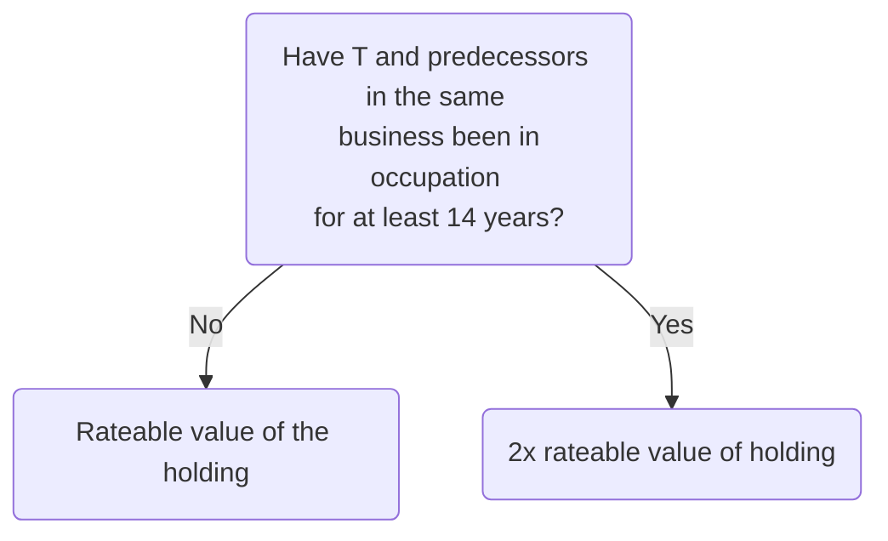
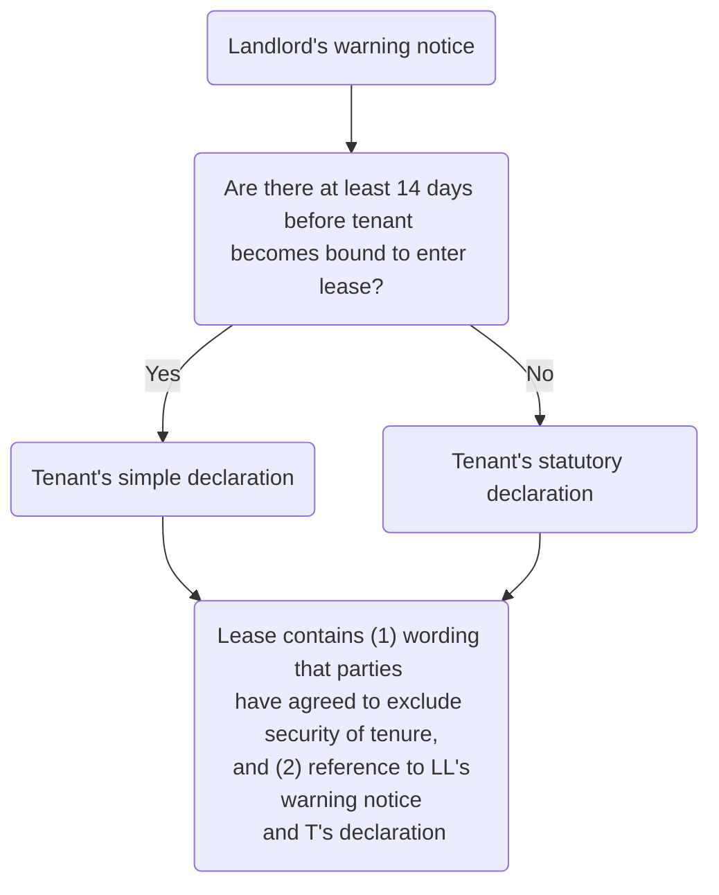

# MERMAID

```mermaid
graph TD
id1(Have T and predecessors in the same <br/> business been in occupation <br/>for at least 14 years?)
id1 --> |No| id2.1(Rateable value of the holding)
id1 --> |Yes| id2.2(2x rateable value of holding)
```

```mermaid
graph TD
id1(Landlord's warning notice) --> id2("Are there at least 14 days before tenant <br/>becomes bound to enter lease?")
id2 -->|Yes| id3.1(Tenant's simple declaration)
id2 -->|No| id3.2(Tenant's statutory declaration)
id3.1 & id3.2 --> id4("Lease contains (1) wording that parties <br/>have agreed to exclude security of tenure,<br/> and (2) reference to LL's warning notice<br/> and T's declaration")
```
