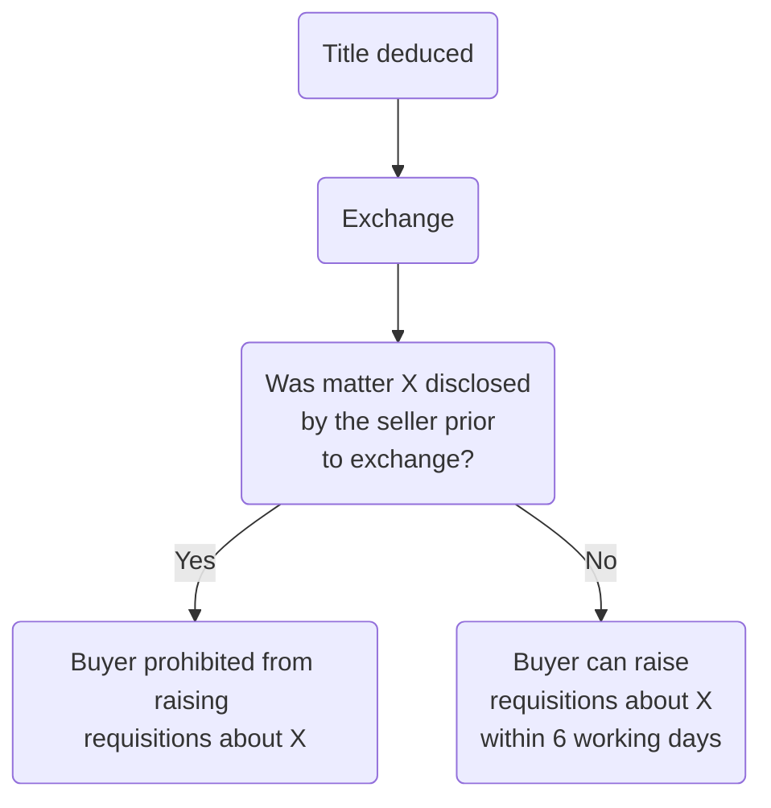

# MERMAID1

```mermaid
graph TD

id1(Title deduced) --> id2(Exchange)
id2 --> id3("Was matter X disclosed <br/>by the seller prior<br/> to exchange?")
id3 --> |Yes|id4.1(Buyer prohibited from raising <br/>requisitions about X)
id3 --> |No|id4.2(Buyer can raise <br/>requisitions about X <br/>within 6 working days)

```
