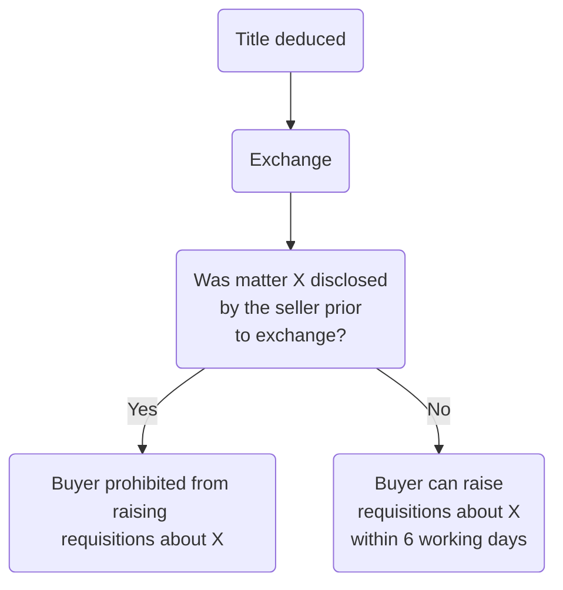

# Title Investigation

## Deduction of Title

### Definition

‘Deduction of title’ is the expression used to signify the seller’s obligation to prove to the  
buyer his ownership of the interest which he is purporting to sell. Ownership is proved to the  
buyer by producing documentary evidence of title. The method of doing this varies according  
to whether the land in question is registered or unregistered.

### Timing

Historically, deduction of title took place only after contracts had been exchanged, so that the  
buyer had to take the seller’s title on trust up until that time and to rely on his right to rescind  
the contract if the title later turned out not to reflect what the seller had contracted to sell.

Modern practice (reflected in the Protocol) is for title to be deduced before exchange. This is reflected in both the Standard Conditions of Sale and Standard Commercial Property Conditions (SC 4.2.1 and SCPC 7.2.1).

### Seller's Obligations

The seller’s obligation in relation to the deduction of his title is to supply sufficient documentary evidence to the buyer to prove that she has the right to sell the land.

Standard Condition 4.1.3 (SCPC 7.1.3) requires the seller, at his own expense, to produce to  
the buyer the original of every document within the title, or, if the original is not available, an abstract, epitome or copy with an original marking by a solicitor of examination either against the original, or against an examined abstract or against an examined copy.

### Official Copies

- Both the Protocol and SC 4.1.2 (SCPC 7.1.2) require the seller to supply official copies of her title to the buyer.
- Official copies are copies prepared directly from the register and should always be supplied since they show the up-to-date position of the register.
- The seller should pay for the official copies.
- Under the Protocol, the official copies should be less than six months old.

## Investigation of Title

The key to successful investigation of title is the keeping of systematic and thorough notes of  
issues raised by that investigation and the steps taken to resolve those issues.

### Reasons for Investigation

#### Seller

1. Seller's solicitor's responsibility to draft the contract for sale of the property, containing the terms of the agreement between parties.
2. Investigation of title will enable the seller’s solicitor, at an early stage, to anticipate and, if possible, deal with any problems that might be revealed by the title.

#### Buyer

When the seller has supplied the buyer with evidence of his title, the buyer’s task is twofold:

1. to ensure that the seller is able to transfer what he has contracted to sell;
2. to identify whether there are any defects in, or problems raised by, the title which could adversely affect the interests of the buyer.

#### Lender

If a lender is lending money in the form of a mortgage to help finance the acquisition of a property, it will be concerned to ensure that the property is worth the money that has been  
advanced.

Where the same solicitor is acting for both the buyer and his lender in a transaction, investigation is carried out only once, but will be done on behalf of both the borrower and  
lender client, taking into account the particular interests of each.

In commercial property transactions, the borrower’s solicitor may be required instead to provide the lender with a ‘Certificate of Title’. This is a certificate signed by the borrower’s solicitors certifying that the borrower has a ‘good and marketable’ title to the property. This certificate will be relied on by the lender in lieu of its own investigation of title. Special care should be taken in giving such certificates, as the lender will be able to sue the borrower’s solicitors should there in fact be any problem with the title.

### Timing

Modern practice is for title to be deduced and investigated before exchange of contracts, and  
for any issues that arise from this process to be resolved before that point. If this is the case, as  
the buyer will already have had his opportunity to raise any queries and will have entered into  
the contract with full knowledge of what the title contains, it is usual to find that the contract  
will contain a provision preventing the buyer raising requisitions on some or all aspects of the  
title once exchange has taken place (see SC 4.2.1 and SCPC 7.2.1).

If, exceptionally, title is deduced after exchange, the contract will usually contain a timetable for the raising of, and responding to, requisitions (see SC 4.3 and SCPC 7.3).

### Investigation

Elements of buyer's investigation:

1. Title will be deduced by the seller in the form of official copies of the entries on the register and the title plan, and so, first, a thorough examination of these must be undertaken.
	- Property register
		- Does the description of the land agree with the contract description?
		- Does the title number match the one given in the contract?
		- Is the estate freehold or leasehold? Does this accord with expectations from the contract
		- Which easements are enjoyed by the property? Do these match the needs of the client?
	- Proprietorship register
		- Is the class of title correct?
		- Is the seller the registered proprietor? If not, who has the ability to transfer the land?
		- Are there any other entries? What is their effect?
	- Charges register
		- Are there any incumbrances?
		- How do these affect the buyer?
		- Which of them will be removed or discharged on completion?
		- Have you agreed in the contract to buy subject to the incumbrances which remain?
	- Title plan
		- Is the land being bought included within the title?
		- Are there any colourings/hatchings which may indicate rights of way, the extent of covenants or land which has been removed from the title?
2. Investigations to discover if there are any overriding interests affecting the property.
3. Certain checks before completion to update the information revealed and to ensure that no changes have taken place since the investigation of title was carried out.

## Common Title Problems

See [[Common Title Problems]].

## Raising Requisitions

If the buyer’s solicitor’s investigation of title reveals any problem then the buyer should raise a ‘requisition on title’ of the seller’s solicitor.

```ad-defn
A requisition is a question asked about the problem which requires a remedy from the seller.
```

If the seller ultimately cannot show good title then the buyer may consider whether defective title indemnity insurance is available (perhaps at the seller’s cost) in order to protect him should he decide to proceed and accept the defect.

Standard Condition 4.3.1 (SCPC 7.3.1) requires the buyer to raise requisitions within six working days of the later of exchange of contracts or the delivery of the epitome.

It is usual in modern practice for the title to be deduced prior to exchange (see 14.2).


