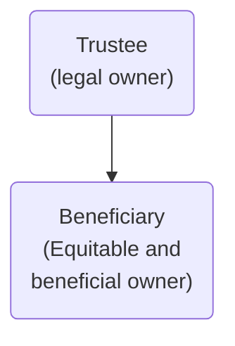

# Creation of express trusts

Express trusts:

- Can be intentionally created
- Can be private or public

Resulting and constructive trusts:

- Arise by operation of law
- Known as ‘implied trusts’

## Categorisation of Trusts

Trusts can be categorised in various ways, but they are most frequently categorised as express, resulting or constructive.

> [!defn]
> An express trust is one which is deliberately created. In other words, it is a trust which arises in response to a person’s intention to create it.

Unlike express trusts, resulting and constructive trusts arise by **operation of law**. In other words, they are **imposed** by the courts.

## Methods of Creating Express Trusts

The person who creates the trust is called the ‘settlor’ of the trust. There are two broad ways in which a settlor can do this: (1) by a self-declaration of trust or (2) by a transfer on trust.

Before:

After:

In a self-declaration of trust, the settlor is the trustee. In a transfer of trust for a third party, the settlor and trustee after different.

It is also possible to have a transfer on trust for the settlor. This is where the settlor is the beneficiary.

### Self Declaration of Trust

A self-declaration of trust requires the settlor to manifest an intention to hold one of their assets on trust for the beneficiary. The settlor remains the legal owner of the asset, but is divested of their beneficial interest in it. The settlor becomes the trustee.

Settlor becomes trustee:

- Retains legal title
- Legal title now held in new capacity
- New equitable title created
- Beneficial ownership transferred to beneficiary

### Transfer on Trust (for Third party)

A transfer on trust requires the settlor to transfer property to a third party and to manifest an intention that the third party should hold the property on trust for the beneficiary. The trustee becomes the legal owner of the property and a new equitable interest is created for the beneficiary, who becomes the equitable and beneficial owner.

Third party becomes trustee:

- Settlor transfers legal title to third party
- Settlor ceases to have any interest
- New equitable title created
- Beneficial ownership transferred to beneficiary

### Transfer on Trust (for settlor)

A transfer on trust will not always be to a third party beneficiary. It is possible for a settlor to transfer property to a trustee to hold on trust for the settlor themselves. This would still be a transfer on trust, involving the transfer of legal title to a third party trustee, but in this scenario the trustee would be holding the property on trust for the settlor (who now becomes the beneficiary). The settlor therefore changes from being the full legal owner to having equitable and beneficial ownership.

## Requirements for Creating an Express Trust

The requirements which must be fulfilled to bring a valid enforceable trust into effect depend on the type of trust, the method of creation of the trust and on the nature of the trust property.

### Three Certainties

Firstly, in order to create a valid express trust, it is necessary to comply with the rules known as the three certainties. A trust requires certainty in order for the rights and obligations under the trust to be enforceable. [[Certainty of intention]] is arguably the most fundamental: it must be certain that a trust relationship is actually intended, as opposed to some other arrangement relating to the property. So it is necessary to show that the settlor intends to either make themselves a trustee or, if they have transferred legal title to a third party, it is necessary to show that they intend that third party to hold the legal title as trustee (rather than intending an outright gift to the third party). It is also necessary to be able to identify the trust property with certainty. This is what is known as “[[certainty of subject matter]]”. And it is necessary to be able to ascertain the beneficiary’s interest in the trust property. This is what is known as “[[certainty of objects]]”.

### Beneficiary Principle

Closely related to [[certainty of objects]] is a requirement known as the beneficiary principle. As with the certainty requirement, the rationale behind the beneficiary principle is the need for a trust to be enforceable. Without identifiable beneficiaries or objects, there is nobody who can enforce the trust (i.e., hold the trustee to account for the performance of their obligations). The beneficiary principle therefore requires the objects of a trust to be legal persons (whether individuals or other legal persons). This means that a trust which is created purely for purposes is not permissible.

There are limited exceptions to this rule. The most common exception is charitable trusts, which have charitable purposes as their objects and are for the public benefit. There is also a much narrower class of anomalous exceptions known as ‘non-charitable purpose trusts’ or ‘private purpose trusts’.

### Perpetuity Rules

A trust is not intended to be a permanent way of holding property. Trusts are therefore subject to rules known as the “perpetuity rules” which limit the duration of the trust. Again, charitable trusts are an exception to these rules. See [[Perpetuity]].

### Further Formalities

Additionally, there may be further formalities to be satisfied to bring the trust into existence. The relevant formalities rules will depend on whether there is a self-declaration or a transfer on trust:

- As we have already seen, a self-declaration of trust only involves a change in equitable title. Legal title does not change. For a self-declaration of trust, it is therefore only necessary to consider whether there are any specific formalities required for the declaration of trust (in other words, the creation of the beneficiary’s interest).
- In the case of a transfer on trust, we have seen that there is a change in both legal and equitable title. In addition to considering whether there are any formalities necessary for creating the beneficiary’s equitable interest, there will also be rules relating to the transfer of legal title to the trustee. This is known as “constitution” of the trust. There are different rules applicable to different types of property, but in all cases it is necessary to validly transfer legal title to the trustee in order to bring the trust into effect.

### Trusts Registration Service

There is one further formality requirement which applies to some private express trusts which does not affect the validity of the trust but is nonetheless important to be aware of in practice. As a result of money laundering legislation, express trusts which have incurred a tax liability in a given year have an obligation to register with the online Trusts Registration Service (‘TRS’) which is operated by HMRC. This obligation is placed upon the trustees of the trust, rather than the settlor, and they are also responsible for keeping the information held by the TRS up to date. This module does not consider the taxation of trusts, so it is not necessary to know when or how the TRS operates, but it is important to be aware of it if you encounter trusts in practice.
