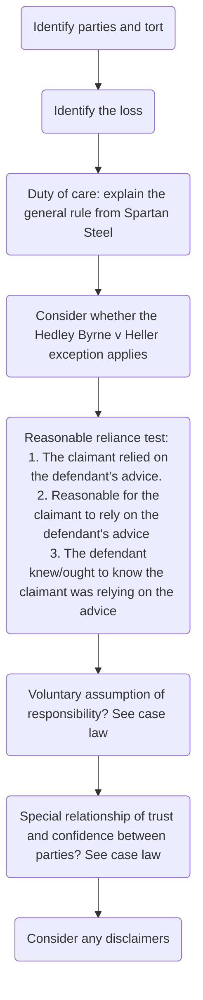

# Pure economic loss

## Introduction

The courts are generally reluctant to allow pure economic loss actions because of policy concerns. These include floodgates, crushing liability and the possibility of fraudulent claims. Some judges are reluctant to interfere with the rules of contract by imposing liability in tort instead.

Courts want to create and apply rules which allow for the possibility of flexibility in the future, but this has led to inconsistency.

Losses can be divided into four categories:

Loss | Description
---|---
Personal injury/ property damage | When the claimant's person or property is damaged. Such losses do not usually pose any problems at the duty of care stage.
Consequential economic loss | Economic loss consequent on physical damage.
Pure economic loss | Economic loss arising where there has been no damage to the claimant's property or injury to their person.
Psychiatric damage | When the claimant suffers psychiatric damage.

Generally, loss for personal injury and consequential economic loss are recoverable, but pure economic loss is not recoverable.

## Definitions

Pure economic loss arises where there has been no damage to the claimant's property or injury to their person.

Different situations where the loss can be categorised as pure economic loss are examined:

### Economic Loss Not Flowing From Damage to Person or Property

This may arise when the claimant has made a bad investment, missed a contractual opportunity or lost an inheritance.

### Loss Arising From Damage to the Property of Another

If a claimant suffers economic loss as a result of damage to property in which they have no proprietary interest, the loss will be categorised as pure economic loss ([[Weller & Co v Foot & Mouth Disease Research Institute [1965] 3 All ER 560]]).

### Defective Items

It is not possible to claim for the cost of repairing an inherently defective item, which has been categorised as pure economic loss. If the claim is that the property is not up to the standard they expected, the claim will generally fail in tort.

They have not suffered physical damage, which is when something good is made bad. Instead, they have always had the property subject to the defect.

Example: A consumer purchases a vacuum cleaner from a shop. When the consumer uses it for the first time it explodes, causing the consumer burns to their hand and to their carpet. The shop has gone out of business, but the consumer locates the manufacturer of the vacuum cleaner.

The consumer cannot sue the shop in contract because the shop has gone out of business. Neither can they sue the manufacturer in negligence for the cost of repairing the defective vacuum cleaner. This is pure economic loss. However, the consumer would be able to recover damages from the manufacturer in negligence for their burnt hand (personal injury) and burnt carpet (property damage) caused by the defective vacuum cleaner.

Builders who negligently put up buildings or other works are liable to anyone injured, or whose property is damaged, by that defect ([[Gallagher v McDowell [1961] N.I. 26]]). But a builder's liability in tort to subsequent owners of premises defectively built by them is limited: where only a defect to the premises has arisen (no other property damage or injury to health), builders are not liable to subsequent purchasers who have merely suffered pure economic loss ([[Murphy v Brentwood District Council [1990] 2 All ER 908]]). This is the key case about defective items.

Key case about defective items: [[Murphy v Brentwood District Council [1990] 2 All ER 908]].

## General Rule

Generally, no duty of care is owed in respect to a pure economic loss ([[Spartan Steel & Alloys Ltd v Martin & Co (Contractors) Ltd [1973] 1 QB 27]]).

## Exceptions to General Rule

The courts have made a distinction between pure economic loss caused by a negligent act and pure economic loss caused by a negligent statement.

If the pure economic loss was caused by a negligent act, then the general rule remains that the courts will not recognise a duty of care.

Three exceptions:

1. Pure economic loss caused by negligence statements
2. Wills
3. References

## Wills

There is a relationship between the solicitor and testator, but if there is negligence in relation to a will it is the beneficiary who suffers a loss. The solicitor owes a duty of care to the beneficiary in this case to achieve practical justice ([[White v Jones [1995] 2 AC 207]]).

The duty of care owed to beneficiaries extends beyond solicitors to other companies offering will-making services ([[Esterhuizen v Allied Dunbar Assurance plc, Times, June 10, 1998]]).

## References

A referee owes a duty of care to the person requesting a reference, but there is additionally a duty of care owed to the subject of the reference to provide an accurate reference ([[Spring v Guardian Assurance plc & Others [1995] 2 AC 296]]).

## Negligent Statements

### Introduction

Negligent statements usually result in pure economic loss. But where misstatements cause physical harm, then the usual duty of care rules apply to the question of duty ([[Perrett v Collins [1998] EWCA Civ 884]]).

Landmark decision: [[Hedley Byrne v Heller [1964] AC 465]]. The House of Lords decided that in certain circumstances concerning two party relationships, there could be liability for careless statements.

Three key concepts/tests were discussed when establishing a duty of care:

1. Reasonable reliance
2. Assumption of responsibility
3. Special relationship of trust and confidence between the parties

Only one of these tests has to be satisfied for a duty of care to be found. The requirements overlap: they are all trying to establish a proximate relationship between the parties and to establish whether it is fair, just and reasonable to impose a duty.

### Reasonable Reliance

1. The claimant relied on the defendant's advice — question of fact
2. It was reasonable for the claimant to rely on the defendant's advice — question of fact. Court considers:
	1. Special skill or knowledge held by the defendant ([[Esso v Mardon [1976] QB 801]])
	2. Special skill or knowledge held by the claimant ([[Stevenson v Nationwide Building Society [1984] 272 EG 663]]). Conversely, in [[Yianni v Edwin Evans [1982] QB 438]] the claimant had no experience/ skill.
	3. General context in which advice is given
		1. Generally, no duty of care will be owed where the advice was given in a social situation, since there is no assumption of responsibility. But not always the case ([[Chaudhry v Prabhakar and Another [1989] 1 WLR 29]])
		2. There is a duty of care to exercise reasonable skill and care owing between friends for professional services provided free of charge, on the basis of assumption of responsibility ([[Lejonvarn v Burgess [2017] EWCA Civ 254]])
	4. Other relevant general factors. Includes
		1. Nature of the advice
		2. Potential risk to the claimant
		3. Availability and practicality of a second option
3. The defendant knew or ought to have known that the claimant was relying on their advice — question of fact. If the defendant knew the claimant was relying on their advice, then they can foresee pure economic loss if they are not careful in giving advice.

### Voluntary Assumption of Responsibility

This applies to relationships which are 'equivalent to contract', i.e., where there is an assumption of responsibility in circumstances in which, but for the action of consideration, there would be a contract. Cases:

- [[Henderson v Merrett Syndicates Ltd [1995] 2 AC 145]]
- [[Lejonvarn v Burgess [2017] EWCA Civ 254]]

When establishing what is required as evidence of an assumption of responsibility, generally the test from [[Caparo Industries v Dickman [1990] 2 AC 605 (HL)]] is used. The House of Lords set out four criteria to be satisfied for a defendant to have assumed responsibility towards a claimant:

1. The defendant must **communicate** the advice to the claimant (as an identifiable individual or as a member of an identifiable class) or know that it will be communicated to them;
2. The defendant must know the **purpose** for which the claimant will use this advice;
3. The defendant must **know, or reasonably believe, that the claimant will rely** on this advice without independent enquiry; and
4. The **claimant must have acted upon** that advice to their detriment.

The court confirmed that the four Caparo criteria could be regarded as criteria for establishing the defendant's voluntary assumption of responsibility ([[Banca Nazionale del Lavoro v Playboy Club & Others [2018] UKSC 43]]).

A recent case reinforced the Caparo principle with a focus on the **purpose of advice**: [[Manchester Building Society v Grant Thornton UK LLP [2021] UKSC 20]].

### Special Relationship of Trust and Confidence

In [[Hedley Byrne v Heller [1964] AC 465]], it was said a special relationship would arise

- where the party seeking advice was trusting the other to exercise such a degree of care as the circumstances required,
- where it was reasonable for them to do that, and
- where the other gave the advice when they knew or ought to have known that the enquirer was relying on them.

## Disclaimers

In some cases the defendant may have taken positive steps against assuming responsibility for their words. The validity of such steps must be considered ([[Hedley Byrne v Heller [1964] AC 465]]). Such disclaimers are subject to the [[Unfair Contract Terms Act 1977]] ([[Smith v Eric Bush [1990] 1 AC 831]]).

This area of law is now also subject to the [[Consumer Rights Act 2015]], regulating disclaimers between traders and consumers. But the position under UCTA 1977 and CRA 2015 is essentially the same: a disclaimer purporting to exclude liability for economic loss or property damage is only valid if fair, i.e., reasonable given all the circumstances.

## Structure for Negligent Misstatement Claims

