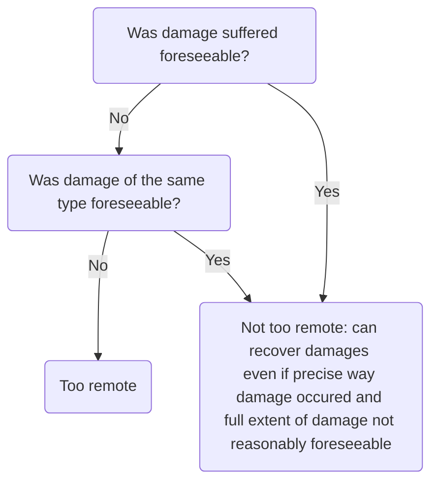

# Remoteness

After establishing [[Tort Law/Causation]], need to examine extent of defendant's liability. Policy dictates that limits must be placed on extent of loss recoverable.

## Test

Claimant can only recover if type of damage suffered was **reasonably foreseeable** at time defendant breached [[duty of care]]. This is an objective test. Legal test of reasonable foreseeability established in [[The Wagon Mound (No 1) [1961] AC 388]]. Held that damage was not reasonably foreseeable: pollution damage was foreseeable but fire damage was not.

Note that historically, the test was whether the damage was a direct result of the defendant's actions. This has since been replaced by reasonable foreseeability.

## Same Type of Harm

Claimant can only recover if defendant ought to have foreseen type of damage suffered. Courts have varied whether this should be broad or narrow:

- [[Bradford v Robinson Rentals [1967] 1 All ER 267]]: reasonably foreseeable that employee would get cold related injury
- [[Tremain v Pike [1969] 1 WLR 1556]]: disease so remote a possibility that defendant could not reasonably foresee.

Reconciling these:

- Uncertainty as to how to apply [[The Wagon Mound (No 2) [1967] 1 AC 617]] test
- Policy: in [[Bradford v Robinson Rentals [1967] 1 All ER 267]] precautions needed to protect claimant from common cold related injuries same as those needed to protect from frostbite

Prevailing attitude of [[Judiciary]] is to take a broad approach to type of damage that must be foreseeable, particularly with regards to personal injury.

In [[Page v Smith [1996] AC 155]] claimant suffered [[Psychiatric harm]] following road traffic accident - held that personal injury, physical or psychiatric foreseeable and recoverable. Also: personal injury is a single indivisible type of harm.

## Exactness of Foreseeability

Only need to establish that type of damage was reasonably foreseeable, no need for defendant to foresee exact way in which damage occurred: [[Hughes v Lord Advocate [1963] AC 837]].

## Extent of Damage

Once established damage was reasonably foreseeable, defendant liable for full extent of damages, even if extent greater than normally expected.

Key case: [[Vacwell Engineering v BDH Chemicals [1971] 1 QB 88]]

### “Thin skull” Rule

No need to foresee extent principle applies even if damage/ extent of injury aggravated by claimant's own weakness. Defendant must take the victim as they find them.

Key case: [[Smith v Leech Brain [1962] 2 QB 405]]. Where defendant can reasonably foresee that conduct will expose claimant to risk of personal injury, no personal injury will be too remote (general rule).

Thin skull rule applies even if damage aggravated by claimant's own 'impecuniosity' (poorness). Key case: [[Lagden v O'Connor [2004] 1 AC 1067]] — victim poor so had to pay more on credit.

