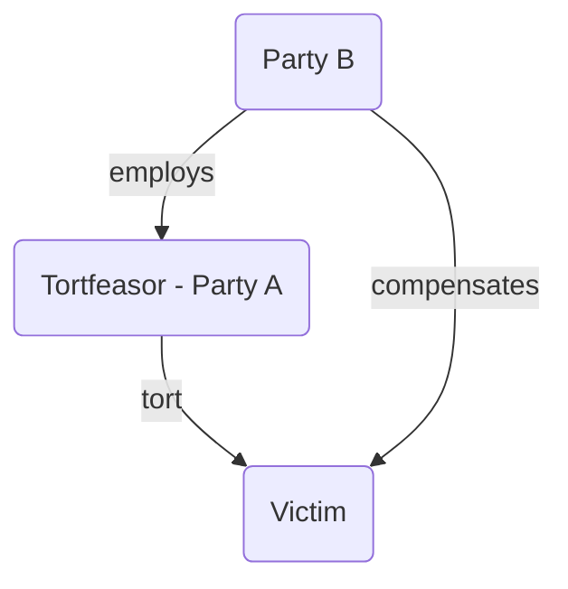

# Vicarious liability

## Definition

>Where one party is held liable for the torts of another, arising because of a specific relationship between parties.

Most commonly exercised in employer/ employee relationships. It is not a tort, just a determination of who is potentially liable. No need to prove fault on the part of the defendant. The defendant who is vicariously liable incurs [[strict liability]].

Elements required:

- A tort has been committed by Party A
	- Usually negligence, but could also be other torts like assault, battery, false imprisonment or defamation by an employee
- Party A is an employee of Party B, or Party A is in a relationship akin to employment with Party B
	- See [[Identifying employment relationship]] for case law on this
- Tort was committed in the course of Party A's employment/ quasi-employment

## Course of Employment

### Modern Framework

Since 2016: an employer will be held vicariously liable for the acts of their employee if there is a **'closeness of connection'** between the employee's wrongful act and their employment (a broader test).

Test originate from: [[Lister v Hesley Hall Ltd [2002] 1 AC 215]] the closeness between the nature of the employment and the particular tort was considered.

Then further developed:

In [[Mohamud v WM Morrison Supermarkets plc [2016] UKSC 11]] it was held that close connection test was two-fold:

1. What functions or 'fields of activities' have been entrusted by the employer to the employee?
2. Was there sufficient connection between the position in which they were employed and their wrongful conduct to make it fair and just for the employer to be held liable?

The close connection test has also been used to determine whether negligent acts are committed in the course of employment ([[Fletcher v Chancery Lane Supplies [2016] EWCA Civ 1112]]).

Recent case in which a manager was held liable at post-Christmas party drinks after punching someone: [[Bellman v Northampton Recruitment Ltd [2018] EWCA Civ 2214]].

### Pre-2002 Case Law

Historically, a tort was said to be “in the course of employment” if the wrongful act was

- Expressly or impliedly authorised by the employer
- Incidental to the carrying out of the employee's proper duties
- An unauthorised way of doing something authorised by the employer

Case law presented in case it's useful. First cases where employee was found to be acting in the course of employment and the employer was held vicariously liable:

Case | Authority for
---|---
[[Century Insurance v Northern Ireland Road Transport Board [1942] AC 509]] | Negligent act while doing something authorised under duties to employer
[[Harvey v RG O'Dell [1958] 1 All ER 657]] | Negligent act during lunch break: lunch break was a reasonably expected act by an employee
[[Rose v Plenty [1976] 1 WLR 141]] | Negligence while employing help for job, despite this being explicitly prohibited by the employer (unauthorised mode of performing employment task)
[[Smith v Stages [1989] 2 WLR 529]] | Paid travel time during working hours is in the course of employment

And cases where the employee was found not to be acting in the course of employment and the employer was not vicariously liable:

Case | Authority for
---|---
[[Joel v Morrison (1834) 6 C&P 501]] | If employee's act unauthorised or expressly prohibited, deemed to have been on a 'frolic of their own'
[[Beard v London General Omnibus Co [1900] 2 QB 530]] | Employee taking actions not incidental to their duties
[[Storey v Ashton (1869) LR4 QB 476]] | Deviation from work duties for an entirely new and independent journey
[[Twine v Bean's Express Ltd [1946] 62 TLR 458]] | Explicit prohibition violated, and prohibited act not being done for the purpose of the employer's business
[[ Mattis v Pollock [2003] 1 WLR 2158 ]] | Geographic location, nightclub owner had encouraged bouncer to get heavy with people

## Employer's Indemnity

Under s 1(1) [Civil Liability (Contribution) Act 1978](https://www.legislation.gov.uk/ukpga/1978/47/contents) an employer may be entitled to seek an indemnity from their employee should they be forced to pay damages in respect of the employee's tort. So, although the victim claims against the employer, the employer may be able to claim something back from the employee. The court will allow such a claim if it is 'just and equitable' to do so.

Generally, litigation conducted on employer's behalf by their insurers, who will be paying in event of liability being established. Right to contribution from an employee rarely exercised by insurers, with a 'gentleman's agreement' not to do so in absence of wilful misconduct or collusion.
