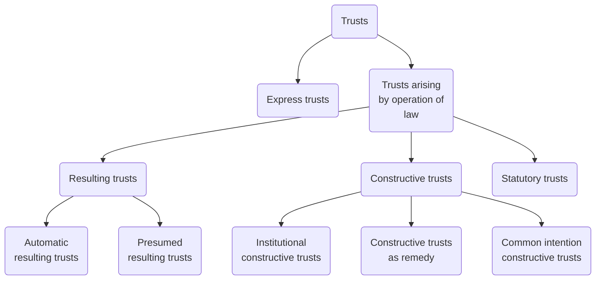

# Trusts arising by operation of law

## Categories of Trusts

Note, this is not a complete list, and some categories overlap.

- Express trusts arise as a result of an express intention to create a trust. In other words, they are created deliberately.
- Trusts can also arise by operation of law. They are not intentionally created, but instead are a response to particular circumstances which the law considers should give rise to a trust.

There are three broad categories of trust arising by operation of law. These are:

- Resulting trusts
- Constructive trusts
- Statutory trusts.

### Statutory Trusts

There are some circumstances where a trust arises as a result of a legislative provision. A key example is trusts of land arising under TLATA 1996 whenever land is acquired by legal co-owners. Another common example is the statutory trusts that arise under the Intestacy Rules when a person dies without leaving a valid will. In these cases, the trust is simply imposed because the statute states that it must be. The intention of the legal owners of the property is simply not relevant.

### Implied Trusts

The focus of this topic is resulting and constructive trusts. Both are often described as ‘implied’ trusts to contrast them with ‘express’ trusts. They are not the product of a settlor’s express intention to create a trust, but rather are implied (perhaps better described as imposed) by equity as a response to a particular set of circumstances. As we will see in this topic, the intention or mindset of the legal owner is often relevant to the creation of such trusts, but the trust that is created will not necessarily reflect their exact intention. Rather, the implied trust arises to correct the fact that the legal ownership of the property does not reflect what equity recognises to be the true beneficial ownership of that property.

### Resulting Trusts

[[Resulting trusts]] are perhaps the less sophisticated of the two types of implied trust, arising in a fairly limited set of circumstances. Broadly, they arise where a legal owner has transferred ownership of their property to a third party but, for some reason, equity recognises that they should retain or regain the beneficial interest in that property. [[Resulting trusts]] can be further subdivided into two key categories:

#### Automatic Resulting Trusts

These are default trusts that arise when a transfer on trust fails, either wholly or partly. If a trustee is holding legal title, but the trust has failed, equity imposes a resulting trust, meaning that they hold the property on trust for the settlor. **This gives the settlor Saunders v Vautier rights**, allowing them to collapse the trust and recover the property. If the trust had failed from the outset (perhaps due to a problem with certainty), the settlor can then attempt to correct that problem. If the trust fails at a later date (for example because it is a purpose trust where the purpose can no longer be fulfilled), the resulting trust ensures that the surplus trust property is returned to the settlor. Automatic [[resulting trusts]] are very much a default trust which do not respond in any way to the actual intention of the settlor. They are just equity’s way of ensuring that the property returns to its original owner when it is otherwise unclear what should happen to it.

#### Presumed Resulting Trusts

These also arise in response to a transfer of legal title, but the intention of the settlor is relevant to the determination of whether a resulting trust has arisen. Where a person makes a gratuitous transfer of property to a third party, equity raises a presumption of a resulting trust. This is due to the maxim that **equity is cynical**, and questions why a person would transfer their own property to someone else. So if a person transfers their property to someone else, equity will presume that they wanted that other person to hold it on trust for them. The presumption of resulting trust can be rebutted by evidence that the transferor did not intend the property to be held on trust for them. So, for example, if it is clear that the transferor intended a gift to the recipient, the presumption will be rebutted and the gift will take effect. A resulting trust will only arise if there is no evidence rebutting the presumption.

### Constructive Trusts

Constructive trusts are more complex and varied in nature. There are many different types of constructive trust, which arise in quite different circumstances, but it is considered that all constructive trusts are imposed to **correct unconscionability**. Three broad situations where constructive trusts arise are considered.

#### Institutional Constructive Trusts

These are the orthodox form of constructive trust which arise because the conscience of a legal owner is affected in some way, preventing them from denying the beneficial interest of another person. This type of constructive trust is imposed automatically in response to a trigger event. Again, there are many different trigger events for constructive trusts, but in this module we focus on:

- Constructive trusts imposed to prevent fraud
- Constructive trusts imposed to perfect an imperfect gift or trust
- Constructive trusts imposed to compel parties to perform a specifically-enforceable contract
- Constructive trusts imposed over profits made in breach of fiduciary duty

#### Constructive Trusts as Remedy

Constructive trusts can also be awarded by a court as a remedy following misapplication of property in which the claimant can establish an equitable proprietary interest, or property representing the traceable proceeds of a breach of trust or fiduciary duty. This sort of constructive trust is not imposed automatically, but is the result of a claimant asserting their rights in the property and seeking to claim beneficial ownership of the property or a share of the property (rather than making an alternative proprietary claim such as a lien or relying upon a personal remedy).

#### Common Intention Constructive Trusts

The final category of constructive trust considered in this module is the common intention constructive trust. These trusts are used to resolve disputes as to beneficial ownership of land where there is no express trust declared over the property. Typically, these disputes arise in cases where the land is occupied by unmarried couples as a family home. Sometimes the land has been registered in the name of just one of the individuals, but the other is seeking to establish that they also have a beneficial interest in the land. In other cases, both are registered as legal owners of the land and therefore hold it as legal joint tenants, but there may still be a dispute about whether their shares in the land are equal. In both cases, the court assesses the common intention of the parties to determine their respective equitable interests in the land.

![[implied-trusts-flowchart.png]]

## Virgo

### Constructive Trusts

A constructive trust differs from an express trust, which is created by the settlor's intent, and the resulting trust, which is triggered by the imputed or presumed intention of the transferor. So if the trust is not triggered by intention, what is it triggered by? Lord Browne-Wilkinson said unconscionability on the part of the defendant was the general principle that underpins the recognition of the construction in all cases. But this does not necessarily explain all the recognised categories.

### Nature

Because the trusts arise by operation of law, there is no requirement that they need to be formally declared. This means they do not need to be evidenced in writing. Once created, the trust functions in the same way as an express trust, save that the constructive trustee is not subject to the same obligations as an express trustee. The fact that the beneficiary of the trust has an equitable proprietary interest in the trust property means that if the trustee becomes insolvent, the beneficiary's claim to the trust property will rank above the claims of unsecured creditors of the trustee.

### Types of Constructive Trust

Judges use the language of the constructive trust in 5 distinct ways.

1. Institutional constructive trust
	- Orthodox mode of analysing trusts
	- The trust arises on the occurrence of a certain event where a constructive trust has previously been recognised.
	- Most significant in English law.
2. Remedial constructive trust
	- This can be awarded where a judge, in the exercise of their discretion, considers it appropriate that D should hold property on trust for the claimant.
	- A consequence is that the creation of the equitable proprietary interest in the property that is held on trust occurs by virtue of the exercise of judicial discretion
	- This distinguishes the remedial from the institutional constructive trust ([[Westdeutsche Landesbank Girozentrale v Islington London Borough Council [1996] AC 669]])
	- So here the extent to which it operates retrospectively to the prejudice of third parties lies in the discretion of the court
	- NOT recognised in England, but recognised in Australia, Canada etc.
3. Constructive trust as remedy
	- Operates simply as a remedial mechanism to enable the transfer of the property to the claimant in Equity.
	- There is already an equitable proprietary interest in existence, typically created in an express trust. The constructive trust simply operates as a conduit for the transfer of the property from D to C.
4. Liability to account as a constructive trustee
	- English law recognises two specific equitable causes of action involving liability of third parties arising from breach of trustee's or fiduciary's duty:
		- Action for unconscionable receipt of property in breach of trust or fiduciary duty
		- Dishonestly assisting a breach of trust or fiduciary duty.
	- Liability of D in these claims is traditionally described as a liability to account as a constructive trustee.
	- But this is misleading; D's liability for both causes of action is a personal liability, either to restore the value of any property received in the breach of trust or fiduciary duty, or to compensate the claimant for the loss suffered as a result of the defendant's assistance with a breach of trust of fiduciary duty.
	- So no trust anywhere here
	- Better described as 'equitable liability to account to the claimant'.
5. Common intention constructive trust.
	- [[CICTs]]
	- Trust arising from an agreement or undertaking of the parties as to whether they have a beneficial interest in the property.
	- Very different from the ordinary constructive trust because it responds to the intentions of the parties.
